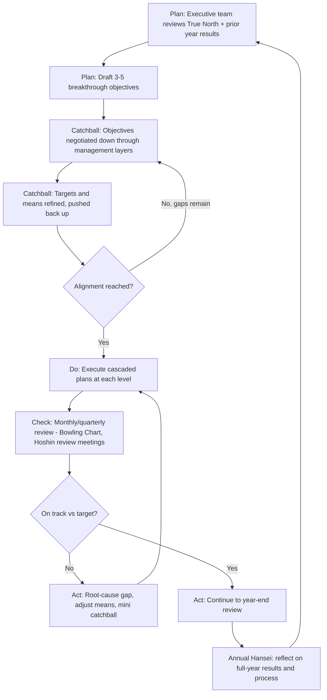

## Hoshin Kanri as Strategy and Policy Deployment

### Overview

Hoshin Kanri (方針管理) — variously translated as "policy deployment," "strategy deployment," or "compass management" (hoshin: direction/compass needle, kanri: management/control) — is Toyota's system for aligning organization-wide strategic goals with the daily improvement activity of every level of the organization, down to the individual work team. It is the mechanism that connects long-horizon strategic intent to gemba-level kaizen, ensuring that continuous improvement effort is not merely dispersed local optimization but is causally linked to a small number of company-wide breakthrough objectives.

The system originated at Japanese quality-management pioneers (including Bridgestone Tire) in the late 1950s–1960s, drawing on Deming's PDCA cycle and management-by-objectives thinking, and was refined within Toyota as part of the broader TPS management infrastructure. It is distinct from — and often confused with — ordinary top-down goal cascading (e.g., conventional MBO or OKRs), because of its emphasis on bidirectional negotiation ("catchball") rather than one-way directive assignment.

### Core Problem Hoshin Kanri Solves

Most organizations face a structural disconnect: executive strategy is set at a high level of abstraction (e.g., "improve customer satisfaction," "expand into new markets"), while daily work happens at a highly concrete level (a specific process step, a specific defect, a specific customer interaction). Without a deliberate mechanism, the two levels drift apart — daily kaizen activity happens but isn't linked to strategic priorities, or strategic plans are issued but never translate into measurable process change.

Hoshin Kanri exists to make that linkage explicit, traceable, and reviewable, so an auditor (internal or external) can trace any team's improvement activity on the shop floor back up through a chain of alignment to a specific company-level strategic objective — and conversely, so a leader wondering "is my company-level strategy actually happening" can trace downward to concrete, currently-in-progress action items.

### The Core Mechanism: Catchball (キャッチボール)

Catchball is the defining practice that separates Hoshin Kanri from generic top-down goal cascading:

- A senior leader proposes a strategic objective, target, and rough means (not yet finalized).
- That proposal is passed ("thrown") to the next level of management, who examines whether the target is achievable given known constraints, and what specific means/resources it would require at their level.
- That level responds ("throws back") with their assessment, counter-proposals, or negotiated adjustments to the target or timeline.
- This exchange repeats iteratively, level by level, until targets and means are simultaneously realistic (bottom-up validated) and ambitious (top-down set) — with each level owning both a target and an agreed method for reaching it.

**Key Points**

- Catchball is fundamentally a negotiation protocol, not a one-way approval process. A hoshin plan that has not been catchballed — pushed down and challenged, then pushed back up with revisions — has not undergone the process correctly, regardless of how the document is formatted.
- The purpose is to prevent two common strategic-planning failure modes: (a) executives setting targets with no grounding in operational reality, which produces impossible goals and eventual cynicism; and (b) operational teams setting only locally-comfortable targets disconnected from what the business actually needs.
- Catchball typically occurs annually for the main planning cycle, but check-ins (monthly/quarterly) use a lighter version of the same dialogue to review progress and re-negotiate as conditions change.

### Structural Components of a Hoshin Plan

#### 1. True North (long-term vision, 3–5+ years)

The overarching, largely qualitative direction of the organization — often durable across multiple annual planning cycles. Examples: "become the safest and most reliable manufacturer in our category," "zero customer-facing defects." True North rarely changes year to year; it provides the fixed reference point against which annual hoshin are judged for coherence.

#### 2. Breakthrough Objectives (annual, typically 3–5 max)

A small number (deliberately limited — commonly cited guidance is no more than 3–5) of company-level strategic priorities for the current planning year. The scarcity is intentional: Hoshin Kanri's discipline comes partly from *forcing* prioritization, rather than attempting to cascade a long list of initiatives, which dilutes focus and catchball bandwidth.

[Inference] The "3–5 max" convention is widely cited in secondary lean literature but is a practical heuristic rather than a rule enforced by any external body — organizations vary in exactly how many they treat as the ceiling, though the underlying principle (forced prioritization) is consistently emphasized across sources.

#### 3. Annual Objectives / Targets Cascaded by Level

Each breakthrough objective is decomposed into level-specific targets as it moves down the organization (division → department → team → individual), with the *means* becoming progressively more concrete and operational at each level. A company-level objective like "reduce customer-reported defects by 30%" might cascade to a plant-level target of "reduce first-pass-yield escapes from Line 3," which cascades to a team-level target of "implement poka-yoke on Station 7."

#### 4. The X-Matrix (a common — though not universal — visualization tool)

The X-Matrix is a single-page format frequently used to visually correlate:

- True North / long-term goals (top)
- Annual breakthrough objectives (left)
- Annual improvement priorities/means (bottom)
- Targets/metrics (right)
- Responsible owners (typically in a corner quadrant)

Correlation symbols (strong/medium/weak, often circles or triangles) are placed in the matrix cells to indicate which annual priorities support which breakthrough objectives, and which metrics measure which priorities — making misalignment (an initiative with no clear link to any strategic objective, or an objective with no supporting initiative) visually obvious.

[Unverified] The X-Matrix is a popular pedagogical and consulting tool for teaching and documenting Hoshin Kanri, but it is not itself a component that originated as a mandatory or universal part of Toyota's internal process — different organizations that practice Hoshin Kanri use different documentation formats, and some (including parts of Toyota) rely more heavily on narrative A3-style hoshin documents than a single X-Matrix artifact.

### Diagram: Hoshin Kanri Cascade Structure (svg_diagram)

<svg xmlns="http://www.w3.org/2000/svg" viewBox="0 0 900 560">
<text x="450" y="30" font-size="20" font-weight="bold" text-anchor="middle" fill="#1a1a1a">Hoshin Kanri Cascade Structure (svg_diagram)</text>

<rect x="300" y="60" width="300" height="60" rx="8" fill="#1e3a8a" stroke="#1a1a1a" stroke-width="2" />
<text x="450" y="95" font-size="15" font-weight="bold" text-anchor="middle" fill="#ffffff">True North (3-5+ years)</text>

<rect x="200" y="160" width="500" height="60" rx="8" fill="#1d4ed8" stroke="#1a1a1a" stroke-width="2" />
<text x="450" y="195" font-size="14" font-weight="bold" text-anchor="middle" fill="#ffffff">Annual Breakthrough Objectives (max 3-5, company-level)</text>

<rect x="60" y="260" width="220" height="60" rx="8" fill="#2563eb" stroke="#1a1a1a" stroke-width="2" />
<text x="170" y="285" font-size="13" font-weight="bold" text-anchor="middle" fill="#ffffff">Division Targets</text>
<text x="170" y="303" font-size="11" text-anchor="middle" fill="#dbeafe">(catchball negotiated)</text>
<rect x="340" y="260" width="220" height="60" rx="8" fill="#2563eb" stroke="#1a1a1a" stroke-width="2" />
<text x="450" y="285" font-size="13" font-weight="bold" text-anchor="middle" fill="#ffffff">Division Targets</text>
<text x="450" y="303" font-size="11" text-anchor="middle" fill="#dbeafe">(catchball negotiated)</text>
<rect x="620" y="260" width="220" height="60" rx="8" fill="#2563eb" stroke="#1a1a1a" stroke-width="2" />
<text x="730" y="285" font-size="13" font-weight="bold" text-anchor="middle" fill="#ffffff">Division Targets</text>
<text x="730" y="303" font-size="11" text-anchor="middle" fill="#dbeafe">(catchball negotiated)</text>

<rect x="60" y="360" width="220" height="60" rx="8" fill="#3b82f6" stroke="#1a1a1a" stroke-width="2" />
<text x="170" y="385" font-size="13" font-weight="bold" text-anchor="middle" fill="#ffffff">Dept / Plant Targets</text>
<text x="170" y="403" font-size="11" text-anchor="middle" fill="#dbeafe">(more concrete means)</text>
<rect x="340" y="360" width="220" height="60" rx="8" fill="#3b82f6" stroke="#1a1a1a" stroke-width="2" />
<text x="450" y="385" font-size="13" font-weight="bold" text-anchor="middle" fill="#ffffff">Dept / Plant Targets</text>
<text x="450" y="403" font-size="11" text-anchor="middle" fill="#dbeafe">(more concrete means)</text>
<rect x="620" y="360" width="220" height="60" rx="8" fill="#3b82f6" stroke="#1a1a1a" stroke-width="2" />
<text x="730" y="385" font-size="13" font-weight="bold" text-anchor="middle" fill="#ffffff">Dept / Plant Targets</text>
<text x="730" y="403" font-size="11" text-anchor="middle" fill="#dbeafe">(more concrete means)</text>

<rect x="150" y="460" width="600" height="60" rx="8" fill="#60a5fa" stroke="#1a1a1a" stroke-width="2" />
<text x="450" y="485" font-size="14" font-weight="bold" text-anchor="middle" fill="#1a1a1a">Team / Gemba-Level Kaizen (specific, measurable, daily-work-linked)</text>
<text x="450" y="503" font-size="11" text-anchor="middle" fill="#1e3a8a">e.g., "implement poka-yoke on Station 7"</text>

<line x1="450" y1="120" x2="450" y2="155" stroke="#1a1a1a" stroke-width="2" marker-end="url(#arrowdown)" />
<line x1="300" y1="220" x2="170" y2="255" stroke="#1a1a1a" stroke-width="1.5" marker-end="url(#arrowdown)" />
<line x1="450" y1="220" x2="450" y2="255" stroke="#1a1a1a" stroke-width="1.5" marker-end="url(#arrowdown)" />
<line x1="600" y1="220" x2="730" y2="255" stroke="#1a1a1a" stroke-width="1.5" marker-end="url(#arrowdown)" />
<line x1="170" y1="320" x2="170" y2="355" stroke="#1a1a1a" stroke-width="1.5" marker-end="url(#arrowdown)" />
<line x1="450" y1="320" x2="450" y2="355" stroke="#1a1a1a" stroke-width="1.5" marker-end="url(#arrowdown)" />
<line x1="730" y1="320" x2="730" y2="355" stroke="#1a1a1a" stroke-width="1.5" marker-end="url(#arrowdown)" />
<line x1="170" y1="420" x2="300" y2="455" stroke="#1a1a1a" stroke-width="1.5" marker-end="url(#arrowdown)" />
<line x1="450" y1="420" x2="450" y2="455" stroke="#1a1a1a" stroke-width="1.5" marker-end="url(#arrowdown)" />
<line x1="730" y1="420" x2="600" y2="455" stroke="#1a1a1a" stroke-width="1.5" marker-end="url(#arrowdown)" />

<text x="850" y="290" font-size="11" fill="`#c2410c`" text-anchor="middle" font-style="italic">catchball</text>

<text x="850" y="304" font-size="11" fill="`#c2410c`" text-anchor="middle" font-style="italic">(bidirectional</text>

<text x="850" y="318" font-size="11" fill="`#c2410c`" text-anchor="middle" font-style="italic">negotiation)</text>

<line x1="800" y1="270" x2="800" y2="310" stroke="`#c2410c`" stroke-width="2" marker-end="url(#arrowdown)" />

<line x1="810" y1="310" x2="810" y2="270" stroke="`#c2410c`" stroke-width="2" marker-end="url(#arrowup)" />

</svg>

### The Annual Planning Cycle (PDCA at Strategic Scale)

Hoshin Kanri is essentially the PDCA (Plan-Do-Check-Act) cycle applied at organizational scale, over an annual cadence:

**Key Points**

- The cycle is nested: an annual outer PDCA loop (the full hoshin cycle) contains monthly/quarterly inner PDCA loops (progress reviews), which themselves may contain daily/weekly PDCA loops (individual kaizen activities feeding into the plan).
- Progress review typically uses a "bowling chart" — a matrix tracking actual vs. target performance month-by-month for each key metric, colored (e.g., green/yellow/red) to make gaps immediately visible, echoing a bowling scorecard's cumulative tracking format.
- The annual cycle closes with a hansei (reflective review) of not just *what* was achieved but *how well the hoshin process itself worked* — was catchball genuine, were targets realistic, did the cascade actually reach the gemba level.

### Distinguishing Hoshin Kanri from Related Systems

| Aspect | Hoshin Kanri | Conventional MBO / Top-Down Cascading | OKRs (Objectives and Key Results) |
| --- | --- | --- | --- |
| Direction of goal-setting | Bidirectional (catchball) | Primarily top-down | Often bidirectional in principle, but less formally structured than catchball |
| Number of objectives | Deliberately limited (3-5) | Can be numerous | Typically limited per cycle, but varies by team |
| Linkage to daily process | Explicit, traceable to specific gemba activity | Often implicit or unmeasured | Varies; often tracked via metrics, less tied to process standards |
| Review cadence | Nested (annual/quarterly/monthly), PDCA-structured | Often only annual | Typically quarterly |
| Means negotiation | Formal part of the process (catchball on *how*, not just *what*) | Rare; means often left to the lower level without negotiation | Key Results define "what," but "how" is less formalized |

[Inference] This comparison reflects how these systems are typically described in management literature; in practice, organizational implementations of OKRs and MBO vary widely, and some contemporary OKR practices explicitly borrow catchball-like dialogue from Hoshin Kanri, so the boundary between these systems in practice is less sharp than the conceptual comparison suggests.

### Worked Example

**Example**

- **True North**: "Be the most trusted manufacturer in our market for product reliability."
- **Breakthrough Objective (Year 1, company-level)**: Reduce warranty claims by 25% year-over-year.
- **Catchball round 1**: Plant management reviews current warranty claim data by defect category and pushes back that a 25% reduction is achievable only if two specific defect categories (accounting for 60% of claims) are addressed; proposes a revised target scoped to those categories.
- **Catchball round 2**: Executive team accepts the scoped target but requests it be paired with a leading indicator (in-process defect rate) so progress is visible before warranty data lags in.
- **Department-level target**: Final assembly department: reduce in-process defect rate for the two target categories by 40%.
- **Team-level kaizen**: Station-level teams implement specific poka-yoke devices and revised standardized work for the two defect-prone operations; each improvement is documented via A3.
- **Monthly review**: Bowling chart tracks in-process defect rate by department; a department falling behind triggers a mini catchball to renegotiate means (not necessarily the target) for the remaining months.
- **Year-end hansei**: Full-year results reviewed against original target; gaps analyzed for whether they stemmed from an unrealistic target, inadequate means, or execution failure — feeding directly into next year's hoshin planning.

### Common Failure Modes in Implementation

- **Catchball in name only**: leadership presents finalized targets and calls the announcement meeting "catchball" without genuine two-way negotiation — the most commonly cited failure mode in secondary literature, since it removes the mechanism that grounds targets in operational reality. [Inference]
- **Objective sprawl**: exceeding the intended small number of breakthrough objectives, which dilutes both catchball bandwidth and gemba-level focus, often because it is organizationally difficult to say no to competing priorities.
- **Disconnection from daily management**: hoshin plans exist as an annual document exercise but are not integrated into daily/weekly management routines (huddles, visual boards), so gemba teams are unaware their daily kaizen is supposed to ladder up to a specific breakthrough objective.
- **Metrics without means negotiation**: targets are cascaded, but the *how* (means) is left entirely to lower levels without any catchball dialogue on feasibility — this reduces Hoshin Kanri to conventional MBO in practice, even if X-Matrices are used as documentation.
- **Treating the X-Matrix as the process**: filling out the visual artifact without the underlying negotiation and review discipline it is meant to document — the tool is mistaken for the practice.

### Related Topics

- Catchball technique — facilitation methods and common negotiation pitfalls
- Bowling charts and visual management for hoshin progress tracking
- A3 thinking applied to hoshin objectives (strategic A3 vs. problem-solving A3)
- PDCA cycle fundamentals and nested-loop management systems
- Toyota's obeya ("big room") management as a physical space supporting hoshin review
- Daily management systems (DMS) and their integration with annual hoshin plans
- True North metrics — selecting durable, multi-year strategic indicators
- Comparative deep dive: Hoshin Kanri vs. OKRs in non-manufacturing/software organizations