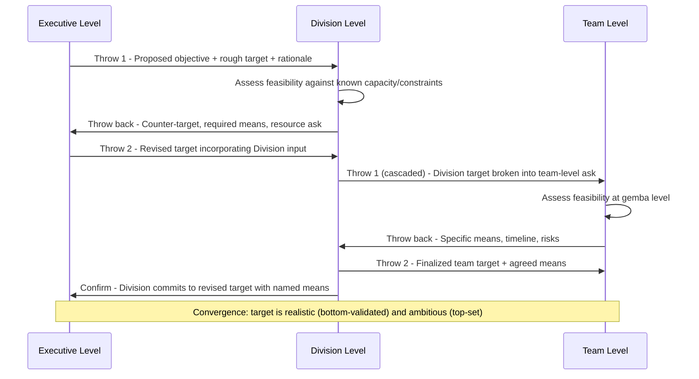

## The Catchball Process for Aligning Goals Across Levels

### Overview

Catchball (キャッチボール, from the English "catch ball") is the iterative, bidirectional negotiation protocol at the center of Hoshin Kanri. Where a prior chapter item covers Hoshin Kanri as the overall strategy deployment system, this item isolates catchball itself as a discrete technique: the specific mechanics of how a target and its means move between organizational levels, get challenged, get revised, and eventually converge into a plan that is simultaneously top-down ambitious and bottom-up feasible.

The name is deliberately literal: like a ball tossed back and forth, a proposed objective is "thrown" from one level to the next, examined, and "thrown back" — modified, countered, or validated — rather than simply caught and executed as-is. A single pass (leader proposes, subordinate accepts) is not catchball; catchball requires at least one genuine round-trip where the receiving level pushes back with substantive information the originating level did not have.

### Why Catchball Exists (the Structural Problem)

Two organizational failure modes motivate catchball's design:

1. **Top-down-only planning**: Executives set targets based on high-level data (market position, financial goals) without visibility into operational constraints. Targets are technically feasible on paper but impossible given current process capability, headcount, or equipment — producing either quiet target abandonment or forced, unsustainable overtime/firefighting to hit numbers.
2. **Bottom-up-only planning**: Teams set their own goals based on local comfort and known capability, with no upward pressure to stretch toward what the business actually needs — producing safe, incremental targets that don't add up to meaningful strategic progress at the company level.

Catchball is the structural compromise: it forces information to flow in both directions *before* a target is finalized, so the eventual target reflects both strategic ambition (from above) and operational reality (from below).

**Key Points**

- Catchball is not consensus-seeking or majority-vote decision-making. The final call on a target typically still rests with the level that owns it strategically; catchball ensures that call is *informed*, not that it is unanimous.
- Catchball is not a one-time event; it recurs at minimum during annual planning, and lighter-weight versions recur during quarterly/monthly progress reviews when targets or means need mid-cycle adjustment.
- Catchball happens level-by-level (e.g., division ↔ department, department ↔ team), not as a single all-hands negotiation — each level only catchballs with the level directly above and below it, which keeps each exchange concrete and manageable.

### The Catchball Exchange: Step-by-Step Mechanics

**Step-by-step breakdown:**

1. **Initial proposal (top-down throw)**: The higher level proposes a target and a rough (not finalized) sense of *why* this target matters and roughly *what* it would take — deliberately incomplete on means, since means are what the lower level is better positioned to specify.
2. **Local assessment**: The receiving level examines the proposal against what they actually know: current process capability, resource constraints, competing priorities, risks the proposing level may not be aware of.
3. **Counter-throw (bottom-up throw back)**: The receiving level responds with one of: acceptance with specifics, a counter-proposal (different target or timeline), or a resource/support request needed to make the original target achievable.
4. **Negotiation iteration**: The higher level reviews the counter-throw. If the gap between proposal and counter is small, it may be resolved directly. If large, another round-trip occurs — this is why catchball is inherently iterative rather than single-pass.
5. **Convergence and commitment**: Both levels agree on a target and a named means to achieve it. This agreement is what gets documented (in an A3, X-Matrix cell, or hoshin planning document) — not the original one-sided proposal.
6. **Cascade downward**: The now-agreed target becomes the *input* for the next catchball round, one level further down, repeating the same throw/assess/counter-throw/converge cycle.

### What Gets Exchanged in Each Throw

A well-formed catchball exchange typically carries more than a bare number. Each throw should communicate:

- **The target itself** (a specific, measurable figure or outcome)
- **The rationale** (why this target, tied back to the objective above it — this is what lets the receiving level evaluate the target intelligently rather than treat it as arbitrary)
- **Known constraints or assumptions** the proposing level is aware of
- **A request for the receiving level's assessment**, explicitly inviting pushback rather than presenting the target as final

A well-formed counter-throw should carry:

- **Specific feasibility data** (current baseline performance, known bottlenecks, capacity limits) — not just "this is too aggressive" without evidence
- **A concrete counter-proposal** (an alternative target, timeline, or scope) rather than only an objection
- **The means** the receiving level proposes to use, and what support or resources those means require from above

[Inference] The quality of catchball as a technique depends heavily on whether counter-throws are evidence-based rather than reflexive pushback; secondary lean literature frequently notes that catchball degrades into a formality when lower levels default to either uncritical acceptance (fear-driven) or reflexive lowballing (gaming the target) rather than substantive, data-grounded negotiation.

### Preconditions for Catchball to Function Correctly

Catchball is a communication protocol, but its effectiveness depends on organizational and cultural preconditions that are not part of the protocol itself:

1. **Psychological safety**: A team must be able to push back on a target from above without career risk. If pushing back is perceived (correctly or not) as insubordination or as "not being a team player," catchball collapses into one-way approval-seeking.
2. **Genuine information asymmetry acknowledgment**: Leadership must accept that lower levels hold information (process capability, day-to-day constraints) that leadership does not have direct access to, and that this information is *legitimate input* to target-setting, not an excuse to be overridden.
3. **Time budget**: Genuine negotiation with multiple round-trips takes calendar time. Compressing the annual planning cycle to leave only enough time for a single top-down announcement structurally forecloses real catchball, regardless of stated intent.
4. **Data availability**: Lower levels need access to relevant baseline data (current defect rates, cycle times, capacity utilization) to make evidence-based counter-throws; without this, pushback is opinion-based and easier to dismiss.
5. **A standing forum**: Catchball needs a designated venue (structured planning meetings, obeya sessions) rather than happening informally/ad hoc, or it tends not to happen at all under normal schedule pressure.

### Common Anti-Patterns

**"Catchball" as theater**: Leadership holds a meeting labeled as catchball, presents a fully finalized target, solicits token comments, and proceeds unchanged. This is the single most frequently cited failure mode in secondary literature — the form of catchball without its substance. [Inference]

**Single-pass "catchball"**: Target thrown down once, accepted once, treated as complete. True catchball implies at least the possibility of multiple round-trips; a process design that only allows one exchange per level structurally prevents the iterative negotiation that catchball is meant to enable.

**Sandbagging**: Lower levels, anticipating that any stated capability will become next year's mandatory baseline, deliberately understate current capacity or overstate constraints during catchball to negotiate an easier target. This is a rational response to an organization that treats hoshin targets punitively (missed targets trigger blame) rather than as commitments arrived at through honest negotiation — it is a symptom of broken psychological safety, not a catchball process flaw per se.

**Skipping levels**: Executive level catchballs directly with team-level gemba staff, bypassing middle management. This can surface useful ground-truth information but removes middle management's role in specifying feasible means at their level of resource control, and can undermine middle management's ownership of the resulting targets.

**Means dictated, not negotiated**: The higher level specifies not just the target but the exact method ("install this specific fixture") without catchballing on means — this converts catchball into ordinary top-down directive-issuing, since the negotiation is intended to cover *how* as much as *how much*.

### Catchball vs. Ordinary Negotiation or Consensus-Building

| Aspect | Catchball | Generic Negotiation | Consensus-Building |
| --- | --- | --- | --- |
| Goal | Convergence on a target + means both levels can commit to | Optimal deal for each party's interest | Agreement acceptable to all parties |
| Structure | Formal, level-by-level, iterative, documented | Often ad hoc, situational | Often group-based, less hierarchical |
| Decision authority | Retained by the proposing/owning level after input | Depends on relative leverage | Distributed; may require unanimity or supermajority |
| Frequency | Structured cadence (annual, with lighter periodic check-ins) | As-needed | As-needed |
| Documentation | Feeds directly into hoshin planning artifacts (A3, X-Matrix) | Variable | Variable |

### Worked Example

**Example**

- **Throw 1 (Executive → Plant Manager)**: "We need a 20% reduction in overall changeover time across the plant this year, to support the new mixed-model production strategy. This matters because our current changeover time is the single biggest constraint on our ability to serve smaller custom orders profitably."
- **Assessment (Plant Manager)**: Reviews changeover data by line. Finds Line 1 is already near best-practice (10% improvement realistic); Line 3 has significant SMED (Single-Minute Exchange of Die) opportunity (35% improvement plausible with investment); Line 2 has an equipment constraint that caps improvement at 5% without capital expenditure.
- **Throw back (Plant Manager → Executive)**: "A flat 20% target across all lines isn't achievable on Line 2 without capital investment we don't currently have budgeted. I propose a weighted target: Line 1 at 10%, Line 3 at 30%, Line 2 at 5% unless $40,000 in capital is approved for a quick-change tooling upgrade, which would let Line 2 hit 15%. Blended, this gets us to roughly 18% plant-wide without the capital ask, or 20% with it."
- **Throw 2 (Executive → Plant Manager)**: Approves the $40,000 capital request given the plan clears the original 20% target with a credible, line-specific rationale; formally sets the differentiated per-line targets as the committed hoshin plan.
- **Cascade (Plant Manager → Line 3 team)**: Line 3's 30% target and SMED-based means are catchballed down to the team level, where the team assesses specific changeover steps and negotiates the exact SMED implementation plan and timeline with the plant manager.

This example illustrates the core value catchball adds: the final plan (differentiated, capital-informed, line-specific targets) is more accurate and more achievable than either a pure top-down 20%-across-the-board mandate or a pure bottom-up "we'll each decide what we can do" approach.

### Related Topics

- Hoshin Kanri as the overall strategy deployment system catchball operates within
- SMED (Single-Minute Exchange of Die) as a concrete means example
- X-Matrix documentation of catchball-negotiated targets and correlations
- Bowling charts for tracking post-catchball target performance over time
- Obeya ("big room") management as a physical venue supporting recurring catchball sessions
- Psychological safety (Amy Edmondson) as the cultural precondition for honest catchball pushback
- A3 problem solving as the artifact format for documenting catchball-derived plans
- Nemawashi (根回し) — the related Japanese practice of informal groundwork/consensus-building preceding formal decisions