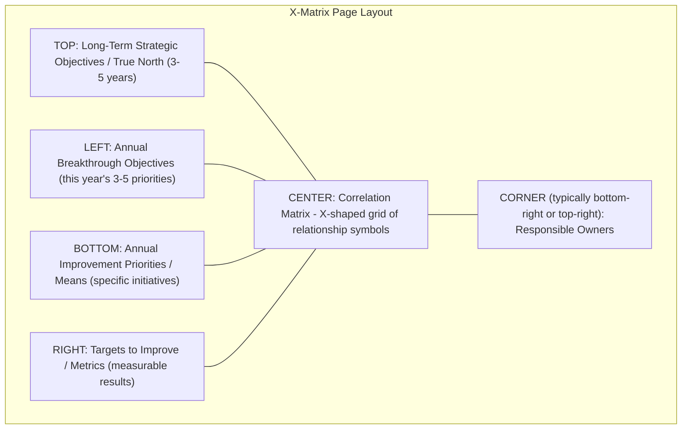

## Building and Using an X Matrix

### Overview

The X-Matrix (also written X Matrix or X-Type Matrix, from its distinctive diagonal "X" layout) is a single-page visual planning document used to document and correlate the outputs of Hoshin Kanri planning and catchball negotiation. It is not itself the strategy process — it is a compact artifact that makes the *relationships* between long-term goals, annual objectives, improvement priorities, metrics, and ownership visible on one page, so that misalignments (an initiative with no clear strategic link, an objective with no supporting action) are visually obvious rather than buried across separate planning documents.

The tool is closely associated with Hoshin Kanri practice as popularized in Western lean literature (notably through consultants and authors such as Thomas Jackson, in *Hoshin Kanri for the Lean Enterprise*), though its use varies significantly by organization. [Unverified] The X-Matrix is a widely taught pedagogical and documentation format for Hoshin Kanri, but it did not originate as a universally mandatory Toyota internal artifact — some organizations that practice genuine Hoshin Kanri (including elements of Toyota itself) rely more on narrative A3-format hoshin documents than a single X-Matrix, so the matrix should be understood as one common implementation tool rather than a defining feature of the underlying methodology.

### Structural Layout

The X-Matrix gets its name from the diagonal band of correlation cells running through the center of the page, dividing the sheet into four outer regions (typically arranged as a rotated square/diamond, though implementations vary):

**The four (or five, including the owner block) regions:**

1. **Top region — Long-Term Strategic Objectives**: The 3–5 year "True North" direction. These are relatively stable across annual planning cycles and provide the fixed reference point the current year's plan must ladder up to.
2. **Left region — Annual Breakthrough Objectives**: The current year's small number (typically 3–5) of top-priority strategic objectives, derived from catchball negotiation with the executive level.
3. **Bottom region — Annual Improvement Priorities (Means)**: The specific initiatives, projects, or kaizen activities that will be executed this year to achieve the breakthrough objectives — the operational "how."
4. **Right region — Targets to Improve (Metrics)**: The measurable results/KPIs used to track whether each improvement priority and breakthrough objective is actually being achieved.
5. **Corner region — Responsible Owners**: Named individuals or teams accountable for each improvement priority, often cross-referenced against the metrics they own.

### The Correlation Grid: How Relationships Are Encoded

The defining visual feature is the matrix of correlation symbols placed in the cells where each pair of adjacent regions intersects. Two correlation grids typically appear:

- **Top ↔ Left grid**: correlates long-term strategic objectives against this year's breakthrough objectives — showing which annual objectives support which long-term direction.
- **Left ↔ Bottom grid**: correlates breakthrough objectives against improvement priorities — showing which specific initiatives support which annual objective.
- **Bottom ↔ Right grid**: correlates improvement priorities against metrics — showing which measurable target tracks which initiative.

**Standard correlation symbols** (conventions vary slightly by source/organization, but a common set is):

| Symbol | Meaning |
| --- | --- |
| ● (filled circle) | Strong/primary relationship |
| ○ (open circle) | Moderate/secondary relationship |
| △ (triangle) | Weak/possible relationship |
| (blank) | No meaningful relationship |

**Key Points**

- An empty row (an improvement priority with no correlation to any breakthrough objective) signals wasted effort — resources going toward something not linked to strategy.
- An empty column (a breakthrough objective with no correlating improvement priority) signals a strategic gap — a stated priority with no concrete plan to achieve it.
- The corner section, correlating owners against metrics/priorities, ensures every initiative has a named accountable party — an initiative with no owner in this grid is a known failure mode (undriven priority).

### Diagram: X-Matrix Visual Structure (svg_diagram)

<svg xmlns="http://www.w3.org/2000/svg" viewBox="0 0 800 800">
<text x="400" y="30" font-size="20" font-weight="bold" text-anchor="middle" fill="#1a1a1a">X-Matrix Structure (svg_diagram)</text>

<rect x="220" y="60" width="360" height="120" fill="#dbeafe" stroke="#1e40af" stroke-width="2" />
<text x="400" y="105" font-size="13" font-weight="bold" text-anchor="middle" fill="#1a1a1a">Long-Term Strategic</text>
<text x="400" y="123" font-size="13" font-weight="bold" text-anchor="middle" fill="#1a1a1a">Objectives (3-5 yrs)</text>
<text x="400" y="150" font-size="11" text-anchor="middle" fill="#333">Obj A | Obj B | Obj C</text>

<rect x="60" y="220" width="140" height="360" fill="#dcfce7" stroke="#15803d" stroke-width="2" />
<text x="130" y="380" font-size="13" font-weight="bold" text-anchor="middle" fill="#1a1a1a" transform="rotate(-90 130 380)">Annual Breakthrough Objectives</text>

<rect x="220" y="620" width="360" height="120" fill="#fef3c7" stroke="#b45309" stroke-width="2" />
<text x="400" y="665" font-size="13" font-weight="bold" text-anchor="middle" fill="#1a1a1a">Annual Improvement</text>
<text x="400" y="683" font-size="13" font-weight="bold" text-anchor="middle" fill="#1a1a1a">Priorities (Means)</text>
<text x="400" y="710" font-size="11" text-anchor="middle" fill="#333">Init 1 | Init 2 | Init 3</text>

<rect x="600" y="220" width="140" height="360" fill="#f3e8ff" stroke="#7e22ce" stroke-width="2" />
<text x="670" y="380" font-size="13" font-weight="bold" text-anchor="middle" fill="#1a1a1a" transform="rotate(-90 670 380)">Targets / Metrics</text>

<rect x="220" y="220" width="360" height="360" fill="#ffffff" stroke="#666" stroke-width="1.5" />

<line x1="220" y1="220" x2="580" y2="580" stroke="#999" stroke-width="1" stroke-dasharray="4,3" />
<line x1="580" y1="220" x2="220" y2="580" stroke="#999" stroke-width="1" stroke-dasharray="4,3" />

<circle cx="280" cy="280" r="8" fill="#1a1a1a" />
<circle cx="340" cy="280" r="5" fill="none" stroke="#1a1a1a" stroke-width="1.5" />
<circle cx="400" cy="340" r="8" fill="#1a1a1a" />
<polygon points="460,390 468,405 452,405" fill="none" stroke="#1a1a1a" stroke-width="1.5" />
<circle cx="340" cy="460" r="8" fill="#1a1a1a" />
<circle cx="520" cy="520" r="5" fill="none" stroke="#1a1a1a" stroke-width="1.5" />
<circle cx="460" cy="460" r="8" fill="#1a1a1a" />

<text x="400" y="400" font-size="12" text-anchor="middle" fill="#666" font-style="italic">correlation grid</text>

<text x="400" y="418" font-size="12" text-anchor="middle" fill="#666" font-style="italic">(● strong ○ moderate △ weak)</text>

<rect x="600" y="620" width="140" height="120" fill="#fee2e2" stroke="#b91c1c" stroke-width="2" />
<text x="670" y="670" font-size="12" font-weight="bold" text-anchor="middle" fill="#1a1a1a">Responsible</text>
<text x="670" y="686" font-size="12" font-weight="bold" text-anchor="middle" fill="#1a1a1a">Owners</text>
</svg>

### Step-by-Step: Building an X-Matrix

1. **Populate the top region first**: Transcribe (do not re-derive) the organization's existing True North / long-term strategic objectives. These should already exist from prior planning cycles; the X-Matrix documents them, it does not create them from scratch each year.
2. **Draft breakthrough objectives (left region)**: Based on the prior year's hansei (reflection) and current business conditions, draft 3–5 candidate annual objectives. This draft is the *input* to catchball, not the final list.
3. **Run catchball to finalize breakthrough objectives**: Negotiate the draft objectives with the relevant management levels (see the catchball process) until targets are both ambitious and validated as feasible. Only the catchball-finalized objectives go into the matrix.
4. **Correlate top ↔ left**: For each breakthrough objective, mark its correlation strength to each long-term objective. An objective with no meaningful correlation to any long-term goal should be questioned before proceeding — it may not belong in this year's plan.
5. **Draft improvement priorities (bottom region)**: For each breakthrough objective, identify the specific initiatives, projects, or kaizen activities that will drive it. This is again catchballed with the level that will execute the work, to ensure means are realistic given resource constraints.
6. **Correlate left ↔ bottom**: Mark which improvement priorities support which breakthrough objectives. Every breakthrough objective should have at least one strong (●) correlation in this grid; if not, the plan has a stated priority with no concrete action behind it.
7. **Define targets/metrics (right region)**: For each improvement priority, define the specific, measurable target that will indicate progress (e.g., "reduce changeover time on Line 3 by 30%," not "improve changeover time").
8. **Correlate bottom ↔ right**: Mark which metrics track which improvement priorities. A priority with no tracking metric cannot be verified during progress review — this correlation should be complete before the plan is finalized.
9. **Assign owners (corner region)**: For each improvement priority (and often each metric), name a specific accountable individual or team. Cross-check that every priority has exactly one clear owner — shared or absent ownership is a common cause of stalled initiatives.
10. **Review the full matrix for gaps**: Scan every row and column for blanks. An empty row or column at any level is either wasted effort (unlinked activity) or an unsupported objective (stated priority, no plan) — both should be resolved before the matrix is considered final.

### Using the X-Matrix During the Year (Not Just at Planning Time)

The X-Matrix is not a "file and forget" planning artifact — its ongoing use includes:

- **Progress review reference**: In periodic (monthly/quarterly) hoshin review meetings, the matrix serves as the master reference for which metrics should be reviewed and which owner should report on them.
- **Mini-catchball trigger**: When a bowling chart or progress metric shows a priority falling behind target, the X-Matrix helps trace *why it matters* (which breakthrough objective it supports) and *who* should be brought into the resulting mini-catchball to adjust means.
- **New-initiative gatekeeping**: Mid-year proposals for new projects or initiatives can be checked against the X-Matrix — if a proposed initiative doesn't correlate to any current breakthrough objective, it's either deprioritized or requires an explicit catchball to justify adding it (recognizing it may displace an existing lower-priority item, since breakthrough objectives are deliberately limited).
- **Year-end hansei input**: At year close, the matrix's correlation structure helps evaluate not just whether targets were hit, but whether the *causal logic* connecting means to objectives to strategy actually held — a metric that improved without moving its correlated breakthrough objective suggests the correlation was miscalibrated, which is itself useful process learning for next year's matrix.

### Common Pitfalls

- **Building the matrix without catchball**: Filling in all four regions unilaterally (by a strategy team or single leader) without the underlying negotiation process. The matrix will look complete and professional but will not reflect the ground-truth feasibility that catchball is designed to surface. [Inference] This is likely the most common failure mode when organizations adopt the X-Matrix as a template without also adopting the surrounding Hoshin Kanri discipline.
- **Too many objectives or initiatives**: Populating the left and bottom regions with long lists rather than the deliberately small, prioritized set Hoshin Kanri calls for. A crowded matrix with weak correlations everywhere defeats the tool's purpose of making priority and alignment visually obvious.
- **Vague metrics**: Right-region entries that are directional rather than measurable ("improve quality" instead of "reduce Station 7 defect rate from 4% to 2%"). Vague metrics cannot be tracked on a bowling chart or used to trigger mini-catchball reviews.
- **Static annual artifact**: Treating the matrix as a document produced once a year and archived, rather than as a living reference consulted in every progress review meeting.
- **Correlation inflation**: Marking most cells as strong (●) correlations to avoid appearing to have gaps, which defeats the diagnostic purpose of the correlation grid — a matrix where everything correlates strongly to everything provides no useful signal about where the real leverage points are.
- **Confusing the tool with the method**: Treating successful completion of the X-Matrix template as equivalent to having done Hoshin Kanri, when the matrix is only a documentation format for a process (catchball-driven strategy deployment) that must actually occur for the artifact to have any value.

### Related Topics

- Hoshin Kanri as the overall strategy deployment system the X-Matrix documents
- The catchball process — the negotiation technique that should precede and populate the matrix
- Bowling charts — the companion tracking tool for the metrics defined in the X-Matrix's right region
- A3 problem solving as an alternative/complementary hoshin documentation format
- Obeya ("big room") management — physical spaces where X-Matrices are often displayed and reviewed
- True North metrics — selecting durable long-term objectives for the matrix's top region
- Visual management principles applied to strategic (not just operational) planning