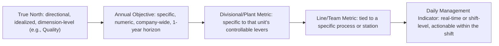

## Defining and Cascading True North Metrics

### Overview

True North is the fixed, long-horizon reference direction against which every annual Hoshin Kanri cycle, breakthrough objective, and gemba-level kaizen activity is ultimately judged for coherence. Where annual breakthrough objectives change year to year, True North is deliberately durable — often stable for 3–5+ years or longer — functioning as a compass heading rather than a destination with a specific arrival date. This item focuses specifically on how True North is defined as a set of *metrics* (not just aspirational language) and how those metrics are cascaded into level-appropriate, measurable indicators throughout the organization without losing their connection to the original strategic intent.

The term borrows the navigational metaphor directly: a compass needle pointing to true north gives a constant, reliable reference direction regardless of the traveler's current position, obstacles, or path — you may zigzag around terrain, but the heading itself doesn't move. In TPS management practice, True North typically expresses the organization's ultimate ideal state across a small number of core dimensions (commonly some combination of safety, quality, cost/productivity, delivery/lead time, and people development — often abbreviated in lean literature with mnemonics like SQDC or SQDCM).

### True North vs. Breakthrough Objectives vs. Operational KPIs

A common source of confusion is treating these three tiers as interchangeable. They differ in horizon, specificity, and function:

| Aspect | True North | Annual Breakthrough Objectives | Operational KPIs |
| --- | --- | --- | --- |
| Time horizon | 3-5+ years, often longer | 1 year | Ongoing, continuously monitored |
| Specificity | Directional, often near-idealistic ("zero defects," "100% on-time delivery") | Concrete, numeric, time-bound | Concrete, numeric, routinely tracked |
| Changes when | Rarely — only on major strategic pivot | Every planning cycle | As needed for daily/weekly management |
| Function | Provides coherence check across years and levels | Focuses this year's catchball and resource allocation | Drives daily/weekly team-level management |
| Example | "Zero customer-facing defects" | "Reduce warranty claims 25% this year" | "Station 7 first-pass yield, tracked daily" |

**Key Points**

- True North metrics are often intentionally set beyond currently achievable levels (e.g., "zero defects," "one-piece flow everywhere") — the point is not that they will be literally reached on a fixed schedule, but that they establish an unambiguous direction that prevents incremental improvement from optimizing toward a locally comfortable but strategically inadequate target.
- [Inference] Because True North metrics are often idealized/asymptotic rather than fully achievable, organizations sometimes struggle with how to "measure" them meaningfully year to year; the resolution used in practice is typically to track *proximity* or *rate of closure* to the ideal (e.g., defect rate trending toward zero) rather than expecting the absolute target to be hit.
- A True North metric that changes every year or two has likely been mis-specified as an annual objective rather than a genuine long-term direction — frequent revision undermines its function as a stable reference point for multi-year coherence checks.

### Common True North Dimensions (SQDCM Framework)

While not a fixed or universal standard, a commonly referenced framework for structuring True North dimensions in TPS-influenced organizations is **SQDCM** (sometimes SQDC without the M):

1. **Safety** — typically the most non-negotiable dimension; often expressed as "zero workplace injuries" or "zero lost-time incidents."
2. **Quality** — typically "zero defects" or "100% first-pass yield," reflecting the ideal of building quality in rather than inspecting it in after the fact.
3. **Delivery** — typically "100% on-time delivery" or "one-piece flow" as the idealized lead-time state, reflecting elimination of batching and waiting waste.
4. **Cost** — typically framed around cost reduction through waste elimination (not simply headcount reduction), often expressed as productivity or value-added ratio improvement.
5. **Morale / People Development (the "M")** — reflects the TPS principle that the organization's capability to develop people is itself a strategic asset; often expressed in terms of employee engagement, skill development coverage, or retention of critical knowledge.

[Unverified] SQDCM/SQDC is a widely taught organizing framework in lean/TPS-adjacent training material, but organizations vary in which dimensions they include, how many they track, and whether they use this specific mnemonic at all — some True North frameworks add dimensions like environmental sustainability or customer satisfaction as separate categories, and Toyota's own internal framing is not confined to a single universal five-category template.

### Diagram: True North Cascade with Metric Transformation (svg_diagram)

<svg xmlns="http://www.w3.org/2000/svg" viewBox="0 0 900 620">
<text x="450" y="30" font-size="20" font-weight="bold" text-anchor="middle" fill="#1a1a1a">True North Metric Cascade (svg_diagram)</text>

<rect x="300" y="60" width="300" height="80" rx="8" fill="#1e3a8a" stroke="#1a1a1a" stroke-width="2" />
<text x="450" y="95" font-size="14" font-weight="bold" text-anchor="middle" fill="#ffffff">True North (Directional Ideal)</text>
<text x="450" y="115" font-size="12" text-anchor="middle" fill="#dbeafe">"Zero customer-facing defects"</text>
<text x="450" y="131" font-size="11" text-anchor="middle" fill="#93c5fd">(Quality dimension, no fixed date)</text>

<rect x="300" y="180" width="300" height="80" rx="8" fill="#1d4ed8" stroke="#1a1a1a" stroke-width="2" />
<text x="450" y="215" font-size="14" font-weight="bold" text-anchor="middle" fill="#ffffff">Annual Breakthrough Objective</text>
<text x="450" y="235" font-size="12" text-anchor="middle" fill="#dbeafe">"Reduce warranty claims 25%</text>
<text x="450" y="250" font-size="12" text-anchor="middle" fill="#dbeafe">this fiscal year"</text>

<rect x="100" y="300" width="300" height="80" rx="8" fill="#2563eb" stroke="#1a1a1a" stroke-width="2" />
<text x="250" y="335" font-size="13" font-weight="bold" text-anchor="middle" fill="#ffffff">Plant-Level Metric</text>
<text x="250" y="355" font-size="12" text-anchor="middle" fill="#dbeafe">"Reduce in-process defect</text>
<text x="250" y="370" font-size="12" text-anchor="middle" fill="#dbeafe">rate 40% for top 2 defect types"</text>

<rect x="500" y="300" width="300" height="80" rx="8" fill="#2563eb" stroke="#1a1a1a" stroke-width="2" />
<text x="650" y="335" font-size="13" font-weight="bold" text-anchor="middle" fill="#ffffff">Line-Level Metric</text>
<text x="650" y="355" font-size="12" text-anchor="middle" fill="#dbeafe">"Line 3 first-pass yield</text>
<text x="650" y="370" font-size="12" text-anchor="middle" fill="#dbeafe">from 92% to 97%"</text>

<rect x="300" y="420" width="300" height="80" rx="8" fill="#3b82f6" stroke="#1a1a1a" stroke-width="2" />
<text x="450" y="455" font-size="13" font-weight="bold" text-anchor="middle" fill="#ffffff">Station-Level Metric</text>
<text x="450" y="475" font-size="12" text-anchor="middle" fill="#dbeafe">"Station 7: defects per</text>
<text x="450" y="490" font-size="12" text-anchor="middle" fill="#dbeafe">1000 units, tracked hourly"</text>

<rect x="300" y="540" width="300" height="60" rx="8" fill="#60a5fa" stroke="#1a1a1a" stroke-width="2" />
<text x="450" y="568" font-size="13" font-weight="bold" text-anchor="middle" fill="#1a1a1a">Daily Andon / Visual Board Tracking</text>
<text x="450" y="586" font-size="11" text-anchor="middle" fill="#1e3a8a">Immediate operator-level feedback</text>

<line x1="450" y1="140" x2="450" y2="175" stroke="#1a1a1a" stroke-width="2" marker-end="url(#ar)" />
<line x1="380" y1="260" x2="280" y2="295" stroke="#1a1a1a" stroke-width="1.5" marker-end="url(#ar)" />
<line x1="520" y1="260" x2="620" y2="295" stroke="#1a1a1a" stroke-width="1.5" marker-end="url(#ar)" />
<line x1="300" y1="380" x2="400" y2="415" stroke="#1a1a1a" stroke-width="1.5" marker-end="url(#ar)" />
<line x1="600" y1="380" x2="500" y2="415" stroke="#1a1a1a" stroke-width="1.5" marker-end="url(#ar)" />
<line x1="450" y1="500" x2="450" y2="535" stroke="#1a1a1a" stroke-width="2" marker-end="url(#ar)" />

<text x="820" y="220" font-size="11" fill="`#c2410c`" font-style="italic">catchball at</text>

<text x="820" y="234" font-size="11" fill="`#c2410c`" font-style="italic">every level</text>

</svg>

### The Cascading Transformation: From Directional Ideal to Actionable Metric

The core technical challenge in cascading True North is that it is deliberately abstract and idealized at the top, but each level down requires progressively more specific, locally measurable, and shorter-horizon metrics. The transformation follows a consistent pattern:

At each transformation step, three things happen simultaneously:

1. **Specificity increases** — from a dimension ("quality") to a numeric target ("25% reduction") to a process-specific indicator ("Station 7 defects per 1000 units").
2. **Time horizon shortens** — from multi-year (True North) to annual (breakthrough objective) to daily/shift-level (gemba indicator).
3. **Controllability increases** — a plant manager cannot directly control "zero customer defects" as an abstract idea, but can directly control a specific fixture's re-torque schedule; the cascade is designed so that the metric at each level is something that level can actually act on.

**Key Points**

- The cascade must preserve *traceability*: someone examining a station-level metric should be able to trace upward through each level to see exactly which True North dimension it ultimately serves. If that traceability breaks (a metric exists with no clear upward linkage), it is either genuinely disconnected busywork or the linkage documentation has simply been lost — both are worth investigating.
- Cascading is not simple arithmetic division (e.g., "25% company-wide" does not mean "25% for every line regardless of starting condition"). As illustrated in the catchball item, cascaded targets should be differentiated based on each unit's actual current performance and improvement potential, which is precisely what catchball negotiation is for.
- Metrics become more numerous but narrower in scope as they cascade down — a single True North dimension might generate one annual objective, which generates several plant-level metrics, which generate many station-level indicators. This fan-out is expected and appropriate, provided the traceability upward remains intact.

### Characteristics of a Well-Defined True North Metric

- **Dimension-anchored**: Clearly tied to one of the organization's core strategic dimensions (safety, quality, delivery, cost, people), not a vague aspiration disconnected from a measurable category.
- **Durable**: Expected to remain the relevant direction for multiple years; not something likely to be fully "achieved and retired" within a single annual cycle (if it is, it was probably an annual objective, not True North).
- **Idealized but directionally clear**: Often expressed as a limit condition ("zero," "100%," "one-piece flow") rather than a moderate improvement, because its function is to prevent complacency and provide unambiguous direction for the cascading annual objectives, not to be a near-term achievable target itself.
- **Measurable in principle**: Even though the ideal state itself may never be fully reached, there must be a metric or family of metrics (defect rate, injury rate, on-time delivery percentage) that can express *progress toward* it, or the cascade below it has nothing concrete to anchor to.
- **Small in number**: Organizations typically maintain only a handful of True North statements (often one per SQDCM-style dimension) — a long list of "true norths" dilutes the coherence-checking function the concept exists to provide.

### Worked Example: Full Cascade from a Single True North Dimension

**Example**

- **True North (Quality dimension)**: "Zero customer-facing defects."
- **Multi-year proximity metric**: Customer-reported defect rate (parts per million), tracked as a long-term trend line, expected to approach — never mathematically reach — zero.
- **Annual Breakthrough Objective (Year N)**: Reduce customer-reported defect rate from 340 ppm to 255 ppm (25% reduction), catchballed and agreed between executive and plant leadership.
- **Plant-Level Metric**: Reduce in-process escape rate for the two highest-volume defect categories by 40%, since analysis showed these two categories account for 60% of customer complaints.
- **Line-Level Metric**: Line 3 first-pass yield improves from 92% to 97%, since Line 3 is the primary source of one of the two target defect categories.
- **Station-Level Metric**: Station 7 defects per 1,000 units, tracked and posted on a visual andon board, reviewed at every shift handoff.
- **Daily Management Action**: Any shift exceeding the station's defect threshold triggers an immediate stop-and-fix response (jidoka) and a same-day root-cause note, feeding into the next hansei/kaizen cycle.

At every level, an observer can trace the station-level number all the way up to "zero customer-facing defects" — this unbroken traceability is the specific technical property that distinguishes a well-cascaded True North metric system from a collection of disconnected local KPIs.

### Common Pitfalls

- **True North as slogan only**: Publishing an inspirational phrase ("Excellence in everything we do") with no attached metric or cascade path. Without a measurable proximity indicator and an explicit cascade, True North functions as decoration rather than a planning tool.
- **Annual objectives mistaken for True North**: Treating a specific, achievable, dated target as "True North," which causes it to be revised or declared "done" within a year or two — eliminating the multi-year stability that gives True North its coherence-checking value.
- **Broken cascade traceability**: Station and line-level metrics proliferate over time (often from well-intentioned local kaizen) without being re-linked to the current True North dimensions, resulting in a metrics dashboard that is busy but strategically incoherent.
- **Cascading by uniform percentage**: Applying the same percentage target to every unit regardless of differing baselines and capability, rather than differentiating cascaded targets through catchball — this produces targets that are simultaneously too easy for high-performing units and infeasible for constrained ones.
- **Too many True North statements**: Attempting to give every function (safety, quality, cost, delivery, people, sustainability, innovation, etc.) equal "True North" status dilutes focus; [Inference] most practical guidance suggests keeping the set small enough that every employee in the organization can recall them without reference material.
- **No proximity metric for an idealized target**: Stating "zero defects" without defining what metric expresses progress toward it (e.g., ppm defect rate) leaves the direction unmeasurable and therefore uncascadable into concrete annual objectives.

### Related Topics

- Hoshin Kanri as the overall system True North metrics anchor
- The catchball process — how cascaded targets at each level are negotiated, not merely divided
- Building and using an X-Matrix — where True North occupies the top region
- Bowling charts — tracking cascaded metric performance against target, period by period
- SQDCM / SQDC frameworks for structuring strategic dimensions
- Daily management systems and visual andon boards as the terminal layer of the metric cascade
- Jidoka and stop-the-line response as the mechanism connecting daily metrics back to root-cause learning