## Leader Standard Work

### Overview

Leader Standard Work (LSW) is the application of standardized work principles to the role of a leader/manager, rather than to a production operator. Where operator standardized work specifies the precise sequence, timing, and method for a repeatable production task, Leader Standard Work specifies the recurring set of activities, checks, and time allocations a leader (team leader, supervisor, plant manager, etc.) performs on a defined cadence — daily, weekly, monthly — to sustain the management system itself: verifying standards are followed, coaching problem-solving, and connecting gemba reality back to the strategic hoshin cascade.

The underlying premise is that management behavior is itself a process, and like any process, an undefined or inconsistent management process produces inconsistent results. Without LSW, a leader's time allocation drifts toward whatever is most urgent or most visible on a given day (firefighting), at the expense of the routine verification and coaching activities that sustain continuous improvement and prevent the same fires from recurring.

### Why Leader Standard Work Exists

Three structural problems motivate LSW as a distinct discipline:

1. **Management attention decays without structure**: Even leaders genuinely committed to lean principles will, absent a defined routine, gradually spend less time at the gemba and more time in meetings, email, and reactive firefighting — not from lack of intent, but because reactive work has more immediate, visible urgency than preventive verification.
2. **Standards decay without verification**: A standardized work sheet that is never checked against actual practice tends to drift from reality — operators develop informal workarounds, and the written standard becomes disconnected from what is actually happening. Someone must routinely verify the standard is both followed and still correct.
3. **Escalation paths require routine, not just crisis-driven, contact**: Problems surfaced only when they become severe enough to force attention are, by definition, being caught late. Leader Standard Work builds in routine, scheduled points of contact with the gemba so smaller deviations are caught before they compound.

**Key Points**

- LSW is not a to-do list or a calendar of meetings — it specifically defines *gemba-facing* activities: what the leader checks, where, how often, and what they are looking for, connected explicitly to sustaining standards and surfacing abnormalities.
- LSW exists at every management level, but its content changes character as it moves up the hierarchy: a team leader's LSW is largely process-verification (checking specific standards at specific stations); a plant manager's LSW is largely system-verification (checking that team leaders are executing *their* LSW, and that escalated problems are being resolved, not just re-escalated).
- LSW is meant to be a *minority* of a leader's total time in practice for higher levels (a plant manager cannot spend all day at every station), but the portion of time it does occupy is protected/non-negotiable, precisely because it's the activity most likely to be sacrificed to urgent-but-less-important demands if left undefined.

### The Three Core Components of Leader Standard Work

LSW documents typically specify three things for each recurring activity:

1. **What** — the specific task or check (e.g., "verify Station 7 standardized work sheet is being followed as written," "review overnight andon pulls and root causes").
2. **When / How Often** — the cadence and, often, the specific time of day (e.g., "daily at shift start," "first Monday of each month").
3. **How** — the specific method: what to look at, what questions to ask, what constitutes a pass/fail or an item requiring escalation.

A well-formed LSW document is itself a standard, in the same sense as operator standardized work: specific enough that deviation from it (a skipped check, a check done superficially) is visible, and specific enough that another person filling the same role could execute it consistently.

### Leader Standard Work by Organizational Level

```mermaid
flowchart TD
    A["Team Leader / Supervisor LSW<br/>Daily, gemba-proximate"] --> A1["Verify standardized work compliance<br/>at specific stations"]
    A --> A2["Review shift-start andon/quality data"]
    A --> A3["Coach operators on 5-Why for<br/>any deviation observed"]

    B["Department / Value Stream Manager LSW<br/>Daily-to-weekly, verification of verification"] --> B1["Audit that team leaders completed<br/>their own LSW checks"]
    B --> B2["Review escalated problems from<br/>team-leader level"]
    B --> B3["Weekly gemba walk across<br/>full value stream"]

    C["Plant / Site Manager LSW<br/>Weekly-to-monthly, system-level"] --> C1["Review hoshin/bowling chart<br/>progress against targets"]
    C --> C2["Spot-check department manager<br/>LSW execution"]
    C --> C3["Monthly cross-functional<br/>hansei review"]

    D["Executive LSW<br/>Monthly-to-quarterly, strategic coherence"] --> D1["Review plant-level hoshin<br/>catchball outcomes"]
    D --> D2["Gemba visits across sites<br/>on a rotating schedule"]
    D --> D3["Quarterly strategic hansei"]
```

**Key Points**

- The pattern that recurs at every level is: *verify the standard below you is being followed, verify the level below you is executing their own LSW, and maintain your own routine gemba contact* — LSW at a given level is partly about direct verification and partly about verifying the verification happening at the level below.
- As level increases, cadence typically lengthens (daily → weekly → monthly) and scope typically broadens (single station → single line → full value stream → full site), but the underlying logic (define what to check, when, and how) remains structurally identical.
- [Inference] A frequently cited practical guideline in secondary lean literature is that roughly 50% or more of a frontline team leader's time should be allocated to LSW-defined gemba activities, with the proportion of protected LSW time generally decreasing (in absolute percentage, though not in strategic importance) at higher organizational levels where broader coordination responsibilities compete for time; this specific percentage is a commonly cited heuristic rather than a fixed rule.

### LSW Document Format (Illustrative Structure)

A typical LSW document/checklist is organized as a matrix of activities against time blocks. A simplified illustrative example for a production team leader:

| Time | Activity | Method / What to Check | Escalation Trigger |
| --- | --- | --- | --- |
| Shift start | Review prior shift andon log | Count and categorize any stops; verify each has a documented cause | 3+ stops from same station in one shift |
| First hour | Gemba walk, Stations 1-4 | Observe cycle against standardized work sheet; ask operator about any deviation | Any deviation not resolved within the standard's allowed tolerance |
| Mid-shift | Gemba walk, Stations 5-8 | Same as above | Same as above |
| Before shift end | Review quality check station data | First-pass yield vs. daily target | Yield below target for 2 consecutive shifts |
| End of shift | Handoff briefing to next shift leader | Communicate any open issues, in-progress 5-Whys, or standard deviations noted | N/A (informational) |

[Inference] The specific structure, granularity, and terminology of LSW documents vary considerably across organizations and industries; the table above illustrates the general pattern (what/when/how/escalation) commonly described in lean management literature rather than a single universally standardized template.

### Diagram: Leader Standard Work Verification Loop (svg_diagram)

<svg xmlns="http://www.w3.org/2000/svg" viewBox="0 0 900 480">
<text x="450" y="30" font-size="20" font-weight="bold" text-anchor="middle" fill="#1a1a1a">Leader Standard Work Verification Loop (svg_diagram)</text>

<rect x="60" y="90" width="220" height="90" rx="8" fill="#dbeafe" stroke="#1e40af" stroke-width="2" />
<text x="170" y="125" font-size="14" font-weight="bold" text-anchor="middle" fill="#1a1a1a">Operator Standardized Work</text>
<text x="170" y="148" font-size="11" text-anchor="middle" fill="#333">defines the correct method</text>
<text x="170" y="163" font-size="11" text-anchor="middle" fill="#333">at the task level</text>

<rect x="340" y="90" width="220" height="90" rx="8" fill="#dcfce7" stroke="#15803d" stroke-width="2" />
<text x="450" y="120" font-size="14" font-weight="bold" text-anchor="middle" fill="#1a1a1a">Team Leader LSW</text>
<text x="450" y="143" font-size="11" text-anchor="middle" fill="#333">verifies operator standard</text>
<text x="450" y="158" font-size="11" text-anchor="middle" fill="#333">is followed &amp; coaches gaps</text>

<rect x="620" y="90" width="220" height="90" rx="8" fill="#fef3c7" stroke="#b45309" stroke-width="2" />
<text x="730" y="120" font-size="14" font-weight="bold" text-anchor="middle" fill="#1a1a1a">Dept Manager LSW</text>
<text x="730" y="143" font-size="11" text-anchor="middle" fill="#333">verifies team leader LSW</text>
<text x="730" y="158" font-size="11" text-anchor="middle" fill="#333">is executed consistently</text>

<rect x="340" y="230" width="220" height="90" rx="8" fill="#f3e8ff" stroke="#7e22ce" stroke-width="2" />
<text x="450" y="260" font-size="14" font-weight="bold" text-anchor="middle" fill="#1a1a1a">Site Manager LSW</text>
<text x="450" y="283" font-size="11" text-anchor="middle" fill="#333">verifies dept manager LSW,</text>
<text x="450" y="298" font-size="11" text-anchor="middle" fill="#333">reviews hoshin progress</text>

<rect x="60" y="370" width="780" height="70" rx="8" fill="#ffedd5" stroke="#c2410c" stroke-width="2" />
<text x="450" y="400" font-size="14" font-weight="bold" text-anchor="middle" fill="#1a1a1a">Deviations Found → 5-Why / A3 → Standard Revised or Reinforced</text>
<text x="450" y="422" font-size="11" text-anchor="middle" fill="#7c2d12">Feeds back into both operator standards and hoshin progress reviews</text>

<line x1="280" y1="135" x2="335" y2="135" stroke="#1a1a1a" stroke-width="2" marker-end="url(#a1)" />
<line x1="560" y1="135" x2="615" y2="135" stroke="#1a1a1a" stroke-width="2" marker-end="url(#a1)" />
<line x1="700" y1="180" x2="500" y2="225" stroke="#1a1a1a" stroke-width="1.5" marker-end="url(#a1)" />
<line x1="450" y1="320" x2="450" y2="365" stroke="#1a1a1a" stroke-width="2" marker-end="url(#a1)" />
<line x1="170" y1="180" x2="200" y2="365" stroke="#888" stroke-width="1.5" stroke-dasharray="5,3" marker-end="url(#a1)" />
</svg>

### LSW as the Connective Tissue Between Daily Management and Hoshin Kanri

LSW is the mechanism that makes both organizational learning culture and Hoshin Kanri cascades operationally real, rather than aspirational:

- **Learning organization link**: LSW is where hansei-style reflection and genchi genbutsu are converted from occasional events into routine daily practice — a leader who has scheduled, protected gemba time every day is structurally more likely to actually go-and-see than one relying on ad hoc initiative.
- **Hoshin Kanri link**: The metrics defined in a cascaded True North / X-Matrix structure (see prior items) need someone routinely checking them and initiating mini-catchball or root-cause response when they drift off track. LSW is what specifies *who checks which metric, how often, and what they do about a gap* — without it, a beautifully constructed hoshin plan has no mechanism ensuring anyone is actually looking at the metrics between quarterly reviews.
- **Standardized work link**: LSW closes the loop on operator standardized work by ensuring someone is routinely verifying that standards are followed and are still accurate — without this verification, standardized work sheets tend to become stale documents that no longer reflect actual practice.

### Worked Example

**Example**

A department manager's LSW includes a weekly 30-minute review, every Monday at 9:00 AM, of the department's contribution to the current hoshin plan's changeover-time reduction objective (see the catchball worked example). The LSW specifies:

- **What**: Review the bowling chart for changeover time on Lines 1-3 against weekly targets.
- **Method**: For any line more than 10% behind its weekly target, walk to that line the same day (not delegate) and conduct a brief genchi genbutsu observation with the line's team leader.
- **Escalation trigger**: If a line is behind target for 2 consecutive weeks, initiate a mini-catchball with the plant manager to discuss whether the target, the means, or the execution needs adjustment.
- **Documented outcome**: A brief note added to the department's A3 or hoshin tracking log, whether or not a gap was found, so that the review itself has a verifiable audit trail distinct from just the manager's memory.

Because this check is scheduled and specified (not left to whenever the manager "gets a chance"), a lagging line is caught within one week rather than being discovered only at the next full quarterly hoshin review — directly shortening the feedback loop between deviation and corrective action.

### Common Pitfalls

- **LSW as a compliance checklist rather than a verification tool**: A leader who checks boxes on an LSW sheet without actually engaging with what they observe (or without escalating what they find) has satisfied the letter of the standard while defeating its purpose.
- **No consequence for un-executed LSW**: If a leader can skip their own LSW repeatedly with no one verifying it happened, LSW at that level effectively does not exist, regardless of the document — this is precisely why the "verify the level below's LSW" component is structurally necessary at every level above the frontline.
- **LSW crowded out by reactive work**: Without protected, calendared time, LSW is the first thing to be sacrificed when urgent issues arise — ironically increasing future urgent issues, since routine verification is what catches small deviations before they become urgent ones.
- **Copy-pasted LSW across roles or sites**: Applying an identical LSW template to a role or site with different processes, risks, or maturity levels, rather than tailoring the specific checks to what that role's process actually requires.
- **LSW disconnected from hoshin metrics**: A leader dutifully executes gemba walks and checks but never connects observations back to the current year's breakthrough objectives, functioning as generic "management by walking around" rather than the tightly linked verification-and-escalation system LSW is meant to be.
- **Treating LSW as static once written**: Like operator standardized work, LSW itself should be periodically reviewed and revised — a checklist appropriate for a plant in crisis-response mode may be inappropriate once stability is achieved and priorities shift.

### Related Topics

- Standardized work — the operator-level standard that Leader Standard Work exists to verify
- Genchi genbutsu ("go and see") as the observational method embedded in gemba-facing LSW checks
- Building a true learning organization culture — hansei and reflection made routine through LSW
- Hoshin Kanri and the catchball process — the strategic cascade LSW keeps operationally connected to daily reality
- Bowling charts — the tracking artifact frequently reviewed as part of managerial LSW
- Obeya ("big room") management as a physical space supporting recurring LSW review routines
- Gemba walks — structure, cadence, and common observational frameworks