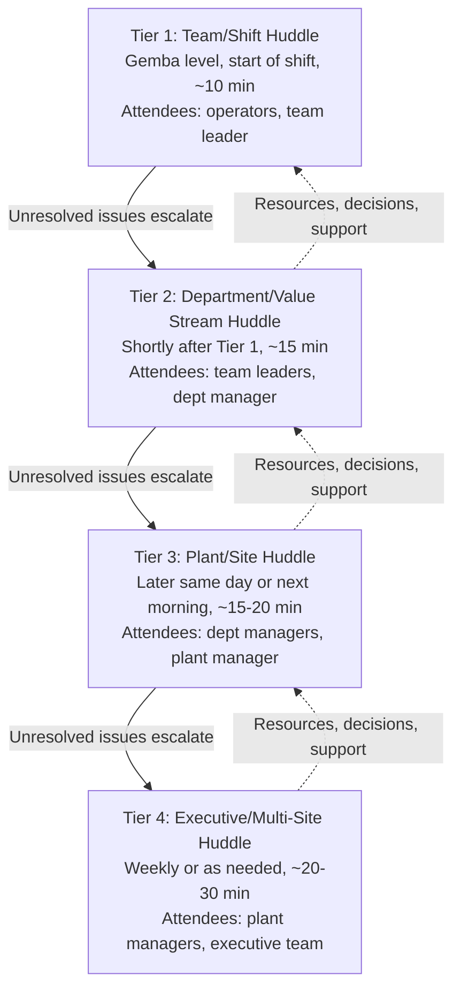

## Daily Management and Tiered Huddle Systems

### Overview

Daily management (sometimes called Daily Management System, DMS — not to be confused with document management systems in other contexts) is the operational infrastructure of short, structured, standing meetings — huddles — organized in a vertical "tier" hierarchy that moves problems, status, and escalations up through an organization within hours rather than days or weeks. Where Leader Standard Work (covered in a prior item) specifies what an individual leader routinely checks, tiered huddles are the *shared, multi-person* venue where that checking becomes visible, coordinated, and escalated across levels in near-real time.

The tiered structure typically runs from the gemba (Tier 1) upward through several management layers (Tier 2, Tier 3, sometimes Tier 4), with each tier's huddle occurring shortly after the tier below it, so that a problem surfaced at the shop floor at shift start can reach site leadership the same day if it exceeds what the local level can resolve.

### Why Tiered Huddles Exist

Without a designed escalation cadence, problem visibility depends on either informal communication (unreliable, inconsistent, easily dropped) or waiting for scheduled periodic meetings (weekly/monthly), which is far too slow for issues that need same-day resolution. Tiered huddles solve this by guaranteeing:

1. **A fixed, short time window** (typically 5–15 minutes per tier) where status and problems are reported, preventing huddles from sprawling into lengthy discussions that defeat the purpose of frequent, rapid escalation.
2. **A standard escalation rule**: a problem that cannot be resolved at one tier within a defined time or scope automatically moves to the next tier's huddle, rather than depending on someone remembering to raise it.
3. **Visual, at-a-glance status**: huddles are almost always conducted standing at a physical (or digital) visual board, not seated around a table with a laptop, to keep the format brief and focused on exceptions rather than narrative reporting.

**Key Points**

- The core design principle is "management by exception": huddles are not meant to report everything that happened, only what deviated from plan/standard and what needs attention — a huddle that recites all-normal status for every item, every day, has drifted from its intended function.
- Huddles are time-boxed deliberately short (commonly 10–15 minutes) — this constraint is a feature, not a limitation, forcing prioritization of what genuinely needs group attention versus what can be resolved one-on-one after the huddle.
- The tiered structure is the physical/organizational embodiment of the same escalation logic found in andon systems (a station-level abnormality escalates to a team leader, then further if unresolved) applied at the level of routine status reporting rather than only in-the-moment production stops.

### Typical Tier Structure

**Tier 1 (Team/Gemba level)**: Conducted at or near the actual work area, typically at shift start. Reviews the prior shift's andon pulls, safety incidents, quality issues, and today's production plan against known constraints. Attendees are operators and the immediate team leader.

**Tier 2 (Department/Value Stream level)**: Conducted shortly after Tier 1 concludes, aggregating status across multiple Tier 1 teams within a department or value stream. The department manager reviews what each team leader escalated, looking for cross-team patterns (e.g., the same defect type appearing on multiple lines) that no single Tier 1 huddle would notice in isolation.

**Tier 3 (Plant/Site level)**: Conducted later the same day or the following morning, aggregating across departments. The plant manager reviews department-level escalations, hoshin-linked metric status (see the True North cascade and bowling chart items), and cross-departmental resource conflicts.

**Tier 4 (Executive/Multi-site level)**: Typically less frequent (weekly rather than daily) given the broader scope, reviewing plant-level performance against company-wide hoshin objectives and allocating resources or making decisions that individual plants cannot make themselves.

[Inference] The specific number of tiers (commonly three to four), their exact cadence, and their naming conventions vary substantially by organization and industry; the structure above reflects a commonly described general pattern in daily-management and tiered-huddle literature rather than a fixed universal standard that all TPS-influenced organizations follow identically.

### Diagram: Huddle Escalation Timing Within a Day (svg_diagram)

<svg xmlns="http://www.w3.org/2000/svg" viewBox="0 0 900 420">
<text x="450" y="30" font-size="20" font-weight="bold" text-anchor="middle" fill="#1a1a1a">Tiered Huddle Escalation Timeline (svg_diagram)</text>

<line x1="80" y1="360" x2="820" y2="360" stroke="#333" stroke-width="2" />
<text x="80" y="385" font-size="12" text-anchor="middle" fill="#333">6:00 AM</text>
<text x="280" y="385" font-size="12" text-anchor="middle" fill="#333">6:20 AM</text>
<text x="480" y="385" font-size="12" text-anchor="middle" fill="#333">7:00 AM</text>
<text x="680" y="385" font-size="12" text-anchor="middle" fill="#333">8:30 AM</text>

<rect x="60" y="80" width="140" height="70" rx="6" fill="#dbeafe" stroke="#1e40af" stroke-width="2" />
<text x="130" y="108" font-size="12" font-weight="bold" text-anchor="middle" fill="#1a1a1a">Tier 1</text>
<text x="130" y="124" font-size="11" text-anchor="middle" fill="#333">Shift Huddle</text>
<text x="130" y="139" font-size="10" text-anchor="middle" fill="#555">10 min</text>
<line x1="130" y1="150" x2="130" y2="360" stroke="#1e40af" stroke-width="1" stroke-dasharray="3,3" />

<rect x="260" y="140" width="140" height="70" rx="6" fill="#dcfce7" stroke="#15803d" stroke-width="2" />
<text x="330" y="168" font-size="12" font-weight="bold" text-anchor="middle" fill="#1a1a1a">Tier 2</text>
<text x="330" y="184" font-size="11" text-anchor="middle" fill="#333">Dept Huddle</text>
<text x="330" y="199" font-size="10" text-anchor="middle" fill="#555">15 min</text>
<line x1="330" y1="210" x2="330" y2="360" stroke="#15803d" stroke-width="1" stroke-dasharray="3,3" />

<rect x="460" y="200" width="160" height="70" rx="6" fill="#fef3c7" stroke="#b45309" stroke-width="2" />
<text x="540" y="228" font-size="12" font-weight="bold" text-anchor="middle" fill="#1a1a1a">Tier 3</text>
<text x="540" y="244" font-size="11" text-anchor="middle" fill="#333">Plant Huddle</text>
<text x="540" y="259" font-size="10" text-anchor="middle" fill="#555">15-20 min</text>
<line x1="540" y1="270" x2="540" y2="360" stroke="#b45309" stroke-width="1" stroke-dasharray="3,3" />

<rect x="660" y="260" width="160" height="70" rx="6" fill="#f3e8ff" stroke="#7e22ce" stroke-width="2" />
<text x="740" y="288" font-size="12" font-weight="bold" text-anchor="middle" fill="#1a1a1a">Tier 4</text>
<text x="740" y="304" font-size="11" text-anchor="middle" fill="#333">Exec Huddle (weekly)</text>
<text x="740" y="319" font-size="10" text-anchor="middle" fill="#555">20-30 min</text>
<line x1="740" y1="330" x2="740" y2="360" stroke="#7e22ce" stroke-width="1" stroke-dasharray="3,3" />

<path d="M 200 115 Q 230 90 260 165" stroke="#c2410c" stroke-width="2" fill="none" marker-end="url(#ae)" />
<path d="M 400 175 Q 430 150 460 225" stroke="#c2410c" stroke-width="2" fill="none" marker-end="url(#ae)" />
<path d="M 620 235 Q 650 210 660 285" stroke="#c2410c" stroke-width="2" fill="none" marker-end="url(#ae)" />
<text x="450" y="60" font-size="11" fill="#c2410c" text-anchor="middle" font-style="italic">unresolved issues escalate same day, tier to tier</text>
</svg>

### Anatomy of a Single Huddle

Regardless of tier, a well-run huddle typically follows a consistent internal structure:

1. **Safety first**: Any safety incidents or near-misses since the last huddle, always reviewed first regardless of other content — reflecting the near-universal TPS/lean convention that safety is the non-negotiable top dimension.
2. **Quality**: Defects, andon pulls, or quality escalations, with brief root-cause status if known (full 5-Why analysis happens outside the huddle if it requires more time).
3. **Delivery/Production**: Status against the shift or day's production plan, flagging any at-risk deliveries.
4. **Cost/Resource issues**: Material shortages, equipment downtime, or staffing gaps affecting output.
5. **Open escalations from the prior huddle**: Follow-up on anything escalated previously, closing the loop rather than letting escalated items disappear.
6. **New escalations to the next tier**: Explicit identification of what, if anything, needs to move up to the next tier's huddle.

**Key Points**

- This SQDC-aligned ordering (Safety, Quality, Delivery, Cost) mirrors the True North dimension structure described in the True North cascade item — the huddle agenda is effectively a compressed, daily-cadence version of the same strategic dimensions tracked at longer horizons.
- Huddles are conducted standing, at a visual board (physical whiteboard, kanban-style board, or digital equivalent), not seated in a conference room — this is a deliberate design choice to keep the format brief and focused on visual status rather than extended discussion.
- Anything requiring more than a brief exchange (a detailed root-cause investigation, a complex resource negotiation) is explicitly deferred to a separate follow-up conversation *after* the huddle, named during the huddle but not conducted within it — protecting the huddle's time-box for all attendees.

### The Visual Board as Huddle Infrastructure

Tiered huddles depend on a standardized visual board (sometimes integrated with, or overlapping, the same board used for LSW verification) that typically displays:

- Current shift/day/week performance against target for each core metric (often using red/yellow/green status)
- Open issues and their assigned owner and target resolution date
- Escalations currently in progress, with which tier they've reached
- A simple visual indicator (a magnet, sticky note, or card) marking whether an issue is newly raised, in progress, or resolved

[Inference] Digital daily-management board tools (dashboards, kanban software) have become common substitutes or supplements for physical boards in many organizations, particularly where teams are geographically distributed; secondary practitioner literature generally emphasizes that the visual/at-a-glance property matters more than the specific medium, though physical boards are often cited as preserving a more consistent "stand and look together" huddle behavior than screen-based equivalents.

### Worked Example

**Example**

- **6:00 AM, Tier 1 (Line 3 shift huddle)**: Team leader reviews overnight andon log — 4 stops, 3 resolved same-shift, 1 recurring stop at Station 7 (same fixture-alignment issue referenced in the learning-organization worked example) not yet resolved. Team leader flags this as an escalation item since it has now recurred for the second consecutive shift.
- **6:20 AM, Tier 2 (Assembly department huddle)**: Team leaders from Lines 1–4 report status. The Line 3 team leader raises the recurring Station 7 issue. The department manager checks whether any other line has seen a similar pattern (none have) and decides this is a Tier 2-resolvable issue — commits a process engineer to investigate that morning rather than escalating further, but flags it as "watching" in case it recurs a third time.
- **7:00 AM, Tier 3 (Plant huddle)**: Department manager reports the assembly department is "yellow" on quality due to the open Station 7 investigation but does not require plant-level resource support yet; plant manager notes it and moves on, since Tier 2 has an owner and a same-day resolution plan.
- **Later that day**: If the process engineer's investigation resolves the issue (as in the earlier 5-Why example — the missing re-torque check), the item is closed and reported as resolved at the next day's Tier 2 huddle, closing the loop.
- **If unresolved by end of shift**: The item would escalate to Tier 3 the following morning with plant-level visibility, and potentially trigger resource requests (e.g., approval to take the line down for a longer fixture repair) that only the plant manager can authorize.

This example shows the core function of tiering: a routine (non-crisis) production issue moves through exactly as many levels as needed to secure a resolution — no more, no fewer — rather than either being silently absorbed at the lowest level indefinitely or needlessly escalated to executives.

### Relationship to Other TPS Management Systems

- **Leader Standard Work**: LSW specifies what an individual leader checks on their own; huddles are the shared venue where multiple leaders' findings are pooled and escalation decisions are made collectively.
- **Andon systems**: Andon provides real-time, in-the-moment escalation for a specific production abnormality; huddles provide a scheduled, batched review of andon activity (and other issues) at defined intervals — andon is the immediate alarm, huddles are the routine audit and coordination layer.
- **Hoshin Kanri / bowling charts**: Higher-tier huddles (Tier 3, Tier 4) typically incorporate review of hoshin-linked metrics, connecting the daily/weekly huddle cadence to the annual strategic cascade.
- **A3 problem solving**: Issues that require deeper investigation than a huddle's time-box allows are typically assigned an A3 owner during the huddle, with the A3's progress reviewed at subsequent huddles until closed.

### Common Pitfalls

- **Huddles that become status-reporting rituals**: Every item reported as "green" every day, with no genuine surfacing of problems — often a symptom of the same psychological-safety issues that undermine hansei and catchball; if raising a problem in the huddle carries perceived risk, huddles degrade into performance rather than management.
- **Huddles that run long**: Allowing detailed problem-solving discussion to happen within the huddle itself, rather than deferring it to a focused follow-up conversation, causes huddles to sprawl past their time-box and lose attendee engagement over time.
- **Escalation without ownership**: An issue is escalated to the next tier, but no one at that tier is assigned clear ownership for resolving or tracking it — the issue effectively becomes lost at the point of escalation.
- **Tiers disconnected from each other's timing**: If Tier 2 happens before Tier 1 has concluded, or Tier 3 happens days after Tier 2, the same-day escalation speed that justifies the tiered structure is lost, and the system reverts to the slow, ad hoc communication it was designed to replace.
- **Board and reality diverging**: The visual board is updated inconsistently or not in real time, so huddle participants are discussing stale information — undermining trust in the board as an accurate representation of gemba conditions.
- **No linkage to strategic metrics**: Huddles that track only immediate operational status (production count, downtime) without any visible connection to the current year's hoshin breakthrough objectives function as pure firefighting coordination rather than the integrated daily-to-strategic management system tiered huddles are meant to support.

### Related Topics

- Leader Standard Work — the individual leader routine that feeds content into huddles
- Andon systems and jidoka — the real-time escalation mechanism huddles review and coordinate around
- Hoshin Kanri and bowling charts — the strategic layer higher-tier huddles connect to
- A3 problem solving — the format used to track issues that outlive a single huddle
- Visual management principles — board design and standard work for visual boards
- Genchi genbutsu — the observational discipline underlying Tier 1 huddle content
- Building a true learning organization culture — psychological safety as a precondition for honest huddle reporting