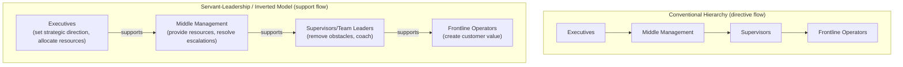

## Servant Leadership in the Toyota Model

### Overview

Servant leadership, in the Toyota-specific management context, refers to the inversion of the conventional organizational hierarchy's functional purpose: rather than the gemba (shop floor, actual work) existing to serve management's directives, management exists to serve the gemba by removing obstacles, providing resources, and enabling the people doing the actual value-creating work to do it well and to improve it continuously. This is frequently visualized in TPS literature as an "inverted pyramid" or "inverted triangle," with frontline operators at the top being supported by successive layers of team leaders, managers, and executives beneath them, rather than the conventional pyramid with executives at the top issuing directives downward.

The term "servant leadership" as a general management concept predates and exists independently of Toyota — it was coined and popularized by Robert K. Greenleaf in his 1970 essay "The Servant as Leader." Its application to Toyota's management philosophy is a mapping made by later lean/TPS authors and practitioners onto observed Toyota management behaviors, rather than terminology Toyota itself originated or exclusively uses; Toyota's own internal language more commonly centers on concepts like respect for people (a pillar of the Toyota Way alongside continuous improvement) and the leader's role in developing subordinates' problem-solving capability.

### The Inverted Pyramid Concept

**Key Points**

- The inversion is functional, not a literal removal of authority or accountability — executives still set strategic direction (via Hoshin Kanri) and retain decision-making authority; the inversion describes the *purpose* each layer serves relative to the layer below it, not a flattening of organizational structure.
- The frontline operator's position "at the top" of the inverted model reflects that they are the ones in direct contact with actual value-creating work and with the customer's requirements (directly or indirectly) — every other layer's job is to enable that contact to go well, not to be enabled by it.
- This concept directly explains why genchi genbutsu (go and see) and Leader Standard Work (both covered in prior items) require leaders to physically go to the gemba rather than manage exclusively through reports: a servant-leadership model requires leaders to understand, firsthand, what obstacles the people they serve actually face.

### How Servant Leadership Manifests in Concrete TPS Practices

Servant leadership in the Toyota model is not merely a philosophical stance — it is expressed through specific, observable behaviors and system designs already covered in this chapter and elsewhere in this course:

1. **Responding to andon pulls as support, not punishment**: When an operator stops the line via andon, the expected leader response is to come to the station and help solve the problem — not to reprimand the operator for stopping production. A leader whose default reaction to an andon pull is irritation or blame is acting contrary to the servant-leadership premise, regardless of stated philosophy.
2. **Genchi genbutsu as an act of respect, not surveillance**: Going to the gemba to observe is framed as understanding the operator's actual working conditions and constraints firsthand, in order to remove obstacles — as distinct from a supervisory "checking up on people" framing, even though the physical actions (walking the floor, observing work) may look similar from the outside.
3. **Standardized work developed with, not for, operators**: Consistent with the point made in the learning-organization item, standards are typically expected to be created or refined with input from the people who perform the work, reflecting that the leader's role is to capture and support the best-known method the workforce has developed, not to impose an external expert's design unilaterally.
4. **Leader Standard Work oriented toward removing obstacles**: LSW checks (see prior item) are framed not as inspection-for-compliance but as identification of what is blocking the standard from being followed — a missing tool, an unclear instruction, a bottleneck upstream — so the leader's action item is typically to fix the obstacle, not simply document the non-compliance.
5. **Coaching toward problem-solving capability, not answer-giving**: A recurring theme in TPS leadership descriptions (discussed further under people development in this chapter) is that leaders are expected to develop subordinates' own capability to identify and solve problems (often through structured questioning, akin to the Toyota Kata coaching approach) rather than simply supplying answers — the servant-leadership framing here is that the leader's obligation is to build the team's long-term capability, not to make themselves the indispensable source of solutions.

### Servant Leadership vs. Conventional Command-and-Control Management

| Aspect | Servant Leadership (Toyota Model) | Conventional Command-and-Control |
| --- | --- | --- |
| Primary leader activity | Removing obstacles, coaching, providing resources | Issuing directives, monitoring compliance |
| Response to problems surfaced | Treated as valuable information; leader engages to help resolve | Often treated as a performance issue to be managed |
| Direction of information flow emphasis | Leader actively seeks gemba information (genchi genbutsu) | Information expected to flow upward via reports |
| Standard-setting | Collaborative, with operator input | Often unilateral, engineering- or management-defined |
| Leader's core value proposition | Enabling others' capability and success | Directing others' actions |
| Authority | Retained, but exercised through support and resource allocation | Retained and exercised through direct command |

[Inference] This comparison presents idealized poles for clarity; in practice, most organizations — including Toyota itself — exhibit a mixture of these behaviors depending on context, urgency, and individual manager style, and the servant-leadership framing describes an intended cultural target more than a claim that command-and-control elements are entirely absent from Toyota's actual management practice.

### Diagram: The Servant-Leadership Support Relationship (svg_diagram)

<svg xmlns="http://www.w3.org/2000/svg" viewBox="0 0 800 500">
<text x="400" y="30" font-size="20" font-weight="bold" text-anchor="middle" fill="#1a1a1a">Servant Leadership Support Relationship (svg_diagram)</text>

<polygon points="150,80 650,80 500,220 300,220" fill="#dbeafe" stroke="#1e40af" stroke-width="2" />
<text x="400" y="115" font-size="14" font-weight="bold" text-anchor="middle" fill="#1a1a1a">Frontline Operators</text>
<text x="400" y="135" font-size="11" text-anchor="middle" fill="#333">(direct value creation, customer contact)</text>
<polygon points="300,220 500,220 430,320 370,320" fill="#dcfce7" stroke="#15803d" stroke-width="2" />
<text x="400" y="255" font-size="13" font-weight="bold" text-anchor="middle" fill="#1a1a1a">Team Leaders</text>
<text x="400" y="272" font-size="10" text-anchor="middle" fill="#333">(remove obstacles, coach)</text>
<polygon points="370,320 430,320 415,400 385,400" fill="#fef3c7" stroke="#b45309" stroke-width="2" />
<text x="400" y="345" font-size="12" font-weight="bold" text-anchor="middle" fill="#1a1a1a">Management</text>
<text x="400" y="360" font-size="9" text-anchor="middle" fill="#333">(resources, escalation)</text>
<polygon points="385,400 415,400 405,450 395,450" fill="#f3e8ff" stroke="#7e22ce" stroke-width="2" />
<text x="400" y="435" font-size="10" font-weight="bold" text-anchor="middle" fill="#1a1a1a">Exec</text>

<line x1="200" y1="470" x2="180" y2="90" stroke="#c2410c" stroke-width="2" stroke-dasharray="6,4" marker-end="url(#su)" />
<text x="230" y="470" font-size="12" fill="#c2410c" font-style="italic">"support flows upward through the structure"</text>
</svg>

### Servant Leadership and Respect for People

Toyota's own internal framing places servant-leadership-style behaviors under the broader pillar commonly translated as "respect for people" (alongside "continuous improvement" as the Toyota Way's two foundational pillars). Respect for people, in this context, is often described as encompassing:

- **Respect for the operator's expertise**: The person doing the work daily typically has the most detailed knowledge of that work's actual conditions — a servant leader treats this expertise as a resource to be drawn upon, not overridden by external authority.
- **Respect for the operator's development**: Providing training, coaching, and stretch challenges that build capability over time, rather than treating people as interchangeable executors of fixed tasks.
- **Respect for the operator's judgment in stopping abnormal conditions**: The authority to pull andon and stop the line, granted to frontline operators rather than reserved to supervisors, is itself a structural expression of respect — trusting frontline judgment about what constitutes an abnormality serious enough to halt production.
- **Respect expressed through job security and long-term relationship**: [Unverified] Toyota's historical association with long-term employment relationships (particularly in its Japanese operations) is frequently cited in lean literature as both an expression of and a precondition for the trust that servant leadership and psychological safety depend on, though the specifics of employment practices vary by country, plant, and era, and should not be assumed to be uniform across all of Toyota's global operations.

### Worked Example

**Example**

An operator on Line 3 pulls the andon cord repeatedly over a shift due to a recurring part-fit issue at their station. Two contrasting leader responses illustrate the distinction:

- **Command-and-control response**: The team leader, frustrated by the production impact, tells the operator to "just make it work" and stop pulling the cord unless it's a safety issue, then reports the shift's low output to their own manager as an operator performance problem.
- **Servant-leadership response**: The team leader comes to the station each time the andon is pulled (consistent with LSW expectations), observes the specific fit issue directly (genchi genbutsu), and after the second occurrence, stays at the station to investigate rather than just clearing the andon and moving on. This leads to identifying an upstream dimensional variance from a supplier part — a problem the operator could not have solved alone since it originates outside their station. The team leader then escalates this to procurement/engineering (using their position to remove an obstacle the operator has no authority to remove) and documents the pattern via A3 for follow-up and eventual yokoten to other lines using the same part.

The second response treats the operator's repeated andon pulls as valuable signal requiring the leader's support to resolve — consistent with the broader design intent of andon covered in earlier chapter items — rather than as a compliance problem to be suppressed.

### Common Pitfalls and Misapplications

- **Servant leadership as leader passivity**: Mistaking "removing obstacles" for abdicating decision-making authority or avoiding difficult performance conversations — servant leadership in the TPS sense retains clear accountability and standards; it changes *how* leaders support meeting those standards, not whether standards and accountability exist.
- **Performative gemba visits**: Leaders physically walking the floor without genuinely listening to or acting on what they observe — the appearance of genchi genbutsu without its substantive follow-through undermines the trust the practice is meant to build, and workers typically recognize the difference.
- **Andon response as inconsistent with stated philosophy**: An organization that formally endorses "servant leadership" language while informally pressuring supervisors to minimize andon pulls or treating frequent pulls as a performance metric against the operator creates a direct contradiction between stated values and lived incentive structure — [Inference] this kind of gap between rhetoric and incentive design is commonly cited in lean-transformation literature as a primary reason cultural adoption efforts fail even when leadership sincerely intends them.
- **Confusing servant leadership with an absence of hierarchy**: Treating the inverted pyramid as implying flat/non-hierarchical organizational structure, when in TPS practice clear roles, standards, and escalation authority (as seen in Leader Standard Work and tiered huddles) remain firmly in place — the inversion concerns functional purpose, not structural flattening.
- **One-directional coaching**: A leader who solves every problem personally rather than coaching the team toward developing their own problem-solving capability may appear helpful in the short term but fails the longer-term people-development obligation the model implies — solving today's problem without building tomorrow's capability is an incomplete application of the concept.

### Related Topics

- Building a true learning organization culture — psychological safety as a shared precondition with servant leadership
- Leader Standard Work — the routine practices through which servant leadership is operationally expressed
- Andon systems and jidoka — the mechanism through which frontline authority to stop work is structurally granted
- Toyota Kata — the coaching pattern for developing subordinate problem-solving capability
- Respect for people as a Toyota Way pillar (alongside continuous improvement)
- Genchi genbutsu — the observational practice underlying servant leaders' obstacle identification
- Daily management and tiered huddle systems — the coordinated venue through which support and escalation flow upward