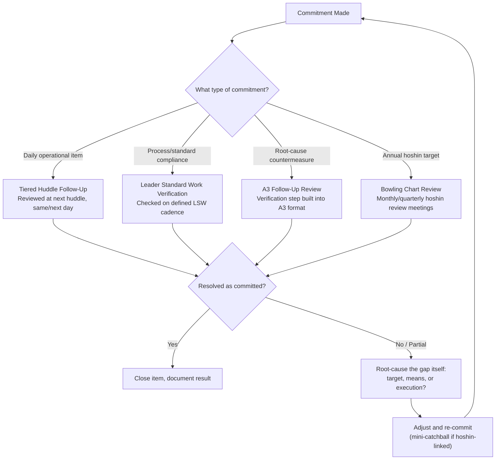

## Toyota's Approach to Management Accountability and Follow-Up

### Overview

Accountability and follow-up in the Toyota management model refers to the specific mechanisms by which commitments — whether catchball-negotiated hoshin targets, countermeasures from an A3, or escalations raised in a tiered huddle — are tracked to closure, verified rather than assumed, and connected back to consequences that reinforce honest reporting rather than suppress it. This item synthesizes and extends threads already introduced across this chapter's items (Leader Standard Work, tiered huddles, catchball, hansei) by focusing specifically on the *closing-the-loop* discipline: the mechanisms that prevent commitments from being made and then quietly forgotten.

A useful way to frame this topic: most organizations are reasonably good at *making* commitments (setting targets, assigning action items in meetings) but structurally weak at *verifying* whether those commitments were actually executed and whether they actually produced the intended effect. Toyota's management system builds specific, repeated verification points into its routine cadence precisely to counter this common failure mode, rather than relying on individual diligence or memory.

### Accountability as Process Verification, Not Blame Assignment

A foundational distinction in the TPS conception of accountability, consistent with points raised under hansei and servant leadership in this chapter: accountability is oriented toward *verifying the process was followed and produced the expected result*, and toward *understanding why* when it did not — not toward assigning individual blame as an end in itself.

- When a target is missed, the accountability process asks: was the target itself unrealistic (a catchball calibration issue), was the countermeasure inadequate (a root-cause analysis issue), or was execution incomplete (a standard-compliance issue)? Each diagnosis leads to a different corrective action, and none of them defaults to punitive action against the individual as the first response.
- This does not mean individual responsibility is absent — a specific person or team is typically named as the owner of a target or action item, and that ownership is real and tracked. The distinction is in *what happens* when a gap is found: investigation and support, rather than blame, as the default first response.

**Key Points**

- [Inference] This blame-neutral framing is a stated ideal consistently emphasized across TPS and lean literature; the degree to which any specific organization or plant achieves it in practice varies, and it depends heavily on the psychological-safety preconditions discussed under hansei and catchball earlier in this chapter — accountability mechanisms alone do not guarantee this ideal is realized if the surrounding culture is punitive.
- The distinction between "accountability for following the process and closing the loop" versus "accountability for hitting every number regardless of circumstance" is central: a team that transparently reports a missed target with clear root-cause analysis is, in this model, exhibiting *more* accountability than a team that reports success through unverified or inflated numbers.

### The Follow-Up Infrastructure: Where Accountability Is Operationalized

Follow-up in Toyota's system is not a separate standalone process — it is built into the recurring cadences already covered elsewhere in this chapter, each closing a different loop:

**Four follow-up mechanisms, each covering a different commitment horizon:**

1. **Tiered huddle follow-up** (daily/near-term): As described in the tiered-huddle item, any item escalated or committed to in one huddle is explicitly reviewed at the next relevant huddle — "open escalations from the prior huddle" is a standard agenda component specifically to prevent items from being raised once and then silently dropped.
2. **Leader Standard Work verification** (routine/ongoing): LSW checks (see prior item) are themselves a follow-up mechanism for standardized work compliance — a leader's routine gemba walk verifies that a previously-established standard is still being followed, not just that it was established.
3. **A3 follow-up review** (root-cause/countermeasure horizon): The A3 format's final section (see the learning-organization item) is explicitly "follow-up / verification of results" — an A3 is not considered complete when a countermeasure is implemented, but only after its effect has been measured and confirmed, with a defined date for that verification check built into the plan from the start.
4. **Bowling chart / hoshin review follow-up** (annual/strategic horizon): As covered under Hoshin Kanri, monthly/quarterly review meetings compare actual performance against target for each cascaded metric, with any gap triggering either a mini-catchball to adjust means or an escalation to reconsider the target itself.

### The A3's Built-In Accountability Structure

Because the A3 format is central to how root-cause problem-solving and its accountability are documented in TPS practice, it's worth detailing how accountability is embedded directly into the artifact itself, rather than tracked separately:

| A3 Section | Accountability Function |
| --- | --- |
| Problem statement / current condition | Establishes a documented, falsifiable baseline — later claims of improvement can be checked against this specific starting point |
| Target condition | Defines what "success" means numerically, preventing later ambiguity about whether the countermeasure worked |
| Root cause analysis | Documents the reasoning trail (e.g., Five Whys), so if the countermeasure fails, the team can examine whether the root cause was mis-diagnosed rather than starting over blind |
| Countermeasure and implementation plan | Names a specific owner and timeline, converting a general intention into a trackable commitment |
| Follow-up / verification | Requires a scheduled check against the target condition, with the actual result documented — this is the section most vulnerable to being skipped, and its presence in the standard format is a deliberate structural defense against that |

**Key Points**

- An A3 without a completed follow-up section is, in TPS practice, considered incomplete — the exercise of implementing a countermeasure without verifying its effect provides no confirmation that a genuine improvement occurred versus a coincidental fluctuation.
- Because A3s are typically archived (supporting the yokoten function described earlier in this chapter), the follow-up section also becomes part of the organization's searchable case history — a future team facing a similar problem can see not just what was tried, but whether it actually worked when verified.

### Diagram: The Accountability Verification Chain (svg_diagram)

<svg xmlns="http://www.w3.org/2000/svg" viewBox="0 0 900 460">
<text x="450" y="30" font-size="20" font-weight="bold" text-anchor="middle" fill="#1a1a1a">Accountability Verification Chain (svg_diagram)</text>
<rect x="60" y="80" width="200" height="80" rx="8" fill="#dbeafe" stroke="#1e40af" stroke-width="2" />
<text x="160" y="112" font-size="13" font-weight="bold" text-anchor="middle" fill="#1a1a1a">Commitment Made</text>
<text x="160" y="132" font-size="11" text-anchor="middle" fill="#333">(target, countermeasure,</text>
<text x="160" y="147" font-size="11" text-anchor="middle" fill="#333">or escalation item)</text>
<rect x="340" y="80" width="220" height="80" rx="8" fill="#dcfce7" stroke="#15803d" stroke-width="2" />
<text x="450" y="112" font-size="13" font-weight="bold" text-anchor="middle" fill="#1a1a1a">Named Owner + Date</text>
<text x="450" y="132" font-size="11" text-anchor="middle" fill="#333">documented, not verbal-only</text>
<text x="450" y="147" font-size="11" text-anchor="middle" fill="#333">(A3, huddle board, LSW sheet)</text>
<rect x="640" y="80" width="220" height="80" rx="8" fill="#fef3c7" stroke="#b45309" stroke-width="2" />
<text x="750" y="112" font-size="13" font-weight="bold" text-anchor="middle" fill="#1a1a1a">Scheduled Verification Point</text>
<text x="750" y="132" font-size="11" text-anchor="middle" fill="#333">built into the routine cadence,</text>
<text x="750" y="147" font-size="11" text-anchor="middle" fill="#333">not left to initiative</text>
<rect x="340" y="220" width="220" height="80" rx="8" fill="#f3e8ff" stroke="#7e22ce" stroke-width="2" />
<text x="450" y="252" font-size="13" font-weight="bold" text-anchor="middle" fill="#1a1a1a">Result Checked Against</text>
<text x="450" y="272" font-size="11" text-anchor="middle" fill="#333">Target Condition</text>
<text x="450" y="287" font-size="11" text-anchor="middle" fill="#333">(not assumed successful)</text>
<rect x="60" y="360" width="340" height="80" rx="8" fill="#fee2e2" stroke="#b91c1c" stroke-width="2" />
<text x="230" y="392" font-size="13" font-weight="bold" text-anchor="middle" fill="#1a1a1a">Gap Found:</text>
<text x="230" y="412" font-size="12" text-anchor="middle" fill="#333">Diagnose target, means, or execution</text>
<text x="230" y="428" font-size="12" text-anchor="middle" fill="#333">(not immediate blame)</text>
<rect x="500" y="360" width="340" height="80" rx="8" fill="#dcfce7" stroke="#15803d" stroke-width="2" />
<text x="670" y="392" font-size="13" font-weight="bold" text-anchor="middle" fill="#1a1a1a">No Gap:</text>
<text x="670" y="412" font-size="12" text-anchor="middle" fill="#333">Document result, archive for</text>
<text x="670" y="428" font-size="12" text-anchor="middle" fill="#333">yokoten, close item</text>
<line x1="260" y1="120" x2="335" y2="120" stroke="#1a1a1a" stroke-width="2" marker-end="url(#av)" />
<line x1="560" y1="120" x2="635" y2="120" stroke="#1a1a1a" stroke-width="2" marker-end="url(#av)" />
<line x1="700" y1="160" x2="500" y2="215" stroke="#1a1a1a" stroke-width="2" marker-end="url(#av)" />
<line x1="400" y1="300" x2="270" y2="355" stroke="#1a1a1a" stroke-width="2" marker-end="url(#av)" />
<line x1="500" y1="300" x2="620" y2="355" stroke="#1a1a1a" stroke-width="2" marker-end="url(#av)" />
</svg>

### The Role of Documentation in Accountability

A recurring structural theme across every mechanism above: verbal commitments made in meetings, without documentation, tend not to survive contact with the next day's priorities. Toyota's accountability system relies on written, visible artifacts as a defense against this:

- **Visual boards** (from the tiered-huddle item) make open items visible to everyone, not just the owner and their direct manager — social visibility functions as a lightweight accountability reinforcement independent of any formal escalation.
- **A3 archives** (from the learning-organization item) create a persistent record that can be referenced later, so a countermeasure's actual documented outcome, not someone's recollection of it, is what's available for review.
- **Bowling charts** (from the Hoshin Kanri item) provide a period-by-period visual history of target-versus-actual, making patterns (chronic underperformance vs. a one-time miss) visible at a glance rather than requiring reconstruction from memory.
- **LSW sheets** (from the prior item) themselves function as a documented record that a specific verification check occurred on a specific date — providing an audit trail for the verification activity itself, not just its findings.

[Inference] The consistent emphasis on written/visual documentation across these mechanisms reflects a broader principle common in lean/TPS literature: relying on memory or informal communication for follow-up is treated as inherently unreliable at organizational scale, regardless of individual conscientiousness, so the system is designed to not depend on anyone's memory being perfect.

### Worked Example

**Example**

Returning to the changeover-time hoshin example introduced under catchball: Line 3's team commits to a 30% changeover-time reduction via SMED implementation, with the plant manager as the accountable owner reporting into the executive-level hoshin plan.

- **Commitment documented**: The X-Matrix records the target and correlates it to the SMED improvement priority; the A3 documenting the specific SMED implementation plan names the Line 3 supervisor as the execution owner with a stated implementation date.
- **Interim follow-up (Tiered huddle)**: Weekly Tier 2 huddles track implementation progress against the A3's stated timeline; a two-week delay in tooling delivery is reported and logged as an open item rather than silently absorbed.
- **Interim follow-up (LSW)**: The department manager's LSW includes a specific check, once SMED implementation begins, verifying the new changeover procedure is actually being followed as documented — catching, for example, an operator reverting to the old method under time pressure.
- **Scheduled verification (A3 follow-up section)**: Six weeks after implementation, the A3's follow-up section requires a formal measurement of actual changeover time against the 30% target, not an assumption that implementation equals success.
- **Result**: Suppose the measured result is only 22% improvement, not 30%. The accountability process at this point asks: was 30% an unrealistic target given SMED's actual achievable ceiling on this specific line (a catchball calibration issue), was the SMED implementation incomplete (an execution issue — perhaps external setup steps weren't fully converted to internal ones), or did something change on the line since the target was set (a changed-condition issue)? This diagnosis, not an assumption of individual failure, determines whether the team re-attempts implementation, revises the target through a mini-catchball, or investigates a specific process step further.
- **Closure and yokoten**: Once the gap is understood and either closed or explicitly re-targeted, the A3 is finalized and archived, with the 22%-vs-30% gap and its diagnosed cause documented for future reference — including for other lines considering similar SMED work, so they inherit the calibration learning rather than repeating the same optimistic target-setting.

### Common Pitfalls

- **Verbal-only commitments**: Action items assigned in a meeting without being written on a board, in an A3, or in an LSW document tend to be the first things forgotten under normal schedule pressure — documentation is not bureaucratic overhead in this model, it is the accountability mechanism itself.
- **Follow-up as a formality**: Scheduling a "verification" step but treating it as a rubber stamp (assuming success rather than measuring it) defeats the purpose of building verification into the process; the A3 follow-up section specifically exists to force an actual measurement, not a confirmation of intent.
- **Punitive response to honestly reported gaps**: As emphasized under hansei and servant leadership, if a leader's response to a documented, verified shortfall is blame rather than root-cause investigation, the predictable long-term consequence is that future reporting becomes less honest — teams learn to manage the appearance of the metric rather than the metric itself.
- **Accountability without resolution authority**: Naming an owner for a commitment who lacks the actual authority or resources to fulfill it (e.g., holding a team leader accountable for a capital-equipment fix only an executive can approve) misplaces accountability and predictably produces unresolved, chronically re-escalated items.
- **Closing items without genuine verification**: Marking an A3 or huddle item "closed" because the immediate symptom disappeared, without confirming the underlying root cause was actually addressed — this risks the same problem recurring later, undetected until it resurfaces, at which point the organization has lost the "second occurrence" signal that would have prompted earlier escalation (as in the tiered-huddle worked example).
- **Accountability theater at senior levels**: Rigorous follow-up enforced at the gemba level while executive-level hoshin commitments face looser or inconsistent verification — undermining the credibility of the whole system, since employees typically notice when accountability standards are applied unevenly across levels.

### Related Topics

- Building a true learning organization culture — hansei and blame-neutral reflection as the cultural foundation this item builds on
- The catchball process — how targets are calibrated, and re-calibrated when follow-up reveals a gap
- A3 problem solving — the artifact format whose structure embeds much of this item's accountability mechanics
- Leader Standard Work — routine verification as an ongoing accountability mechanism
- Daily management and tiered huddle systems — the short-cycle follow-up venue for operational commitments
- Bowling charts and hoshin review cadences — the strategic-horizon follow-up mechanism
- Servant leadership in the Toyota model — the framing that shapes how leaders respond when accountability review finds a gap