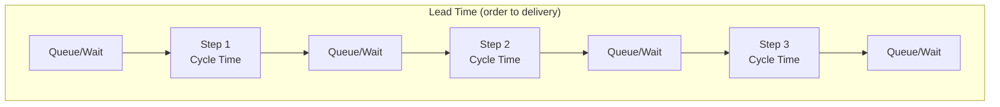

## Tracking Lead Time, Cycle Time, and Throughput

### Overview

Lead time, cycle time, and throughput are the three foundational flow metrics in lean manufacturing measurement, and one of the most common sources of confusion in lean practice is treating these terms as interchangeable when they measure structurally different things. Precision in these definitions matters directly for the vanity-metric diagnostic covered in the prior item: a metric mislabeled or miscalculated across these three categories can create a false impression of system performance, because each metric responds to different process changes and can move in opposite directions from the others simultaneously.

All three metrics are grounded in value-stream thinking — the idea that a product or service moves through a defined sequence of steps from initiation (customer order, or start of production) to completion (delivery, or finished good), and that measuring this flow accurately is a prerequisite for identifying waste and improvement opportunities.

### Core Definitions

**Cycle Time**: The time required to complete one unit of work at a single process step, from the start of work on that unit at that step to its completion at that step. Cycle time is a *local*, step-level measurement.

$$\text{Cycle Time} = \text{Time to complete one unit at one process step}$$

**Lead Time**: The total elapsed time from when a unit of work is requested (or enters the system) to when it is completed and available to the customer (internal or external) — encompassing all process steps *and* all the waiting time between them. Lead time is a *system-level*, end-to-end measurement.

$$\text{Lead Time} = \sum(\text{Cycle Times}) + \sum(\text{Wait/Queue Times between steps})$$

**Throughput**: The rate at which units are completed by the system over a given period — typically expressed as units per unit of time (e.g., units per hour, per shift, per day).

$$\text{Throughput} = \frac{\text{Units Completed}}{\text{Time Period}}$$

**Key Points**

- The critical distinction between cycle time and lead time is that lead time includes *waiting* — a process can have short cycle times at every individual step and still have very long lead time if units sit in queues between steps. This gap between cycle time and lead time is, in most lean value-stream analyses, where the majority of total waste (non-value-added waiting) actually resides.
- Throughput and cycle time are related but distinct: for a single-path process with no parallelism, throughput is approximately the inverse of the bottleneck step's cycle time (the slowest step paces the whole system), not the average of all steps' cycle times.
- All three metrics require a precise, explicitly stated definition of start and end points before they mean anything comparable across teams or time periods — "lead time" measured from "order received" versus "order confirmed" versus "production start" are different metrics wearing the same name, and comparing them across teams using different definitions produces meaningless or misleading conclusions.

### The Relationship Between the Three Metrics

**The Little's Law relationship**, borrowed from queueing theory and widely applied in lean/flow analysis, formalizes the connection between lead time, throughput, and work-in-process (WIP):

$$\text{Lead Time} = \frac{\text{WIP}}{\text{Throughput}}$$

This relationship has significant practical implications:

- To *reduce* lead time without changing throughput, an organization must reduce WIP (the amount of work sitting in the system at any given time) — this is the mathematical foundation behind lean's emphasis on limiting work-in-process and pursuing one-piece flow rather than large batches.
- Conversely, increasing throughput while holding WIP constant also reduces lead time — this is why bottleneck-focused improvement (increasing the constraint's effective capacity) directly improves lead time, consistent with the caution against non-bottleneck utilization optimization discussed in the prior vanity-metrics item.
- [Inference] Little's Law is a well-established mathematical result within queueing theory (originally proven by John D.C. Little), and its application to manufacturing/service flow is a standard and widely taught extension in lean and operations-management practice; its accuracy in a specific real-world system depends on the system reaching a reasonably steady state over the measurement period, which is a standard caveat for the law's practical application rather than a flaw in the law itself.

### Diagram: Lead Time vs. Cycle Time vs. Throughput (svg_diagram)

<svg xmlns="http://www.w3.org/2000/svg" viewBox="0 0 900 500">
<text x="450" y="30" font-size="20" font-weight="bold" text-anchor="middle" fill="#1a1a1a">Lead Time, Cycle Time, Throughput (svg_diagram)</text>

<line x1="60" y1="120" x2="840" y2="120" stroke="#333" stroke-width="2" />
<text x="60" y="105" font-size="12" fill="#333">Order Received</text>
<text x="800" y="105" font-size="12" fill="#333">Delivered</text>

<line x1="60" y1="150" x2="840" y2="150" stroke="#1e40af" stroke-width="2" />
<line x1="60" y1="140" x2="60" y2="160" stroke="#1e40af" stroke-width="2" />
<line x1="840" y1="140" x2="840" y2="160" stroke="#1e40af" stroke-width="2" />
<text x="450" y="175" font-size="14" font-weight="bold" text-anchor="middle" fill="#1e40af">Lead Time (order → delivery, includes ALL waiting)</text>

<rect x="60" y="220" width="100" height="60" rx="4" fill="#f3f4f6" stroke="#999" stroke-width="1" />
<text x="110" y="255" font-size="11" text-anchor="middle" fill="#666">Queue</text>
<rect x="180" y="220" width="120" height="60" rx="4" fill="#dcfce7" stroke="#15803d" stroke-width="2" />
<text x="240" y="245" font-size="12" font-weight="bold" text-anchor="middle" fill="#1a1a1a">Step 1</text>
<text x="240" y="262" font-size="10" text-anchor="middle" fill="#333">Cycle Time = 5 min</text>
<rect x="320" y="220" width="100" height="60" rx="4" fill="#f3f4f6" stroke="#999" stroke-width="1" />
<text x="370" y="255" font-size="11" text-anchor="middle" fill="#666">Queue</text>
<text x="370" y="270" font-size="10" text-anchor="middle" fill="#b91c1c">(2 hrs wait)</text>
<rect x="440" y="220" width="120" height="60" rx="4" fill="#dcfce7" stroke="#15803d" stroke-width="2" />
<text x="500" y="245" font-size="12" font-weight="bold" text-anchor="middle" fill="#1a1a1a">Step 2</text>
<text x="500" y="262" font-size="10" text-anchor="middle" fill="#333">Cycle Time = 8 min</text>
<rect x="580" y="220" width="100" height="60" rx="4" fill="#f3f4f6" stroke="#999" stroke-width="1" />
<text x="630" y="255" font-size="11" text-anchor="middle" fill="#666">Queue</text>
<text x="630" y="270" font-size="10" text-anchor="middle" fill="#b91c1c">(4 hrs wait)</text>
<rect x="700" y="220" width="120" height="60" rx="4" fill="#dcfce7" stroke="#15803d" stroke-width="2" />
<text x="760" y="245" font-size="12" font-weight="bold" text-anchor="middle" fill="#1a1a1a">Step 3</text>
<text x="760" y="262" font-size="10" text-anchor="middle" fill="#333">Cycle Time = 6 min</text>

<text x="450" y="330" font-size="12" text-anchor="middle" fill="#666" font-style="italic">Total cycle time: 19 min. Total lead time: 19 min + 6+ hours of waiting.</text>

<rect x="220" y="380" width="460" height="90" rx="8" fill="#fef3c7" stroke="#b45309" stroke-width="2" />
<text x="450" y="412" font-size="14" font-weight="bold" text-anchor="middle" fill="#1a1a1a">Throughput = Units Completed / Time Period</text>
<text x="450" y="435" font-size="12" text-anchor="middle" fill="#333">Paced by the BOTTLENECK step's effective capacity,</text>
<text x="450" y="452" font-size="12" text-anchor="middle" fill="#333">not the average of all steps' cycle times</text>
</svg>

### Measurement Considerations for Each Metric

#### Cycle Time

- Measured at the individual station/process level, typically via direct time study (stopwatch observation) or automated data capture (machine cycle logs, barcode scan timestamps).
- Should be measured across multiple repetitions to capture natural variation, not a single observation — a cycle time reported as a single number without a stated range or variance can mask significant instability that a mean alone would not reveal.
- Distinguishing **value-added** cycle time (actual transformation of the product) from **non-value-added but necessary** cycle time (unavoidable setup, inspection) within the station-level measurement is a further refinement often used to prioritize waste-elimination targets within a single step.

#### Lead Time

- Requires an explicit, documented start and end point definition (e.g., "from customer PO receipt to product ship date") that is consistently applied — as noted above, comparing lead times across teams or time periods with inconsistent definitions produces invalid comparisons.
- Often decomposed into **order-to-production lead time** (administrative/planning delay before physical work begins) and **production lead time** (the manufacturing process itself) — many lean transformations find the first component is a larger and more addressable source of total lead time than the manufacturing process itself, since administrative queues are frequently invisible to shop-floor-focused improvement efforts.
- Customer-facing lead time (from the customer's actual request) should be distinguished from internal production lead time (from work-order release) — these often differ significantly and both are meaningful to track, but for different purposes and different audiences.

#### Throughput

- Must specify the unit of measurement clearly (units, orders, standard hours of work) since aggregating dissimilar products into a single throughput number can obscure meaningful variation between product types.
- Should be measured relative to the actual system constraint (the bottleneck), consistent with Theory of Constraints thinking referenced in the prior vanity-metrics item — throughput measured at a non-bottleneck station can show local improvement without any change in actual system-wide output.
- Distinguished from **capacity** (the maximum possible output rate) — throughput is the *actual* realized output rate, which may be below capacity due to downtime, quality losses, or upstream starvation.

### Value-Stream Mapping as the Primary Tool for Capturing These Metrics

Value stream mapping (VSM) is the standard lean technique for visually documenting the full sequence of process steps along with their cycle times, queue/wait times between steps, and overall lead time, typically presented as a "current state" map (documenting the process as it actually operates today, based on direct observation/genchi genbutsu) and a "future state" map (the target process after planned improvements).

**Key Points**

- A VSM typically displays cycle time, changeover time, uptime/availability, and headcount at each process step, along with a timeline at the bottom explicitly separating value-added time (cycle times) from non-value-added time (queue/wait times) — visually making the lead-time-versus-cycle-time gap immediately apparent, which is often the single most striking (and improvement-motivating) feature of a properly constructed VSM.
- The ratio of total value-added time (sum of cycle times) to total lead time is sometimes called **process cycle efficiency** or **flow efficiency** — a commonly cited illustrative pattern in lean literature is that this ratio is often surprisingly low in unoptimized processes (single-digit to low-double-digit percentages), meaning most of a typical unit's total lead time is spent waiting rather than being actively worked on. [Inference] The specific percentage varies enormously by industry and process, so this should be read as an illustrative pattern motivating the importance of the metric, not a universal benchmark applicable to any specific process without direct measurement.

### Worked Example

**Example**

A custom fabrication shop wants to understand why customer-quoted lead time (10 business days) feels inconsistent with the shop's own sense that "the actual work only takes about a day."

- **Cycle time data collected** (via direct observation at each of 4 process steps: cutting, welding, finishing, quality inspection): 45 min, 90 min, 60 min, 20 min — total value-added cycle time across all steps: approximately 3.6 hours.
- **Queue time data collected** (via genchi genbutsu observation and work-order timestamp analysis): Orders wait an average of 1.5 days in a queue before cutting begins (administrative/scheduling delay), 1 day between cutting and welding (batch accumulation), 2 days between welding and finishing (finishing department capacity constraint), and 3 days between finishing and inspection (inspector availability, since inspection is staffed only twice weekly).
- **Lead time calculated**: Approximately 1.5 + 1 + 2 + 3 days of queue time plus 3.6 hours of actual processing ≈ 7.7 days of queue time + same-day processing, closely matching the observed ~10-day customer experience once order-entry administrative delay is included.
- **Throughput analysis**: Comparing each step's effective daily capacity reveals the finishing department, staffed with fewer people relative to incoming volume, is the system bottleneck — it has the longest queue (2 days waiting *before* it) and is running closest to its maximum capacity, meaning overall shop throughput is paced by finishing's capacity, not by cutting or welding's (faster) cycle times.
- **Diagnosis and improvement targeting**: Rather than focusing improvement effort on the welding station's 90-minute cycle time (the longest individual cycle time, and therefore an intuitive but potentially misleading target), the value-stream data directs attention to (a) the finishing department bottleneck, where added capacity would directly increase system throughput, and (b) the inspection scheduling constraint (staffed only twice weekly), which independently adds queue time regardless of any upstream improvement — illustrating that intuition based on cycle time alone, without lead-time and throughput/bottleneck analysis, would have misdirected improvement effort.

### Common Pitfalls

- **Confusing cycle time and lead time in reporting**: Referring to a single station's processing time as "lead time," which dramatically understates the actual customer-experienced total time and creates a false impression of process speed.
- **Averaging cycle times across dissimilar work**: Blending cycle time data across product variants with substantially different processing requirements into a single average obscures meaningful variation and can misdirect improvement targeting.
- **Optimizing non-bottleneck cycle time**: As shown in the worked example, focusing improvement effort on the step with the longest individual cycle time rather than the step constraining overall system throughput (the bottleneck) — these are not always the same step, and treating them as such without value-stream analysis can produce well-intentioned effort with no system-level payoff.
- **Measuring throughput without WIP context**: Reporting a throughput increase without also tracking WIP can mask that the increase came from processing pre-existing backlog rather than genuine capacity improvement, or vice versa can hide a WIP buildup that will surface as future lead-time degradation per Little's Law.
- **Inconsistent start/end point definitions across teams or periods**: Comparing this quarter's lead time to last quarter's, or one team's lead time to another's, without verifying both use identical start/end point definitions — a common source of misleading trend lines and cross-team comparisons.
- **Treating a single measurement as representative**: Reporting a single cycle time or lead time observation without capturing natural variation (via multiple observations or a stated range) risks treating an outlier as typical, or vice versa.

### Related Topics

- Choosing meaningful metrics over vanity metrics — the diagnostic framework these three metrics should be evaluated against
- Value stream mapping — the primary technique for capturing and visualizing all three metrics together
- Theory of Constraints and bottleneck identification — the framework underlying correct throughput interpretation
- Little's Law and queueing theory fundamentals as applied to manufacturing flow
- One-piece flow and WIP reduction as direct levers for lead-time improvement
- SMED (Single-Minute Exchange of Die) as a common lever for reducing bottleneck cycle time
- Overall Equipment Effectiveness (OEE) and its relationship to throughput and capacity