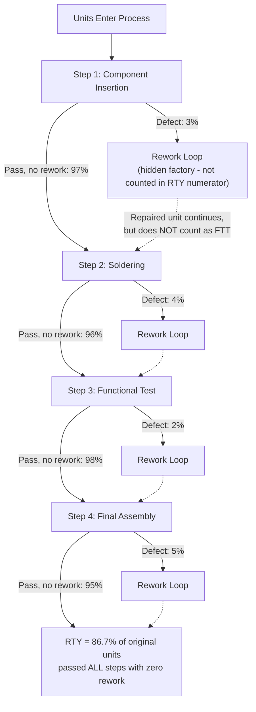

## First Time Through Rate and Rolled Throughput Yield

### Overview

First Time Through (FTT) rate and Rolled Throughput Yield (RTY) are two closely related quality metrics that address a specific measurement gap left exposed by the final-inspection-only yield problem flagged in the vanity-metrics item: both are designed to capture *true* quality performance across a multi-step process by accounting for rework, scrap, and hidden defects at every individual step, rather than only counting what fails at the very end of the line. Where final-inspection yield can mask substantial waste occurring earlier in a process (because units that are reworked before reaching final inspection never register as a defect), FTT and RTY specifically measure the proportion of units that pass through the *entire* process correctly the first time, with no rework, scrap, or adjustment at any step.

### Core Definitions

**First Time Through (FTT) Rate** — sometimes called First Pass Yield (FPY) at the single-step level, or First Time Through when applied across an entire multi-step process — is the percentage of units that complete a process step (or the full process) correctly on the first attempt, without any rework, repair, scrap, or retest.

$$\text{FTT (single step)} = \frac{\text{Units Passing Without Rework}}{\text{Total Units Entering That Step}}$$

**Rolled Throughput Yield (RTY)** extends this concept across a multi-step process by multiplying the FTT of each individual step together, capturing the *compounding* effect of defects across the full value stream — a critical distinction from simply averaging step yields, which would significantly overstate true end-to-end quality.

$$\text{RTY} = \text{FTT}_1 \times \text{FTT}_2 \times \text{FTT}_3 \times \cdots \times \text{FTT}_n$$

**Key Points**

- The multiplicative (not additive or averaged) relationship in RTY is the single most important technical property of this metric: because probabilities of passing each step compound, a process with several steps each individually yielding a seemingly healthy 95% can have a true end-to-end yield substantially lower than 95% once compounded across all steps — this compounding effect is precisely what final-inspection-only yield measurement fails to reveal.
- FTT and RTY are explicitly designed to counter the "hidden factory" phenomenon — the informal, often invisible rework loops (touch-up, adjustment, re-testing) that absorb significant capacity and cost but never appear in a defect count because the unit is fixed before it reaches the point where defects are formally logged.
- A unit that is reworked and subsequently passes final inspection is, by definition, *not* counted as a "first time through" success under this metric — this is the specific design feature that distinguishes RTY from a simple final-inspection pass rate, and is the metric's core value in exposing quality costs that conventional final-yield reporting hides.

### Worked Calculation: Why Multiplication Matters

Consider a four-step assembly process, each step individually reporting a seemingly strong yield:

| Step | Individual FTT |
| --- | --- |
| Component insertion | 97% |
| Soldering | 96% |
| Functional test | 98% |
| Final assembly | 95% |

**A naive (incorrect) approach** — averaging the four yields — would suggest overall quality of roughly 96.5%, appearing quite strong.

**The correct RTY calculation** — multiplying the four yields — gives:

$$\text{RTY} = 0.97 \times 0.96 \times 0.98 \times 0.95 = 0.867$$

The true end-to-end first-time-through yield is approximately **86.7%**, not 96.5%. This roughly 10-percentage-point gap between the (incorrect) average and the (correct) rolled yield represents units that experienced at least one rework/repair loop somewhere in the process — capacity and cost consumed by hidden rework that a final-inspection or averaged-yield view would never surface.

### Diagram: RTY Compounding Effect Across Process Steps (svg_diagram)

<svg xmlns="http://www.w3.org/2000/svg" viewBox="0 0 900 480">
<text x="450" y="30" font-size="20" font-weight="bold" text-anchor="middle" fill="#1a1a1a">Rolled Throughput Yield Compounding (svg_diagram)</text>

<rect x="60" y="80" width="780" height="50" fill="#dbeafe" stroke="#1e40af" stroke-width="2" />
<text x="450" y="110" font-size="13" font-weight="bold" text-anchor="middle" fill="#1a1a1a">1000 units start (100%)</text>
<rect x="60" y="150" width="757" height="50" fill="#bfdbfe" stroke="#1e40af" stroke-width="2" />
<text x="440" y="180" font-size="13" font-weight="bold" text-anchor="middle" fill="#1a1a1a">970 units after Step 1 (FTT 97%)</text>
<rect x="60" y="220" width="727" height="50" fill="#93c5fd" stroke="#1e40af" stroke-width="2" />
<text x="425" y="250" font-size="13" font-weight="bold" text-anchor="middle" fill="#1a1a1a">931 units after Step 2 (FTT 96%)</text>
<rect x="60" y="290" width="713" height="50" fill="#60a5fa" stroke="#1e40af" stroke-width="2" />
<text x="415" y="320" font-size="13" font-weight="bold" text-anchor="middle" fill="#1a1a1a">912 units after Step 3 (FTT 98%)</text>
<rect x="60" y="360" width="677" height="50" fill="#3b82f6" stroke="#1e40af" stroke-width="2" />
<text x="395" y="390" font-size="13" font-weight="bold" text-anchor="middle" fill="#ffffff">867 units after Step 4 (FTT 95%)</text>

<text x="450" y="450" font-size="14" font-weight="bold" text-anchor="middle" fill="`#b91c1c`">RTY = 86.7% — NOT the naive average of 96.5%</text>

</svg>

### FTT/RTY Process Flow

### Why RTY Matters More Than Final Inspection Yield

- **Cost visibility**: Every rework loop consumes labor, time, and material — RTY makes visible the cumulative cost of rework across the full process, which a final-inspection pass rate hides entirely since the same unit's rework history is invisible once it eventually passes.
- **True capacity consumption**: A process with a high final-inspection yield but low RTY is consuming significantly more actual processing capacity than its final numbers suggest, since rework loops occupy stations and labor that could otherwise process new units — this directly connects to the throughput and Little's Law relationship discussed in the prior lead-time/cycle-time item, since hidden rework increases effective WIP and cycle time even when final yield looks healthy.
- **Root-cause targeting**: Because RTY is calculated per step, it immediately identifies *which* step is contributing the most compounding quality loss, directing root-cause investigation (5-Why, A3) to the step with the lowest individual FTT rather than requiring a separate diagnostic exercise to locate the problem.
- **Resistance to a specific vanity-metric failure mode**: RTY is explicitly resistant to the "final-inspection-only yield" vanity metric pattern flagged in the prior item, since it cannot be improved by simply catching and fixing more defects before final inspection — it can only improve by genuinely reducing the rate of defects occurring at each step.

**Key Points**

- RTY requires reliable defect/rework tracking at *every* individual step, not just at final inspection — this is a meaningfully higher data-collection burden than final-yield tracking alone, and is often the practical barrier to adopting RTY in processes without existing station-level quality data capture.
- [Inference] Because RTY multiplies probabilities, the metric is particularly sensitive to processes with many steps: even small per-step defect rates compound significantly across a long process, which is a commonly cited rationale in quality-engineering literature for why long, many-step assembly processes benefit disproportionately from RTY-based analysis compared to short processes where the averaging-versus-multiplying distinction matters less in absolute terms.
- RTY and FTT are typically most useful as *internal* process-improvement diagnostics rather than customer-facing quality metrics — a customer generally cares about final delivered quality (which final inspection yield does capture, assuming inspection itself is reliable), while RTY specifically serves the internal purpose of exposing hidden rework cost and prioritizing improvement effort.

### FTT/RTY in Relation to Other Metrics in This Chapter

- **Vanity metrics (prior item)**: RTY is presented in quality literature specifically as a corrective to the final-inspection-yield vanity-metric pattern — it is a worked example of designing a metric that resists the specific gaming/blind-spot vulnerability a simpler metric exhibits.
- **Cycle time and throughput (prior item)**: Hidden rework loops directly inflate effective cycle time and WIP at the steps where rework occurs, connecting RTY analysis to the Little's Law relationship — a low RTY at a specific step is often accompanied by elevated WIP and cycle time at that same step, since rework consumes station capacity that could otherwise process new units forward.
- **A3 problem solving**: A step identified as having a low individual FTT within an RTY analysis is a natural candidate for a formal A3 investigation, since RTY analysis provides the "current condition" data (the specific step, the specific defect rate) that an A3's root-cause analysis section requires as its starting point.
- **Jidoka and poka-yoke**: Improving a specific step's FTT rate is frequently achieved through poka-yoke (mistake-proofing) devices or jidoka-style automatic detection at that step, directly reducing the defect rate feeding into that step's contribution to overall RTY.

### Worked Example: Using RTY to Prioritize Improvement

**Example**

Returning to the four-step process above (97%, 96%, 98%, 95% individual FTTs, 86.7% RTY): a plant manager has limited kaizen resources this quarter and must choose which step to prioritize for improvement.

- **Naive prioritization** (by raw defect percentage): Final assembly, at 95% FTT (5% defect rate), has the highest individual defect percentage and might intuitively seem the obvious target.
- **RTY-informed prioritization**: Because RTY is multiplicative, the *sensitivity* of overall RTY to improvement at each step should also account for that step's position and the compounding effect of units already lost upstream. In this case, improving final assembly's FTT from 95% to 98% would raise overall RTY from 86.7% to approximately 89.4% — but so would achieving the same 3-percentage-point improvement at soldering (96% → 99%), since each step's FTT multiplies against the same base. [Inference] In practice, the step offering the greatest *practical* RTY improvement often depends on which step's defects are most addressable with available kaizen resources and root-cause tractability, not purely on which step has the mathematically largest raw defect percentage — RTY analysis identifies where compounding loss occurs, but does not by itself determine which fix is most feasible.
- **Additional finding from RTY-level data**: Because RTY analysis requires per-step tracking, the plant discovers that soldering's rework loop (contributing the second-largest defect rate) is disproportionately expensive in labor time compared to component insertion's rework loop, since manual soldering rework requires a specialized technician — a cost dimension invisible from the FTT percentage alone but surfaced once per-step tracking (a prerequisite for RTY) is in place. This directs the kaizen investment toward soldering despite final assembly having the nominally higher defect rate.

### Common Pitfalls

- **Averaging instead of multiplying**: As demonstrated in the worked calculation above, averaging individual step yields rather than multiplying them is the single most common and most consequential calculation error, since it can overstate true quality performance by a substantial margin, particularly in longer processes.
- **Incomplete step coverage**: Calculating RTY using only some steps in a process (often because data collection is easier at certain stations) produces an incomplete and overstated picture — RTY is only as accurate as its weakest data-collection link, and a step with unmeasured rework is implicitly treated as 100% FTT, inflating the overall result.
- **Not counting rework as a first-time-through failure**: A common data-collection error is only logging a "defect" when a unit is scrapped, while units that are reworked and pass are silently counted as first-time-through successes — this defeats the entire purpose of RTY as a hidden-factory detection tool, since rework (not just scrap) is exactly what the metric is designed to expose.
- **Treating RTY as a customer-facing quality claim**: Reporting RTY externally as if it represents delivered product quality can be misleading, since RTY measures internal process efficiency (rework-free flow) rather than final delivered defect rate — a process can have modest RTY but still deliver zero defects to the customer if rework loops are effective, and conflating the two metrics misrepresents what each actually indicates.
- **Ignoring RTY trend over time in favor of a single snapshot**: A single RTY calculation provides a point-in-time diagnostic; without tracking RTY trend over successive periods (analogous to the bowling-chart approach discussed under Hoshin Kanri), it's difficult to verify whether targeted improvements at specific steps are producing sustained gains or whether the compounding effect is shifting to different steps over time.

### Related Topics

- Choosing meaningful metrics over vanity metrics — the diagnostic context RTY is designed to satisfy
- Tracking lead time, cycle time, and throughput — how hidden rework loops connect to WIP and cycle-time inflation
- Poka-yoke and mistake-proofing — the primary technique for directly improving individual-step FTT
- Jidoka — automatic defect detection as a mechanism feeding accurate per-step rework data
- A3 problem solving — the follow-on root-cause process for a step identified as a major RTY contributor
- The "hidden factory" concept in quality engineering and its cost implications
- Statistical process control (SPC) as a complementary tool for monitoring per-step defect rate stability over time