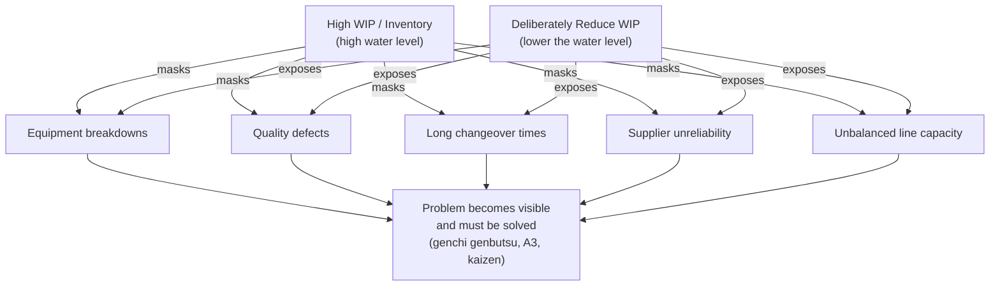

## Work in Process Levels and Inventory Turns

### Overview

Work in process (WIP) and inventory turns are two of the most direct measurement links between the flow metrics covered in a prior item (lead time, cycle time, throughput, Little's Law) and lean's foundational objective of waste elimination — specifically, the elimination of excess inventory, which TPS classifies as one of the seven/eight classical wastes (muda). WIP measures the amount of partially completed work sitting in the system at any given moment; inventory turns measures how many times total inventory (raw material, WIP, and finished goods, depending on the scope of the calculation) is consumed and replaced over a period, functioning as a velocity indicator for the entire value stream.

Both metrics matter in lean practice not simply as cost-accounting figures, but because inventory in TPS is understood as a *symptom and a mask* — it accumulates at points where flow is interrupted, and it hides underlying problems (quality issues, unreliable equipment, unbalanced capacity) that would otherwise be immediately visible if the process ran with minimal buffer. Reducing WIP is therefore not merely a cost-reduction tactic in TPS thinking; it is a deliberate diagnostic technique for exposing problems that excess inventory would otherwise conceal.

### Core Definitions

**Work in Process (WIP)**: The quantity of units that have started production but have not yet been completed, at any given point in time — units currently in queues, being processed, or awaiting the next process step.

**Inventory Turns (Inventory Turnover)**: The number of times inventory is fully cycled (sold/consumed and replenished) over a given period, typically calculated as:

$$\text{Inventory Turns} = \frac{\text{Cost of Goods Sold (annual)}}{\text{Average Inventory Value}}$$

An equivalent, often more operationally intuitive framing expresses turns in terms of **days of inventory on hand**:

$$\text{Days of Inventory} = \frac{365}{\text{Inventory Turns}}$$

**Key Points**

- Higher inventory turns generally indicate faster inventory velocity (inventory is converted to sales/consumption more frequently), which in most contexts correlates with lower carrying cost, less capital tied up, and — per the Little's Law relationship discussed in the prior item — shorter lead time for a given throughput level.
- Inventory turns is typically calculated as a company-wide or plant-wide financial metric (using COGS and average inventory value from accounting records), while WIP is more often tracked operationally at the shop-floor or value-stream level (in units or standard hours) — both measure related underlying phenomena but at different levels of aggregation and with different data sources.
- [Inference] What counts as "good" inventory turns varies enormously by industry (a grocery retailer and an aerospace manufacturer have structurally different appropriate benchmarks), so inventory turns is generally most meaningful as a trend metric compared against a company's own historical performance or close industry peers, rather than as an absolute universal target.

### The TPS View: Inventory as a Waste That Hides Other Wastes

A defining TPS insight — often illustrated with the "rocks and water" or "lowering the water level" metaphor — treats inventory level as analogous to the water level in a river or lake, with underlying process problems (equipment breakdowns, quality defects, long changeovers, supplier unreliability) represented as rocks on the riverbed. High inventory (high water level) submerges these rocks, allowing production to continue smoothly despite the problems' presence, because buffer stock absorbs any given problem's disruptive effect before it reaches the customer.

**Key Points**

- This framing is why TPS treats WIP reduction as an *active improvement technique*, not just a cost-optimization goal: deliberately and incrementally lowering buffer inventory is used specifically to force previously-hidden problems to the surface, where they become visible enough to trigger the problem-solving mechanisms discussed elsewhere in this course (andon, A3, hansei).
- This also explains why naive, purely cost-driven inventory reduction (cutting inventory without addressing the underlying problems it was masking) is a well-documented failure pattern: if the "rocks" (root causes) are not identified and removed as the water level drops, the exposed problems cause visible production disruption rather than triggering productive improvement — the inventory reduction must be paired with genuine problem-solving capacity, or it simply converts hidden waste into visible chaos.
- [Inference] This is frequently cited in lean literature as a primary reason why inventory-reduction initiatives fail when implemented as a standalone cost-cutting exercise (e.g., by a finance function mandating inventory cuts) rather than as an integrated lean transformation with the accompanying problem-solving infrastructure described throughout this course.

### Diagram: The Water Level Metaphor (svg_diagram)

<svg xmlns="http://www.w3.org/2000/svg" viewBox="0 0 900 460">
<text x="450" y="30" font-size="20" font-weight="bold" text-anchor="middle" fill="#1a1a1a">Inventory as Water Level Over Hidden Problems (svg_diagram)</text>

<text x="220" y="65" font-size="14" font-weight="bold" text-anchor="middle" fill="`#1a1a1a`">High WIP (problems hidden)</text>

<rect x="80" y="80" width="280" height="200" fill="`#f3f4f6`" stroke="#666" stroke-width="2" />

<rect x="80" y="110" width="280" height="170" fill="`#93c5fd`" opacity="0.7" />

<text x="220" y="140" font-size="12" text-anchor="middle" fill="`#1e3a8a`" font-weight="bold">Water Level (WIP)</text>

<polygon points="120,280 145,230 170,280" fill="#78716c" />
<polygon points="200,280 225,240 250,280" fill="#78716c" />
<polygon points="280,280 305,235 330,280" fill="#78716c" />
<text x="220" y="300" font-size="10" text-anchor="middle" fill="#666">(rocks = quality, downtime, changeover issues — submerged, invisible)</text>

<text x="680" y="65" font-size="14" font-weight="bold" text-anchor="middle" fill="`#1a1a1a`">Low WIP (problems exposed)</text>

<rect x="540" y="80" width="280" height="200" fill="`#f3f4f6`" stroke="#666" stroke-width="2" />

<rect x="540" y="240" width="280" height="40" fill="`#93c5fd`" opacity="0.7" />

<text x="680" y="260" font-size="11" text-anchor="middle" fill="`#1e3a8a`" font-weight="bold">Water Level (WIP)</text>

<polygon points="580,280 605,190 630,280" fill="`#78716c`" />

<polygon points="660,280 685,200 710,280" fill="`#78716c`" />

<polygon points="740,280 765,195 790,280" fill="`#78716c`" />

<text x="680" y="300" font-size="10" text-anchor="middle" fill="`#b91c1c`" font-weight="bold">(rocks exposed above water — visible, must be addressed)</text>

<line x1="380" y1="180" x2="520" y2="180" stroke="#1a1a1a" stroke-width="2" marker-end="url(#wat)" />
<text x="450" y="165" font-size="11" text-anchor="middle" fill="#1a1a1a">deliberately reduce WIP</text>

<text x="450" y="380" font-size="13" text-anchor="middle" fill="#333" font-style="italic">Reducing WIP without a plan to address exposed problems converts hidden waste into visible disruption.</text>

<text x="450" y="400" font-size="13" text-anchor="middle" fill="#333" font-style="italic">Reducing WIP paired with problem-solving capacity converts hidden waste into targeted improvement.</text>

</svg>

### Measuring and Tracking WIP in Practice

- **Physical unit counts**: Direct observation/genchi genbutsu counting of units at each station and queue — the most straightforward method, but requires either manual counting or automated tracking (barcode/RFID scans, kanban card counts) to sustain over time.
- **Kanban system limits**: In a kanban-controlled pull system, WIP is directly constrained by the number of kanban cards (or equivalent digital signals) in circulation for a given process segment — the kanban count itself becomes both the control mechanism and the measurement of maximum permitted WIP, a structural link between WIP management and pull-system design covered elsewhere in this course.
- **WIP-to-capacity ratio**: Comparing current WIP levels against the theoretical minimum needed to keep the bottleneck station continuously fed (per Theory of Constraints logic referenced in prior items) helps distinguish "necessary buffer" from "excess accumulation."
- **WIP aging**: Tracking not just the quantity of WIP but how long units have been sitting as WIP (via timestamp data) surfaces stagnant work-in-process that a raw count alone would not reveal — a large WIP count of recently-started units is a different situation than the same count dominated by units that have been sitting for days, even though both would show identical WIP quantity.

**Key Points**

- WIP is most useful as an operational, near-real-time metric (tracked on the same visual boards discussed in the tiered-huddle item) rather than solely as a periodic financial calculation — its diagnostic value in exposing flow problems is greatest when reviewed frequently enough to catch abnormal accumulation quickly.
- Via Little's Law (introduced in the prior lead-time item), WIP directly determines lead time for a given throughput: $\text{Lead Time} = \text{WIP} / \text{Throughput}$. This means WIP tracking and lead-time tracking are not independent metrics — a WIP increase with stable throughput predicts a corresponding lead-time increase, making WIP monitoring a useful *leading* indicator that can flag lead-time degradation before it fully manifests in lagging lead-time data.

### Inventory Turns: Calculation Nuances and Scope

Inventory turns can be calculated at different scopes, and the choice of scope changes what the metric actually reveals:

| Scope | What It Measures | Typical Data Source |
| --- | --- | --- |
| Raw material turns | How quickly purchased material is consumed into production | Purchasing/inventory system |
| WIP turns | How quickly work-in-process moves through the production process | Shop-floor/MES tracking |
| Finished goods turns | How quickly completed product is shipped/sold after completion | Warehouse/shipping records |
| Total inventory turns | Combined velocity across all three categories | Consolidated accounting records |

[Inference] Distinguishing these scopes matters practically because a company can have healthy total inventory turns driven primarily by fast finished-goods movement while WIP turns remain sluggish (indicating flow problems within production itself that a blended total-inventory figure would not surface) — decomposing the metric by scope is a standard diagnostic refinement referenced across operations-management and lean-accounting literature, though the specific decomposition used varies by organization and available data granularity.

### Worked Example

**Example**

A manufacturer reviews its current-state metrics: total inventory turns of 6 (roughly 61 days of inventory on hand), with a stated hoshin objective (see the Hoshin Kanri item) to reach 12 turns (roughly 30 days) within two years, aligned to a broader lead-time reduction breakthrough objective.

- **Diagnostic decomposition**: Breaking the total figure down by scope reveals raw material turns of 15 (healthy, fast-moving purchased components) and finished goods turns of 10 (reasonably fast shipping), but WIP turns of only 3 — indicating the bottleneck to overall inventory velocity is specifically within the production process itself, not in purchasing or shipping.
- **Genchi genbutsu investigation**: A value-stream walk (as described in the prior lead-time item) finds large batches of WIP accumulating ahead of a single heat-treatment station, which runs in large batches due to a lengthy oven changeover time between different part specifications — consistent with the "rocks under water" pattern, where a long changeover time (a root-cause problem) is currently masked by allowing large WIP buffers to accumulate around it.
- **Countermeasure**: A SMED (Single-Minute Exchange of Die) initiative targeting the heat-treatment oven's changeover time is initiated (connecting to the earlier catchball worked example's SMED context), aiming to enable smaller, more frequent batches without sacrificing the station's effective throughput.
- **WIP reduction as deliberate diagnostic**: Rather than waiting for the full SMED project to complete before reducing WIP, the team deliberately lowers the kanban limit ahead of the heat-treatment station in controlled increments, which — consistent with the water-level metaphor — surfaces additional smaller issues (a secondary quality problem specific to one part type, previously buried within large mixed batches) that the team addresses via a follow-on A3 as they emerge.
- **Result tracked via bowling chart**: WIP turns at the heat-treatment step and overall lead time are tracked monthly against target on the hoshin bowling chart (per the Hoshin Kanri item), with the SMED-driven changeover reduction directly correlating to WIP-turn improvement as the initiative progresses.

### Relationship to Other Concepts in This Course

- **Lead time, cycle time, throughput (prior item)**: WIP is one of the three terms in Little's Law, directly connecting this item's content to the flow-metrics framework already established.
- **Choosing meaningful metrics over vanity metrics**: Inventory turns passes the meaningful-metric diagnostic well when properly scoped (it's difficult to game without genuine process change, and it links causally to carrying cost and lead time) — but a blended total-inventory-turns figure that obscures which scope (raw material, WIP, finished goods) is actually driving performance risks the same kind of misleading aggregation flagged in that item.
- **Hoshin Kanri and bowling charts**: WIP and inventory turns are common candidates for hoshin-level metrics, particularly when a breakthrough objective targets lead-time or working-capital reduction.
- **Pull systems and kanban**: WIP levels are the direct operational lever that kanban system design controls; understanding WIP as a metric is a prerequisite for understanding why kanban card-count decisions matter.
- **SMED and changeover reduction**: As shown in the worked example, reducing changeover time is frequently the specific countermeasure that allows WIP reduction without throughput loss, since smaller batch sizes become economically viable only when changeover cost (time) is reduced.

### Common Pitfalls

- **Cutting WIP without addressing root causes**: As emphasized in the water-level metaphor, reducing inventory buffers without a plan to solve the problems those buffers were masking converts hidden waste into visible production disruption — a well-documented failure mode when inventory reduction is pursued as a pure cost-cutting mandate.
- **Using a single blended inventory-turns figure without scope decomposition**: As the worked example shows, a healthy blended total can conceal a genuinely problematic WIP-specific bottleneck; scope decomposition (raw material vs. WIP vs. finished goods) is often necessary to locate the actual constraint.
- **Treating WIP reduction as a one-time event rather than an ongoing diagnostic practice**: The "lower the water level, find a rock, fix it, lower again" pattern is iterative by design — a single WIP reduction exercise, rather than a sustained practice of incremental reduction paired with problem-solving, captures only one round of hidden-problem exposure rather than the ongoing improvement cycle TPS intends.
- **Ignoring WIP aging in favor of raw counts**: As noted above, a stable WIP count can mask a shift toward older, stagnant work-in-process — raw quantity tracking alone can miss this degradation.
- **Setting inventory-turn targets without industry-appropriate context**: Adopting a generic "best practice" turns target without accounting for the specific industry, product complexity, and demand variability context can set an infeasible or inappropriately lax target — inventory turns benchmarks are highly context-dependent, as noted above.
- **Disconnecting WIP/inventory metrics from the hoshin cascade**: Tracking WIP and turns as isolated operational metrics without linking them to a stated strategic objective (lead-time reduction, working-capital improvement) risks the same "metrics without decision utility" pattern flagged under vanity metrics — the numbers are tracked, but no clear action follows from their movement.

### Related Topics

- Tracking lead time, cycle time, and throughput — Little's Law and the direct mathematical link to WIP
- Choosing meaningful metrics over vanity metrics — evaluating inventory turns against the meaningful-metric diagnostic
- Kanban systems and pull-based production — the operational mechanism that directly controls WIP levels
- SMED (Single-Minute Exchange of Die) — the changeover-reduction technique that enables lower WIP without throughput loss
- The seven/eight wastes (muda) — inventory as one of the classical waste categories
- One-piece flow — the idealized end-state of minimal WIP that inventory-turn improvement moves toward
- Value stream mapping — the genchi genbutsu-based technique for locating where WIP accumulates and why