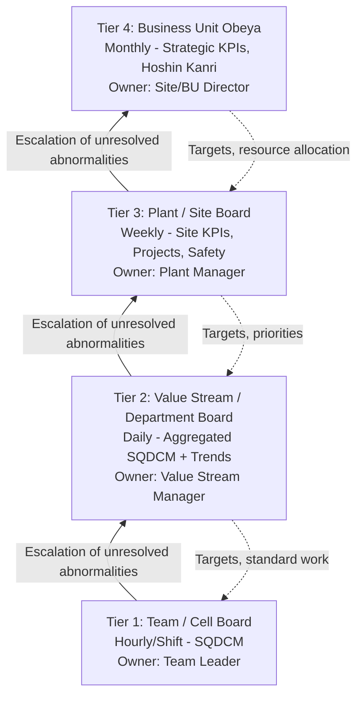
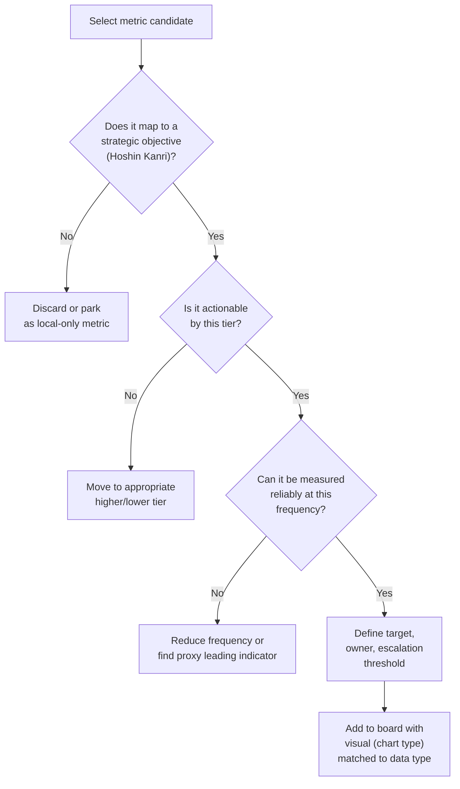

## Designing Visual Performance Boards and Tiered Metrics

### Overview

Visual performance boards (also called performance management boards, obeya boards, or tiered huddle boards) are physical or digital displays that make process performance visible at the point of work. They translate abstract metrics into a shared visual language so that abnormalities are detected immediately, and they anchor the structured huddles that connect shop-floor performance to plant- and enterprise-level objectives. Tiered metrics refer to the practice of cascading a small number of vital metrics through organizational levels (Tier 1: team/cell, Tier 2: value stream/department, Tier 3: plant, Tier 4: business unit/enterprise), with each tier summarizing and escalating only what the level above needs to know.

### Core Principles

- **Visual Management**: A board should communicate normal vs. abnormal condition within 3–5 seconds ("management by sight"). Color coding (green/yellow/red), simple icons, and consistent layout are prioritized over dense tables.
- **Point of Cause, Point of Use**: Boards live where the work happens, not in a manager's office. Data entry happens by the people doing the work.
- **Cascading Purpose**: Each tier's board should answer "are we on track to meet the tier above's target," not simply replicate the tier above's dashboard.
- **Actionability**: Every metric on a board must have an owner, a target, and a defined escalation path when it goes red.
- **Leading vs. Lagging Balance**: Boards mix lagging indicators (output, defects, downtime — measure what already happened) with leading indicators (5S score, training compliance, near-miss counts — predict future performance).

### The Tiered Structure

Each escalation carries three elements: **what** is abnormal, **why** (initial containment/root-cause hypothesis), and **what help is needed**. This prevents tiers from becoming report-outs rather than problem-solving mechanisms.

### The SQDCM (or SQCDP) Framework

The most common metric categorization used on boards is **SQDCM**:

| Category | Focus | Example Metrics |
| --- | --- | --- |
| **Safety** | Injuries, near-misses, hazard reports | Recordable incident rate, near-miss count, PPE compliance |
| **Quality** | Defects, rework, customer complaints | First Pass Yield (FPY), defects per million opportunities (DPMO), scrap rate |
| **Delivery** | On-time performance, throughput | OTD%, takt time adherence, backlog |
| **Cost** | Resource consumption, waste | Labor efficiency, material yield, OEE |
| **Morale/Motivation** | Engagement, attendance, suggestions | Attendance rate, kaizen suggestions submitted, training hours |

Some organizations sequence this as SQDCM to reinforce that safety and quality are non-negotiable gates before delivery and cost are discussed — a deliberate ordering to prevent cost pressure from eroding safety or quality behavior.

### Anatomy of a Tier 1 Team Board

A physical Tier 1 board is typically organized into standardized zones:

1. **Header Zone**: Team name, shift, date, huddle time.
2. **SQDCM Metric Zone**: One chart per category, updated by hand (grease pencil on laminate, or magnetic markers) at defined intervals (hourly for production count, daily for others).
3. **Hour-by-Hour Production Tracking Chart**: Plots planned vs. actual output per hour with a reason-code column for gaps.
4. **Andon/Abnormality Log**: Running list of stops, with time, reason, and resolution status.
5. **Action/Kaizen Tracker**: Open items with owner and due date (often a simple PICK chart or 5W1H format).
6. **Standard Work / Layout Reference**: Visual work instructions, layout diagram, or skills matrix for the cell.
7. **Escalation Flag**: A visible marker (red card, magnet) indicating an item needs Tier 2 support.

**Example — Hour-by-Hour Tracking Table:**

| Hour | Plan | Actual | Variance | Reason (if red) |
| --- | --- | --- | --- | --- |
| 6–7am | 50 | 50 | 0 | — |
| 7–8am | 50 | 42 | -8 | Changeover delay |
| 8–9am | 50 | 48 | -2 | Minor jam, cleared |

### Board-Design Decision Framework

### Selecting the Right Visual Format

Different data behaviors require different chart types; using the wrong one is a common failure mode.

- **Trend over time (continuous)**: Run chart or control chart (e.g., OEE% by day).
- **Comparison against target (single period)**: Bullet graph or simple bar with a target line.
- **Categorical breakdown (Pareto)**: Pareto chart for defect-type or downtime-reason ranking.
- **Variation/stability**: Statistical Process Control (SPC) chart with upper/lower control limits, to distinguish common-cause from special-cause variation.
- **Binary status**: Red/Yellow/Green (RYG) tile — used sparingly, only for true go/no-go conditions, since overuse desensitizes viewers.

**Example — Simple SVG Bullet Graph (svg_diagram) for OTD% vs. Target:**

<svg xmlns="http://www.w3.org/2000/svg" viewBox="0 0 400 90">
<text x="0" y="15" font-size="13" font-family="sans-serif" fill="#333">On-Time Delivery % (svg_diagram)</text>
<rect x="0" y="30" width="380" height="20" fill="#e0e0e0" />
<rect x="0" y="30" width="270" height="20" fill="#a8d5a2" />
<rect x="0" y="30" width="150" height="20" fill="#f7c948" />
<rect x="291" y="25" width="4" height="30" fill="#c0392b" />
<rect x="0" y="55" width="304" height="12" fill="#333" />
<text x="0" y="82" font-size="11" font-family="sans-serif" fill="#555">Actual: 80% (bar) | Target: 92% (red marker)</text>
</svg>

### Digital vs. Physical Boards

| Dimension | Physical Board | Digital Board |
| --- | --- | --- |
| **Update effort** | Manual, reinforces ownership/engagement | Can auto-populate from MES/SCADA, less manual reinforcement |
| **Visibility** | Only at physical location | Accessible remotely, multi-site roll-up possible |
| **Data latency** | Batch (hourly/shift) | Can be near real-time |
| **Cost of change** | Low (marker, paper) | Requires IT/software change control |
| **Behavioral effect** | Writing the number by hand increases operator awareness of trend | [Inference] Risk of passive viewing without active data ownership if automation removes manual step |
| **Best fit** | Tier 1 cell level | Tier 2+ aggregation, obeya rooms, multi-site |

[Inference] Many organizations adopt a hybrid model: manual entry at Tier 1 (to preserve engagement) with automated roll-up into digital dashboards at Tier 2 and above, since manual aggregation across many cells does not scale.

### The Daily Huddle Cadence

A tiered board system is only effective when paired with a disciplined meeting rhythm. A typical cadence:

| Tier | Frequency | Duration | Attendees | Standing Agenda |
| --- | --- | --- | --- | --- |
| 1 | Start of shift | 5–10 min | Operators, Team Leader | SQDCM review, prior day abnormalities, plan for shift |
| 2 | Daily | 15–20 min | Team Leaders, Value Stream Manager | Tier 1 escalations, cross-cell dependencies |
| 3 | Weekly | 30 min | VSMs, Plant Manager | Tier 2 escalations, project status, resource decisions |
| 4 | Monthly | 60 min | Plant/BU leadership | Strategic KPI review, Hoshin Kanri deployment check |

**Key Points**

- Huddles are stand-up, timeboxed, and held *at* the board, not in a conference room.
- The huddle's job is to identify and assign abnormalities, not to solve them on the spot (deep problem-solving is taken offline, e.g., via A3 or kaizen event).
- A metric that never triggers a discussion is either mis-targeted or not actionable — it should be reviewed for removal ("metric pruning").

### Common Failure Modes

- **Metric Proliferation**: Boards accumulate metrics over time without removing stale ones, diluting attention. A common heuristic is capping Tier 1 boards at 8–12 total metrics.
- **Vanity Metrics**: Numbers that look good but don't drive behavior (e.g., total units produced without a quality or safety counterbalance) can incentivize the wrong behavior.
- **Green-Washing**: Chronic yellow/red conditions get manually recolored green to avoid escalation friction; this is a leading indicator of a weak escalation culture and should itself be monitored.
- **Disconnected Tiers**: Tier 1 metrics that don't roll up to any Tier 2/3 objective indicate the cascade (Hoshin Kanri catchball) was not properly deployed.
- **Data Without Ownership**: A chart with no named accountable owner tends to go stale first.

### Worked Example — Building a Tier 1 Board for an Assembly Cell

1. **Identify strategic driver**: Plant-level goal is "Improve OTD from 85% to 95%."
2. **Cascade to cell**: Cell contributes via takt adherence; Tier 1 metric becomes "Hourly output vs. plan."
3. **Add quality gate**: Since faster output shouldn't sacrifice quality, add "First Pass Yield" as a paired metric (SQDCM discipline).
4. **Add safety gate**: "Days since last recordable incident" displayed prominently, reviewed first in every huddle.
5. **Define escalation rule**: If hourly output variance exceeds -10% for two consecutive hours, Team Leader flags for Tier 2 support within 30 minutes.
6. **Design visual**: Hour-by-hour bar chart with red highlighting on variance rows exceeding threshold; FPY as a simple daily run chart with a target line at 98%.
7. **Establish review cadence**: 5-minute huddle at shift start using yesterday's closing data as the discussion trigger.

### Related Topics

- Hoshin Kanri (Policy Deployment) and catchball process
- Overall Equipment Effectiveness (OEE) calculation and decomposition
- Statistical Process Control (SPC) charting fundamentals
- Andon systems and escalation protocols
- A3 problem-solving methodology
- Gemba walks and leader standard work
- Pareto analysis for defect/downtime prioritization
- Obeya (war room) design for strategic-level visual management