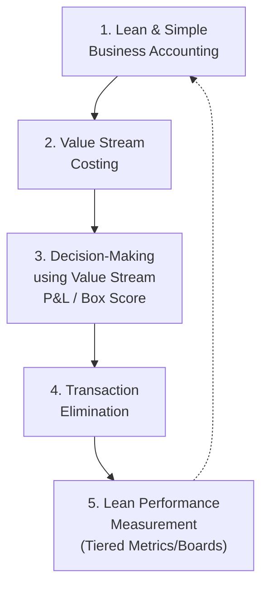

## Lean Accounting Fundamentals

### Overview

Lean Accounting is a management accounting approach designed to support and reinforce Lean Manufacturing rather than undermine it. Traditional standard costing and cost accounting were designed for mass production and can drive behaviors that directly contradict Lean principles — such as building inventory to absorb fixed overhead, favoring large batch sizes to reduce apparent unit cost, and evaluating labor efficiency in ways that discourage flow. Lean Accounting replaces these mechanisms with value-stream-based costing, simplified transaction tracking, and decision-support reporting aligned to the goals of flow, waste elimination, and customer value.

### Why Traditional Cost Accounting Conflicts with Lean

- **Overhead Absorption Incentive**: Standard costing allocates fixed overhead per unit produced. Producing more units — even unsold ones — lowers the reported unit cost, incentivizing overproduction (one of the seven wastes / *muda*).
- **Labor Efficiency Variances**: Traditional variance reporting rewards keeping machines and workers continuously busy, which conflicts with Lean's preference for producing only to actual demand (pull) and accepting planned idle time.
- **Batch-Size Distortion**: Cost systems that spread setup cost over batch size make large batches appear cheaper per unit, discouraging the small-batch/single-piece-flow changes central to Lean.
- **Complex, Transaction-Heavy Reporting**: Detailed labor and material transaction tracking (job costing, detailed routing capture) is itself a non-value-added activity that Lean seeks to eliminate.
- **Delayed, Aggregated Feedback**: Monthly financial closes are too slow and too aggregated to inform daily operational decisions on the shop floor.

**Key Points**

- The core critique is not that financial accuracy is unimportant, but that the *mechanisms* of traditional costing create perverse incentives at the operational level.
- Lean Accounting does not eliminate GAAP/regulatory financial reporting — it typically runs value-stream costing for internal decision support alongside statutory reporting, with periodic reconciliation.

### The Five Core Principles (per the Maskell/Baggaley framework)

Lean Accounting, as formalized by Brian Maskell and Bruce Baggaley (authors of *Practical Lean Accounting*), is generally organized around five interconnected practice areas:

1. **Lean and Simple Business Accounting**: Eliminate unnecessary transactions, standard cost variance reporting, and detailed labor tracking; simplify the general ledger to align with value streams.
2. **Value Stream Costing**: Collect costs by value stream (not by department or work order), typically weekly.
3. **Decision-Making**: Use value stream financial data (via the Box Score) for pricing, sourcing, capacity, and product-mix decisions instead of allocated standard costs.
4. **Transaction Elimination**: Remove backflushing complexity, detailed labor reporting, and work-order tracking where flow and visual control make them redundant.
5. **Lean Performance Measurement**: Tie financial value-stream metrics to the operational SQDCM metrics on visual boards, so financial and operational performance are viewed together.

### Value Stream Costing

Value Stream Costing is the central technical mechanism of Lean Accounting. Instead of allocating overhead to individual products via cost drivers, all costs directly traceable to a value stream (people, equipment depreciation, supplies, space) are summed for that value stream as a whole, typically on a **weekly** basis.

$$\text{Value Stream Cost per Unit} = \frac{\text{Total Value Stream Costs (weekly)}}{\text{Units Shipped (weekly)}}$$

**Cost Categories Typically Included Directly in a Value Stream:**

| Category | Treatment |
| --- | --- |
| Direct labor (all operators in the value stream) | Directly assigned, not allocated |
| Value-stream-dedicated equipment depreciation | Directly assigned |
| Materials | Usually tracked separately as a pass-through (materials often backflushed at standard price) |
| Value-stream support staff (schedulers, quality, engineering dedicated to the stream) | Directly assigned |
| Occupancy (space, utilities) | Assigned via simple square-footage or headcount basis — not complex ABC allocation |
| Shared/facility-level overhead not traceable to any stream | Kept separate, often shown as "Sustaining" or "Business Support" costs below the value stream lines |

Because most people and resources are dedicated to a single value stream under a well-designed Lean organization, the need for complex allocation is greatly reduced — this simplification is the mechanism, not merely a byproduct.

### The Box Score

The **Box Score** is the primary reporting artifact in Lean Accounting, combining operational, capacity, and financial metrics for a value stream on one page, typically covering weekly actuals, trend, and a future/planned state.

**Example — Simplified Box Score structure:**

| Metric | Operational |  | Capacity |  | Financial |  |
| --- | --- | --- | --- | --- | --- | --- |
|  | Last Week | This Week | Productive % | Non-Productive % | Revenue | This Week |
| On-Time Delivery | 91% | 94% | Available Capacity | 62% | Material Cost | $48,200 |
| First Pass Yield | 96% | 97% | Productive | 71% | Value Stream Cost | $112,400 |
| Dock-to-Dock Days | 6.2 | 5.8 | Non-Productive | 22% | Value Stream Profit | $39,600 |
| Avg. Order Lead Time | 4.1 days | 3.7 days | Available for Sale/Growth | 7% | ROS (Return on Sales) | 21% |

**Key Points**

- The "Capacity" section is a distinctive feature: it splits capacity into *Productive* (creates customer value), *Non-Productive* (waste — changeovers, rework, waiting), and *Available* (free capacity for growth without new investment) — making waste's financial cost visible in capacity terms, not just dollars.
- The Box Score is meant to be understandable by non-accountants — operations, sales, and engineering staff — supporting the Lean principle of decentralized, informed decision-making.

### Impact on Key Managerial Decisions

**Product Mix and Pricing Decisions**

Under standard costing, low-volume/high-complexity products often appear artificially cheap because overhead allocation smooths out their true resource consumption. Under Value Stream Costing:

$$\text{Value Stream Profit} = \text{Value Stream Revenue} - \text{Value Stream Costs}$$

Because most costs in a value stream are not reallocated per unit, decisions about which products to emphasize are made using the value stream's *aggregate* profitability and capacity impact rather than a distorted per-unit "fully loaded cost."

**Make vs. Buy / Capacity Decisions**

Because Non-Productive and Available capacity are explicitly visible in the Box Score, a common Lean Accounting technique is to evaluate a make/buy or new-business decision by asking whether it can be absorbed within *existing available capacity* — in which case the decremental cost is near-zero (labor/equipment are already paid for) — versus whether it requires new capacity investment.

### Elimination of Standard Cost Variances

Traditional variance analysis (material price variance, labor efficiency variance, purchase price variance, overhead volume variance) is generally reduced or eliminated in mature Lean Accounting implementations because:

- These variances are calculated monthly/after the fact — too slow to drive real-time operational correction.
- Labor efficiency variance specifically incentivizes keeping workers "busy" rather than matched to actual customer demand (pull).
- [Inference] Organizations transitioning from standard costing often retain a *simplified* material price variance for procurement performance tracking even after eliminating labor and overhead variances, since raw material price fluctuation remains a legitimate external signal.

### Inventory Valuation Under Lean Accounting

Because Lean environments target low inventory levels, inventory valuation is simplified rather than eliminated:

- **Backflushing**: Material and labor costs are automatically relieved from inventory based on the bill of materials for units *completed*, rather than tracked transaction-by-transaction through work-in-process (WIP) stages.
- **Simplified WIP Valuation**: With low WIP (a direct outcome of flow and small batch sizes), the financial materiality of precise WIP costing decreases, justifying simpler estimation methods (e.g., average day's worth of WIP valued at a blended rate) instead of detailed job costing.
- [Inference] The lower the WIP levels achieved operationally, the more defensible simplified valuation becomes from an audit-materiality standpoint; this is a self-reinforcing relationship between operational Lean maturity and accounting simplification.

### Transaction Elimination — Practical Mechanisms

| Traditional Transaction | Lean Accounting Alternative |
| --- | --- |
| Work order issued/closed per job | Backflush at point of shipment/completion |
| Labor time tickets per operation | Simple attendance/headcount by value stream (labor is a period cost of the stream, not traced per unit) |
| Detailed routing/move tickets | Visual/physical flow control (kanban, FIFO lanes) replaces paperwork tracking |
| Purchase price variance per PO | Blanket POs with negotiated pricing; variance tracked in aggregate, less frequently |
| Perpetual inventory transaction per move | Point-of-use/kanban replenishment with periodic cycle counting |

### Common Implementation Challenges

- **Dual Reporting Burden**: Many organizations must maintain standard costing for statutory/tax reporting (GAAP/IFRS) while running Value Stream Costing internally, requiring periodic reconciliation between the two — a genuine added complexity during transition.
- **ERP System Rigidity**: Many legacy ERP systems are architected around standard costing and work orders, making Value Stream Costing difficult to implement without workarounds or supplementary spreadsheet/BI tools. [Unverified] The degree of difficulty varies significantly by specific ERP platform and version, and newer platforms increasingly offer native value-stream costing modules.
- **Organizational Resistance**: Finance teams trained in variance analysis may resist relinquishing familiar control mechanisms; cross-functional education is typically required.
- **Value Stream Boundary Definition**: Costing accuracy depends heavily on how cleanly value streams are defined organizationally (shared equipment or shared staff across streams reintroduce allocation complexity).

### Worked Example — Comparing Standard Costing vs. Value Stream Costing for a Pricing Decision

A company produces two products, A (high volume) and B (low volume, more complex).

**Standard Costing view** (overhead allocated by machine hours):

- Product A: $40 allocated overhead/unit → appears highly profitable
- Product B: $40 allocated overhead/unit (same rate) → appears marginally profitable, though B actually consumes more changeover time and quality inspection effort

**Value Stream Costing view**:

- Both A and B run through the same value stream; weekly value stream cost is $180,000, weekly shipments (A+B combined) generate $260,000 revenue → value stream profit $80,000 (30.8% ROS)
- Capacity analysis reveals Product B's frequent changeovers consume a disproportionate share of *Non-Productive* capacity time
- Decision reframes from "is Product B profitable per unit" to "does Product B's changeover burden reduce the value stream's total available capacity for higher-margin work" — a capacity/mix question rather than a unit-cost question

### Related Topics

- Value Stream Mapping (VSM) and value stream definition
- Box Score construction and weekly reporting cadence
- Hoshin Kanri and linking financial targets to strategy deployment
- Kanban and pull systems (operational driver of low WIP enabling simplified valuation)
- Takt time and capacity planning
- Target costing vs. standard costing
- Throughput Accounting (Theory of Constraints) as a related alternative costing philosophy
- Tiered visual performance boards (integration of Box Score into Tier 2/3 boards)