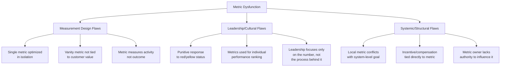

## Avoiding Metric-Driven Dysfunction

### Overview

Metric-driven dysfunction occurs when the act of measuring and managing a metric causes people to optimize for the number itself rather than the underlying outcome the metric was meant to represent. This is a well-documented phenomenon in management theory — formalized as **Goodhart's Law** ("when a measure becomes a target, it ceases to be a good measure") and **Campbell's Law** — and it poses a particular risk in Lean environments, where tiered metrics and visual boards are deliberately designed to be highly visible and to drive daily behavior. The same visibility that makes metrics powerful for surfacing abnormalities can, if poorly designed or poorly led, drive gaming, local suboptimization, and erosion of trust.

### Root Causes of Metric Dysfunction

**Key Points**

- Dysfunction rarely stems from a single cause — it typically emerges from the *interaction* of a flawed metric design and a punitive or narrowly incentivized management response to that metric.
- A metric that is well-designed but is met with blame when it turns red will still produce gaming behavior, because the underlying human incentive (avoid punishment) overrides the intended signal.

### Common Failure Patterns

**1. Local Optimization at the Expense of System Performance**

A classic Lean example: a work cell is measured on individual machine utilization (%). Operators run machines continuously to keep utilization high, building inventory that the downstream process cannot consume — directly violating flow and pull principles while satisfying the metric.

**2. Gaming and Data Manipulation**

When a metric target becomes threatening (e.g., tied to bonuses, publicly ranked, or grounds for discipline), people rationally shift effort from *improving the process* to *improving the reported number*. Examples include:

- Reclassifying defects as "rework" rather than "scrap" to protect a quality metric
- Delaying data entry of a problem until after a reporting cutoff
- Cherry-picking easy jobs to protect a cycle-time average

**3. Vanity Metrics Without Customer Linkage**

Metrics that look favorable in isolation but don't correlate with customer value or business outcomes (e.g., total units produced, without regard to whether those units were ordered) — see the earlier discussion of overproduction incentives under standard costing overhead absorption.

**4. Metric Fixation Over Process Understanding**

Teams review the red/green status of a chart without discussing the underlying process — the board becomes a compliance ritual (updating the chart) rather than a problem-solving trigger. This is sometimes called **"metric theater."**

**5. Overload / Metric Proliferation**

As referenced in visual board design, too many tracked metrics dilute attention, making it statistically likely that *something* is red at any given time, which desensitizes the team to genuine signals (alarm fatigue).

**6. Treating Common-Cause Variation as Special-Cause**

Reacting to every fluctuation in a metric as if it represents a real change in the process, rather than understanding the metric's natural statistical variation (addressed formally below), leads to overcorrection — a phenomenon W. Edwards Deming termed **"tampering,"** which can actually increase variation rather than reduce it.

### Distinguishing Signal from Noise: The Statistical Foundation

A central technical tool for avoiding false-alarm dysfunction is **Statistical Process Control (SPC)**, which separates *common-cause variation* (natural, expected fluctuation) from *special-cause variation* (a real, assignable change in the process).

$$UCL = \bar{x} + 3\sigma, \quad LCL = \bar{x} - 3\sigma$$

Where $\bar{x}$ is the process mean and $\sigma$ is the standard deviation of the metric. A single data point falling within these control limits should generally **not** trigger a reactive intervention or a punitive discussion — doing so is tampering. Only a point outside the limits, or a documented pattern (e.g., 7 consecutive points trending in one direction), indicates a special cause worth investigating.

**Example — Reaction Rule Table:**

| Observation | Correct Response |
| --- | --- |
| Single point within control limits, slightly above target | No action; note it, continue monitoring |
| Single point outside control limits | Investigate for a specific, assignable root cause |
| 7+ consecutive points trending one direction | Investigate — process may be shifting |
| Every daily fluctuation triggers a huddle escalation | Sign of tampering; revisit control limits and huddle escalation criteria |

### Design Principles to Prevent Dysfunction

**1. Pair Metrics to Prevent Single-Metric Gaming**

Never manage a metric in isolation if it can be improved by degrading another. This mirrors the SQDCM sequencing discussed in visual board design.

| Primary Metric | Required Paired/Counterbalancing Metric | Prevents |
| --- | --- | --- |
| Output/Throughput | First Pass Yield (Quality) | Rushing at the expense of quality |
| Machine Utilization | WIP / Inventory Level | Overproduction to inflate utilization |
| On-Time Delivery | Overtime Hours / Cost | "Making the date" via unsustainable cost |
| Individual Productivity | Team/Value Stream Output | Local optimization over flow |
| Cost per Unit | Safety Incidents | Cutting corners to hit cost targets |

**2. Measure the Process, Not Just the Person**

Metrics should primarily be diagnostic tools aimed at the *process* (is the standard work capable of delivering the target?) rather than instruments of individual performance evaluation. When a metric goes red, the first question should be "what in the process caused this," not "who caused this."

**3. Ensure Metric Ownership Matches Authority**

A metric assigned to a team that lacks control over its inputs (e.g., holding an assembly cell accountable for on-time delivery when a shared upstream department controls their material supply) produces frustration and eventual disengagement rather than improvement, since the team cannot act on the signal.

**4. Prefer Leading Indicators Alongside Lagging Ones**

Lagging metrics (defects shipped, downtime hours) confirm a problem already occurred. Leading metrics (5S audit scores, preventive maintenance compliance, training completion, near-miss reporting rate) predict future performance and give teams something actionable *before* the lagging metric degrades.

**5. Build Psychological Safety Around Red Status**

A metric turning red should be treated as a discovery of an improvement opportunity, not evidence of failure requiring blame. [Inference] Organizations that visibly reward the *reporting* of a problem (rather than penalizing the person who reports it) tend to see more honest, earlier signals — this is a widely cited principle in Lean culture literature (e.g., Toyota's andon cord philosophy of celebrating a pulled cord as a save, not a failure), though the specific magnitude of this effect will vary by organizational context. [Speculation]

**6. Periodically Prune and Re-Validate Metrics**

Metrics should be reviewed on a cadence (e.g., quarterly at Tier 2/3) to ask: "does this metric still drive the behavior we want, and has anyone found a way to satisfy it without improving the actual outcome?" A metric found to be gamed should be redesigned or replaced, not merely re-emphasized.

### A Diagnostic Checklist for Existing Metrics

**Example — Metric Health Audit Questions**

- Does the metric owner have authority over the inputs that drive it?
- Is there a counterbalancing metric that would reveal if this one is being gamed?
- Is the metric tied to individual compensation/discipline in a way that incentivizes concealment?
- Has the team ever discussed a way to "beat" the metric without changing the underlying process?
- Is the response to red status consistently a process conversation, or does it default to blame?
- Has this metric been red or green for an extended period without any corresponding discussion (a sign it's not actually being reviewed)?
- Does this metric still map to a live strategic objective (Hoshin Kanri linkage), or has the underlying goal changed?

### Worked Example — Diagnosing and Correcting a Dysfunctional Metric

**Scenario**: A stamping department is measured solely on "parts per hour" per press, publicly ranked by operator, tied to a small productivity bonus.

**Observed dysfunction**: Operators begin skipping first-piece inspection steps to save time, and downstream defect rates rise. Some operators also learn to run smaller, faster-cycling parts preferentially when scheduling flexibility allows, leaving harder parts for the next shift.

**Diagnosis using the framework above**:

- No counterbalancing quality metric — the primary failure identified.
- Compensation directly tied to the raw metric — creates strong individual incentive to game it.
- Individual ranking rather than team/value-stream framing — encourages cherry-picking and discourages helping teammates.

**Corrective redesign**:

1. Replace individual "parts per hour" ranking with a **team/value-stream throughput metric** paired with **First Pass Yield**, so both must move together.
2. Remove direct compensation linkage from the raw production count; tie any incentive instead to the value-stream Box Score performance (see Lean Accounting fundamentals) reviewed collectively.
3. Reframe huddle discussion of the metric around process capability (is the standard work achievable at the current takt time) rather than individual blame.
4. Add a leading indicator — first-piece inspection compliance rate — to catch quality risk before defects reach the customer.

### Related Topics

- Statistical Process Control (SPC) and control chart interpretation
- Goodhart's Law and Campbell's Law in organizational measurement
- Designing visual performance boards and tiered metrics
- Andon systems and psychological safety in escalation
- Hoshin Kanri (Policy Deployment) and metric-to-strategy linkage
- Lean Accounting fundamentals and Box Score design
- Root Cause Analysis (5 Whys, Fishbone) as the correct response to red metrics
- Leader Standard Work and Gemba walk discipline