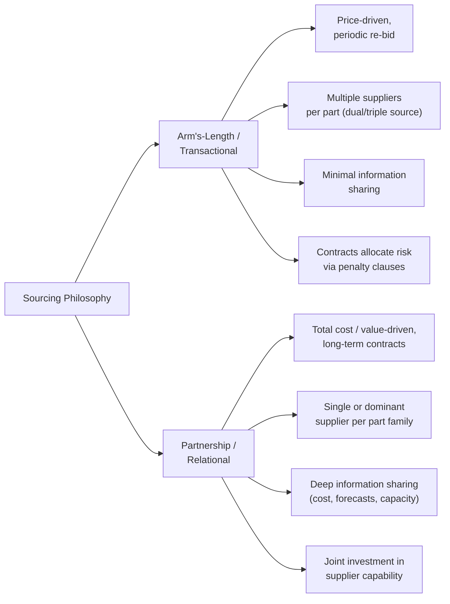
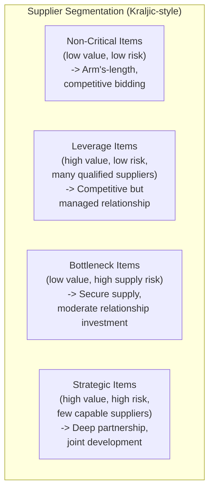

## Supplier Partnership Philosophy versus Arm's-Length Sourcing

### Overview

Lean supply chain management rests on a strategic choice about the nature of buyer-supplier relationships. **Arm's-length sourcing** (also called transactional or adversarial sourcing) treats each purchase as an independent, price-driven transaction among interchangeable suppliers competing primarily on cost. **Supplier partnership** (the model most associated with the Toyota Production System, formalized in Toyota's *keiretsu*-influenced supplier network) treats key suppliers as long-term collaborators whose capability development is a shared investment, on the premise that total value stream cost and quality are optimized through deep, durable relationships rather than through periodic competitive re-bidding. The choice between these philosophies materially shapes contract structure, information sharing, cost management, and continuous improvement capability across the extended value stream.

### Comparative Framework

### Core Dimensions of Comparison

| Dimension | Arm's-Length Sourcing | Partnership Sourcing |
| --- | --- | --- |
| **Selection Criteria** | Primarily lowest bid price per RFQ cycle | Total cost of ownership, quality capability, strategic fit, willingness to improve jointly |
| **Contract Duration** | Short-term, frequently re-competed | Multi-year, often with automatic renewal tied to performance |
| **Number of Sources per Part** | Often dual/triple-sourced to preserve leverage and reduce supply risk | Often single-sourced per part family, with risk managed through capability and trust rather than redundancy |
| **Information Sharing** | Minimal; suppliers treated as external, potentially adversarial parties | Extensive — cost breakdowns, demand forecasts, capacity plans, quality data shared bidirectionally |
| **Cost Management Approach** | Price negotiation / competitive bidding pressure | Target costing and joint cost reduction (kaizen) activities |
| **Quality Approach** | Incoming inspection, reject-and-return, penalty clauses | Supplier development, joint problem-solving, source inspection elimination over time |
| **Investment in Supplier Capability** | Rare — buyer does not want to invest in a supplier that may be replaced | Common — buyer provides engineering support, training, even capital equipment guidance |
| **Risk Allocation** | Transferred to supplier via contract terms (penalties, liquidated damages) | Shared — problems are treated as joint problems to solve, not fault to assign |
| **Switching Behavior** | Frequent switching is normal and even used as negotiating leverage | Switching is rare, reserved for sustained, unaddressed performance failure |

### The Toyota Keiretsu Model as the Archetypal Partnership Approach

Toyota's supplier system is the most widely studied real-world example of the partnership philosophy, and several of its specific mechanisms are useful as concrete design patterns:

- **Tiered Supplier Structure**: Toyota works primarily with a limited set of **Tier 1** suppliers, who in turn manage their own Tier 2 and Tier 3 sub-suppliers — Toyota rarely manages parts suppliers directly beyond Tier 1, delegating that coordination to trusted Tier 1 partners.
- **Cross-Shareholding and Long Tenure**: Historically, Toyota held minority equity stakes in key suppliers, reinforcing long-term alignment of interests beyond a single contract cycle. [Unverified — the degree of cross-shareholding has evolved over time and varies by supplier and region; current specifics should be confirmed for any region-specific analysis.]
- **Supplier Associations (Kyohokai)**: Toyota historically organized supplier associations where suppliers share best practices with each other — including, notably, with competitors within the same association — under the premise that raising the capability of the entire supplier base benefits Toyota more than any single supplier hoarding an advantage.
- **Guest Engineer Programs**: Supplier engineers are seconded into Toyota's own product development teams during new model programs, embedding suppliers early in design decisions (a practice sometimes called "black box" or "gray box" parts design, discussed further below).
- **On-Site Supplier Development (Jishuken)**: Toyota sends its own improvement specialists (*jishuken* teams) into supplier plants to jointly kaizen the supplier's processes — a direct capability investment that would be irrational under a purely transactional model where the supplier might be dropped next quarter.

### Target Costing as the Financial Mechanism of Partnership Sourcing

A key technical distinction between the two philosophies is how cost is determined:

**Arm's-length approach:**

$$\text{Price} = \text{Supplier's Cost} + \text{Supplier's Desired Margin (negotiated down by buyer)}$$

**Partnership / target costing approach:**

$$\text{Target Cost} = \text{Market-Driven Selling Price} - \text{Desired Profit Margin}$$

Under target costing, the buyer and supplier jointly work backward from what the end customer is willing to pay, then collaborate — often using **value engineering** and joint kaizen — to design and manufacture the part at or below the target cost, sharing resulting savings according to a pre-agreed formula. This requires supplier cost transparency that would be commercially unthinkable under an arm's-length model, since it requires the supplier to open its cost structure to the buyer.

### Risk and Resilience Trade-offs

**Key Points**

- **Arm's-length sourcing** is generally more resilient to *single-supplier failure* (dual-sourcing provides redundancy) but more exposed to *relationship shallowness* — suppliers have less incentive to prioritize a buyer during shortages, since loyalty is not cultivated.
- **Partnership sourcing** is generally more resilient to *quality and delivery variability* (deep collaboration surfaces problems earlier) but more exposed to *single-source concentration risk* — a disruption at that one supplier (natural disaster, financial failure, cyberattack) has an outsized impact.
- [Inference] The 2011 Tōhoku earthquake and subsequent supply disruptions affecting Toyota's own single-sourced specialty component suppliers are frequently cited in the literature as the canonical illustration of partnership-model concentration risk, prompting subsequent industry-wide reassessment of strategic dual-sourcing for critical, hard-to-substitute components even within otherwise partnership-oriented supply chains.

### Hybrid / Segmented Sourcing Strategy

Most mature Lean organizations do not apply a single philosophy uniformly across all purchased items — they segment suppliers by strategic importance, typically using a variant of the **Kraljic Matrix**:

- **Non-critical items** (e.g., standard fasteners, generic office supplies): Arm's-length sourcing is appropriate — low switching cost, abundant suppliers, minimal quality risk.
- **Strategic items** (e.g., custom-engineered subsystems, sole-source technology components): Partnership sourcing is justified — the cost of relationship investment is offset by superior quality, innovation access, and supply security.
- This segmentation itself reflects Lean's emphasis on applying the right tool to the specific situation rather than a dogmatic, one-size-fits-all policy.

### Supplier Development as a Distinct Partnership Activity

Where arm's-length sourcing treats supplier capability as a pre-existing selection criterion (you choose a supplier because it is already capable), partnership sourcing treats supplier capability as something the buyer actively builds:

**Example — Typical Supplier Development Activities:**

- Joint kaizen events held at the supplier's facility, led by the buyer's Lean/continuous improvement team
- Training the supplier's workforce in TPS tools (5S, standard work, SMED) at the buyer's expense or with shared cost
- Providing engineering support to help the supplier meet increasingly demanding quality or delivery specifications
- Establishing a supplier scorecard reviewed jointly (not punitively) on a regular cadence, with improvement plans co-developed rather than dictated

### Common Pitfalls in Transitioning Between Models

- **Partial Partnership Without Trust Investment**: Extending long-term contracts to suppliers without genuinely sharing cost/forecast information or investing in capability — this yields the *risks* of single-sourcing (concentration) without the *benefits* of partnership (collaboration, transparency), a frequently observed hybrid failure mode.
- **Reverting to Price Pressure Under Financial Stress**: Organizations that adopt partnership rhetoric but revert to unilateral price-cutting demands during downturns damage supplier trust in ways that are difficult to rebuild, undermining the long-term collaboration the model depends on.
- **Applying Partnership Uniformly Without Segmentation**: Investing partnership-level relationship resources in low-strategic-value commodity items wastes buyer capacity that should be focused on strategic/bottleneck items.
- **Neglecting Supplier's Own Sub-Tier Risk**: A buyer may have a strong Tier 1 partnership while remaining unaware of fragility at that supplier's own Tier 2/3 sub-suppliers — a gap that was widely exposed during global semiconductor and raw-material shortages in recent years. [Unverified — specific shortage events and their causal chains are complex and vary by industry; general pattern is well documented but any specific case should be independently verified.]

### Worked Example — Choosing a Sourcing Model for a New Component

**Scenario**: An automotive assembler needs to source a newly designed sensor module, technically complex, produced by only three qualified global suppliers, representing 4% of total vehicle cost but critical to a safety-related function.

**Analysis using the Kraljic framework**:

- High supply risk (few qualified suppliers, complex technology) + high business impact (safety-critical) → classified as a **Strategic item**.

**Recommended approach**:

1. Select a primary supplier based on total cost of ownership and technical capability, not lowest quoted price alone.
2. Negotiate a multi-year agreement with a target-costing framework, sharing forecast volumes to allow the supplier to plan capacity investment.
3. Embed a guest engineer relationship during the design phase to co-develop the component to a joint target cost.
4. Establish joint quality review cadence rather than pure incoming-inspection reliance, working toward source-inspection elimination as trust and capability mature.
5. Mitigate concentration risk by qualifying a second supplier for a smaller allocation (e.g., 15–20% of volume) as a resilience hedge, without diluting the primary partnership's depth — reflecting the hybrid strategic-item risk mitigation discussed above.

### Related Topics

- Kraljic Matrix and strategic sourcing segmentation
- Target costing and joint value engineering
- Toyota's Tier 1/2/3 supplier network structure
- Supplier development programs and Jishuken (on-site kaizen)
- Total Cost of Ownership (TCO) analysis
- Single-sourcing vs. dual-sourcing risk management
- Kanban-based supplier replenishment systems
- Lean accounting fundamentals (cost transparency prerequisites)