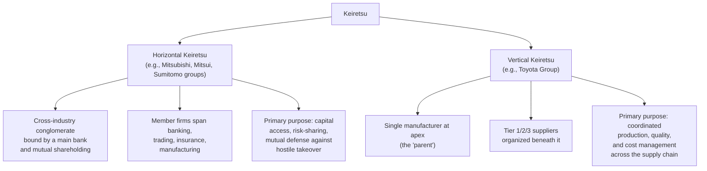
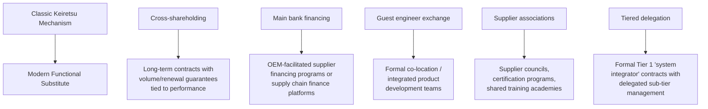

## The Keiretsu Model and Its Modern Adaptations

### Overview

*Keiretsu* (系列, literally "series" or "grouping") refers to a distinctive form of Japanese inter-firm organization in which legally independent companies are bound together through cross-shareholding, long-term trading relationships, shared financing (often via a "main bank"), and personnel exchange, rather than through formal parent-subsidiary ownership. In the context of Lean Manufacturing, the term is most often used narrowly to describe **vertical keiretsu** — the supplier network structures pioneered by Toyota and other Japanese manufacturers — which provided the organizational and financial scaffolding that made the deep supplier partnership philosophy (target costing, guest engineering, jishuken) practically sustainable over decades. Understanding keiretsu is essential context for evaluating why certain Lean supply chain practices emerged where they did, and what is and is not portable to organizations operating without that structure.

### Horizontal vs. Vertical Keiretsu

There are two historically distinct forms, and conflating them is a common source of confusion:

- **Horizontal keiretsu** (e.g., the Mitsubishi, Mitsui, and Sumitomo groups) are broad conglomerates spanning unrelated industries, historically bound together by a central "main bank" that provided financing and by reciprocal minority shareholdings, primarily as a post-war successor structure to the dissolved *zaibatsu* conglomerates.
- **Vertical keiretsu** (e.g., the Toyota Group, comprising Toyota Motor Corporation and its extended supplier network including firms like Denso and Aisin) are the form directly relevant to Lean Manufacturing, and are the focus of the rest of this document.

### Structural Mechanisms of the Vertical (Supplier) Keiretsu

**1. Tiered Supplier Architecture**

The manufacturer (e.g., Toyota) manages a relatively small number of **Tier 1** suppliers directly. Each Tier 1 supplier is responsible for managing its own **Tier 2** sub-suppliers, who in turn may manage **Tier 3** suppliers — delegating coordination complexity downward rather than the OEM attempting to manage thousands of parts suppliers itself.

**2. Cross-Shareholding**

The parent manufacturer historically held minority equity stakes in key Tier 1 suppliers (and vice versa, in some cases), aligning long-term financial interest and signaling durable commitment that discourages either party from prioritizing short-term transactional advantage over the relationship. [Unverified — the extent and trend of cross-shareholding has been reported as declining industry-wide over recent decades due to corporate governance reform pressures in Japan; current specific equity percentages for any named company should be independently verified rather than assumed static.]

**3. Personnel Exchange (Amakudari-adjacent practices and Guest Engineering)**

Engineers and managers move between the parent company and key suppliers — including the "guest engineer" practice in which supplier engineers are embedded within the OEM's product development teams during new model programs — building shared technical language, trust, and mutual understanding of constraints on both sides.

**4. Supplier Associations (Kyohokai / Kyoryokukai)**

Formal associations of a manufacturer's key suppliers meet regularly to share best practices, receive training, and coordinate around the parent's evolving needs. Notably, direct competitors within the same association are expected to share improvement techniques with each other, on the premise that raising the capability floor of the entire supplier base benefits the parent manufacturer more than allowing any single supplier's improvement to remain proprietary.

**5. Main Bank Financing**

In the classic model, a keiretsu-affiliated bank provided preferential, relationship-based financing to member firms, reducing suppliers' capital constraints and making it feasible for them to make long-horizon investments (new equipment, workforce training) justified by the expectation of a durable buyer relationship rather than by near-term contract guarantees alone.

### Why the Keiretsu Structure Enabled Specific TPS Supply Chain Practices

**Key Points**

- **Target costing and cost transparency** (suppliers opening their cost structures to the OEM) are commercially risky under arm's-length competitive sourcing, since transparent cost data could be used against the supplier in future re-bids. Cross-shareholding and long-term relational commitment reduced that risk, making transparency rational.
- **Jishuken (on-site kaizen investment)** — the OEM sending its own improvement specialists to upgrade a supplier's processes for free or at shared cost — is economically irrational if the supplier might be dropped next quarter for a lower bid. The keiretsu's implicit long-term commitment made this investment payback horizon viable.
- **Single-sourcing of many components** was made less risky by the depth of the relationship (the OEM had detailed visibility into and influence over the supplier's operations, and financial ties discouraged supplier failure or defection) compared to single-sourcing under a purely arm's-length model.
- [Inference] This suggests the keiretsu structure functioned less as a separate "extra" practice and more as the underlying institutional trust mechanism that made several core Lean supply chain practices economically rational for both parties — a point often underemphasized when these practices are described purely as management techniques divorced from their institutional context.

### Historical Decline and Erosion Pressures

The classic keiretsu model has weakened significantly since the 1990s due to several converging pressures:

- **Japanese Corporate Governance Reform**: Regulatory and investor pressure (particularly following Japan's "Corporate Governance Code" reforms) pushed publicly listed companies to reduce cross-shareholding, which was increasingly criticized as entrenching management and depressing capital efficiency and shareholder returns.
- **Financial Deregulation**: The erosion of the "main bank" system as Japanese capital markets liberalized reduced the financial glue holding vertical keiretsu together.
- **Globalization of Supply Chains**: OEMs increasingly needed to source from globally competitive suppliers outside the traditional keiretsu network to remain cost-competitive internationally, diluting the exclusivity of the original structure.
- **Foreign OEM Adoption of TPS Practices Without Keiretsu Ties**: Non-Japanese manufacturers adopted TPS-style supplier development practices without the underlying keiretsu institutional scaffolding, demonstrating that some (though arguably not all) of the practices could be decoupled from the original structure.

### Modern Adaptations Outside Japan

Because most Western and globally distributed manufacturers cannot replicate cross-shareholding or main-bank financing structures (due to differing capital market norms, antitrust considerations, and corporate governance expectations), modern Lean organizations have adapted the *functional intent* of keiretsu — long-term trust, capability investment, coordinated tiering — using different institutional tools:

**Example — Functional Substitutes in Practice:**

| Keiretsu Mechanism | Modern Non-Japanese Adaptation | Illustrative Context |
| --- | --- | --- |
| Cross-shareholding | Multi-year exclusive or preferred-supplier agreements with automatic renewal clauses tied to jointly reviewed scorecards | Common in automotive and aerospace long-term agreements (LTAs) |
| Main bank financing | Supply chain finance / reverse factoring programs where the OEM's stronger credit rating is used to secure suppliers cheaper financing | Increasingly common across large-OEM supply chains as a substitute for direct equity ties |
| Guest engineering | Formal supplier co-location programs and integrated product development (IPD) teams during new product introduction | Widely adopted in automotive and electronics new-model programs |
| Supplier associations | Supplier councils, shared Lean training academies, and structured supplier certification/development programs | Used by large manufacturers seeking the capability-raising benefit without formal equity ties |
| Tiered delegation | Formal "Tier 1 systems integrator" contracts explicitly delegating Tier 2/3 sub-supplier management and quality responsibility | Standard practice in modern automotive and aerospace sourcing |

### Limits of Portability — What Does Not Transfer Easily

- **Antitrust and Competition Law Constraints**: Cross-shareholding and coordinated information-sharing among direct competitors (as occurs within Japanese supplier associations) face significant antitrust scrutiny under U.S. and EU competition law, meaning this specific mechanism generally cannot be directly replicated outside Japan without legal risk.
- **Shareholder Return Expectations**: Public companies in many Western capital markets face stronger investor pressure for short-term capital efficiency, making illiquid, non-controlling cross-shareholdings a harder sell to shareholders than they historically were in Japan.
- **Labor Market Mobility Differences**: The guest engineer and personnel exchange practices were historically reinforced by relatively lower cross-company labor mobility norms in Japan; in labor markets with higher employee turnover and mobility, the trust and continuity benefits of personnel exchange may be harder to sustain over multi-decade horizons. [Speculation — this is a plausible contributing factor frequently referenced in comparative management literature, but the causal weight of labor mobility versus other factors is not precisely quantified.]
- **Trust Built Over Decades**: [Inference] Many of the practical benefits of keiretsu (willingness to share true cost data, willingness to invest in a supplier without immediate contractual guarantee) arguably depend on relationship history and repeated-game trust accumulated over long periods, which cannot simply be declared into existence via a new long-term contract — this suggests modern adaptations may achieve *partial*, not full, functional equivalence, particularly in early years of a new relationship.

### Worked Example — Adapting Keiretsu Principles for a Non-Japanese Manufacturer

**Scenario**: A U.S.-based industrial equipment manufacturer wants to adopt keiretsu-style supplier partnership principles for its critical component suppliers, without cross-shareholding or a main-bank structure available as tools.

**Adaptation approach**:

1. **Replace cross-shareholding with contractual commitment**: Offer 5-year volume commitments with automatic renewal contingent on jointly reviewed performance criteria (not unilateral re-bid), giving the supplier a comparable long-horizon planning basis.
2. **Replace main-bank financing with supply chain finance**: Establish a reverse-factoring arrangement allowing key suppliers to draw on the OEM's credit rating for working capital, reducing the supplier's cost of capital without requiring equity investment.
3. **Replace guest engineering with formal co-location**: Embed supplier engineers directly in the OEM's product development team for the duration of new product programs, with clearly defined IP-sharing agreements appropriate to a non-equity relationship.
4. **Replace supplier associations with a supplier council**: Establish a structured forum where the OEM's top-tier suppliers meet quarterly for joint training and process-improvement sharing, explicitly scoped to avoid antitrust exposure (e.g., no discussion of pricing among competing suppliers).
5. **Formalize tiered delegation contractually**: Require Tier 1 suppliers to submit sub-tier quality and capacity management plans as part of the contract, replicating the delegated-tier oversight function without requiring the OEM to manage Tier 2/3 directly.

### Related Topics

- Supplier partnership philosophy versus arm's-length sourcing
- Target costing and joint value engineering
- Jishuken (on-site supplier kaizen) and guest engineer programs
- Supply chain finance and reverse factoring mechanisms
- Tier 1/2/3 supplier risk management and sub-tier visibility
- Toyota Production System organizational history
- Kraljic Matrix and strategic sourcing segmentation
- Antitrust considerations in supplier collaboration and information sharing