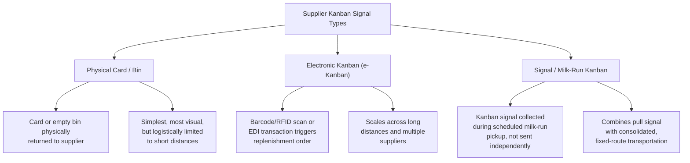

## Extending Kanban and Pull Systems to Suppliers

### Overview

Internal kanban systems regulate the flow of material and production instructions between adjacent processes within a single facility. **Supplier kanban** (also called external kanban or inter-company kanban) extends this same pull logic across the organizational boundary, so that a supplier replenishes parts based on actual, signaled consumption at the buyer's point of use rather than on a forecast-driven purchase order schedule. This is one of the most operationally demanding Lean supply chain practices to implement well, because it requires the supplier's own production and logistics systems to respond reliably to signals arriving on a much shorter cycle than traditional purchasing, and because failures in the signal chain (a lost card, a data sync error, a transport delay) have immediate, visible consequences on the buyer's line.

### Why Extend Pull Beyond the Factory Walls

Without supplier kanban, purchased-parts replenishment typically follows a forecast-push model: the buyer issues periodic purchase orders based on a forecasted build schedule (often via MRP), and the supplier produces and ships against that forecast. This reintroduces the classic problems Lean seeks to eliminate at the internal level, now at the supply chain level:

- **Forecast Error Amplification (Bullwhip Effect)**: Small changes in the buyer's actual demand can produce increasingly amplified swings in the supplier's production schedule as the signal passes through forecasting and order-batching logic.
- **Excess Buffer Inventory**: Both parties hold safety stock to protect against forecast inaccuracy and lead-time variability, tying up working capital across the extended value stream.
- **Delayed Signal of Real Demand Change**: A genuine shift in consumption may not reach the supplier until the next forecast revision cycle, whereas a kanban signal reflects near-real-time actual usage.

Supplier kanban aims to replace forecast-push replenishment with actual-consumption-triggered replenishment, extending the "produce only what has been consumed" principle across the company boundary.

### Types of Supplier Kanban Signals

**1. Physical Card/Bin Kanban**

The traditional two-bin or card-based system extended physically to a nearby supplier: an empty container or a physical card is returned to the supplier, triggering replenishment of exactly that container's worth of parts. This works best when the supplier is geographically close (enabling frequent, low-cost transport) — a pattern common in Toyota's original supplier base, historically often located near assembly plants specifically to enable this.

**2. Electronic Kanban (e-Kanban)**

For suppliers at greater distance, a physical card cycling back and forth is impractical due to transit time. E-Kanban replaces the physical card with an electronic signal — a barcode/RFID scan at the point of consumption, or a system-generated transaction — transmitted via EDI (Electronic Data Interchange), a supplier portal, or direct system integration, triggering the same "replenish exactly this quantity" logic without a physical card's transit constraint.

**3. Signal Kanban within Milk-Run Logistics**

A **milk run** is a scheduled, fixed-route transportation pattern where a truck visits multiple suppliers on a set route and frequency (e.g., every 2 hours), picking up small quantities from each based on kanban signals collected since the last visit. This decouples the *pull signal* (immediate) from the *physical replenishment* (batched to the next scheduled run), balancing responsiveness against transportation efficiency.

### Core Design Parameters

Extending kanban to a supplier requires explicitly calculating several parameters that, for internal kanban, may be simpler due to shorter and more controllable lead times.

**Kanban Quantity Calculation**

$$\text{Number of Kanban Cards} = \frac{D \times (LT + SS)}{C}$$

Where:

- $D$ = average daily demand (units/day)
- $LT$ = total supplier replenishment lead time (days) — order transmission + supplier production + transportation + receiving
- $SS$ = safety stock factor (days), accounting for demand and lead-time variability
- $C$ = container/kanban quantity (units per bin/card)

**Example Calculation:**

A component has average daily demand of 400 units, total supplier lead time of 3 days (including a 1-day order signal delay, 1.5-day supplier production/pick time, and 0.5-day transit), a safety factor of 1 day, and a standard container size of 200 units.

$$\text{Number of Kanban Cards} = \frac{400 \times (3 + 1)}{200} = \frac{1600}{200} = 8 \text{ cards}$$

This means 8 containers' worth of inventory must exist in the pipeline (at the supplier, in transit, and at the buyer) at any time to buffer against the full replenishment cycle.

**Key Points**

- Supplier lead time for external kanban is almost always longer and more variable than internal process-to-process lead time, meaning supplier kanban systems typically require larger kanban quantities (more WIP in the pipeline) than a comparable internal loop — a frequently underestimated design constraint when organizations attempt to apply internal kanban sizing formulas unchanged to external suppliers.
- Any structural change to supplier lead time (a new plant location, a mode of transport change, a process change at the supplier) requires recalculating and rebalancing the kanban quantity — a static kanban count is a liability if the underlying lead time assumption drifts.

### Milk-Run Route Design

Milk-run logistics are central to making supplier kanban economically viable when a single truckload per supplier per delivery would be inefficient.

**Example — Milk-Run Route Design Considerations:**

| Parameter | Design Consideration |
| --- | --- |
| Route frequency | Balances inventory holding cost (less frequent = more buffer needed) against transportation cost (more frequent = more trips) |
| Route sequencing | Suppliers sequenced geographically to minimize total distance/time per loop |
| Truck utilization | Route and container sizing designed to keep trucks reasonably full each run, avoiding wasted transportation capacity (a Lean waste — transportation muda) |
| Pickup/delivery windows | Fixed time windows at each supplier stop, requiring supplier dock scheduling discipline |
| Consolidation points | For very distant suppliers, kanban orders may be consolidated at a regional cross-dock before a longer-haul milk run to the buyer |

### Prerequisites for Successful Supplier Kanban

Extending pull to suppliers is not simply a matter of introducing cards or e-Kanban software — it requires the supplier relationship and process maturity to support it:

1. **Stable, Predictable Supplier Process Capability**: A supplier with high process variability (frequent quality issues, unreliable cycle times) will struggle to respond reliably to short-cycle kanban signals; process stabilization at the supplier typically must precede kanban implementation, not follow it.
2. **Reliable, Consistent Transportation**: Milk-run or e-Kanban systems depend on transportation reliability; unpredictable transit times undermine the lead-time assumptions embedded in the kanban quantity calculation.
3. **Relationship Trust and Information Sharing**: As discussed in supplier partnership philosophy, suppliers are typically more willing to hold buffer stock and respond flexibly to pull signals when they have visibility into the buyer's longer-term forecast and trust the relationship's durability — a purely transactional supplier has less incentive to prioritize responsiveness to a kanban signal over other customers' forecast-based orders.
4. **System/Data Integration Capability**: E-Kanban requires the supplier to have (or be willing to adopt) compatible EDI, barcode/RFID scanning, or portal-based order-receipt capability — a real capability gap for smaller or less digitally mature suppliers.
5. **Packaging and Container Standardization**: Kanban quantities are tied to standard container sizes; suppliers must be able to pack in the buyer's specified container/quantity standard, which may require investment in returnable packaging systems.

### Common Implementation Challenges

- **Returnable Container Logistics**: Physical kanban depends on containers cycling back to the supplier; loss, damage, or delay of returnable containers/cards disrupts the signal loop. Many implementations require a dedicated container-tracking and management process.
- **Demand Volatility Exceeding Kanban Design Assumptions**: A kanban system sized for average demand and expected variability can be overwhelmed by demand spikes beyond the design range, requiring either temporary supplemental orders or periodic kanban count recalibration.
- **Supplier's Own Sub-Tier Dependency**: A Tier 1 supplier's ability to respond to kanban pull signals depends on its own upstream material availability; without cascading the pull discipline further upstream, the Tier 1 supplier may simply shift the buffer/forecast problem to its own Tier 2 suppliers rather than eliminating it.
- **System Integration Fragility**: For e-Kanban, a data sync failure, EDI transaction error, or system outage can silently break the signal loop; robust systems require monitoring/alerting for missed or delayed kanban transmissions, since a "silent" pull failure is more dangerous than a visibly empty physical card.
- **Resistance from Traditional Purchasing Functions**: Procurement organizations built around periodic RFQ/PO cycles and MRP-driven scheduling may resist the shift to a demand-pull model, since it changes established performance metrics (e.g., PO cycle counts) and requires new skills in kanban-loop design and monitoring.

### Worked Example — Transitioning a Supplier from Forecast-Push to Kanban Pull

**Scenario**: An assembly plant currently orders a wiring harness component from a supplier 150 miles away via weekly MRP-generated purchase orders, resulting in an average 12 days of buyer-side inventory as a buffer against forecast error.

**Transition steps**:

1. **Stabilize supplier process first**: Confirm the supplier's on-time delivery and quality performance are within acceptable control limits (see Statistical Process Control) before introducing shorter-cycle replenishment — a volatile supplier process will produce a volatile kanban loop.
2. **Redesign logistics**: Replace weekly full-truckload shipments with a milk-run route delivering smaller quantities twice daily, feasible given the 150-mile distance with appropriate route planning.
3. **Standardize containers**: Establish a returnable container size aligned to a manageable kanban unit (e.g., 4 hours of consumption per container) rather than the current pallet-based full-truckload unit.
4. **Implement e-Kanban signaling**: Given the distance precludes practical physical card return within the desired cycle time, deploy barcode-scan-triggered electronic kanban integrated with the supplier's order-receipt system.
5. **Calculate initial kanban quantity**: Using the formula above, with realistic total lead time (order transmission + supplier pick/pack + milk-run transit) and an appropriate safety factor, size the number of kanban loops needed.
6. **Pilot and monitor before full cutover**: Run the new e-Kanban loop in parallel with reduced (not eliminated) buffer stock initially, monitoring for missed signals or transit variability before fully committing to the lower target inventory level.
7. **Recalculate periodically**: Revisit the kanban quantity calculation whenever lead time, demand pattern, or container size assumptions change materially.

### Related Topics

- Kanban system design and calculation (internal)
- Milk-run logistics and route optimization
- Supplier partnership philosophy versus arm's-length sourcing
- Bullwhip effect and demand amplification in supply chains
- Statistical Process Control (SPC) for supplier process stability
- Value Stream Mapping (extended to multi-company value streams)
- EDI and e-Kanban system integration architecture
- Returnable packaging and container standardization programs