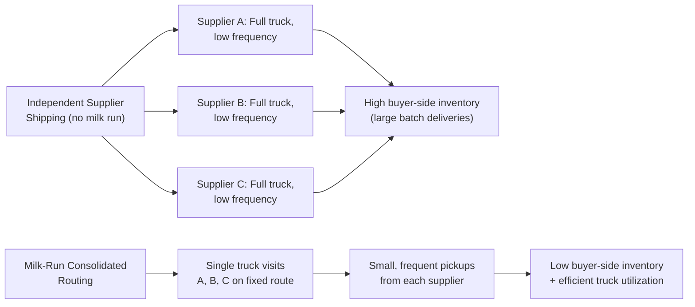

## Milk Runs and Synchronized Logistics Routing

### Overview

A **milk run** is a logistics pattern in which a single vehicle follows a fixed route, on a fixed schedule, picking up (or delivering) small, frequent quantities from multiple suppliers rather than each supplier shipping independently in large, infrequent, full-truckload batches. The name derives from the traditional dairy delivery model, where a milkman follows a set route on a set schedule regardless of the exact quantity needed at each stop. In Lean supply chains, milk runs are the primary transportation mechanism that makes small-lot, high-frequency, kanban-pull replenishment from geographically dispersed suppliers economically viable — without synchronized routing, small-lot shipping from many individual suppliers would be prohibitively expensive due to poor truck utilization.

### The Core Problem Milk Runs Solve

Without route synchronization, each supplier ships independently, which creates a direct tension between two Lean objectives:

- **Small lot sizes / low inventory** (favors frequent, small shipments) versus
- **Low transportation cost / high vehicle utilization** (favors large, infrequent, full-truckload shipments)

By consolidating small pickups from multiple nearby suppliers into a single vehicle's route, milk runs allow each individual supplier relationship to operate on small-lot, frequent-delivery kanban logic (as covered in supplier kanban extension) while still achieving reasonable truck fill rates and per-unit transportation cost — resolving the tension rather than trading one objective off against the other.

### Core Design Elements of a Milk Run

**1. Route Sequencing**

Suppliers are grouped and sequenced geographically to minimize total travel distance/time, typically solved as a variant of the classic **Vehicle Routing Problem (VRP)** — a well-established class of combinatorial optimization problem in logistics and operations research, for which multiple heuristic and exact solution approaches exist depending on the number of stops and constraints involved.

**2. Fixed Frequency and Time Windows**

Each supplier is assigned a specific pickup/delivery window within the route cycle (e.g., "Supplier A: 8:00–8:15 AM, Supplier B: 8:45–9:00 AM"). This requires supplier-side dock scheduling discipline — a late supplier delays the entire route's remaining stops.

**3. Standard Container and Load Planning**

Because milk-run vehicles carry mixed loads from multiple suppliers, container sizes and load configurations must be standardized across suppliers on the same route to ensure efficient loading, secure transport, and predictable capacity planning per stop.

**4. Cycle Time / Loop Duration**

$$\text{Route Cycle Time} = \sum_{i=1}^{n} (\text{Travel Time}_i + \text{Load/Unload Time}_i)$$

The total loop duration determines how frequently each supplier is visited, which in turn is a direct input into the kanban quantity calculation for each part sourced along that route (shorter loop → less pipeline inventory needed).

### Types of Milk-Run Configurations

| Configuration | Description | Typical Use Case |
| --- | --- | --- |
| **Single-loop pickup** | One truck visits multiple suppliers, consolidating pickups, returns to a single destination (the plant) | Regional suppliers within a moderate radius of one assembly plant |
| **Multi-loop with cross-dock** | Multiple regional milk-run loops feed into a consolidation cross-dock, then a longer-haul trunk route carries the consolidated load to the plant | Suppliers spread across a wider geography, or international supply networks |
| **Delivery milk run** | Reverse pattern — a single vehicle delivers small quantities to multiple downstream customers/plants from one or few sources | Distribution from a central DC to multiple assembly lines or dealers |
| **Round-trip milk run** | Combines delivery (dropping finished goods or empty containers) and pickup (collecting parts or returnable packaging) in the same loop | Efficient use of otherwise empty return trips (backhaul optimization) |

### Backhaul Optimization

A critical efficiency lever in milk-run design is using the return leg of the route productively rather than running the vehicle empty:

**Example — Round-Trip Milk-Run Structure:**

1. Truck departs the assembly plant carrying **empty returnable containers** and **e-Kanban pickup signals/cards**.
2. Truck visits Supplier A: drops empty containers, picks up filled containers for Supplier A's parts.
3. Truck visits Supplier B: drops empty containers, picks up filled containers for Supplier B's parts.
4. Truck visits Supplier C: same pattern.
5. Truck returns to the plant fully loaded with parts from all three suppliers, having also completed the empty-container return distribution in the same trip — avoiding two separate one-way trips (an empty container return trip and a separate parts pickup trip).

This directly eliminates the transportation waste (one of the seven classic *muda* categories) associated with running vehicles empty or under-loaded in one direction.

### Milk Run and Kanban Interaction

Milk runs and supplier kanban are tightly coupled design decisions, not independent choices:

**Key Points**

- The milk-run **frequency** directly determines the **lead time component** used in the supplier kanban quantity formula — a more frequent milk run reduces required pipeline inventory, but increases transportation cost per unit; this is a genuine trade-off requiring joint optimization, not a free improvement in one direction.
- Kanban signals (physical cards or e-Kanban scans) accumulated at each supplier since the last route visit are collected during the milk-run stop, meaning the "signal kanban within milk-run logistics" pattern described in supplier kanban design is the typical real-world implementation — pure card-based kanban and milk-run logistics are usually implemented together rather than as separate systems.
- Changing route frequency (e.g., moving from twice-daily to once-daily pickups) requires recalculating kanban quantities for every part sourced along that route, since the lead-time assumption embedded in each part's kanban count has changed.

### Route Design Trade-off Analysis

**Example — Frequency vs. Cost Trade-off Table:**

| Route Frequency | Transportation Cost per Trip | Pipeline Inventory Required | Truck Utilization Risk |
| --- | --- | --- | --- |
| Once daily | Lower total trips, cost spread over larger volume | Higher (longer lead time between pickups) | Good utilization if volume is high enough to fill truck |
| Twice daily | More trips, higher total transportation cost | Lower (shorter lead time) | Risk of under-filled trucks if volume per half-day is low |
| Continuous/very frequent | High transportation cost | Minimal | High risk of poor utilization unless volume is very high or route consolidates many suppliers |

Determining optimal frequency requires balancing the **inventory holding cost saved** by shorter cycles against the **incremental transportation cost** of more frequent, potentially less-full trips — a calculation that should be revisited whenever demand volume or supplier count on a route changes materially.

### Third-Party Logistics (3PL) Role in Milk-Run Operation

Many organizations outsource milk-run route operation to a **3PL provider** rather than operating the fleet directly, because:

- 3PLs can consolidate milk-run routes across multiple client OEMs sharing a geographic region, achieving better truck utilization than any single OEM could alone.
- Route optimization software and driver/fleet management is a specialized capability that a 3PL can amortize across many clients.
- [Inference] This consolidation benefit is often cited as the primary economic rationale for 3PL-operated milk runs versus dedicated fleets, though the trade-off is reduced direct control over scheduling flexibility and potentially less visibility into route performance compared to an owned fleet — the right choice depends on volume density and the OEM's logistics management capability.

### Common Implementation Challenges

- **Supplier Dock Scheduling Discipline**: A single late supplier on a milk-run route delays every subsequent stop, cascading disruption across all suppliers on that loop — this makes on-time dock readiness a shared, cross-supplier performance dependency in a way that independent shipping does not create.
- **Route Rebalancing as Volume Changes**: A route designed for a given demand level and supplier set becomes inefficient (over- or under-utilized) as volumes shift or suppliers are added/dropped, requiring periodic route re-optimization rather than a "design once" mentality.
- **Geographic Feasibility Limits**: Milk runs are most effective when suppliers are within a reasonably compact geographic cluster; suppliers far outside the natural route radius may require a separate route or a cross-dock consolidation stage, adding complexity.
- **Container/Packaging Standardization Across Suppliers**: Since a single vehicle carries mixed loads from multiple suppliers, inconsistent container dimensions or securing/loading requirements across suppliers on the same route reduce load efficiency and can create safety/loading complications.
- **Data/Visibility Requirements**: Effective milk-run operation with kanban signal collection benefits from real-time or near-real-time visibility into route status and kanban demand at each stop; without this, drivers may arrive without accurate knowledge of pickup quantities needed at each stop.

### Worked Example — Designing a Milk-Run Route

**Scenario**: An assembly plant sources components from four suppliers within a 40-mile radius, currently each shipping independently via full-truckload every 3–5 days, resulting in high buyer-side buffer inventory.

**Design process**:

1. **Map supplier locations and current shipment volumes**: Confirm total combined daily volume across all four suppliers is sufficient to justify a shared route (a milk run consolidating very low-volume suppliers may still result in poor truck utilization if combined volume is insufficient).
2. **Sequence the route geographically**: Order the four stops to minimize total driving distance (a simple nearest-neighbor or more rigorous VRP-based sequencing depending on route complexity).
3. **Determine route frequency**: Model twice-daily versus once-daily frequency against the trade-off table above, selecting the frequency that best balances the plant's inventory reduction goals against transportation cost.
4. **Assign time windows to each supplier stop**: Establish fixed pickup windows and communicate dock-readiness expectations to each supplier.
5. **Standardize containers across the four suppliers**: Align on a common returnable container size/type suitable for all four part types, enabling efficient mixed loading.
6. **Integrate with kanban system**: Configure e-Kanban or physical card collection at each stop, and recalculate kanban quantities for each part based on the new, shorter route-cycle lead time.
7. **Pilot with a buffer, then tighten**: Run the new route with a modest safety buffer above the calculated minimum kanban quantity initially, monitoring on-time performance and truck utilization before reducing inventory to the fully calculated target.

### Related Topics

- Extending kanban and pull systems to suppliers
- Vehicle Routing Problem (VRP) and route optimization methods
- Cross-docking and consolidation logistics
- Returnable packaging and container standardization
- Third-party logistics (3PL) provider selection and management
- Transportation waste (muda) in the seven wastes framework
- Supplier partnership philosophy versus arm's-length sourcing
- Value Stream Mapping across multi-company logistics networks