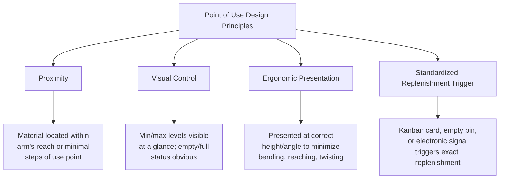
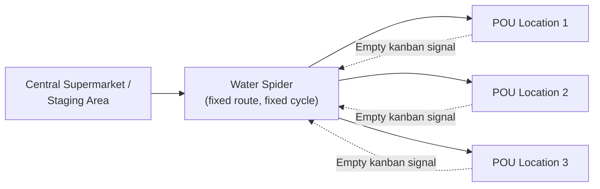

## Point of Use Storage and Delivery Design

### Overview

Point of Use (POU) storage refers to positioning materials, components, and tools directly at the location where they are consumed in the production process, rather than in a centralized warehouse or stockroom that requires operators or material handlers to travel to retrieve them. POU delivery design extends this principle to the replenishment mechanism itself — designing how materials arrive at that point of use so that operators never need to leave their work area, search for parts, or interrupt value-added work to manage inventory. Together, POU storage and delivery are the physical/spatial implementation layer that makes kanban pull signals and milk-run logistics operationally real at the workstation level, and they represent one of the most direct, visible eliminations of *motion* and *waiting* waste on the shop floor.

### Why Point of Use Matters

Without POU design, common non-value-added activities emerge even in an otherwise well-run process:

- **Motion Waste**: Operators walk to a central stockroom to retrieve parts, consuming time that adds no value to the product.
- **Waiting Waste**: Production stops or slows while an operator or material handler searches for or waits for parts.
- **Inventory Waste (Excess/Hidden)**: Centralized storage often leads to larger batch withdrawals "to avoid another trip," increasing WIP at the workstation and obscuring actual consumption rates.
- **Defect Risk from Wrong-Part Selection**: A centralized stockroom serving multiple work areas increases the risk of an operator retrieving the wrong part number, especially under time pressure.
- **Lost Visual Control**: When material is stored away from the point of consumption, abnormal consumption patterns (a part running out unexpectedly, a part not being used at all) are far less visible to supervisors doing a Gemba walk than when the material sits directly at the workstation with visual min/max indicators.

### Core Design Principles

**1. Proximity**: Material is positioned as close as physically possible to where it is consumed, ideally requiring no more than a short reach or a single step — the goal is elimination of walking, not merely reduction.

**2. Visual Control**: The storage location itself communicates status without requiring inventory system lookup — a partially empty bin, a visible min/max marker line, or a kanban card position should make "do we need to reorder" instantly apparent to anyone walking by, reinforcing the visual management principles discussed in visual performance board design.

**3. Ergonomic Presentation**: Parts are presented at a height and angle that minimizes bending, reaching overhead, or twisting — directly addressing both ergonomic injury risk (a Safety metric in SQDCM) and cycle-time efficiency.

**4. Standardized Replenishment Trigger**: Every POU location has a clearly defined signal (kanban card, empty container, min/max visual line, electronic sensor) that unambiguously triggers replenishment — ambiguity in when to reorder is itself a source of both stockouts and excess inventory.

### Common Point of Use Storage Mechanisms

| Mechanism | Description | Typical Application |
| --- | --- | --- |
| **Two-bin system** | Two containers of the same part; when the front bin empties, it's pulled to signal replenishment while the rear bin is consumed | Small fasteners, common hardware, high-frequency low-cost items |
| **Gravity flow rack (flow rack)** | Angled shelving where containers slide forward by gravity as front containers are emptied, presenting the next container automatically at the pick face | Line-side component presentation in assembly |
| **Kanban square / marked floor location** | A marked, sized floor or shelf area indicating the exact quantity/location for a specific part; an empty square signals replenishment need | WIP between processes, larger or palletized components |
| **POU carts / mobile racks** | Wheeled racks pre-kitted with the exact parts needed for a specific job or shift, delivered directly to the workstation | Low-volume, high-mix production where SKU variety at a fixed location is impractical |
| **Vertical carousels / automated storage** | Motorized storage bringing the needed bin to an access window on operator request | High SKU-count environments where full line-side presentation of every part is physically impossible |
| **Point-of-use vending/dispensing** | Controlled-access dispensing units (common for tooling, PPE, or higher-cost consumables) that track usage electronically | Items requiring usage tracking or cost control alongside POU convenience |

### Sizing Point of Use Locations

POU storage quantity is directly derived from the same kanban logic covered previously, applied at the workstation level rather than the supplier level:

$$\text{POU Container Size} = \frac{\text{Replenishment Cycle Time} \times \text{Consumption Rate}}{\text{Number of Containers in Rotation}}$$

**Example Calculation:**

A workstation consumes a component at 30 units/hour. The internal material handler replenishment route (a "water spider" route, covered below) cycles every 45 minutes.

$$\text{Minimum Buffer Needed} = 30 \text{ units/hr} \times 0.75 \text{ hr} = 22.5 \text{ units} \rightarrow 23 \text{ units (rounded up)}$$

With a two-bin system, each bin should hold at least this quantity so that the second bin covers consumption for one full replenishment cycle while the empty bin is being refilled — undersizing the bin relative to the replenishment cycle risks a stockout before the next scheduled replenishment arrives.

**Key Points**

- POU container sizing should be based on the *actual* replenishment cycle time achievable by material handling (the "water spider" route time), not an aspirational or assumed cycle time — a mismatch here is a common root cause of line-side stockouts even in an otherwise well-designed POU layout.
- Container size is a direct trade-off between line-side space consumption (smaller containers, more frequent replenishment, better flow) and material-handling labor efficiency (larger containers, less frequent trips, more line-side space consumed) — this mirrors the milk-run frequency trade-off at a smaller physical scale.

### The Water Spider (Mizusumashi) Role

A **water spider** (mizusumashi) is a dedicated material handler responsible for replenishing multiple point-of-use locations on a fixed route and cycle, functionally the internal-plant equivalent of an external milk run.

**Design characteristics:**

- **Fixed route, fixed cycle time**: Like an external milk run, the water spider follows a standardized route at a defined frequency, rather than responding ad hoc to requests — ad hoc "runner" responses to shouted requests reintroduce variability and waiting that a standardized route eliminates.
- **Standardized work for the route**: The water spider's route, stops, and tasks are documented as standard work, just as a production operator's tasks would be, since consistency in replenishment timing is what allows POU container sizes to be minimized safely.
- **Decoupling operators from material handling**: By removing material replenishment responsibility from production operators, operators remain focused on value-added work, while a specialist role optimizes the (non-value-added but necessary) material movement activity separately.

### Line-Side Layout Considerations

**Example — Line-Side Presentation Design Checklist:**

- Are parts sequenced along the line in the order they are used, minimizing operator reach/search time?
- Is each part's location clearly labeled with part number, matching the labeling used in the kanban/replenishment signal, to prevent picking errors?
- Are high-frequency parts positioned closer/more accessibly than low-frequency parts (a POU application of Pareto-based prioritization)?
- Does the flow-rack or bin angle allow gravity-fed presentation without operator intervention, where applicable?
- Is there a clear visual distinction between "active" and "empty, awaiting replenishment" containers?
- Is POU storage volume kept to the calculated minimum, resisting the tendency to "just add a bit more buffer" that gradually erodes flow and hides true consumption signals?

### POU Design for High-Mix / Low-Volume Environments

Standard POU design (fixed bins for fixed parts) becomes challenging when a line produces high product variety with frequent changeovers, since holding line-side stock for every possible part variant may be physically impractical.

**Adapted approaches:**

- **Kitting**: Rather than storing every part variant line-side, a kit containing only the specific parts needed for the next job/unit is assembled off-line (often by the water spider or a dedicated kitting area) and delivered just before that job begins — shifting variety-handling complexity away from the line itself.
- **Sequenced/JIS (Just-in-Sequence) Delivery**: Parts are delivered to the line in the exact sequence required by the upcoming build schedule, particularly common for large, variant-heavy components (e.g., seats, dashboards in automotive assembly) where holding line-side stock of every variant is impractical due to size or cost.
- **Mobile POU Carts**: Pre-loaded carts specific to a given job travel with or ahead of the job through the line, rather than fixed bins holding every possible variant at every station.

### Common Implementation Pitfalls

- **Undersized Replenishment Cycle Relative to Container Size**: As noted above, a mismatch between water-spider cycle time and container sizing is a frequent, avoidable root cause of stockouts.
- **POU Sprawl Without Discipline**: Over time, operators or supervisors add "just in case" extra containers at the point of use, gradually reintroducing the excess inventory and reduced visual clarity that POU design was meant to eliminate — periodic layout audits (tied to 5S discipline) are needed to prevent this drift.
- **Inconsistent Labeling Between POU Bins and Kanban Signals**: If the part number or label on a POU bin doesn't precisely match the kanban card or replenishment system record, picking errors and replenishment mismatches result.
- **Ignoring Ergonomics in Pursuit of Density**: Maximizing how many part numbers fit line-side can conflict with ergonomic presentation (forcing awkward reach angles); safety and quality metrics should be reviewed alongside space-efficiency metrics when evaluating a POU layout.
- **Water Spider Route Instability**: If the water spider's route is not treated as disciplined standard work (e.g., handlers deviate from the route to handle ad hoc requests), replenishment timing becomes unpredictable, undermining the lead-time assumptions in POU container sizing.

### Worked Example — Redesigning a Line-Side Storage Area

**Scenario**: An assembly line currently has operators walking approximately 40 meters round-trip to a central stockroom every 20 minutes to retrieve small hardware components, consuming an estimated 12% of available cycle time in non-value-added motion.

**Redesign process**:

1. **Identify consumption rate**: Measure actual hourly consumption for each hardware part at the workstation.
2. **Select POU mechanism**: Given the small size and high frequency of hardware items, select a two-bin gravity flow rack mounted directly at the workstation.
3. **Establish water spider route**: Assign a material handler a fixed route covering this and adjacent workstations, with a target cycle time of 30 minutes based on achievable walking/replenishment time across all stops on the route.
4. **Size containers**: Using the sizing formula above, calculate the minimum bin quantity needed to cover consumption for one full 30-minute water-spider cycle, plus an appropriate safety margin.
5. **Implement visual kanban signal**: Install a simple empty-bin-triggers-refill system (physical bin removed and placed in a designated "needs refill" slot the water spider checks each pass).
6. **Measure motion waste elimination**: Re-time the operator's cycle post-implementation to confirm the walking/searching time previously spent has been converted to value-added or at minimum eliminated as waste, and verify no new stockouts have emerged from the redesigned replenishment cycle.
7. **Institute periodic audit**: Add line-side POU layout review to the standard 5S/Gemba walk checklist to catch inventory creep or labeling drift over time.

### Related Topics

- Kanban system design and calculation
- Water spider (mizusumashi) standard work design
- 5S workplace organization
- Extending kanban and pull systems to suppliers
- Milk runs and synchronized logistics routing
- Just-in-Sequence (JIS) delivery for high-variant components
- Ergonomics and workplace safety in line design
- Standard work documentation