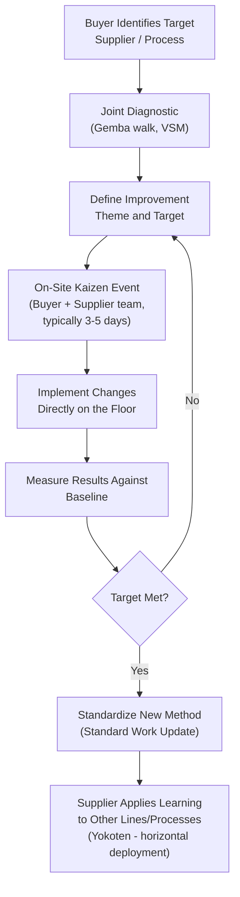

## Joint Kaizen and Supplier Development Programs

### Overview

Joint kaizen and supplier development programs are the operational mechanism through which the supplier partnership philosophy is put into practice: rather than simply specifying performance requirements and auditing compliance, the buyer actively invests its own improvement expertise, personnel, and sometimes capital into raising a supplier's process capability. This is the practice that most directly distinguishes a partnership-oriented supply chain from an arm's-length one, since sending an improvement team to a supplier's facility is an investment that only makes economic sense if the buyer expects to retain that supplier over a long horizon. Toyota's *jishuken* (自主研, "self-study" or autonomous study) program is the most extensively documented example and provides the reference architecture most modern supplier development programs are modeled on or benchmarked against.

### Why Buyers Invest in Supplier Capability Directly

- **Total Value Stream Optimization**: A defect, delay, or cost inefficiency at a supplier eventually surfaces as a defect, delay, or cost impact at the buyer's own line — the supplier's process capability is effectively part of the buyer's own value stream, not a separable external concern.
- **Faster Improvement Than Audit-and-Penalize**: Detailed inspection and penalty-based supplier management identifies problems after they occur; joint kaizen aims to build the supplier's own root-cause and problem-solving capability so future problems are prevented or caught earlier.
- **Leveraging Buyer Expertise Where the Supplier Lacks It**: Smaller or less mature suppliers may not have in-house Lean/continuous-improvement expertise; the buyer's investment transfers capability the supplier could not easily develop alone.
- **Building Trust That Reinforces the Partnership Model**: Direct capability investment is itself a costly, hard-to-fake signal of long-term commitment, reinforcing the relational trust discussed in supplier partnership philosophy and keiretsu structures.

### The Jishuken Model — Reference Architecture

**Key phases:**

1. **Target Identification**: The buyer selects which suppliers and which specific processes warrant direct improvement investment, typically prioritized by strategic importance (see Kraljic-style segmentation) and by where current performance gaps have the greatest impact on the buyer's own value stream.
2. **Joint Diagnostic**: A cross-functional team (buyer improvement specialists + supplier engineers/operators) conducts a Gemba walk and often a Value Stream Map of the specific process, establishing a factual baseline rather than relying on reported metrics alone.
3. **Improvement Theme Definition**: A specific, measurable target is set (e.g., "reduce changeover time on Line 3 from 45 minutes to 15 minutes") — narrow enough to be addressed in a focused event, not an open-ended general improvement mandate.
4. **On-Site Kaizen Event**: A time-boxed, intensive event (often 3–5 days) where the joint team implements changes directly on the shop floor — this is deliberately hands-on and action-oriented rather than a report-writing or recommendation exercise.
5. **Result Measurement**: Before/after data is collected against the baseline to confirm the improvement actually achieved the target, not merely that activity occurred.
6. **Standardization**: Successful changes are captured as updated standard work, ensuring the improvement persists after the kaizen team leaves rather than reverting once external attention fades.
7. **Yokoten (Horizontal Deployment)**: The supplier is expected to apply the learning independently to other similar lines or processes without requiring the buyer's team to repeat the full intervention at every location — this is a key mechanism for scaling capability transfer efficiently, and specifically what distinguishes long-term capability building from a one-off intervention.

### Types of Supplier Development Interventions

| Intervention Type | Description | Typical Duration |
| --- | --- | --- |
| **On-site kaizen event (jishuken-style)** | Intensive, focused, hands-on improvement event on a specific process | 3–5 days |
| **Lean fundamentals training** | Classroom/workshop training in core tools (5S, standard work, visual management, basic problem-solving) | 1–3 days, often repeated for multiple supplier staff |
| **Guest engineer placement** | Supplier engineer embedded in the buyer's product development team during a new program | Weeks to months, spanning a development program |
| **Quality system development** | Buyer supports supplier in building SPC capability, error-proofing (poka-yoke), or formal quality management systems | Multi-month, phased |
| **Capacity/capital planning support** | Buyer provides technical input on equipment selection or capacity investment decisions to ensure alignment with buyer's future volume needs | Project-specific, tied to capital cycles |
| **Supplier association / shared learning forum** | Periodic multi-supplier gathering for cross-pollination of best practices (see keiretsu supplier associations) | Ongoing, quarterly/periodic cadence |

### Structuring a Supplier Development Program

**Example — Program Governance Structure:**

- **Executive sponsorship**: Senior leadership commitment on both sides, since resource allocation (buyer specialist time, supplier production downtime for kaizen events) requires priority above routine operations.
- **Dedicated supplier development function**: Larger buyers often maintain a formal Supplier Development or Supplier Quality Engineering group whose job is specifically to plan and execute these interventions, distinct from routine purchasing/procurement staff.
- **Supplier scorecard integration**: Development priorities are informed by an ongoing supplier scorecard (quality, delivery, cost, responsiveness) reviewed jointly, not used punitively — the scorecard identifies *where* development investment would have the greatest impact, rather than serving primarily as a penalty mechanism.
- **Investment prioritization criteria**: Since buyer improvement resources are finite, criteria are needed for selecting which suppliers/processes receive direct investment (e.g., strategic importance, current performance gap size, supplier's demonstrated willingness to engage and sustain improvements).

### The Role of Cost-Sharing in Joint Kaizen

Supplier development can involve financial cost-sharing beyond specialist time investment, particularly for capital-intensive improvements:

$$\text{Net Buyer Benefit} = \Delta\text{Quality/Delivery Improvement Value} - (\text{Buyer's Share of Investment} + \text{Specialist Time Cost})$$

**Example — Cost-Sharing Arrangements:**

| Arrangement | Description |
| --- | --- |
| Buyer absorbs specialist time fully | Common for smaller interventions (kaizen events, training) where the buyer's own staff time is the primary cost |
| Shared capital investment | For larger equipment/tooling upgrades, buyer and supplier may split cost, particularly when the improvement primarily benefits the buyer's specific parts |
| Savings-sharing formula (gainshare) | Cost reductions resulting from joint kaizen are shared between buyer and supplier per a pre-agreed formula, similar in spirit to the target-costing savings-sharing discussed in supplier partnership philosophy |
| Supplier self-funded with buyer technical support only | Buyer provides expertise/training but supplier bears implementation cost — appropriate when supplier has adequate capital access but lacks technical capability |

[Inference] The choice of cost-sharing arrangement is generally driven by whether the improvement benefit accrues primarily to the buyer (favoring buyer-funded or shared investment) or is a general capability improvement that benefits the supplier's broader business including other customers (favoring supplier self-funding with buyer technical support) — though in practice this line is often negotiated case-by-case rather than governed by a fixed formula.

### Measuring Supplier Development Program Effectiveness

**Example — Program-Level Metrics:**

| Metric Category | Example Metrics |
| --- | --- |
| Direct process improvement | Changeover time reduction, defect rate reduction, cycle time improvement at the specific intervention site |
| Capability transfer / sustainment | Percentage of improvements still in place (audited) 6–12 months after the kaizen event, absent continued buyer presence |
| Horizontal deployment (yokoten) | Number of additional lines/processes at the supplier where the technique was independently applied without buyer involvement |
| Supplier engagement | Supplier-initiated improvement suggestions or requests for further joint development (a leading indicator of genuine capability adoption vs. compliance-only participation) |
| Aggregate supply base impact | Overall trend in supplier scorecard performance (quality, delivery) across the supplier base receiving development investment, versus those not receiving it |

**Key Points**

- The **sustainment metric** (improvements still in place after the buyer's team has left) is arguably the most important indicator of genuine capability transfer versus a temporary, buyer-dependent fix — a kaizen event that produces excellent Day 1 results but reverts within months indicates the standardization and supplier ownership steps of the jishuken cycle were insufficiently executed.
- Horizontal deployment (yokoten) activity occurring *without* buyer prompting is a strong signal the supplier has internalized the improvement methodology itself, rather than merely complying with a specific buyer-directed change.

### Common Implementation Challenges

- **Supplier Perceives Intervention as Punitive Audit**: If prior interactions with the buyer have been primarily inspection/penalty-based, a supplier may initially distrust a kaizen team's intent, requiring explicit relationship-building before genuine collaboration is possible — this is a direct consequence of the trust-dependency discussed in supplier partnership philosophy.
- **Resource Constraints on the Buyer Side**: Genuine on-site kaizen investment requires the buyer to dedicate skilled improvement specialists' time away from internal projects; under-resourcing this function relative to the number of suppliers needing development limits program scale and impact.
- **Lack of Follow-Through on Standardization**: Kaizen events that end without formal standard-work updates and a defined sustainment audit plan are prone to regression once the intensity of the event passes.
- **Uneven Investment Across the Supplier Base**: Concentrating development investment on a few strategic suppliers while neglecting others can leave weak links elsewhere in the supply chain — the overall supply chain's resilience depends on its weakest node, not only its most-invested-in one.
- **IP and Confidentiality Concerns**: Suppliers serving multiple buyers/competitors may be reluctant to share detailed process data or cost information with one buyer's kaizen team, requiring careful scoping of what information exchange is expected during joint improvement activities.
- **Sub-Tier Blind Spots**: Development investment at a Tier 1 supplier does not automatically extend to that supplier's own Tier 2/3 sub-suppliers, potentially leaving upstream capability gaps that Tier 1 improvement alone cannot resolve — echoing the sub-tier dependency risk discussed for kanban and keiretsu structures.

### Worked Example — Structuring a Joint Kaizen Event

**Scenario**: A buyer identifies that a strategic Tier 1 supplier's changeover time on a shared production line is 90 minutes, well above the buyer's own internal standard of under 20 minutes for comparable equipment, contributing to the supplier's inconsistent delivery performance.

**Program design**:

1. **Diagnostic phase**: Buyer's Lean specialists and supplier's engineers jointly conduct a video-timed study of the current changeover, categorizing steps as internal (machine stopped) versus external (can be done while running) — the standard first step of SMED (Single-Minute Exchange of Die) analysis.
2. **Target setting**: Joint team sets an initial target of 30 minutes (a meaningful but achievable first-phase reduction, with 20 minutes or below as an eventual goal after multiple iterations).
3. **On-site kaizen event**: A 4-day event where the joint team converts identified internal steps to external steps, standardizes tooling positioning, and implements simple visual aids — implementing changes directly rather than only producing recommendations.
4. **Measurement**: Post-event changeover is timed across multiple repetitions to confirm the improvement is real and repeatable, not a single best-case result.
5. **Standardization**: New changeover procedure is documented as updated standard work at the supplier, with training provided to all shifts, not only the shift present during the kaizen event.
6. **Sustainment audit**: Buyer schedules a follow-up visit at 90 days to confirm the new changeover time is being sustained across all shifts and has not regressed.
7. **Yokoten planning**: Supplier is encouraged and supported (with lighter-touch buyer involvement) to apply the same SMED technique to other changeover-heavy lines at the same facility, extending the capability without requiring a full repeat intervention.

### Related Topics

- Jishuken and Toyota's supplier development history
- Supplier partnership philosophy versus arm's-length sourcing
- The keiretsu model and its modern adaptations
- SMED (Single-Minute Exchange of Die) methodology
- Yokoten (horizontal deployment) of improvements
- Supplier scorecards and performance measurement systems
- Target costing and gainshare arrangements
- Value Stream Mapping for joint buyer-supplier diagnostics