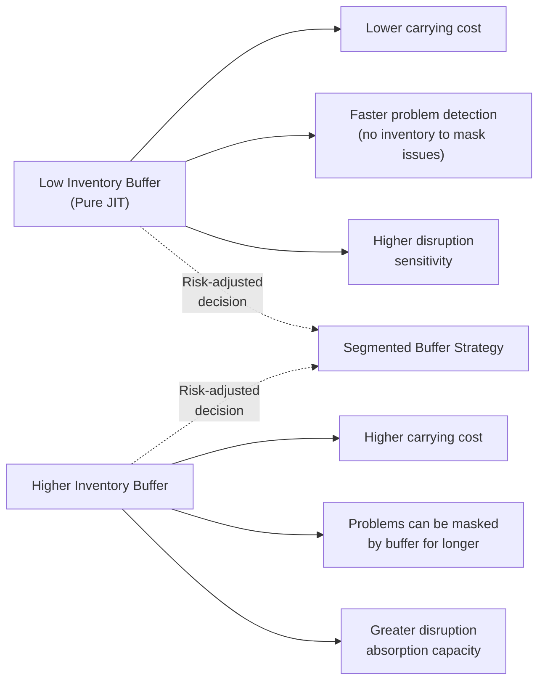
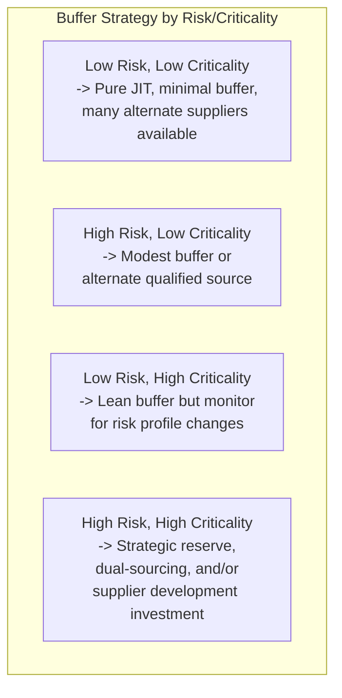

## Balancing Just-in-Time Efficiency with Supply Risk

### Overview

Just-in-Time (JIT) production is designed to minimize inventory by synchronizing supply to actual demand, delivering exactly what is needed, exactly when needed, in exactly the quantity needed. This efficiency comes with an inherent trade-off: the same low-buffer design that eliminates waste also reduces the system's slack to absorb disruption. A supply interruption that a high-inventory system might absorb unnoticed can halt a JIT-run production line within hours. Balancing JIT efficiency against supply risk is therefore not a matter of choosing one philosophy over the other, but of deliberately and selectively deciding where low-buffer JIT logic is appropriate and where resilience investments are justified, based on the actual risk and criticality profile of each part, supplier, and geography.

### The Fundamental Trade-off

**Key Points**

- A core Lean principle is that inventory buffers *hide* problems (a machine's true reliability, a supplier's true variability) — this is precisely why lean systems deliberately run with minimal buffer, since exposing problems is what drives their resolution. Under pure efficiency logic, more buffer is a symptom of unresolved process instability, not a legitimate risk-management tool.
- Under supply-risk logic, however, some disruptions originate from causes entirely outside the buyer's or even the supplier's process control (natural disasters, geopolitical events, single-source capacity loss) — buffer against *these* categories of risk is not masking a fixable internal process problem, and eliminating it entirely can leave an organization dangerously exposed.
- The resolution is not "more buffer is always better" or "less buffer is always better," but distinguishing which risks are process-improvable (where buffer reduction is the correct long-term response) from which are genuinely exogenous (where some buffer or redundancy is a rational risk-management investment).

### Categorizing Supply Risk

Not all supply risks warrant the same response. A useful distinction:

| Risk Category | Description | Example | Appropriate Response |
| --- | --- | --- | --- |
| **Process variability risk** | Supplier's own quality/delivery inconsistency due to immature or unstable processes | Frequent late shipments from a supplier with unstable internal changeover practices | Address through supplier development / joint kaizen, not buffer — buffer would mask the underlying instability |
| **Demand forecast risk** | Buyer's own demand signal uncertainty causing mismatched supply | Sudden unplanned order spike from an end customer | Address through improved demand signal-sharing and flexible capacity agreements, not solely inventory |
| **Single-source concentration risk** | Reliance on one supplier/facility for a critical component with no qualified alternative | Sole-source semiconductor or specialty material supplier | Address through dual-sourcing, safety stock, or supplier capacity redundancy |
| **Geographic/systemic risk** | Natural disaster, geopolitical disruption, pandemic, transportation network failure | Earthquake affecting a supplier region; port closure | Address through geographic diversification, strategic reserves, and scenario planning |
| **Financial risk** | Supplier's financial instability threatening its ability to continue operating | Supplier facing bankruptcy risk | Address through financial health monitoring and contingency qualification of backup sources |

### Segmented Buffer Strategy (Applying Kraljic-Style Thinking to Risk)

Rather than applying uniform JIT discipline or uniform buffer policy across all purchased items, mature Lean supply chains segment buffer strategy by the same strategic/risk dimensions used in supplier sourcing decisions:

- **Low risk / low criticality items** (e.g., generic hardware with many qualified suppliers): Pure JIT logic applies cleanly — minimal buffer is appropriate since disruption is both unlikely and easily substitutable if it occurs.
- **High risk / high criticality items** (e.g., sole-sourced specialty components essential to the final product): Some combination of strategic safety stock, dual-sourcing, or deep supplier development investment (per the joint kaizen practices) is a rational departure from pure JIT minimalism — not a Lean failure, but a deliberate risk-adjusted design choice.

### Techniques for Managing the Trade-off Without Abandoning JIT Principles

**1. Strategic (Decoupling) Buffers vs. General Safety Stock**

A key technical distinction: a **strategic buffer** is a deliberately sized, specifically justified reserve held against an identified, quantified risk (e.g., "60 days of a sole-sourced casting, sized against the known historical frequency and duration of regional supply disruptions in that supplier's location"). This differs from generalized safety stock accumulated informally "just in case" without an underlying risk analysis — the former is a disciplined risk-management decision; the latter is often simply unaddressed process variability being buffered rather than resolved.

$$\text{Strategic Buffer Quantity} = D \times T_{disruption} \times P_{disruption}\text{-adjusted factor}$$

Where $D$ is daily consumption and $T_{disruption}$ is the target duration of disruption the organization has decided to protect against (informed by historical disruption data and risk tolerance) — this is a deliberate policy decision, not a default fallback.

**2. Dual/Multi-Sourcing for Concentration Risk**

As discussed in supplier partnership philosophy, single-sourcing is often preferred under partnership logic for its relationship and cost benefits, but for genuinely high-criticality, high-risk items, qualifying a second source (even at a smaller allocation percentage, such as 15–20% of volume) preserves most partnership benefits with the primary supplier while providing a tested fallback capability if the primary is disrupted.

**3. Supplier Development to Reduce Process-Variability Risk (Not Just Buffer Against It)**

Where the underlying risk is process instability at the supplier (not an exogenous event), the correct Lean response is investment in the supplier's capability (per joint kaizen and supplier development programs) rather than buffer — this converts a recurring risk into a permanently reduced one, consistent with the Lean preference for root-cause elimination over symptom management.

**4. Geographic and Structural Diversification**

For systemic/geographic risk, diversifying supplier locations (rather than concentrating all sourcing in a single region for cost efficiency) trades some transportation/coordination efficiency for reduced correlated-disruption exposure — a decision that became a widely discussed industry theme following major regional supply disruptions in recent years. [Unverified — specific disruption events, their causal chains, and industry-wide response patterns are complex and vary significantly by sector; general direction is well documented in industry commentary, but specific claims about any named event should be independently verified.]

**5. Demand and Capacity Signal Sharing**

Extending visibility of longer-range demand forecasts to key suppliers (a partnership-model practice) allows suppliers to build in their own flexible capacity or raw-material buffers proactively, reducing the buyer's own need to hold finished-component inventory as the primary risk mitigation tool.

**6. Scenario Planning and Stress Testing**

**Example — Supply Risk Stress-Test Questions:**

- If our single source for Part X were disrupted for 30 days, what is our actual exposure (days of production at risk) given current buffer and lead time to qualify an alternate?
- Which suppliers share a common upstream Tier 2/3 dependency that could create correlated risk we are not currently tracking?
- What is our current visibility into sub-tier supplier concentration, and where are the blind spots (echoing the sub-tier visibility gap discussed under keiretsu and kanban limitations)?

### Illustrative Historical Reference Points

[Inference] Two widely referenced industry episodes are commonly cited in supply chain risk literature as illustrating this trade-off in practice: the 2011 Tōhoku earthquake's impact on automotive supply chains reliant on specialized, geographically concentrated component suppliers, and the semiconductor supply disruptions affecting multiple industries in the early 2020s. Both are frequently cited as prompting broader industry reassessment of pure lowest-buffer JIT policies for genuinely critical, hard-to-substitute inputs. [Unverified — specific causal details, timelines, and the scope of industry-wide policy changes attributed to these events vary across sources and should be independently verified for any analysis requiring precision on a specific company or timeframe.]

### Common Pitfalls in Balancing the Trade-off

- **Treating All Buffer as Waste Without Risk Segmentation**: Applying uniform minimal-buffer JIT discipline to genuinely high-risk, high-criticality items without differentiated analysis can leave an organization dangerously exposed to a foreseeable disruption category.
- **Treating All Buffer as Legitimate Risk Management**: Conversely, allowing buffer to accumulate broadly without rigorous risk-based justification reintroduces the problem-masking effect Lean specifically seeks to avoid, and represents a drift back toward traditional (non-Lean) inventory practices under the guise of "resilience."
- **Static Risk Assessment**: A supplier's risk profile (financial health, geographic exposure, process stability) can change over time; a buffer strategy set once and never revisited becomes misaligned with actual current risk.
- **Ignoring Correlated Risk Across the Supply Base**: Multiple ostensibly independent suppliers may share a common upstream Tier 2/3 dependency (e.g., the same raw material processor), creating hidden correlated risk that a per-supplier risk assessment alone would miss.
- **Overreacting to a Single Disruption Event**: A single disruption can trigger an organization-wide overcorrection toward excessive buffer across the entire supply base, reintroducing significant carrying cost for items where the actual risk does not justify it — the corrective response should be proportionate and risk-segmented, not blanket.

### Worked Example — Risk-Adjusted Buffer Decision

**Scenario**: A manufacturer sources two components: (1) a common electrical connector available from over a dozen qualified global suppliers, and (2) a custom-molded housing available from only one qualified supplier due to specialized tooling investment.

**Analysis and decision**:

1. **Component 1 (connector)**: Low risk (many alternate sources, short qualification time if needed), moderate criticality. Decision: maintain pure JIT kanban-based replenishment with minimal buffer — the risk profile does not justify additional buffer, and doing so would simply add unnecessary carrying cost.
2. **Component 2 (custom housing)**: High risk (single source, specialized tooling means a new supplier would require significant qualification lead time), high criticality (used in the primary product line). Decision: establish a strategic buffer sized against a realistic disruption duration (e.g., estimated time to expedite alternate tooling or qualify a backup supplier), explicitly justified and periodically reviewed — not held indefinitely as an unexamined default, but as a deliberate, quantified risk-management position.
3. **Ongoing monitoring**: Both components' risk classifications are revisited periodically (e.g., annually, or upon a material change such as a new qualified supplier becoming available for Component 2, which would justify reducing the strategic buffer).

### Related Topics

- Supplier partnership philosophy versus arm's-length sourcing
- The keiretsu model and its modern adaptations
- Extending kanban and pull systems to suppliers
- Kraljic Matrix and strategic sourcing segmentation
- Joint kaizen and supplier development programs
- Value Stream Mapping for multi-tier supply chain risk visibility
- Business continuity planning and scenario stress testing
- Dual-sourcing and supplier qualification processes