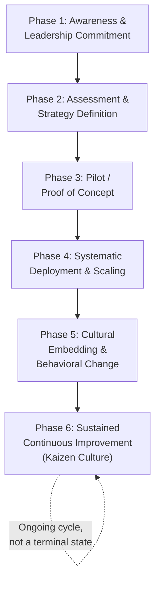

## Common Phases of a Lean Transformation Roadmap

### Overview

A Lean transformation roadmap describes the typical sequence of organizational, cultural, and technical stages an organization moves through when converting from traditional (often batch-and-queue, command-and-control) operations to a Lean operating model. While specific consultants, frameworks, and companies (Toyota's own internal development, the Shingo Institute's model, Lean Enterprise Institute frameworks) describe the phases with different terminology and boundaries, most converge on a recognizable common structure: initial awareness and leadership commitment, pilot-scale proof of concept, systematic tool deployment across the operation, cultural/behavioral embedding, and sustained continuous improvement as a permanent operating discipline. Understanding this phased structure is important because organizations frequently fail not from choosing the wrong tools, but from attempting to skip phases — particularly by jumping to broad tool deployment before establishing the leadership commitment and cultural foundation that later phases depend on.

### The General Phase Sequence

**Key Points**

- This is not a strictly linear, one-time progression — mature organizations continuously cycle through elements of assessment, piloting, and scaling as they address new value streams, new sites, or evolving strategic priorities, and Phase 6 is explicitly meant to be a permanent state rather than an endpoint.
- Organizations frequently underestimate the time required for Phases 5 and 6 relative to Phases 3–4, since tool deployment (visible, schedulable) is easier to plan than cultural change (gradual, harder to measure directly).

### Phase 1: Awareness and Leadership Commitment

**Objective**: Establish genuine, informed leadership understanding of and commitment to Lean as a long-term operating philosophy, not merely a cost-reduction initiative to be delegated to a project team.

**Typical activities:**

- Leadership education (often including visits to mature Lean sites — "Lean study missions" or benchmarking visits)
- Articulation of the business case connecting Lean to specific strategic objectives (not generic "efficiency" framing)
- Explicit executive sponsorship and visible commitment (leaders participating in Gemba walks, not merely authorizing budget)

**Key Points**

- [Inference] A frequently cited failure pattern in the Lean transformation literature is leadership treating the transformation as a delegated initiative (assigning it to a "Lean department" or external consultants) rather than a personal leadership commitment — this is widely identified as a leading predictor of stalled transformations, though the specific relative weight of this factor versus others (resourcing, tool selection, sequencing) is not precisely quantifiable and varies by source and context.
- Genuine leadership commitment at this phase is what enables the harder trade-offs required later (e.g., accepting short-term output disruption during a pilot, allocating specialist time to supplier development, resisting the temptation to declare victory after early wins).

### Phase 2: Assessment and Strategy Definition

**Objective**: Establish a factual baseline of current-state performance and define where Lean transformation effort will be initially focused, avoiding a diffuse "do Lean everywhere at once" approach.

**Typical activities:**

- Current-state Value Stream Mapping of one or more priority value streams
- Baseline metrics establishment (the foundation for later Lean Metrics and Performance Measurement work)
- Strategic alignment via Hoshin Kanri (Policy Deployment), connecting the transformation's goals to overall business strategy rather than treating it as an isolated operational program
- Selection of an initial pilot area based on criteria such as visibility (a good pilot demonstrates credible proof of concept to skeptics), feasibility (a contained scope reduces risk of early failure), and strategic relevance (the pilot should address a genuine business priority, not a token demonstration)

### Phase 3: Pilot / Proof of Concept

**Objective**: Demonstrate Lean principles working in a contained, real operational setting, generating credible evidence and organizational learning before wider commitment.

**Typical activities:**

- Intensive, focused kaizen events in the selected pilot area (5S, standard work, cell design, initial pull system implementation)
- Close measurement of pilot results against the Phase 2 baseline
- Deliberate capture of lessons learned — including what did *not* work, since a pilot's organizational-learning value depends on honest assessment, not selective reporting of successes

**Key Points**

- A pilot's purpose is dual: it must produce genuine operational results, *and* it must generate internal change agents and credible internal case studies that support the subsequent scaling phase — a pilot that succeeds technically but is never effectively communicated internally provides limited transformation value.
- [Inference] Selecting a pilot area with too little inherent difficulty risks producing results that skeptics can dismiss as "that would never work in our harder areas," while selecting an area that is too difficult risks early, visible failure that undermines momentum — pilot selection is frequently identified as a decision requiring careful judgment rather than a formulaic choice.

### Phase 4: Systematic Deployment and Scaling

**Objective**: Extend proven approaches from the pilot across additional value streams, departments, or sites, building the internal infrastructure (people, processes, governance) to sustain deployment beyond what a single pilot team can execute directly.

**Typical activities:**

- Development of internal Lean capability (training programs, internal kaizen facilitators, often a formal "Lean Promotion Office" or continuous improvement function)
- Standardized deployment methodology so that scaling doesn't require reinventing the approach for each new area
- Establishment of the tiered visual performance board and metrics infrastructure across scaled areas (connecting to the Lean Metrics and Performance Measurement chapter's content)
- Extension to supply chain partners where appropriate (connecting to the Lean Supply Chain and Supplier Development chapter's content), though this typically follows internal deployment maturity rather than preceding it

**Key Points**

- Scaling requires a shift from a small, dedicated pilot team doing the improvement work directly to building broader organizational capability to do improvement work — a common failure mode is scaling the *tools* without scaling the underlying *capability*, resulting in superficial tool adoption (visual boards that are updated but not used for genuine problem-solving) rather than genuine capability transfer.

### Phase 5: Cultural Embedding and Behavioral Change

**Objective**: Shift Lean practices from something driven by a project team or initiative into default behavioral norms — how people naturally think about and respond to problems, regardless of whether an active "transformation program" is being managed.

**Typical activities:**

- Leader Standard Work formalizing Gemba walks and coaching behaviors as a normal part of every manager's role, not an occasional special activity
- Shift in performance management and recognition systems to reward problem-surfacing and improvement behavior (directly connecting to the metric-driven dysfunction risks of punishing red-status reporting)
- Development of internal problem-solving capability at all levels (not concentrated solely in a specialist improvement function)
- Revision of organizational structures, incentive systems, and even hiring/promotion criteria to reinforce Lean behaviors structurally rather than relying on ongoing exhortation

**Key Points**

- This phase is widely regarded in the literature as the most difficult and the most frequently underinvested — tool deployment (Phase 4) is often achieved reasonably well by many organizations, while genuine cultural embedding (Phase 5) is considerably rarer, which is frequently cited as the primary distinguishing factor between organizations that sustain Lean gains over the long term and those that experience "Lean backsliding" after initial program intensity fades.
- [Speculation] Some practitioners argue that Phases 4 and 5 should be pursued more simultaneously than sequentially — embedding behavioral expectations from the start of scaling rather than treating culture as a separate, later phase — though this remains a matter of differing practitioner philosophy rather than settled consensus.

### Phase 6: Sustained Continuous Improvement

**Objective**: Reach a state where continuous improvement (kaizen) is a permanent, self-sustaining operating characteristic rather than a program with a defined end date.

**Typical activities:**

- Ongoing tiered metrics review and huddle cadence (per visual performance board design) functioning as routine management practice, not a special initiative
- Continued joint kaizen and supplier development extending the transformation beyond the buyer's own four walls
- Periodic re-assessment and re-prioritization via Hoshin Kanri as strategic priorities evolve, ensuring the transformation doesn't calcify around its original pilot-phase priorities indefinitely
- Formal or informal maturity assessment (e.g., against frameworks such as the Shingo Model) to identify where further development is still needed even in a mature transformation

**Key Points**

- A genuinely mature Lean organization does not describe itself as having "completed" a Lean transformation — the framing shifts from "transformation project" to "how we operate," which is itself often used as an informal indicator of whether Phase 5/6 has been genuinely reached versus merely claimed.

### Common Roadmap Failure Patterns

| Failure Pattern | Description | Typical Root Cause |
| --- | --- | --- |
| **Tool-first deployment** | Introducing 5S, kanban, and visual boards broadly before establishing leadership commitment or cultural foundation | Skipping or under-investing in Phase 1 |
| **Perpetual pilot** | Pilot area shows strong results but scaling never meaningfully proceeds | Insufficient capability-building investment for Phase 4, or loss of leadership attention after initial pilot success |
| **Program fatigue / initiative overload** | Lean transformation treated as one of several competing corporate initiatives, losing priority as new initiatives are launched | Lack of genuine strategic integration (Hoshin Kanri linkage) connecting Lean to core business strategy rather than treating it as a parallel program |
| **Backsliding after program closure** | Gains achieved during an active transformation program erode once formal program management ends | Phase 5 (cultural embedding) was not genuinely achieved; practices depended on program-driven attention rather than embedded behavioral norms |
| **Metrics without behavior change** | Visual boards and tiered metrics are implemented and updated, but huddles remain compliance rituals rather than genuine problem-solving | Connects directly to metric-driven dysfunction patterns — tools deployed without the underlying cultural/leadership behavior they are meant to support |

### Worked Example — Roadmap Timeline for a Mid-Sized Manufacturer

**Example — Illustrative (not universally fixed) Phase Timeline:**

| Phase | Illustrative Duration | Key Milestone |
| --- | --- | --- |
| 1: Awareness & Commitment | 2–4 months | Executive team completes Lean study mission; business case approved |
| 2: Assessment & Strategy | 1–2 months | Current-state VSM complete; pilot area selected; baseline metrics established |
| 3: Pilot | 3–6 months | Pilot area demonstrates measurable improvement against baseline; internal case study documented |
| 4: Systematic Deployment | 12–24 months | Lean Promotion Office established; tiered visual boards deployed across primary value streams |
| 5: Cultural Embedding | 24+ months, ongoing | Leader Standard Work formalized; performance management systems updated to reward improvement behavior |
| 6: Sustained Continuous Improvement | Indefinite/ongoing | Continuous improvement is described internally as "how we operate," not as a program |

[Inference] These durations are illustrative and vary substantially by organization size, starting culture, industry, and leadership consistency; specific published benchmarks for phase duration are not standardized across the practitioner literature, so any timeline should be treated as directional rather than prescriptive.

### Related Topics

- Hoshin Kanri (Policy Deployment) and strategy alignment
- Value Stream Mapping (current-state and future-state)
- Leader Standard Work and Gemba walk discipline
- Designing visual performance boards and tiered metrics
- Avoiding metric-driven dysfunction
- The Shingo Model and Lean maturity assessment frameworks
- Change management theory applied to operational transformations
- Joint kaizen and supplier development programs