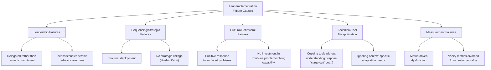

## Common Reasons Lean Implementations Fail

### Overview

Despite decades of documented success stories, a substantial proportion of Lean implementations fail to achieve sustained results, with many organizations reporting initial gains that erode within a few years or tool deployments that never progress beyond superficial adoption. Understanding common failure patterns is as important as understanding the roadmap phases themselves, since most failures are not failures of technical knowledge (organizations generally know *what* 5S, kanban, and value stream mapping are) but failures of sequencing, leadership behavior, and cultural sustainment. This document catalogs the most frequently cited failure patterns in the Lean transformation literature, organized by root cause category.

### Failure Taxonomy

### Leadership Failures

**1. Delegated Rather Than Owned Commitment**

Perhaps the most frequently cited failure pattern: senior leadership authorizes a Lean initiative, assigns it to a "Lean department," consultant, or improvement team, and treats it as a delegated operational program rather than a personal leadership responsibility. This directly undermines the leadership commitment foundation described as Phase 1 of the transformation roadmap.

- **Symptom**: Leaders can articulate the Lean initiative's existence but cannot describe specific process problems currently being worked on in their own areas.
- **Consequence**: When trade-offs arise (a pilot requiring short-term output disruption, a supplier development investment requiring specialist time reallocation), delegated leadership lacks the conviction to defend the investment against competing short-term pressures.

**2. Inconsistent Leadership Behavior Over Time**

Leaders who visibly champion Lean during a launch period but revert to command-and-control, results-only management once initial pressure or novelty fades send a strong signal that the transformation was situational rather than a genuine change in operating philosophy.

**3. Leadership Impatience for Results**

Lean transformations, particularly the cultural embedding phase, require a multi-year horizon; leadership expecting dramatic financial results within a single fiscal quarter or two frequently abandons or deprioritizes the effort before Phase 5/6 maturity is reached, capturing only the more superficial Phase 3/4 gains before losing patience.

**4. Failure to Model Gemba-Based Leadership**

Leaders who manage exclusively from reports and dashboards, without regularly walking the actual process (Gemba), lose the direct, factual understanding of process reality that credible Lean leadership requires — this also undermines the "management by sight" principle central to visual performance board design, since a leader disconnected from the Gemba cannot meaningfully interpret what a visual board is showing.

### Sequencing and Strategic Failures

**1. Tool-First Deployment**

Introducing 5S, kanban, and visual management broadly across the organization before establishing genuine leadership commitment or cultural readiness — as identified in the transformation roadmap's common failure patterns — produces superficial adoption (boards exist, kanban cards exist) without the underlying behavioral change that gives these tools their actual value.

**2. Lack of Strategic Integration (Hoshin Kanri Disconnect)**

When Lean is treated as a parallel operational improvement program rather than being explicitly linked to core business strategy via Hoshin Kanri (Policy Deployment), it competes for organizational attention against other initiatives and is the first to be deprioritized when resource constraints emerge, since it is not perceived as integral to strategic success.

**3. "Big Bang" Deployment Without Piloting**

Attempting to deploy Lean practices across an entire operation simultaneously, skipping the pilot/proof-of-concept phase, denies the organization the contained learning opportunity a pilot provides and multiplies the consequences of early implementation mistakes across the whole operation rather than containing them.

**4. Copying a Specific Company's Practices Without Adapting to Context**

Directly importing specific practices (e.g., a particular andon system design, a specific kanban card format) from a benchmarked company (frequently Toyota) without adapting them to the organization's own product mix, volume, culture, and constraints — sometimes described pejoratively as "cargo cult Lean," implementing the visible form of a practice without the underlying understanding of the problem it was designed to solve.

### Cultural and Behavioral Failures

**1. Punitive Response to Surfaced Problems**

As detailed extensively in metric-driven dysfunction, if raising a problem (pulling an andon cord, reporting a red metric) results in blame rather than support, people rationally stop surfacing problems — this is frequently identified as the single most corrosive cultural failure, since it directly undermines the core mechanism (early problem visibility) that makes Lean systems function.

**2. Insufficient Investment in Front-Line Problem-Solving Capability**

Treating structured problem-solving (5 Whys, A3, root-cause analysis) as a specialist skill reserved for a Lean/continuous-improvement department, rather than building this capability broadly among supervisors and operators, creates a bottleneck where improvement can only occur where specialists are personally involved — severely limiting the pace and scale of genuine continuous improvement.

**3. Compensation and Recognition Systems Misaligned with Lean Behavior**

Performance management systems that continue to reward individual output, utilization, or activity metrics (rather than team-based flow, quality, and problem-solving contribution) create a structural incentive conflict with Lean behavior — as discussed under avoiding metric-driven dysfunction, incentive misalignment reliably undermines even well-designed metrics and tools.

**4. Treating Lean as a Cost-Cutting/Headcount-Reduction Program**

When Lean is introduced explicitly or implicitly as a mechanism for workforce reduction, front-line employees have a direct incentive to resist and conceal waste (since eliminating waste in their own role may appear to threaten their job) rather than surface it — this single framing choice is frequently cited as capable of undermining an otherwise well-designed transformation from the outset.

**5. Loss of Momentum After Early Wins**

Organizations that treat initial pilot or Phase 3/4 successes as evidence of a "completed" transformation, declaring victory and redirecting attention elsewhere, generally see gains erode as ongoing behavioral reinforcement (Phase 5/6) never materializes — the same "backsliding after program closure" pattern identified in the roadmap failure analysis.

### Technical and Tool Misapplication Failures

**1. Applying Tools Without Understanding Underlying Principles**

Implementing kanban card systems, visual boards, or standard work documents as compliance artifacts, without genuine understanding of the pull, flow, and continuous-improvement principles they are meant to serve, produces what is often described as "fake Lean" — the visible trappings without functional benefit.

**2. Ignoring Prerequisite Process Stability**

Attempting to implement kanban, supplier kanban extension, or takt-based flow before achieving basic process stability (consistent cycle times, acceptable quality levels, reliable equipment) results in systems that are immediately overwhelmed by the very variability they were not designed to accommodate — as noted in the supplier kanban and milk-run design content, process stabilization is generally a prerequisite, not something that can be addressed concurrently with pull-system implementation.

**3. Over-Reliance on External Consultants Without Internal Capability Transfer**

Organizations that rely on external consultants to conduct kaizen events and design systems, without deliberately building internal facilitation and problem-solving capability, find that improvement activity stalls or reverses once the consulting engagement ends — mirroring the "sustainment" failure mode discussed in joint kaizen and supplier development programs, but occurring internally rather than at a supplier.

**4. Neglecting IT/ERP System Constraints**

As discussed under Lean Accounting fundamentals, legacy ERP systems architected around standard costing and work orders can create friction with value-stream costing and pull-based operations; organizations that don't anticipate and plan for this friction often find their financial and operational systems working against, rather than reinforcing, the Lean transformation.

### Measurement Failures

**1. Metric-Driven Dysfunction**

As covered extensively elsewhere, poorly designed or punitively managed metrics can actively drive counterproductive behavior (gaming, local suboptimization) rather than genuine improvement — a well-documented and specific failure category in its own right.

**2. Measuring Activity Instead of Outcomes**

Tracking the number of kaizen events held, 5S audits completed, or training sessions delivered, without connecting these activities to actual customer-value outcomes (quality, delivery, cost), can create an illusion of transformation progress that doesn't correspond to genuine operational improvement.

**3. Financial Reporting Misalignment**

When financial performance continues to be reported and evaluated using traditional standard-costing metrics that reward overproduction and utilization (as detailed in Lean Accounting fundamentals), operational teams receive conflicting signals — Lean behavior improves operational metrics while appearing to worsen traditional financial metrics, creating organizational confusion about which signal to trust.

### A Diagnostic Framework for At-Risk Transformations

**Example — Early Warning Indicators of a Failing Implementation:**

| Warning Sign | Underlying Failure Category |
| --- | --- |
| Leadership can't describe specific current process problems in their own area | Delegated commitment |
| Visual boards are updated but huddles rarely result in assigned action items | Metric theater / cultural failure |
| Kaizen events are frequent but post-event sustainment audits show frequent regression | Insufficient standardization / capability transfer |
| Employees express fear about job security when discussing waste elimination | Cost-cutting framing |
| Financial reports and operational metrics tell contradictory stories about performance | Financial reporting misalignment |
| Improvement activity is concentrated entirely within a specialist "Lean team" | Insufficient front-line capability investment |
| Initial pilot results were strong, but 12+ months later no meaningful scaling has occurred | Perpetual pilot / loss of leadership attention |

### Worked Example — Diagnosing a Stalled Transformation

**Scenario**: A manufacturer launched a Lean transformation 18 months ago. 5S and visual boards were deployed across three departments, several kaizen events were held, but recent internal survey data shows declining employee engagement with the program, and departmental performance metrics have plateaued after initial early gains.

**Diagnostic process using the framework above**:

1. **Check leadership behavior**: Interviews reveal senior leaders rarely conduct Gemba walks and primarily review Lean progress via a monthly slide deck — indicating a delegated-commitment failure pattern (Phase 1 foundation was likely never solid).
2. **Check huddle quality**: Observation of daily huddles at the visual boards shows metrics are read aloud but rarely trigger assigned follow-up actions — indicating metric theater rather than genuine problem-solving engagement.
3. **Check incentive alignment**: Review of the performance management system finds individual output-based bonuses unchanged since before the transformation began — a structural incentive conflict undermining team-based flow behavior.
4. **Check sustainment**: A sample of process changes from earlier kaizen events shows roughly half have reverted to prior methods — indicating the standardization step of the kaizen cycle was insufficiently rigorous.

**Corrective priorities identified**: Rather than launching additional kaizen events (which would compound the existing sustainment problem), the diagnosis suggests the organization should first address the leadership engagement gap (reinstating regular Gemba walks) and the incentive misalignment (revising compensation structure), since these foundational issues are likely undermining the value of any further tool deployment until resolved.

### Related Topics

- Common phases of a lean transformation roadmap
- Avoiding metric-driven dysfunction
- Leader Standard Work and Gemba walk discipline
- Hoshin Kanri (Policy Deployment) and strategic alignment
- Lean accounting fundamentals
- Joint kaizen and supplier development programs (sustainment parallels)
- The Shingo Model and Lean culture assessment
- Change management theory and organizational resistance patterns