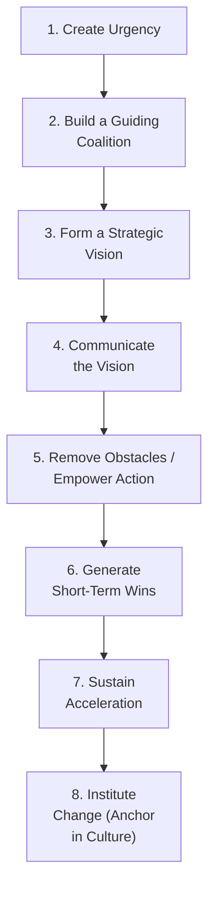
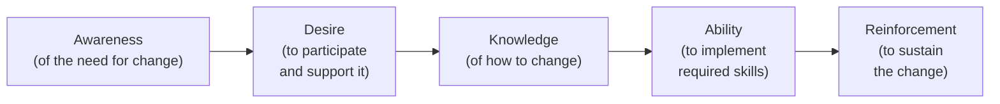
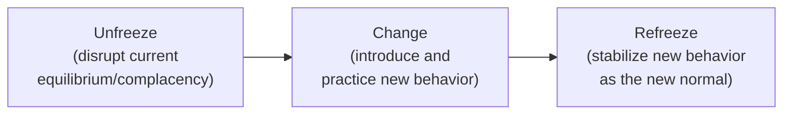

## Change Management Principles for Lean Adoption

### Overview

Lean adoption is fundamentally an exercise in organizational change management, not merely a technical deployment of tools and metrics. The tools of Lean (kanban, 5S, value stream mapping, visual boards) are relatively well-documented and technically straightforward to specify; what determines whether they take root and deliver sustained value is how the surrounding human system — habits, incentives, identity, trust, and power structures — responds to and absorbs the change. This document applies established general change management frameworks (Kotter's model, the ADKAR model, and Lewin's change model) specifically to the context of Lean transformation, connecting them to the failure patterns and roadmap phases already established.

### Why General Change Management Theory Applies to Lean

Lean transformation exhibits the classic characteristics that make change management theory relevant: it requires behavior change from a large number of people simultaneously, it challenges existing power structures and routines (particularly supervisory roles, as decision authority shifts toward front-line problem-solving), it unfolds over a multi-year horizon that outlasts typical organizational attention spans, and — as detailed in common reasons Lean implementations fail — its most consequential failures are behavioral and cultural rather than technical.

### Kotter's 8-Step Model Applied to Lean Transformation

John Kotter's widely referenced organizational change model maps closely onto the Lean transformation roadmap phases, providing a useful complementary lens focused specifically on the change-management mechanics within each phase.

| Kotter Step | Lean Transformation Application |
| --- | --- |
| **1. Create Urgency** | Establishing the business case connecting current-state waste/performance gaps to competitive or financial consequences — the same function served by Phase 1's business-case articulation, but with explicit attention to making the *urgency* emotionally and factually credible, not just stated |
| **2. Build a Guiding Coalition** | Assembling a cross-functional leadership group (not a single Lean champion) with genuine authority and credibility, addressing the "delegated commitment" failure pattern by ensuring multiple senior leaders are visibly and personally invested |
| **3. Form a Strategic Vision** | Articulating what the organization will look like post-transformation in concrete, specific terms — connects directly to Hoshin Kanri's strategic alignment function |
| **4. Communicate the Vision** | Repeated, consistent, multi-channel communication — not a single launch announcement — since infrequent communication is a commonly cited reason employees perceive a change initiative as having "gone quiet" and therefore deprioritized |
| **5. Remove Obstacles / Empower Action** | Addressing structural barriers such as misaligned incentive systems, restrictive job classifications, or approval bottlenecks that prevent front-line staff from acting on improvement ideas |
| **6. Generate Short-Term Wins** | Corresponds to Phase 3 (Pilot/Proof of Concept) — deliberately selecting and showcasing early wins to build credibility and momentum for the harder, longer scaling and culture phases ahead |
| **7. Sustain Acceleration** | Corresponds to Phase 4 (Systematic Deployment) — using early credibility to tackle larger, more difficult scope rather than declaring victory prematurely (directly addressing the "loss of momentum after early wins" failure pattern) |
| **8. Institute Change** | Corresponds to Phase 5/6 (Cultural Embedding and Sustained Continuous Improvement) — anchoring new behaviors into hiring criteria, promotion standards, and everyday leadership practice so they persist independent of the original change program's active management |

**Key Points**

- Kotter's model explicitly warns against skipping steps or declaring victory too early — directly paralleling the "perpetual pilot" and "backsliding after program closure" failure patterns, where organizations effectively stop at Step 6 (short-term wins) without progressing to Steps 7–8.

### The ADKAR Model — Individual-Level Change Adoption

While Kotter's model addresses organizational-level sequencing, the **ADKAR model** (developed by Prosci) focuses on the individual psychological stages a person must pass through to adopt a change, which is useful for diagnosing *why* a specific group or individual is resisting Lean adoption even when organizational-level steps have been followed.

**Diagnostic application to Lean adoption:**

| ADKAR Stage | Gap Symptom in Lean Context | Typical Intervention |
| --- | --- | --- |
| **Awareness** | Employee doesn't understand why current methods are being changed | Communicate the specific business case and connect it to visible current-state problems (ideally ones the employee has personally experienced) |
| **Desire** | Employee understands the rationale but doesn't want to participate (fear, skepticism, or perceived threat) | Directly addresses the "cost-cutting framing" failure pattern — desire is often blocked by legitimate fear of job loss, requiring explicit, credible reassurance and, where relevant, redeployment rather than elimination commitments |
| **Knowledge** | Employee wants to participate but doesn't know how to apply specific tools (5 Whys, standard work documentation, kanban replenishment) | Targeted skills training, connecting to the front-line problem-solving capability investment discussed under implementation failures |
| **Ability** | Employee has knowledge but struggles to apply it under real working conditions (time pressure, unfamiliar tools) | Coaching and practice opportunities, often through structured kaizen events where new skills are applied with support before being expected independently |
| **Reinforcement** | Initial adoption occurs but reverts without ongoing reinforcement | Corresponds directly to the sustainment mechanisms discussed in joint kaizen programs (standardization, follow-up audits) and Leader Standard Work (ongoing Gemba-based coaching) |

**Key Points**

- A critical diagnostic use of ADKAR is recognizing that different individuals or groups within the same organization may be stuck at *different* stages simultaneously — a training program (addressing Knowledge) will not resolve resistance rooted in Desire (fear of job loss), meaning generic, undifferentiated interventions often fail to address the actual blocking stage for a given group.

### Lewin's Three-Stage Model — Unfreeze, Change, Refreeze

Kurt Lewin's classical change model provides a simpler, complementary framing particularly useful for understanding the psychological state required before new behaviors can be introduced.

- **Unfreeze**: Disrupting the comfort of current routines sufficiently that people become genuinely open to a different way of working — this maps to Kotter's "Create Urgency" step and to the honest current-state Value Stream Mapping exercise in Phase 2, which often itself serves an unfreezing function by making waste visible to people who had normalized it.
- **Change**: The active period of trying new behaviors, tools, and routines — corresponds to the pilot and deployment phases, where new practices are actively being learned and practiced, often with some discomfort and reduced short-term efficiency as people move up the learning curve.
- **Refreeze**: Stabilizing the new behavior as the accepted normal way of working, so the organization doesn't naturally drift back to prior habits absent continued active reinforcement — this is functionally equivalent to the "standardization" step in the jishuken kaizen cycle and to Kotter's "Institute Change" step, and its absence is the direct mechanism behind the "backsliding after program closure" failure pattern.

**Key Points**

- [Inference] A frequently noted critique of Lewin's model in modern change literature is that "refreezing" can be interpreted as implying change should stop entirely once stabilized — this sits in some tension with Lean's philosophy of continuous, never-ending improvement (kaizen), and most modern Lean-oriented change practitioners treat "refreeze" as stabilizing a *new baseline for continued iteration*, rather than a genuinely final, permanent end state.

### Addressing Resistance to Change — Common Sources and Responses

**Example — Resistance Source and Response Matrix:**

| Source of Resistance | Underlying Driver | Change Management Response |
| --- | --- | --- |
| Fear of job loss | Legitimate concern, especially if Lean is perceived as headcount reduction | Explicit, credible commitment (backed by action, not just statement) regarding job security implications; redeployment rather than elimination where feasible |
| Loss of status/authority | Supervisors whose traditional command-and-control role is challenged by front-line empowerment | Redefine supervisory role explicitly around coaching and problem-solving facilitation rather than directive control, with corresponding recognition for this new role |
| Skepticism from prior failed initiatives | "Initiative fatigue" from previous programs that didn't sustain | Transparency about what will be different this time, and early, credible wins that visibly differ from past program patterns |
| Genuine technical disagreement | Legitimate concern that a specific practice doesn't fit local context | Distinguish this from generic resistance — genuine technical concerns should be investigated and potentially incorporated, since ignoring valid local knowledge is itself a form of the "cargo cult" tool-copying failure pattern |
| Identity threat | Employees whose sense of professional competence is tied to current methods | Frame the change as building on existing expertise (the person's process knowledge is essential to improving it) rather than replacing or devaluing it |

**Key Points**

- Not all resistance is irrational or should be overcome by persuasion alone — some resistance reflects genuinely valid concerns about a poorly designed or poorly contextualized change, and effective change management includes distinguishing legitimate signal from reflexive resistance, incorporating the former rather than simply working to overcome it.

### Communication Cadence and Change Management

**Example — Multi-Stage Communication Plan Structure:**

| Audience | Frequency | Content Focus |
| --- | --- | --- |
| Executive/senior leadership | Monthly | Strategic progress against Hoshin Kanri objectives, resource decisions needed |
| Middle management/supervisors | Weekly/bi-weekly | Operational specifics, upcoming kaizen events, coaching support needs |
| Front-line employees | Daily (via huddles) + periodic broader updates | Direct connection to their own work area's visual board metrics, recognition of contributions |

**Key Points**

- Communication frequency should generally decrease in formality but increase in immediacy and personal relevance closer to the front line — a front-line employee is generally better served by daily engagement with their own team's visual board than by an infrequent, generic company-wide newsletter about "the Lean transformation."

### Worked Example — Applying ADKAR to Diagnose Supervisor Resistance

**Scenario**: Six months into a Lean deployment, front-line operators have engaged well with new standard work and visual boards, but shift supervisors are visibly disengaged, rarely participating in huddles, and occasionally reverting teams to prior informal practices when not directly observed.

**ADKAR-based diagnosis**:

1. **Awareness check**: Supervisors can articulate the business case accurately — awareness is not the gap.
2. **Desire check**: Interviews reveal supervisors perceive the new model (front-line problem-solving, coaching-based leadership) as reducing their authority and value to the organization — desire is genuinely low, and the root cause is an identity/status threat, not a knowledge gap.
3. **Knowledge/Ability check**: Supervisors have received the same training as operators but have not received specific coaching-skill development for their redefined role — a real gap exists here as well, compounding the desire problem.

**Corrective intervention based on diagnosis**: Rather than repeating general Lean awareness training (which would not address the actual blocking stage), the intervention focuses on (a) explicitly redefining and valuing the supervisor's new coaching-based role, with corresponding recognition and career-path clarity, and (b) providing supervisor-specific coaching-skills training distinct from the operator-level training already delivered — directly targeting the Desire and Knowledge/Ability gaps identified rather than applying a generic, undifferentiated response.

### Related Topics

- Common phases of a lean transformation roadmap
- Common reasons lean implementations fail
- Leader Standard Work and Gemba walk discipline
- Avoiding metric-driven dysfunction
- Hoshin Kanri (Policy Deployment) and strategic alignment
- Kotter's 8-Step Change Model (general management theory)
- ADKAR Model and Prosci change management methodology
- Joint kaizen and supplier development programs (sustainment mechanisms)