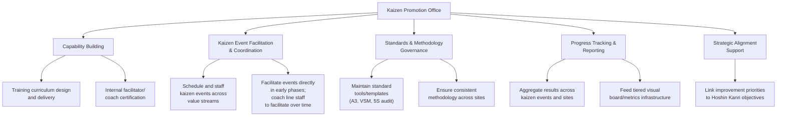

## Building an Internal Kaizen Promotion Office

### Overview

A Kaizen Promotion Office (KPO) — also called a Lean Promotion Office, Continuous Improvement Office, or Operational Excellence function — is the internal organizational unit responsible for building, coordinating, and sustaining an organization's Lean capability across the enterprise. Its emergence typically corresponds to Phase 4 (Systematic Deployment and Scaling) of the transformation roadmap: while a pilot can be run by a small ad hoc team or external consultants, scaling Lean practice across multiple value streams, sites, or business units requires a dedicated internal function with clear mandate, skilled staff, and defined governance. Designing this office well — its scope, authority, staffing model, and relationship to line management — is itself a significant determinant of whether a Lean transformation successfully scales or stalls, as discussed in the transformation failure patterns around "insufficient investment in front-line problem-solving capability."

### Core Functions of a Kaizen Promotion Office

**1. Capability Building**: Designing and delivering training curricula (from basic Lean awareness through advanced facilitator certification), and developing internal coaching capability so that improvement expertise doesn't remain concentrated in a small specialist group indefinitely.

**2. Kaizen Event Facilitation and Coordination**: Scheduling, resourcing, and initially directly facilitating kaizen events across the organization, with a deliberate transition over time toward coaching line managers and supervisors to facilitate their own events (directly addressing the "over-reliance on external consultants without internal capability transfer" failure pattern, but applied to internal reliance on the KPO itself).

**3. Standards and Methodology Governance**: Maintaining consistent tools, templates, and methodology (standard A3 problem-solving formats, VSM conventions, 5S audit criteria) across different sites and value streams, so that improvement work is comparable and transferable across the organization rather than reinventing methodology locally each time.

**4. Progress Tracking and Reporting**: Aggregating kaizen event results, capability development metrics, and broader transformation progress indicators, and feeding this into the tiered visual performance board structure at Tier 3/4 levels.

**5. Strategic Alignment Support**: Working with senior leadership to ensure improvement priorities and resource allocation are explicitly linked to Hoshin Kanri strategic objectives, rather than the KPO independently selecting improvement targets disconnected from business strategy.

### Organizational Placement and Reporting Structure

Where the KPO sits in the organizational chart significantly affects its authority and effectiveness:

| Reporting Structure | Description | Trade-offs |
| --- | --- | --- |
| **Direct report to CEO/COO** | KPO leader reports to the most senior operating executive | Highest authority and visibility signal; requires genuine senior executive engagement to be meaningful rather than symbolic |
| **Embedded within Operations** | KPO reports through the VP of Operations or equivalent | Close operational integration; risk of being perceived as "just another operations initiative" rather than enterprise-wide |
| **Standalone function reporting to a steering committee** | KPO reports to a cross-functional governance body rather than a single executive | Reinforces cross-functional ownership; can suffer from diffused accountability if the steering committee is not genuinely engaged |
| **Embedded within Quality or Engineering** | KPO housed within an existing technical function | Leverages existing technical credibility; risk of the transformation being perceived as a quality-department initiative rather than a broader operating philosophy |

**Key Points**

- [Inference] Regardless of specific reporting line, the KPO's effectiveness is widely considered to depend more on genuine, visible senior leadership engagement (per the leadership commitment principles discussed in transformation failure patterns) than on the specific org-chart placement — a well-placed KPO with disengaged executive sponsors will struggle just as much as a suboptimally placed one with strong sponsorship, though placement can still meaningfully help or hinder in marginal cases.

### Staffing Models

**Example — Common KPO Staffing Approaches:**

| Staffing Model | Description | Best Fit Context |
| --- | --- | --- |
| **Dedicated permanent specialists** | Full-time improvement facilitators/coaches with no other line responsibilities | Larger organizations with sufficient scale to justify dedicated headcount |
| **Rotational assignment** | High-potential operational staff rotate through the KPO for a fixed period (e.g., 18–24 months) before returning to line roles | Builds broad organizational Lean fluency among future leaders; risk of losing institutional KPO knowledge with frequent rotation if not managed carefully |
| **Hybrid core-plus-rotational** | Small permanent core team (maintaining methodology consistency and institutional memory) supplemented by rotational assignees | Balances continuity with broad capability-building; a commonly cited pattern in mature Lean organizations |
| **Distributed embedded coordinators** | Part-time improvement coordinator role embedded within each value stream/department, coordinated by a small central KPO | Suited to organizations wanting improvement ownership to remain close to line management rather than centralized |

**Key Points**

- The rotational model has a specific strategic benefit beyond immediate capability building: staff who rotate through the KPO and later become line managers or executives carry direct, personal experience of Lean methodology into leadership roles, which is frequently cited as a mechanism for building the kind of genuine (rather than delegated) leadership commitment identified as critical in Phase 1 of the transformation roadmap.

### KPO Capability Maturity Levels

**Example — Illustrative KPO Maturity Progression:**

| Maturity Level | Characteristics |
| --- | --- |
| **Level 1: Direct Delivery** | KPO staff personally facilitate nearly all kaizen events; line managers participate but don't lead |
| **Level 2: Coaching Transition** | KPO staff increasingly coach line managers to co-facilitate events, gradually shifting facilitation responsibility |
| **Level 3: Line-Led with KPO Support** | Line managers facilitate their own kaizen events; KPO provides methodology support, training, and cross-site coordination rather than direct facilitation |
| **Level 4: Embedded Capability** | Improvement capability is broadly distributed; KPO's primary role shifts to strategic alignment, advanced methodology development, and cross-organizational learning capture (yokoten) rather than day-to-day facilitation |

**Key Points**

- A KPO that remains permanently at Level 1 (direct delivery) has effectively created a bottleneck — the pace of organizational improvement becomes capped by the KPO's own staffing capacity, directly reproducing the "insufficient investment in front-line problem-solving capability" failure pattern at the KPO level itself, even while nominally being the vehicle meant to build that capability.
- Progression through these levels should be a deliberate, tracked objective of the KPO's own strategy, not an incidental byproduct — a mature KPO explicitly measures and reports on the shift in facilitation ownership from itself to line management over time.

### KPO Governance and the Steering Committee

Larger, more mature Lean organizations typically pair the KPO with a **Lean/Operational Excellence Steering Committee** — a cross-functional senior leadership body that:

- Reviews and approves the KPO's priorities against Hoshin Kanri strategic objectives, ensuring the KPO's activity portfolio stays connected to business strategy rather than pursuing improvement opportunities in isolation
- Allocates resources (budget, headcount, capital) for larger improvement investments that exceed the KPO's own discretionary authority
- Reviews aggregated progress metrics (from the KPO's tracking function) at a cadence consistent with Tier 3/4 tiered metrics review
- Resolves cross-functional prioritization conflicts (e.g., competing kaizen event requests from different value streams with limited KPO facilitation capacity)

### Common Pitfalls in KPO Design

- **KPO as a Silo**: If the KPO operates largely independently of line management, conducting kaizen events as isolated projects rather than embedding ownership with the affected teams, the "over-reliance on external consultants" sustainment failure pattern is effectively reproduced internally — the KPO becomes a substitute for, rather than a builder of, line capability.
- **Perpetual Level 1 Maturity**: As discussed above, a KPO that never transitions facilitation ownership to line management creates a permanent capability bottleneck and signals that Lean remains "the KPO's job" rather than "how we operate" — directly undermining Phase 5/6 cultural embedding.
- **Disconnection from Strategy**: A KPO that independently selects improvement priorities without steering committee alignment to Hoshin Kanri risks investing significant effort in locally interesting but strategically peripheral improvements.
- **Understaffing Relative to Scaling Ambition**: Organizations that scale Lean deployment aggressively (Phase 4) without proportionally growing KPO capacity (whether dedicated or rotational) create a facilitation bottleneck that slows the very deployment the KPO exists to support.
- **Overemphasis on Event Count as a Success Metric**: Measuring KPO effectiveness primarily by the number of kaizen events conducted (an activity metric) rather than sustained outcome improvement and capability transfer (per the measurement failure patterns discussed in implementation failures) can drive the KPO toward volume over depth, undermining sustainment quality.
- **Rotational Staff Turnover Erasing Institutional Knowledge**: A purely rotational staffing model without any permanent core can lose accumulated methodology refinement and historical context each time staff rotate out, unless deliberately mitigated by documentation and a stable core team.

### Worked Example — Establishing a KPO During Phase 4 Scaling

**Scenario**: An organization has successfully completed a pilot (Phase 3) in one value stream and is ready to scale Lean deployment across five additional value streams and two additional sites over the next 18 months.

**KPO design process**:

1. **Define scope and mandate**: Steering committee (newly formed, chaired by the COO) charters the KPO with an explicit mandate covering training delivery, kaizen event facilitation, and cross-site methodology consistency — formally documented to avoid ambiguity about authority.
2. **Select staffing model**: Given the organization's mid-size and desire to build broad leadership capability, a hybrid model is chosen: two permanent KPO specialists (retained from the pilot team, providing institutional continuity) supplemented by four rotational assignees (one per new value stream) serving 18-month rotations.
3. **Establish maturity progression targets**: The KPO commits to an explicit Level 1→3 maturity transition timeline for each new value stream — direct facilitation for the first two kaizen events at each new site, transitioning to line-led facilitation with KPO coaching support by the third event.
4. **Link to Hoshin Kanri**: Improvement priorities for each new value stream are explicitly derived from that value stream's contribution to current-year strategic objectives, reviewed and approved by the steering committee before KPO resource allocation.
5. **Define success metrics**: Rather than tracking kaizen event count alone, the KPO's own performance dashboard includes sustainment audit pass rates (per the joint kaizen sustainment metric), facilitation-ownership transition progress, and value-stream-level operational metric improvement — avoiding the activity-metric pitfall.
6. **Plan for rotational continuity**: Documentation standards are established so that departing rotational staff hand off methodology refinements and site-specific context to incoming staff, mitigating institutional-knowledge loss.

### Related Topics

- Common phases of a lean transformation roadmap
- Common reasons lean implementations fail
- Change management principles for lean adoption
- Hoshin Kanri (Policy Deployment) and strategic alignment
- Joint kaizen and supplier development programs
- Designing visual performance boards and tiered metrics
- A3 problem-solving methodology
- Yokoten (horizontal deployment) of improvements