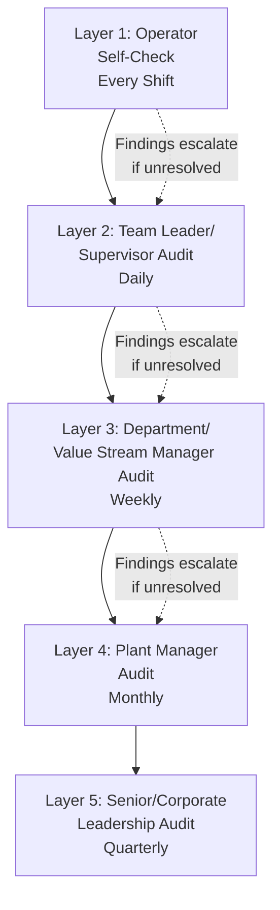
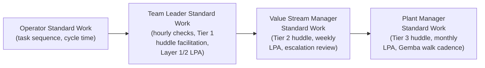

## Sustaining Gains Through Audits and Layered Standard Work

### Overview

Achieving an improvement is only half of the Lean cycle; sustaining it against the natural organizational tendency to drift back toward prior habits is the other, often harder, half — directly addressing the "backsliding after program closure" failure pattern identified in earlier discussions of transformation failure. **Layered Process Audits (LPAs)** and **Layered Standard Work** are the two primary structural mechanisms Lean organizations use to make sustainment a built-in operating discipline rather than a hoped-for outcome. Together they create a system in which conformance to standard work is verified at multiple organizational levels on defined cadences, so that deviation is caught and corrected quickly rather than being discovered only after it has caused a downstream problem.

### The Sustainment Problem

Without deliberate mechanisms, standard work established during a kaizen event tends to erode over time due to several converging pressures:

- **Memory decay**: Operators trained on a new method gradually drift back toward previously ingrained habits, particularly under time pressure.
- **Turnover**: New employees are trained by whoever is available, who may themselves have drifted from the documented standard, compounding deviation across successive training generations.
- **Local "improvements"**: Well-intentioned individual workarounds, made without going through the formal kaizen/standardization process, can accumulate and diverge from the validated standard.
- **Reduced External Attention**: As discussed in the KPO maturity content, once direct facilitation support is withdrawn from a given area, the absence of ongoing verification can allow drift to go undetected until it manifests as a quality or safety problem.

### Layered Process Audits (LPAs)

A Layered Process Audit is a short, focused, high-frequency verification that a specific process is being performed according to its documented standard — "layered" because different organizational levels (operator self-check, supervisor, plant manager, and periodically senior/corporate leadership) each conduct audits at different frequencies, creating overlapping, redundant verification rather than relying on a single audit layer.

**Key Design Principles:**

- **Different Questions at Different Layers**: Each layer typically audits a different, appropriately scoped subset of standards — an operator self-check might cover their own workstation's 5S and safety compliance, while a plant manager's monthly audit samples across multiple areas and includes higher-level questions such as whether Tier 1 escalations are being properly resolved.
- **High Frequency, Short Duration**: LPAs are deliberately brief (often 5–15 minutes) and frequent, rather than lengthy and rare — frequent, lightweight verification catches drift early, before it compounds, consistent with the Lean preference for fast feedback over delayed, comprehensive review.
- **Direct Observation, Not Documentation Review**: LPAs verify actual behavior at the Gemba (is the operator actually following the documented sequence, is the 5S standard actually being maintained) rather than merely checking that a training record or sign-off exists — this distinction is central to the audit's value, since documentation compliance and behavioral compliance can diverge significantly.
- **Immediate Feedback and Correction**: Findings are addressed at the point of discovery where possible (a coaching conversation, an immediate correction) rather than only being logged for later review — this reinforces the "measure the process, not just the person" principle discussed under avoiding metric-driven dysfunction, since the audit's purpose is process reinforcement, not punitive documentation.

### Layered Process Audit Design

**Example — LPA Checklist Structure (Layer 1: Operator Self-Check):**

| Audit Item | Verification Method | Frequency |
| --- | --- | --- |
| Standard work sequence followed for current operation | Direct observation against posted standard work document | Every shift start |
| Required PPE worn correctly | Visual check | Every shift start |
| Workstation 5S condition matches standard (marked locations, no unauthorized items) | Visual comparison to photo standard | Every shift start |
| Point-of-use inventory within min/max visual indicators | Visual check | Every shift start |

**Example — LPA Checklist Structure (Layer 3: Value Stream Manager, Weekly):**

| Audit Item | Verification Method | Frequency |
| --- | --- | --- |
| Sample of Layer 1/2 audit records complete and findings addressed | Record review + spot verification | Weekly |
| Tier 1 huddle escalations resolved within defined SLA | Escalation log review | Weekly |
| Standard work documents current (no undocumented local deviations observed) | Direct observation across sampled workstations | Weekly |
| Kaizen event sustainment audits (per joint kaizen program) up to date for recent events in this value stream | Record review | Weekly |

**Key Points**

- Higher audit layers should include some verification *of the audit process itself* (are Layer 1/2 audits actually being performed and are their findings being addressed), not solely direct process observation — this prevents the audit system itself from becoming a compliance ritual, mirroring the "metric theater" risk discussed under metric-driven dysfunction, but applied to the audit mechanism.

### Layered Standard Work

**Layered Standard Work** extends the concept of standard work (traditionally associated with operator-level task sequences) upward through the management hierarchy, defining the specific, documented, recurring activities expected of supervisors, managers, and executives — most centrally, their audit and Gemba walk responsibilities.

**Example — Illustrative Team Leader Layered Standard Work (Daily):**

| Time | Activity |
| --- | --- |
| Start of shift | Layer 2 LPA on 2 randomly selected workstations |
| Start of shift | Facilitate Tier 1 huddle (SQDCM review) |
| Mid-shift | Gemba walk of full area, verify hour-by-hour tracking chart is current |
| End of shift | Review and update visual board with shift results; log any unresolved escalations |

**Key Points**

- The critical distinguishing feature of layered standard work versus a generic job description is specificity and cadence — "conduct regular Gemba walks" is not layered standard work; "conduct a Layer 2 LPA on two randomly selected workstations at shift start" is. This specificity is what makes the leadership behaviors sustaining the transformation auditable and coachable in the same way operator standard work is.
- Layered standard work for leadership directly operationalizes the "Leader Standard Work" principle referenced throughout the transformation roadmap and change management content — it is the concrete documentation that prevents leadership Gemba engagement from depending on individual discipline or memory alone.

### Integrating LPAs with the Tiered Metrics and Escalation System

LPA findings should feed directly into the same tiered huddle and escalation structure used for operational SQDCM metrics (per visual performance board design), rather than existing as a separate, disconnected audit program:

- A Layer 1 self-check finding an out-of-standard condition is corrected immediately where possible; if it recurs or cannot be immediately resolved, it escalates to the Tier 1 huddle as an abnormality, following the same escalation logic as any other SQDCM finding.
- Aggregated LPA compliance rates (percentage of scheduled audits completed, percentage finding no deviation) become a leading indicator metric on the Tier 2/3 visual boards, alongside — not separate from — the lagging operational metrics they are meant to help sustain.
- A declining LPA compliance trend (audits being skipped or consistently finding deviations) is itself a leading indicator warranting the same kind of root-cause investigation as any other metric trend, per the statistical and diagnostic principles discussed in avoiding metric-driven dysfunction.

### Common Pitfalls in Audit and Layered Standard Work Systems

- **Audit as Punitive Gotcha**: If LPA findings are used to discipline operators rather than to reinforce and coach standard work adherence, the psychological safety principles discussed under metric-driven dysfunction are violated, and operators may begin concealing deviations rather than allowing them to be caught — directly undermining the audit's protective purpose.
- **Checklist Fatigue and Superficial Completion**: Audits that become long, infrequent, and administratively burdensome are prone to being completed as a box-ticking exercise rather than genuine observation — the short, frequent design principle exists specifically to avoid this failure mode.
- **Standards Not Updated After Legitimate Improvement**: If an operator identifies a genuinely better method but it isn't captured through the formal standardization process (per the jishuken kaizen cycle), the LPA system will flag the improved-but-undocumented method as a deviation — creating a perverse disincentive to improve, unless organizations maintain a clear, fast pathway for legitimate standard-work updates.
- **Audit Layers Without Genuine Higher-Level Engagement**: If senior leadership's quarterly audit layer is delegated or performed superficially, the "layered" design's core value — genuine multi-level attention reinforcing that sustainment matters at every organizational level — is undermined, echoing the delegated-commitment failure pattern discussed in transformation failures.
- **Disconnection from the Escalation System**: Running LPAs as a standalone program with separate reporting, rather than integrating findings into the existing tiered huddle and visual board structure, creates redundant administrative burden and misses the opportunity to treat audit findings with the same rigor as other operational abnormalities.

### Worked Example — Designing a Layered Audit System for a New Standard

**Scenario**: A recent kaizen event (per the joint kaizen program cycle) has established a new, faster changeover procedure on a production line, reducing changeover time from 45 to 18 minutes. The organization wants to ensure this gain is sustained rather than eroding over subsequent months, as has happened with prior kaizen events at this site.

**Design process**:

1. **Document the new standard**: The updated changeover sequence is captured as formal standard work, including step-by-step photos/diagrams at the workstation.
2. **Define Layer 1 audit item**: Team leaders add "changeover performed per updated standard sequence, timed" as a specific Layer 2 LPA item, checked at the next scheduled changeover each shift (not every changeover, to keep the audit lightweight, but frequent enough to catch drift early).
3. **Define escalation trigger**: Any changeover exceeding 25 minutes (a threshold with margin above the 18-minute target but well below the prior 45-minute baseline) triggers a Tier 1 huddle discussion, treated as a process abnormality requiring root-cause investigation rather than blame.
4. **Schedule Layer 3 verification**: The value stream manager includes a monthly review of aggregated changeover time data and Layer 2 audit compliance as part of their layered standard work.
5. **Set a formal sustainment audit checkpoint**: Consistent with the joint kaizen sustainment metric, a formal review is scheduled at 90 days post-kaizen-event specifically to confirm the changeover time has been sustained across all shifts, not just the shift present during the original kaizen event.
6. **Establish an improvement-capture pathway**: If an operator identifies a further refinement to the changeover process, a lightweight process is defined for proposing and validating the change before updating the formal standard — preventing the disincentive-to-improve pitfall described above.

### Related Topics

- Common reasons lean implementations fail
- Joint kaizen and supplier development programs (sustainment audit parallels)
- Designing visual performance boards and tiered metrics
- Avoiding metric-driven dysfunction
- Leader Standard Work and Gemba walk discipline
- Building an internal kaizen promotion office
- SMED (Single-Minute Exchange of Die) methodology
- 5S workplace organization and audit standards