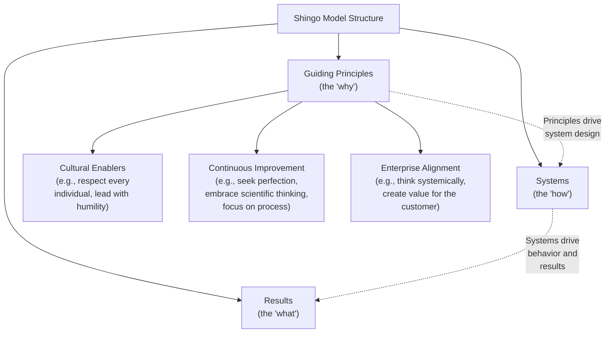
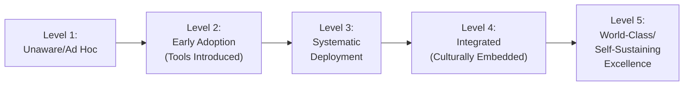

## Lean Maturity Models and Organizational Self-Assessment

### Overview

A Lean maturity model provides a structured framework for assessing how far an organization has progressed in its Lean transformation — not merely which tools have been deployed, but how deeply Lean principles have become embedded in daily behavior, leadership practice, and organizational culture. Maturity models serve a diagnostic function complementary to the roadmap phases and audit mechanisms already discussed: where layered process audits verify conformance to a specific standard, a maturity model assesses the broader, systemic question of how developed the organization's overall Lean operating system has become, typically across multiple dimensions (leadership behavior, process discipline, results, and culture) rather than a single score.

### Why Maturity Assessment Matters

- **Diagnosing Where Investment Is Needed**: An organization strong on Phase 3/4 tool deployment but weak on Phase 5/6 cultural embedding (a common pattern per the transformation failure analysis) can use a maturity model to make this gap explicit and actionable, rather than relying on informal impression.
- **Avoiding Premature Declaration of Success**: Organizations that measure only lagging operational results (which can show short-term improvement even from superficial tool deployment) risk missing that the underlying behavioral and cultural foundation remains fragile — a maturity model that explicitly assesses behavior and culture, not just results, helps guard against this.
- **Benchmarking and External Validation**: Structured maturity frameworks (particularly externally administered ones) provide a basis for comparison against other organizations or against the framework's own defined excellence criteria, offering a check against internally generated overconfidence.
- **Guiding Sequenced Investment**: Most maturity models are structured so that progress at higher levels depends on foundational elements being genuinely in place at lower levels — informing where to focus effort next rather than pursuing advanced practices prematurely.

### The Shingo Model — A Widely Referenced Framework

The **Shingo Model**, developed by the Shingo Institute (Utah State University), is one of the most extensively documented and widely referenced Lean maturity and assessment frameworks, distinctive for its explicit emphasis on the relationship between principles, systems, and results, and its "Guiding Principles" structure.

**Key structural insight of the Shingo Model**: Rather than assessing tools or results in isolation, the model's central premise is that sustainable results emerge from well-designed management systems, which in turn must be genuinely aligned with and driven by ideal guiding principles — an organization that achieves good results through systems not genuinely rooted in these principles (e.g., short-term cost-cutting rather than genuine waste elimination and respect for people) is assessed as less mature, since the results are considered less likely to be sustainable.

**Key Points**

- This principle-driven emphasis directly reflects the "cargo cult Lean" failure pattern discussed earlier — the Shingo Model's assessment methodology is specifically designed to distinguish organizations that have adopted the visible tools of Lean from those where the underlying principles genuinely drive daily behavior, since the model considers this distinction central to whether results will be sustained (connecting to the transformation Phase 5/6 cultural embedding challenge).
- [Unverified] Specific Shingo Prize award criteria, scoring methodology details, and current framework revisions should be verified against the Shingo Institute's own current published materials, as these are periodically updated and specific procedural details are outside the scope of general Lean principles knowledge.

### Common Dimensions Across Maturity Models

While specific frameworks vary in terminology and structure, most Lean maturity assessment approaches evaluate similar underlying dimensions:

| Dimension | What It Assesses | Example Indicators |
| --- | --- | --- |
| **Leadership Behavior** | Whether leaders personally practice Lean behaviors (Gemba walks, coaching, layered standard work) versus delegating them | Leader Standard Work compliance, frequency and quality of leader Gemba engagement |
| **Process Discipline** | Whether standard work, visual management, and pull systems are consistently followed and maintained | LPA compliance rates, standard work currency, visual board update consistency |
| **Problem-Solving Capability** | Whether structured problem-solving (5 Whys, A3, root-cause analysis) is broadly practiced at the front line, not concentrated in specialists | Percentage of front-line staff trained and actively using structured problem-solving tools |
| **Results Sustainability** | Whether operational improvements persist over time rather than reverting | Sustainment audit pass rates over 6–12 month horizons (per joint kaizen and layered audit sustainment metrics) |
| **Culture and Engagement** | Whether continuous improvement is intrinsically valued rather than externally imposed | Employee-generated improvement suggestion rates, survey-based engagement measures, voluntary participation patterns |
| **Strategic Alignment** | Whether improvement activity is genuinely connected to business strategy | Percentage of active kaizen/improvement initiatives explicitly traceable to current Hoshin Kanri objectives |

### Maturity Level Progression — A Generalized Structure

Most maturity models, regardless of specific naming, describe a broadly similar progression:

**Example — Generalized Maturity Level Descriptions:**

| Level | Characteristic Description |
| --- | --- |
| 1: Unaware/Ad Hoc | Little or no formal Lean activity; problem-solving is reactive and inconsistent |
| 2: Early Adoption | Basic tools (5S, visual boards) introduced in pilot areas; activity is program-driven and concentrated in specific projects |
| 3: Systematic Deployment | Tools and practices extended across most of the organization; a KPO or equivalent function coordinates deployment; metrics infrastructure in place |
| 4: Integrated | Lean behaviors are default practice among leadership and front-line staff; layered standard work and audit systems are self-sustaining; problem-solving capability is broadly distributed |
| 5: World-Class/Self-Sustaining | Continuous improvement is described internally as "how we operate," not a program; the organization is a benchmark reference point for others; improvement extends fully into the supply chain (per joint kaizen and supplier development maturity) |

**Key Points**

- This generalized progression maps closely to the transformation roadmap's Phase 1–6 structure, but assesses *depth and sustainability* at a point in time rather than describing a temporal sequence — an organization could, in principle, remain stalled at Level 2 or 3 indefinitely if the failure patterns discussed earlier are not addressed, rather than automatically progressing with time alone.
- Very few organizations genuinely achieve and sustain Level 5 maturity across an entire enterprise; most maturity assessments reveal uneven maturity across different sites, value streams, or dimensions within the same organization, which is itself useful diagnostic information (a plant-wide "Level 3" assessment may mask a Level 4 leadership-behavior dimension alongside a Level 2 problem-solving-capability dimension).

### Conducting an Organizational Self-Assessment

**Example — Self-Assessment Process Structure:**

1. **Select or adapt a framework**: Choose a structured framework (Shingo Model, an internally developed dimension-based rubric, or an industry-specific model) appropriate to the organization's size and context, rather than relying on informal impression alone.
2. **Define assessment scope**: Determine whether the assessment covers a single site/value stream or the full enterprise — broader scope requires more assessment resources but reveals cross-site maturity variation.
3. **Gather multi-source evidence**: Combine direct observation (Gemba walks by the assessment team), document review (standard work currency, audit records, kaizen event sustainment data), and interviews/surveys across organizational levels (front-line, supervisory, and executive) — relying on any single evidence source risks the same "documentation compliance versus behavioral compliance" gap discussed under layered process audits.
4. **Score against defined criteria**: Apply the framework's specific scoring criteria consistently across assessed areas, ideally using assessors trained in the framework's methodology to reduce subjective variation between assessors.
5. **Identify dimension-level gaps, not just an aggregate score**: A single overall maturity score can obscure important variation across dimensions (e.g., strong process discipline but weak problem-solving capability) — the diagnostic value of the assessment depends on examining dimension-level results, not only a composite number.
6. **Translate findings into prioritized action**: Connect identified gaps to specific roadmap or capability-building actions (e.g., a leadership-behavior gap might prompt renewed investment in layered standard work for leaders; a problem-solving-capability gap might prompt expanded KPO training deployment).
7. **Reassess on a defined cadence**: Periodic reassessment (e.g., annually) tracks genuine progress over time and helps confirm whether corrective actions from a prior assessment have had the intended effect.

### Common Pitfalls in Maturity Assessment

- **Self-Assessment Bias / Grade Inflation**: Internally conducted assessments, particularly when tied to leadership performance evaluation, are prone to optimistic self-scoring; external or third-party-facilitated assessment (or at minimum, assessors independent of the area being assessed) helps mitigate this.
- **Treating the Assessment as an Audit Rather Than Diagnostic**: If the assessment process feels punitive to the areas being assessed, the same psychological-safety concerns discussed under metric-driven dysfunction can lead to concealment of genuine gaps rather than honest disclosure, undermining the assessment's diagnostic value.
- **Overweighting Results, Underweighting Systems and Principles**: An organization achieving good short-term operational results through means not genuinely aligned with Lean principles (e.g., through pressure and overtime rather than genuine waste elimination) may score deceptively well on results-only measures — the Shingo Model's explicit principles-systems-results structure exists specifically to guard against this, and any maturity framework should incorporate more than lagging results alone.
- **One-Time Assessment Without Follow-Through**: Conducting a thorough assessment but failing to connect findings to concrete action plans and subsequent reassessment reduces the exercise to a documentation activity rather than a genuine improvement driver.
- **Applying a Single Enterprise-Wide Score Without Site/Dimension Granularity**: As noted above, aggregating maturity into a single score can mask significant variation that would otherwise inform more targeted, effective investment decisions.

### Worked Example — Interpreting a Maturity Assessment Result

**Scenario**: An organization conducts its first formal maturity self-assessment across three plants, using a dimension-based framework covering leadership behavior, process discipline, problem-solving capability, results sustainability, and culture/engagement.

**Illustrative results:**

| Dimension | Plant A | Plant B | Plant C |
| --- | --- | --- | --- |
| Leadership Behavior | Level 4 | Level 2 | Level 3 |
| Process Discipline | Level 3 | Level 3 | Level 2 |
| Problem-Solving Capability | Level 2 | Level 2 | Level 3 |
| Results Sustainability | Level 3 | Level 2 | Level 2 |
| Culture/Engagement | Level 3 | Level 2 | Level 3 |

**Interpretation and action**:

- Plant A shows strong leadership behavior (Level 4) but comparatively weaker problem-solving capability (Level 2) — suggesting leadership is genuinely engaged (regular Gemba walks, layered standard work in practice) but front-line staff may lack sufficient structured problem-solving training, indicating a targeted KPO training investment rather than a leadership intervention.
- Plant B shows consistently lower scores across most dimensions, with leadership behavior as a notable low point (Level 2) — this pattern suggests a foundational leadership-commitment gap (echoing the "delegated commitment" failure pattern) is likely constraining progress across other dimensions, indicating leadership engagement should be the priority intervention before further tool or capability investment.
- Plant C shows a specific weakness in process discipline (Level 2) despite reasonable problem-solving capability and culture — suggesting the value stream may benefit from a renewed layered process audit emphasis (per the sustainment mechanisms discussed earlier) rather than additional training or leadership intervention.

This dimension-level, site-level granularity allows targeted, differentiated investment rather than a generic, one-size-fits-all corrective response across all three plants.

### Related Topics

- Common phases of a lean transformation roadmap
- Common reasons lean implementations fail
- Sustaining gains through audits and layered standard work
- Building an internal kaizen promotion office
- The Shingo Model and Shingo Institute assessment criteria
- Change management principles for lean adoption
- Hoshin Kanri (Policy Deployment) and strategic alignment
- Avoiding metric-driven dysfunction