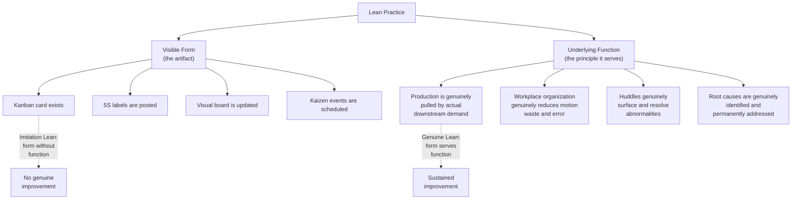

## Recognizing and Avoiding Tool-Only, Imitation Lean

### Overview

"Imitation Lean" — also referred to as "fake Lean," "cargo cult Lean," or "Lean theater" — describes the condition in which an organization adopts the visible artifacts of Lean Manufacturing (kanban cards, 5S labels, visual boards, kaizen event schedules) without the underlying principles, problem-solving behavior, and leadership engagement that give those artifacts their functional purpose. This document consolidates and extends a theme referenced throughout the preceding material — in the transformation failure patterns, the Shingo Model's principles-systems-results structure, and the layered audit discussion — into a focused treatment of how to recognize imitation Lean, why it emerges even in organizations with genuine improvement intentions, and how to structurally guard against it.

### The Core Distinction: Form versus Function

**Key Points**

- The same physical artifact (a kanban card posted at a workstation) can represent either genuine or imitation Lean depending entirely on whether the underlying behavior it's meant to trigger — actual pull-based replenishment — is genuinely occurring. Inspecting the artifact alone cannot distinguish the two; only observing the behavior around it can.
- This distinction is precisely what the Shingo Model's principles-systems-results framework is designed to assess, and precisely what a well-designed layered process audit verifies at the behavioral level rather than a documentation-compliance level.

### Common Symptoms of Imitation Lean

| Symptom | What Genuine Lean Would Look Like Instead |
| --- | --- |
| Visual boards are updated on schedule, but huddles rarely produce assigned action items or escalations | Huddles consistently surface specific abnormalities with named owners and follow-up |
| 5S audits show high scores, but workstations still exhibit hidden inventory, unlabeled tools, or informal "just in case" stockpiles | 5S condition reflects genuine minimal, purposeful organization maintained through daily habit, not audit-day preparation |
| Kanban cards exist, but material is still frequently expedited via informal phone calls or emergency runs outside the kanban signal | Replenishment genuinely occurs only in response to the kanban signal; expediting is rare and treated as an abnormality requiring root-cause investigation |
| Kaizen events are held regularly and well-attended, but post-event sustainment audits show frequent regression within months | Kaizen improvements are captured as updated standard work and verified sustained through the layered audit system |
| Standard work documents exist and are posted, but actual operator practice varies noticeably from what's documented | Standard work documents accurately reflect current, consistently followed practice, updated promptly when genuine improvements are validated |
| Leadership references "our Lean journey" in communications but rarely appears at the Gemba or personally engages with visual board huddles | Leadership Gemba engagement is a specific, tracked component of layered standard work, genuinely and consistently practiced |
| Problem-solving tools (5 Whys, A3) are used to produce documentation for audits, but root causes identified rarely result in permanent corrective action | A3s and root-cause analyses genuinely drive process changes, tracked to closure and verified as sustained |

### Root Causes of Imitation Lean

**1. Tool-First Sequencing (Skipping Foundational Phases)**

As identified in the transformation roadmap failure patterns, deploying tools broadly before establishing genuine leadership commitment and cultural readiness (Phases 1–2) produces exactly this outcome — the tools exist because they were mandated or scheduled, not because the underlying need and understanding were genuinely established first.

**2. Benchmarking Without Contextual Adaptation**

Directly copying a specific practice observed at a benchmarked organization (frequently Toyota) — a particular kanban card format, a specific andon system design — without understanding the underlying problem that practice was designed to solve in its original context produces a superficially similar artifact disconnected from genuine local need.

**3. Metrics That Reward Artifact Existence Rather Than Function**

If an internal audit or KPO measures "percentage of workstations with a posted visual board" rather than "percentage of huddles resulting in documented, resolved abnormalities," the organization is structurally incentivized to produce the visible artifact without the underlying behavior — directly connecting to the "measuring activity instead of outcomes" failure pattern discussed under implementation failures.

**4. Compressed Timelines Under External Pressure**

Organizations facing external pressure (a customer audit requirement, a corporate mandate with an imposed deadline) to demonstrate Lean adoption quickly may deploy visible artifacts rapidly to satisfy the requirement, without the time genuine behavioral and cultural change requires — producing a result that satisfies the immediate external check but lacks functional substance.

**5. Insufficient Leadership Understanding of Underlying Principles**

Leaders who have not genuinely engaged with Lean principles themselves (the "delegated commitment" pattern) may evaluate progress based on visible tool deployment simply because they lack the deeper understanding needed to assess genuine functional adoption — they ask "do we have kanban?" rather than "is our production genuinely pulled by actual demand?"

### Diagnostic Questions to Distinguish Genuine from Imitation Lean

**Example — Diagnostic Question Pairs:**

| Surface-Level Question (Insufficient Alone) | Function-Level Question (Reveals Genuine Adoption) |
| --- | --- |
| "Do we have visual boards?" | "When a metric goes red, what specifically happens next, and can you show me an example from this week?" |
| "Do we hold kaizen events?" | "Show me a kaizen event from six months ago — is the change still in place, and how do you know?" |
| "Do we have kanban cards?" | "Walk me through the last time material was expedited outside the kanban signal — why did that happen, and was it treated as an abnormality?" |
| "Have staff completed Lean training?" | "Show me an example of a front-line-initiated problem-solving effort that wasn't directed by a supervisor or the KPO" |
| "Does leadership support the transformation?" | "When was the last time a plant leader personally conducted a Gemba walk, and what did they change as a result?" |

**Key Points**

- The function-level questions consistently require *specific, recent, verifiable examples* rather than general affirmations — this is a deliberate diagnostic technique, since imitation Lean organizations can typically answer surface-level questions affirmatively but struggle to produce concrete, specific examples when pressed for genuine behavioral evidence.

### Structural Safeguards Against Imitation Lean

**1. Behavior-Based, Not Artifact-Based, Audit Criteria**

As emphasized in the layered process audit content, LPAs should verify actual behavior through direct observation (is the operator actually following the sequence, is material actually being pulled per the kanban signal) rather than checking for the mere existence of a posted document or card.

**2. Outcome and Sustainment Metrics Over Activity Counts**

Per the KPO design and implementation failure discussions, tracking sustainment audit pass rates and genuine operational outcome improvement, rather than counts of kaizen events held or boards deployed, structurally discourages a focus on producing visible artifacts as an end in themselves.

**3. Principles-Systems-Results Assessment Structure**

Adopting an assessment approach similar to the Shingo Model's explicit separation of principles, systems, and results — rather than assessing results in isolation — makes it harder for genuinely improved short-term results achieved through non-Lean means (pressure, overtime, hidden buffer) to be mistaken for genuine Lean maturity.

**4. Requiring Specific, Verifiable Examples in Reviews**

Building the diagnostic-question discipline described above into routine leadership reviews and maturity assessments (rather than accepting general affirmations) creates ongoing structural pressure toward genuine, specific, demonstrable practice.

**5. Protecting Time for Genuine Cultural Embedding (Phase 5/6)**

Resisting compressed-timeline pressure to demonstrate Lean adoption faster than genuine behavioral change can realistically occur — this requires leadership willingness to explicitly communicate to external stakeholders (customers, corporate parent) that meaningful Lean adoption follows a multi-year horizon, rather than compressing the timeline in ways that predictably produce imitation Lean.

**6. Leadership Genuinely Learning the Underlying Principles**

Leaders who have personally engaged with Lean principles (through direct Gemba experience, genuine study, and ideally rotational KPO-style exposure per the transformation roadmap) are better positioned to ask function-level rather than surface-level questions, since they understand what genuine adoption should look like in practice.

### Worked Example — Auditing for Imitation Lean

**Scenario**: A new operations leader joins an organization that reports itself as being "deep into its Lean journey," with visual boards across all departments, a KPO in place, and regular kaizen event scheduling — but overall operational performance metrics have plateaued for over a year.

**Diagnostic approach using the framework above**:

1. **Observe huddles directly rather than reviewing reports**: The new leader attends several Tier 1 huddles unannounced and observes that metrics are read aloud but discussion rarely extends beyond acknowledgment — no specific action items or owners are assigned for red-status items, indicating huddles are functioning as compliance rituals rather than genuine problem-solving.
2. **Ask function-level questions of the KPO**: When asked to show a kaizen event from the prior year and confirm whether the change is still in place, KPO staff struggle to produce clear sustainment evidence for several examples — suggesting the sustainment/standardization step of the kaizen cycle has been inconsistently executed.
3. **Review audit criteria**: Examination of the existing layered process audit checklists reveals they primarily verify document existence (is a standard work sheet posted) rather than behavioral conformance (is the operator following it) — identifying a structural safeguard gap consistent with the imitation Lean risk factors.
4. **Assess leadership engagement pattern**: Interviews reveal plant leadership rarely personally conducts Gemba walks, delegating this to the KPO — indicating the delegated-commitment pattern likely underlies the broader plateau.

**Corrective priorities identified**: Rather than adding further tool deployment or kaizen event volume (which would likely compound the existing pattern), the diagnosis points toward redesigning audit criteria around genuine behavioral verification, reinstating leadership Gemba engagement as explicit layered standard work, and reviewing whether huddle facilitation training has adequately equipped team leaders to drive genuine problem-solving discussion rather than passive metric reporting.

### Related Topics

- Common reasons lean implementations fail
- Lean maturity models and organizational self assessment
- Sustaining gains through audits and layered standard work
- Building an internal kaizen promotion office
- Avoiding metric-driven dysfunction
- Change management principles for lean adoption
- The Shingo Model and principles-systems-results framework
- Leader Standard Work and Gemba walk discipline