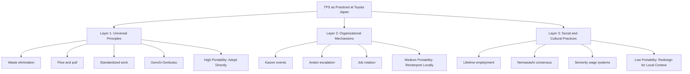

## Adapting TPS Principles Across Different National and Organizational Cultures

### Overview

Adapting TPS Principles refers to the deliberate translation of Toyota Production System philosophy, tools, and management practices into contexts shaped by different national cultures, organizational histories, and workforce expectations. TPS was developed inside a specific socio-industrial context (postwar Japan, Toyota's internal labor relations, and a particular consensus-oriented management style). Transplanting it elsewhere requires distinguishing between the universal principles (waste elimination, flow, respect for people) and the culturally-contingent mechanisms Toyota used to implement them (ringi consensus decision-making, nemawashi, lifetime employment norms, seniority-based hierarchy).

### Why Direct Transplantation Fails

**Key Points**

- TPS is often mistaken for a toolkit (kanban cards, andon cords, 5S checklists) rather than a management philosophy; copying tools without the underlying thinking produces what practitioners call a "fake lean" or "cargo cult" implementation.
- The Toyota Way is built on two pillars — Continuous Improvement (Kaizen, Challenge, Genchi Genbutsu) and Respect for People (Respect, Teamwork) — and the second pillar is the one most frequently dropped or diluted during international transfer.
- Contextual elements often mistaken for "the system itself" include: Japanese seniority-based promotion, company unions, quality circles held outside paid hours, and the cultural expectation of collective identity subordinated to group harmony (*wa*).
- [Inference] Organizations that fail at lean transformation most often fail at the people-management layer, not the technical/process layer, since process tools are comparatively easy to copy while trust-based labor relations are not.

### Framework for Cultural Adaptation

A useful way to reason about adaptation is separating TPS into three layers, from least to most culturally portable.

**Layer 1 — Universal Principles (High Portability)**

These are physics- and logic-based and transfer regardless of culture:

- Waste identification (the seven/eight *muda*)
- Flow and pull production logic
- Standardized work as the baseline for improvement
- Visual management for making abnormalities visible
- Root cause analysis (5 Whys, Genchi Genbutsu)

**Layer 2 — Organizational Mechanisms (Medium Portability)**

These require reinterpretation but not abandonment:

- Kaizen events / structured improvement cycles
- Andon escalation protocols
- Cross-training and job rotation
- Team-based problem solving

**Layer 3 — Social/Cultural Practices (Low Portability, High Adaptation Need)**

These are the practices most tied to Japanese labor context and require substantial redesign elsewhere:

- Lifetime employment and internal labor markets
- Ringi/nemawashi consensus-building processes
- Seniority (*nenko*) wage systems
- Company-based unions integrated with management

### National Culture Dimensions Relevant to Lean Adoption

Hofstede's cultural dimensions framework is commonly used by lean practitioners to anticipate friction points during transformation. This is a widely cited applied framework in cross-cultural management, though its predictive precision for specific lean interventions is debated among researchers.

| Dimension | Japan (TPS Origin) | High-Contrast Example | Adaptation Implication |
| --- | --- | --- | --- |
| Power Distance | Moderate, but flattened on the shop floor via *genba* authority | Very high power distance cultures (e.g., parts of Latin America, South Asia) | Andon cord "stop the line" authority for frontline workers may be culturally resisted if halting a process is seen as challenging management authority; requires explicit leadership sanctioning and visible reinforcement |
| Uncertainty Avoidance | High | Lower uncertainty avoidance cultures (e.g., some Anglo/Nordic contexts) | Standardized work is easier to accept in high uncertainty-avoidance cultures; in low uncertainty-avoidance cultures, workers may resist rigid standards and need standardization framed as "current best known method, subject to challenge" |
| Individualism vs. Collectivism | Collectivist | Highly individualist cultures (e.g., US) | Team-based kaizen credit and group problem-solving may need to coexist with individual recognition systems; suggestion systems often need individual incentive redesign |
| Long-Term Orientation | High | Short-term oriented, shareholder-value-driven cultures | Kaizen's incremental, compounding-returns logic conflicts with quarterly-earnings pressure; leadership must protect long-term investment logic (a core theme of Toyota Way Principle 1: "base decisions on long-term philosophy") |

[Inference] Because Hofstede's dimensions are national averages derived from a specific historical survey population (IBM employees, 1960s–70s), applying them to predict a specific plant's lean adoption outcome is a heuristic, not a deterministic model; organizational sub-culture frequently matters more than national culture.

### Common Adaptation Patterns by Region (Illustrative)

**United States**

- Emphasis shifts toward individual accountability metrics alongside team KPIs
- Andon/stop-authority requires strong, visible management backing to overcome fear of blame culture
- Job security concerns (layoff history) create resistance to efficiency gains being perceived as headcount-reduction tools; successful transformations explicitly decouple kaizen savings from layoffs

**Western Europe**

- Strong works councils and union co-determination (especially Germany's *Mitbestimmung*) require lean rollout to be negotiated as part of formal labor agreements rather than imposed unilaterally
- Higher baseline job security expectations reduce the "fear factor" that can drive urgency in some transformations, requiring intrinsic-motivation framing instead

**China**

- High power distance often means kaizen suggestions flow more effectively top-down initially, with bottom-up suggestion systems requiring longer cultural runway and visible non-punitive handling of worker-flagged problems
- Rapid workforce turnover in some manufacturing regions undermines Toyota's assumption of long-tenured, deeply cross-trained operators, requiring more robust standardized work documentation to compensate

**India**

- Multi-lingual, multi-regional workforces require standardized work instructions to rely more heavily on visual/pictorial formats over text
- Hierarchical family-business ownership structures in many manufacturers can conflict with distributed decision-making authority central to TPS

[Speculation] Region-specific adaptation patterns above are generalized tendencies drawn from published case studies and practitioner literature; individual organizations within any country vary substantially and may not fit these patterns.

### Organizational Culture as a Second Variable

National culture is only one axis; organizational culture (industry norms, founding leadership style, prior change history) interacts with it:

- A US aerospace firm with strong engineering-hierarchy culture will adapt TPS differently than a US retail distribution firm with high frontline turnover
- Family-owned manufacturers (common in India, Italy, Latin America) often have faster decision cycles but greater risk of change reversal if the transformation is tied to a single champion rather than embedded in systems
- Post-merger organizations carrying two blended cultures often need transformation governance to explicitly reconcile competing legacy norms before layering lean practices on top

### Toyota's Own Cross-Cultural Adaptation: NUMMI and TMMK Cases

**Example**

- NUMMI (New United Motor Manufacturing, Inc., California, 1984) is the most studied case of Toyota adapting TPS for a US unionized workforce previously known for adversarial labor relations at the same GM Fremont plant. Toyota retained ~85% of the same workforce but rebuilt trust through job security commitments, team-based work design, and visible management presence on the floor (*genchi genbutsu*), producing quality levels comparable to Japanese plants within the same workforce that had previously been GM's worst-performing.
- Toyota Motor Manufacturing Kentucky (TMMK) similarly required adaptation of the *hoshin kanri* policy deployment process and team leader structures to fit US supervisory expectations and labor law constraints (e.g., differences in at-will employment vs. Japanese lifetime employment norms).

[Unverified] Specific quantitative quality/productivity figures from NUMMI are widely cited in case study literature (e.g., Harvard Business School cases) but exact figures vary by source and reporting year; general directional claims about NUMMI's turnaround are well-corroborated across sources.

### Adaptation Framework for Transformation Leaders

**Key Points**

1. **Separate principle from practice.** Before adapting, explicitly document which mechanism is serving which principle (e.g., andon cord serves "make problems visible immediately," not "physical cord pulling" per se — the mechanism can change; the principle can't).
2. **Diagnose local constraints first.** Labor law, union structure, turnover rates, and existing management trust levels should be assessed via Genchi Genbutsu (go and see) before designing the local rollout, not assumed from headquarters.
3. **Sequence trust before tools.** Respect for People elements (job security assurances, transparent non-punitive problem escalation) generally need to precede aggressive kaizen/andon rollout, or worker engagement collapses into compliance theater.
4. **Localize language and metaphor.** Japanese terms (*muda*, *kaizen*, *poka-yoke*) can be retained as branding but should be paired with locally resonant explanations; over-reliance on untranslated Japanese terminology can create an "othering" effect that undermines ownership.
5. **Adapt incentive systems.** Group-based recognition common in Japan often needs a blended individual/team incentive structure in more individualist cultures to sustain engagement.
6. **Build local Kaizen ownership.** Long-term sustainability requires local leadership (not expatriate Japanese trainers alone) to become internal *sensei*, since transformations led entirely by outside experts tend to regress once the experts leave.

### Common Failure Modes

- **Tool-only import:** Installing kanban boards and andon lights without redesigning management behavior around them ("lean theater")
- **Top-down mandate without trust-building:** Announcing lean as a cost-cutting initiative, which triggers resistance particularly in cultures with historical layoff-driven efficiency programs
- **Ignoring legal/labor context:** Attempting direct transplant of Japanese team structures into jurisdictions with strict works-council co-determination requirements, triggering legal and relational conflict
- **Metrics mismatch:** Applying Toyota's long-term philosophy (Principle 1 of the Toyota Way: long-term philosophy over short-term financial goals) inside organizations structurally bound to quarterly shareholder reporting cycles, causing kaizen investment to be starved during downturns

### Related Topics

- Toyota Way 2001 document: Continuous Improvement and Respect for People pillars in depth
- Hoshin Kanri (policy deployment) across multinational subsidiaries
- Labor relations and works councils in lean transformations (Germany, EU context)
- NUMMI case study: full organizational history and workforce integration
- Change management models for lean transformation (Kotter's 8-Step vs. Toyota's approach)
- Building internal Kaizen/Sensei capability vs. reliance on external consultants
- Hofstede's cultural dimensions theory: origins, critiques, and applied limitations
- Lean transformation sustainability and regression risk after initial rollout