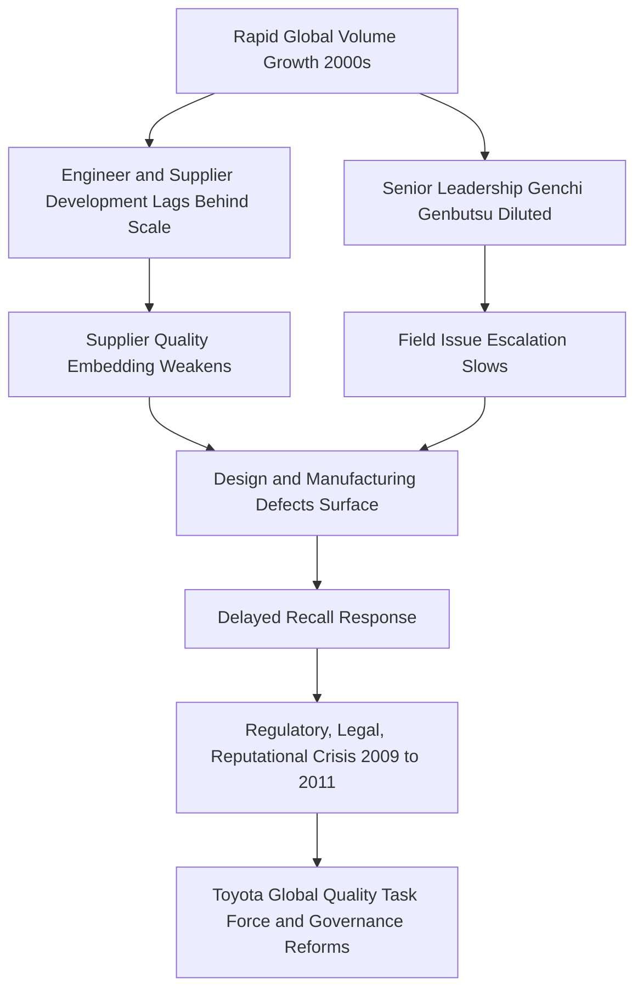

## Lessons from Toyota's Own Setbacks and Recalls

### Overview

This topic examines Toyota's 2009–2011 unintended acceleration crisis and subsequent recalls as a case study in how even the originating organization of TPS can drift from its own principles under growth pressure. The episode is widely used in lean and operations management curricula to illustrate that TPS is not a permanent immunity to failure but a discipline requiring continuous organizational vigilance, and that its erosion tends to follow a predictable pattern tied to rapid scale-up.

### Background: The 2009–2011 Recall Crisis

**Key Points**

- Beginning in 2009, Toyota recalled millions of vehicles globally related to unintended acceleration issues, initially attributed to floor mat entrapment of the accelerator pedal and later to sticking accelerator pedal mechanisms.
- Total vehicles recalled across the related campaigns exceeded 10 million units worldwide across multiple recall waves from 2009–2011.
- The crisis culminated in US congressional hearings, a US Department of Transportation investigation (with NASA engineering support to examine potential electronic throttle control causes), and significant reputational and financial damage, including a 2014 deferred prosecution agreement with the US Department of Justice.
- [Unverified] Exact aggregate financial cost figures (recall costs, settlements, fines, and lost sales combined) vary by source and reporting period; the DOJ settlement itself was publicly reported at $1.2 billion, but total crisis-related costs across litigation, recalls, and lost sales are estimated differently across analyses.

### Root Cause Analysis: What Investigations Found

- The NASA-supported NHTSA investigation (2010–2011) examined potential electronic throttle control system defects and did not find evidence of an electronic cause for unintended acceleration in the cases examined, instead attributing incidents primarily to mechanical pedal issues and floor mat interference.
- Separately, a 2013 Oklahoma jury verdict in a civil case (*Bookout v. Toyota Motor Corp.*) found Toyota's electronic throttle control system design defective in that specific case, based on expert testimony regarding software and fail-safe design; this verdict does not overturn the NASA/NHTSA findings but reflects a different evidentiary standard and forum. [Inference] The coexistence of these differing findings is frequently cited in later engineering ethics and product liability curricula as an example of how technical root cause determination in complex system failures can remain genuinely contested even after extensive investigation.

### Why This Matters for TPS: The Internal Diagnosis

Toyota's own internal and external post-mortems (including commentary from Toyota leadership such as then-President Akio Toyoda's 2010 congressional testimony) pointed to organizational rather than purely technical root causes:

**Key Points**

1. **Growth outpaced people development.** Toyota's global production volume roughly doubled in the decade leading up to the crisis, a pace that outstripped the organization's traditional emphasis on developing engineers and suppliers steeped in TPS discipline before scaling.
2. **Erosion of Genchi Genbutsu at the top.** Rapid international expansion diluted the direct, hands-on plant-floor engagement by senior leadership that TPS relies on for early problem detection; problems escalated more slowly to decision-makers.
3. **Weakened supplier relationship depth.** Faster supplier onboarding to meet growth targets meant some supplier relationships lacked the deep, long-term trust-building (*keiretsu*-style) that historically allowed Toyota to embed quality standards deeply into supplier processes.
4. **Communication and escalation delays.** Toyota's own review acknowledged that customer complaint and field-issue data did not escalate to senior leadership and regulators quickly enough, a breakdown in the "stop and fix" (*jidoka*) philosophy applied at an enterprise, not just shop-floor, level.
5. **Overconfidence from quality reputation.** [Inference] Toyota's decades-long reputation for quality is commonly cited as a contributing cultural factor — a form of institutional overconfidence that may have slowed internal skepticism toward early warning signals, though this specific causal claim is an interpretive one drawn from leadership commentary rather than a directly measurable finding.

### Toyota's Organizational Response

- **Toyota Global Quality Task Force**, announced in 2010, was created to strengthen quality control processes across regions with dedicated regional quality officers empowered with greater authority to halt production or issue recalls without waiting for Japan headquarters sign-off.
- Toyota increased the authority of regional/local executives to make safety-related decisions faster, explicitly reducing the prior bottleneck of centralized decision-making from Japan for global markets.
- Enhanced event data recorder (black box) deployment and expanded brake-override software (which cuts engine power when both accelerator and brake are pressed simultaneously) were implemented across product lines following the crisis.
- Increased investment in supplier quality audits and re-emphasis on *obeya* (large room) cross-functional problem-solving sessions for safety-critical issues.

### Broader Lessons for Lean Practitioners

**Key Points**

- **Scale is a threat to system discipline, not just a growth milestone.** Organizations pursuing rapid volume growth should treat the pace of people/supplier development as a hard constraint on production growth rate, not a lagging variable to catch up on later.
- **Escalation speed must scale with organizational size.** As hierarchy layers and geographic distance increase, formal mechanisms (not just cultural norms) are needed to preserve the fast-escalation intent of jidoka/andon at an enterprise level, since informal trust-based escalation degrades with scale.
- **Reputation is not a substitute for vigilance.** A strong quality reputation can create organizational blind spots; process discipline requires structural reinforcement (audits, empowered quality authority) rather than reliance on cultural pride alone.
- **Genchi Genbutsu must be preserved deliberately during expansion.** Senior leaders in fast-growing organizations need explicit mechanisms (rotating plant visits, direct field-data review cadences) to prevent hands-on engagement from eroding as headcount and geography grow.
- **Crisis response speed matters as much as root cause accuracy.** Delays in public and regulatory communication compounded reputational damage independent of the ultimate technical findings; incident response protocols benefit from being decoupled from full root-cause certainty.

### Comparison: TPS Principle vs. Observed 2009–2011 Breakdown

| TPS Principle | Intended Function | Observed Breakdown During Crisis |
| --- | --- | --- |
| Jidoka (stop and fix) | Immediate escalation of defects before they compound | Field complaint data and early signals reportedly escalated slowly through the organization |
| Genchi Genbutsu | Leadership directly observes problems at the source | Diluted at senior levels due to rapid multi-region expansion |
| Long-term supplier partnership | Deep, trust-based quality embedding with suppliers | Faster supplier onboarding for growth reduced relationship depth in some cases |
| Respect for People / customer | Organizational responsiveness to stakeholder concerns | Criticized in congressional testimony for insufficiently rapid regulatory and customer communication |

[Inference] This comparison table synthesizes commonly cited themes from post-crisis analyses and Toyota's own public statements; it represents an interpretive mapping rather than an official Toyota-published framework.

### Related Topics

- Jidoka and enterprise-level escalation system design
- Toyota Global Quality Task Force structure and governance reforms
- Product liability and root-cause investigation methodology in complex electromechanical systems
- Managing production volume growth rate against organizational capability development
- Case study: NASA-NHTSA electronic throttle control investigation methodology
- Crisis communication and regulatory response frameworks for manufacturers
- Supplier relationship depth (keiretsu model) and its role in quality assurance
- Governance mechanisms for preserving Genchi Genbutsu at scale in multinational organizations