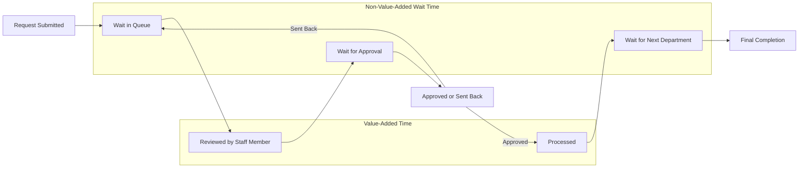

## Lean in Administrative and Office Processes

### Overview

Lean applied to administrative and office (transactional) environments extends TPS waste-elimination and flow principles from physical manufacturing to information-based, knowledge-work processes such as finance, HR, procurement, customer service, and back-office operations. This domain is often called "Lean Office" or "Transactional Lean." The core challenge is that office work products (information, decisions, approvals) are intangible and highly variable, making waste less visually obvious than in a factory, which requires adapted tools for value stream mapping and waste identification.

### Why Office Waste Is Harder to See

**Key Points**

- In manufacturing, inventory piles up visibly as physical stock; in office processes, "inventory" takes the form of emails sitting unread, documents in approval queues, or tickets waiting in a system — waste that is invisible without deliberate tracing.
- Office processes often cross multiple departments and IT systems, so the total value stream is rarely visible to any single person performing a step in it, unlike a factory floor where the physical flow is spatially observable.
- Batch-and-queue behavior is culturally normalized in office settings (e.g., "I'll process all my invoices on Friday") in ways that would be immediately recognized as wasteful batching on a shop floor.
- [Inference] Because office waste lacks the physical/visual signal that shop-floor waste has, Lean Office implementations depend more heavily on deliberate value stream mapping and time-tracking exercises to surface waste that would otherwise go unnoticed.

### The Eight Wastes Reinterpreted for Office/Transactional Work

| Manufacturing Waste (Muda) | Office/Administrative Equivalent |
| --- | --- |
| Overproduction | Generating reports nobody reads; producing more copies/data than needed |
| Waiting | Approval queues, waiting on email replies, system lag, waiting for signatures |
| Transportation | Routing documents/approvals through unnecessary departments or people |
| Overprocessing | Redundant data entry across systems, excessive approval layers, over-formatting |
| Inventory | Backlogs of unprocessed emails, tickets, invoices, or open cases |
| Motion | Searching for files, switching between systems/tabs, walking to other departments for signatures |
| Defects | Data entry errors, incomplete forms causing rework, incorrect information requiring correction |
| Underutilized talent/skills | Skilled staff doing manual data entry instead of analysis or problem-solving |

### Core Tools for Lean Office Implementation

**Value Stream Mapping (Administrative VSM)**

- Maps an information/document's journey through an office process from request to completion, capturing processing time vs. wait time at each step (analogous to cycle time vs. lead time in manufacturing VSM).
- Typically reveals process cycle efficiency (value-added time ÷ total lead time) far below manufacturing benchmarks; administrative processes commonly show single-digit percentage efficiency where most of the total lead time is queue/wait time rather than actual processing.
- [Inference] The specific efficiency percentages often cited in Lean Office training materials (e.g., "administrative processes are typically 90% waste") are illustrative benchmarks drawn from case study aggregates rather than a universal measured constant, and vary significantly by process type and organization.

**5S for Office Environments**

- Sort: Remove unused files, forms, software licenses, and outdated templates
- Set in Order: Standardize folder structures, naming conventions, and desktop/digital workspace organization
- Shine: Maintain clean, distraction-free physical and digital workspaces
- Standardize: Create shared conventions for document handling and file organization across the team
- Sustain: Regular audits of digital and physical workspace organization

**Kanban for Knowledge Work**

- Visual boards (physical or digital, e.g., columns like "Requested → In Progress → Review → Done") make queue buildup visible in ways that email inboxes or shared drives do not.
- Work-in-process (WIP) limits per column prevent staff from starting new tasks before finishing current ones, directly addressing multitasking-driven waiting and context-switching waste.
- Kanban boards in office settings are widely used in software/knowledge-work contexts (e.g., agile software teams), representing one of the more mature and widely adopted transplants of a TPS-originated tool into non-manufacturing settings.

**Standard Work for Administrative Tasks**

- Documents the current best-known method for recurring administrative tasks (e.g., invoice processing steps, onboarding checklist sequencing) to reduce variation between staff performing the same task.
- Distinguished from rigid bureaucracy by framing standards as the current baseline for improvement (kaizen), not a permanent rule — a distinction that requires explicit reinforcement in office cultures unfamiliar with TPS.

### Kaizen Events in Office Settings

**Example**

A typical Lean Office kaizen event for an accounts-payable invoice process might follow this structure:

1. **Current state mapping** — team walks the actual invoice path from receipt to payment, timing each handoff
2. **Waste identification** — team tags each step as value-added, non-value-added-but-necessary, or pure waste (e.g., duplicate data entry into both the accounting system and an Excel tracker)
3. **Root cause discussion** — 5 Whys applied to recurring delays (e.g., "Why do invoices sit for 3 days before approval?" → traced to a single approver being a bottleneck with no backup)
4. **Future state design** — team redesigns the flow, often eliminating an approval layer, combining redundant systems, or introducing a kanban-style visual queue
5. **Rapid implementation and follow-up** — changes piloted immediately where possible, with a 30/60/90-day review to confirm the gains held

### Common Barriers to Lean Office Adoption

**Key Points**

- **Invisibility of flow.** Without physical products moving between stations, staff and managers often do not perceive their work as part of a "process" with flow and waste, making the initial mapping exercise itself a significant mindset shift.
- **Functional silos.** Office processes frequently cross department boundaries (e.g., sales → finance → legal → operations) where each department optimizes its own local step without visibility into the end-to-end value stream, producing classic sub-optimization.
- **Resistance to visual management.** Knowledge workers may resist kanban boards or visible WIP tracking as a form of surveillance rather than a flow-improvement tool, requiring careful framing and staff involvement in board design.
- **Metrics mismatch.** Office functions are often measured on local efficiency (e.g., "invoices processed per person per day") rather than end-to-end cycle time, which can incentivize batching behavior that increases total lead time even while individual productivity metrics look good.
- **Software/systems fragmentation.** Unlike a physical factory line, office workflows frequently span multiple disconnected software systems (CRM, ERP, email, spreadsheets), and eliminating waste sometimes requires IT/systems integration work beyond what a kaizen team alone can implement.

### Distinguishing Lean Office from Business Process Reengineering (BPR)

[Inference] This distinction is a commonly taught contrast in lean curricula rather than a strictly formalized industry standard, but it is useful for clarifying scope:

- Lean Office favors incremental, continuous kaizen-driven improvement led by the people doing the work, preserving existing process structure where possible while eliminating waste within it.
- BPR (associated with Hammer and Champy's 1990s work) favors radical, clean-slate process redesign, often IT-system-driven and led top-down by consultants or senior management, explicitly willing to discard existing process structure entirely.
- Many organizations use a blended approach: BPR-style redesign for fundamentally broken processes, followed by ongoing Lean Office kaizen to sustain and refine the redesigned process over time.

### Related Topics

- Value stream mapping symbols and notation adapted for information flow
- Kanban systems in software development (Scrum vs. Kanban vs. Scrumban)
- Lean Six Sigma integration for transactional process variation reduction
- Digital 5S and knowledge management practices
- Cross-functional kaizen events and breaking down departmental silos
- Business Process Reengineering (BPR) vs. incremental Lean improvement
- Process cycle efficiency calculation and benchmarking in service industries
- Visual management systems for distributed and remote knowledge-work teams