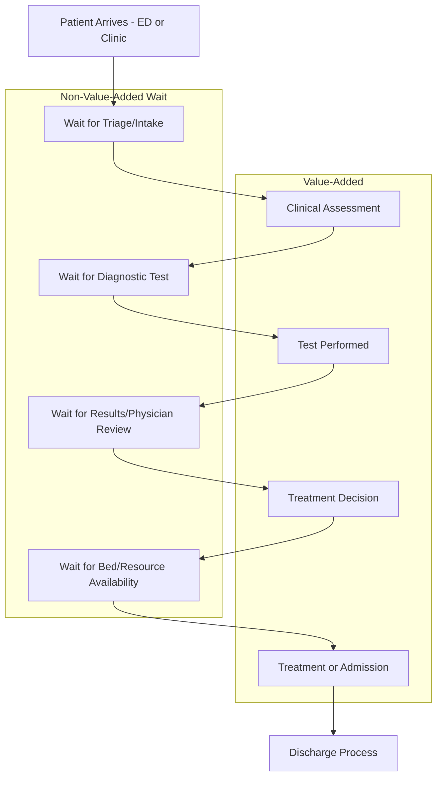

## Lean in Healthcare Delivery

### Overview

Lean in healthcare delivery applies TPS principles — waste elimination, flow, standardized work, and respect for people — to clinical and administrative processes in hospitals, clinics, and health systems. Unlike manufacturing, the "product" is patient care, where defects can mean patient harm, and "customers" include patients, families, clinicians, and payers simultaneously. Virginia Mason Medical Center (Seattle) and ThedaCare (Wisconsin) are among the most widely cited early adopters that directly partnered with Toyota-trained consultants to build formal lean management systems, often branded as the "Virginia Mason Production System" (VMPS).

### Why Healthcare Is a Distinct Adaptation Challenge

**Key Points**

- Patient variability (case mix, comorbidities, unpredictable emergencies) is far higher than typical manufacturing part variability, making standardized work harder to apply uniformly without clinical judgment overrides.
- Multiple, sometimes conflicting, definitions of "customer" and "value" exist simultaneously — a treatment efficient for hospital throughput may not align with what a patient or family perceives as valuable (e.g., time spent with a physician).
- Regulatory, licensing, and liability structures constrain process redesign options in ways factories do not face (e.g., scope-of-practice laws determining which staff can perform which tasks).
- Clinical staff often have strong professional autonomy norms and hierarchical medical training cultures (physician-led decision authority) that can conflict with team-based, frontline-driven kaizen approaches central to TPS.
- [Inference] Because errors in healthcare can directly harm patients rather than only produce defective products, the risk tolerance for testing process changes via rapid PDCA cycles is generally lower and more tightly governed than in manufacturing kaizen events.

### The Eight Wastes Reinterpreted for Healthcare

| Manufacturing Waste (Muda) | Healthcare Equivalent |
| --- | --- |
| Overproduction | Unnecessary tests, duplicate diagnostics, over-treatment beyond clinical need |
| Waiting | Patients waiting for appointments, test results, discharge processing, bed availability |
| Transportation | Moving patients between departments/units more than clinically necessary |
| Overprocessing | Redundant paperwork, repeated intake questioning across departments |
| Inventory | Excess medication/supply stock, patients boarding in ED awaiting inpatient beds |
| Motion | Staff walking excessive distances to retrieve supplies or equipment (search waste) |
| Defects | Medication errors, misdiagnosis, wrong-site procedures, readmissions due to incomplete discharge processes |
| Underutilized talent/skills | Licensed clinicians performing non-clinical administrative tasks instead of practicing at top of license |

### Case Study: Virginia Mason Production System (VMPS)

**Example**

- Virginia Mason Medical Center began formal lean adoption in 2002, directly training with former Toyota engineers, and restructured its management system around the Toyota Production System, rebranded internally as VMPS.
- Key elements adopted include: standardized work for clinical processes, daily kaizen (called "Rapid Process Improvement Workshops" or RPIWs), visual management boards on care units, and a formal "Patient Safety Alert" system modeled on Toyota's andon cord, allowing any staff member to immediately flag a safety concern.
- Publicly reported outcomes from Virginia Mason's lean program include reductions in patient walking distance during care processes, reduced inventory costs, and improved patient safety incident reporting rates, though [Unverified] specific quantitative figures (e.g., percentage reductions in cost or error rates) vary across the years and sources reporting on the program and should be verified against Virginia Mason's own published outcomes data for current figures.

**Example**

- ThedaCare's "Business Performance System," developed around the same period, is another frequently cited early healthcare-lean adopter, notable for redesigning primary care delivery around collaborative care teams and reducing patient wait times through flow-focused redesign of clinic visits.

### Core Lean Healthcare Tools

**Value Stream Mapping for Patient Flow**

- Maps a patient's journey (e.g., from ED arrival to discharge, or from referral to surgery) capturing wait times, handoffs, and value-added clinical time at each step.
- Frequently reveals that total patient lead time is dominated by waiting (for beds, tests, transport, discharge paperwork) rather than actual clinical care time, mirroring the pattern seen in administrative/office value streams.

**5S in Clinical Environments**

- Applied to supply carts, medication rooms, and equipment storage to reduce search time (motion waste) during time-critical clinical tasks; standardized cart layouts across units reduce error risk when staff float between departments.

**Visual Management and Andon-style Escalation**

- Patient status boards, care pathway checklists, and safety-alert systems adapted from Toyota's andon cord concept allow frontline staff (nurses, technicians) to immediately escalate safety concerns without waiting for hierarchical approval — directly translating jidoka's "stop and fix" principle into a clinical safety context.

**Rapid Improvement Events (Kaizen Events / RPIWs)**

- Structured 3–5 day improvement workshops where cross-functional clinical and administrative staff redesign a specific process (e.g., medication reconciliation, OR turnover time), following the standard PDCA cycle: observe current state, identify waste, test countermeasures, standardize the improved process.

### Adapting TPS Concepts for Clinical Safety Culture

**Key Points**

- **Jidoka → Patient Safety Alerts.** Toyota's stop-the-line authority is reframed as an explicit, protected right for any staff member (including junior nursing staff) to halt a process and escalate a safety concern without fear of reprisal — requiring strong leadership commitment to psychological safety, since medical hierarchy culture can otherwise suppress this.
- **Standardized Work → Clinical Care Pathways / Checklists.** Standardized work is implemented as evidence-based care pathways and checklists (e.g., WHO Surgical Safety Checklist, central line insertion bundles), framed as reducing preventable variation while explicitly preserving clinical judgment for exceptions.
- **Genchi Genbutsu → Gemba Walks on Care Units.** Hospital leadership conducts direct rounding/observation on clinical units to see care delivery firsthand rather than relying solely on dashboard metrics, mirroring shop-floor management walks.
- **Heijunka (Leveling) → Demand Smoothing for Scheduling.** Applied to surgical scheduling and elective procedure booking to reduce artificial demand peaks that cause bed and staffing bottlenecks, distinct from unpredictable emergency demand which cannot be leveled.
- [Inference] The degree to which "stop the line" authority is genuinely exercised by junior clinical staff in practice depends heavily on an organization's underlying psychological safety and hierarchy culture, and published case studies suggest this cultural shift is typically the slowest and most difficult element of healthcare lean adoption to achieve, more so than the technical tools themselves.

### Common Barriers to Lean Adoption in Healthcare

- **Professional hierarchy and autonomy norms.** Physician-led decision cultures can resist frontline, team-based kaizen approaches that presume the person closest to the work has authority to suggest process changes.
- **Regulatory and accreditation constraints.** Process redesigns must remain compliant with bodies such as (in the US) The Joint Commission and CMS regulations, which can limit the range of experimental process changes compared to a factory floor.
- **Fragmented information systems.** Electronic health record (EHR) systems frequently do not interoperate smoothly across departments or with scheduling/supply systems, creating waste (duplicate data entry, search waste) that lean teams cannot resolve without IT investment.
- **Measuring "value" from multiple stakeholder perspectives simultaneously.** Cost-efficiency value to the hospital, clinical-outcome value to the patient, and experiential value (wait time, communication) to the patient/family do not always align, complicating a single unified value stream definition.
- **Change fatigue and clinician burnout.** Clinical staff are frequently subject to concurrent quality initiatives (accreditation requirements, EHR rollouts, lean initiatives), and without careful sequencing, lean can be perceived as "one more program" rather than a coherent management philosophy.

### Related Topics

- Jidoka and Patient Safety Alert system design in clinical settings
- Virginia Mason Production System: detailed RPIW methodology
- Value stream mapping for emergency department patient flow
- Clinical checklist design (WHO Surgical Safety Checklist) as standardized work
- Heijunka applied to elective surgical scheduling
- Psychological safety and hierarchy culture in clinical kaizen adoption
- Lean Six Sigma in healthcare quality improvement (DMAIC vs. PDCA)
- Regulatory constraints on process redesign (Joint Commission, CMS) in lean healthcare initiatives