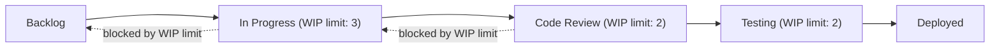

## Lean in Software Development and IT Operations

### Overview

Lean applied to software development and IT operations extends TPS flow and waste-elimination principles to knowledge-work processes involving code, deployments, and infrastructure. This domain most directly informed and was later formalized into the Agile movement, Kanban Method (Anderson), and the DevOps movement, making it one of the most mature and widely institutionalized non-manufacturing applications of TPS thinking. Mary and Tom Poppendieck's "Lean Software Development: An Agile Toolkit" (2003) is the most frequently cited work translating the seven manufacturing wastes into software-specific equivalents.

### The Seven Wastes of Software Development (Poppendieck Mapping)

| Manufacturing Waste (Muda) | Software Development Equivalent |
| --- | --- |
| Overproduction | Building features nobody uses (gold-plating, speculative "just in case" functionality) |
| Waiting | Waiting for code reviews, environment provisioning, build/test pipeline completion, approvals |
| Extra Processing | Unnecessary documentation, redundant meetings, excessive process overhead relative to team size |
| Extra Features | Scope creep beyond what delivers actual user value |
| Task Switching | Developers juggling multiple concurrent projects, reducing focus and increasing defect rates |
| Defects | Bugs, production incidents, code that fails tests or requires rework |
| Motion (Handoffs) | Work passed between specialized teams (dev → QA → ops) with information loss at each handoff |

[Inference] The seven-waste taxonomy above (task switching and extra features as distinct categories rather than the traditional eight manufacturing wastes) reflects the Poppendiecks' specific adaptation and is one of several published mappings used in lean software literature; other practitioner sources map software waste slightly differently while covering substantially overlapping ground.

### Kanban Method for Software Teams

**Key Points**

- David J. Anderson's Kanban Method (formalized around 2010, building on earlier Microsoft and Corbis case studies) applies TPS pull-system and visual-management principles directly to software and IT work, without prescribing iteration-based cadences the way Scrum does.
- Core practices: visualize the workflow (columns representing states like Backlog → In Progress → Code Review → Testing → Deployed), limit work-in-process (WIP) per column, manage flow (track and reduce cycle time), make policies explicit, implement feedback loops, and improve collaboratively using models such as scientific method.
- WIP limits directly implement the TPS pull-system principle: new work is only pulled into a stage when capacity frees up, preventing the software-team equivalent of overproduction (starting too many features at once, which increases context-switching waste and delays overall throughput).
- Cumulative Flow Diagrams (CFDs) and cycle time/lead time metrics serve as the software-team analog to manufacturing's flow and lead-time measurements in value stream mapping.

### DevOps and Continuous Delivery as Flow Optimization

**Key Points**

- DevOps practices (continuous integration, continuous delivery/deployment, infrastructure as code) can be understood as applying TPS's single-piece flow and batch-size reduction principles to software releases: shifting from large, infrequent batch releases (high risk, long feedback delay) toward small, frequent, low-risk deployments.
- The "Three Ways" framework popularized by Gene Kim, Kevin Behr, and George Spafford in *The Phoenix Project* (2013) and later *The DevOps Handbook* explicitly maps to TPS/lean thinking: **First Way** (flow — optimizing the flow of work from development to operations to customer), **Second Way** (feedback — creating fast, amplified feedback loops), **Third Way** (continuous learning and experimentation — analogous to kaizen/PDCA culture).
- Continuous Integration reduces the software equivalent of "batch defect discovery cost" — the TPS principle that catching defects immediately (jidoka) is dramatically cheaper than discovering them after large batches accumulate, translated into the software finding that bugs caught immediately after a commit are cheaper to fix than bugs found after full integration cycles.
- Automated testing and deployment pipelines function as software's equivalent of poka-yoke (error-proofing) — building constraints into the system so certain defect classes cannot pass through undetected.
- [Inference] While the DevOps movement's explicit self-framing as a direct descendant of TPS/lean manufacturing thinking is well-documented in its own literature (Kim, Humble, Debois, Willis), the degree to which any specific DevOps practice's effectiveness is causally attributable to lean principles versus independently-discovered software engineering best practice is not something that can be cleanly separated or quantified.

### Example: Applying Value Stream Mapping to a Deployment Pipeline

**Example**

A software delivery value stream map might trace a code change from commit to production, capturing:

1. Commit → wait for CI build (value-added: automated build; wait: queue time)
2. Build passes → wait for code review (wait: reviewer availability)
3. Review approved → wait for QA environment deployment
4. QA testing → wait for release window/approval
5. Production deployment → monitoring for incidents

Organizations frequently discover, similarly to administrative VSM findings, that actual value-added processing time (writing code, running automated tests) is a small fraction of total lead time from commit to production, with the majority consumed by approval queues, environment provisioning delays, and release-window batching — directly analogous to the queue-dominated lead times found in manufacturing and office value streams.

### Standardized Work in Software Contexts

- Coding standards, style guides, and architectural conventions serve a similar function to manufacturing standardized work: establishing a current best-known baseline that reduces variation-driven defects, while remaining subject to team-driven revision (retrospectives functioning as the kaizen mechanism).
- Definition of Done (DoD) criteria in Agile/Scrum frameworks function as a standardized work checklist, ensuring consistent quality bar across completed work items regardless of which team member performed the work.
- Runbooks and incident response playbooks in IT operations serve the same standardization function as manufacturing work instructions, reducing variation in how production incidents are diagnosed and resolved.

### Root Cause Analysis and Blameless Postmortems

- Blameless postmortem practices (widely associated with Google's Site Reliability Engineering practices and popularized industry-wide through the DevOps movement) directly mirror TPS's emphasis on treating defects as system/process failures rather than individual failures, encouraging root-cause investigation (5 Whys) without fear of blame — a direct translation of the psychological-safety element underlying jidoka's "stop the line" authority.
- 5 Whys is commonly applied in incident retrospectives to distinguish proximate technical causes (e.g., "the server ran out of memory") from deeper systemic causes (e.g., "there was no automated capacity monitoring alert configured, and the alerting gap was never flagged in the last infrastructure review").

### Common Adaptation Challenges

**Key Points**

- **Intangibility of "inventory."** Unlike physical work-in-process, unfinished code, unreviewed pull requests, and undeployed features are easy to accumulate invisibly without a kanban board or similar visual system actively maintained by the team.
- **Estimation and demand variability.** Software work item size is inherently harder to standardize/predict than manufacturing takt time, complicating direct application of heijunka (production leveling) concepts, though some teams approximate this through consistent WIP limits and cycle-time-based forecasting rather than fixed-duration estimation.
- **Tension between Scrum's fixed iterations and Kanban's continuous flow.** Organizations sometimes blend the two ("Scrumban"), but this can create governance ambiguity about which cadence rules (sprint planning vs. continuous pull) actually govern team behavior.
- **Tooling fragmentation.** Similar to general office lean challenges, software delivery often spans multiple disconnected tools (issue trackers, CI/CD systems, monitoring dashboards), making a truly unified value stream view difficult to construct without deliberate integration effort.
- **Risk of "cargo cult Agile/DevOps."** As with manufacturing tool-only imports, teams adopting kanban boards or CI/CD pipelines without the underlying flow-optimization and continuous-improvement mindset frequently fail to realize the intended benefits, reproducing the "lean theater" failure mode seen in other domains.

### Related Topics

- Poppendieck's seven wastes of software development in depth
- Kanban Method (Anderson) vs. Scrum vs. Scrumban governance models
- The Three Ways of DevOps (Kim, Behr, Spafford) and their TPS origins
- Continuous Integration/Continuous Delivery pipeline design as batch-size reduction
- Blameless postmortem culture and 5 Whys in incident root cause analysis
- Cumulative Flow Diagrams and cycle time/lead time metrics for software teams
- Site Reliability Engineering (SRE) practices and their relationship to jidoka
- Value stream mapping applied to CI/CD deployment pipelines