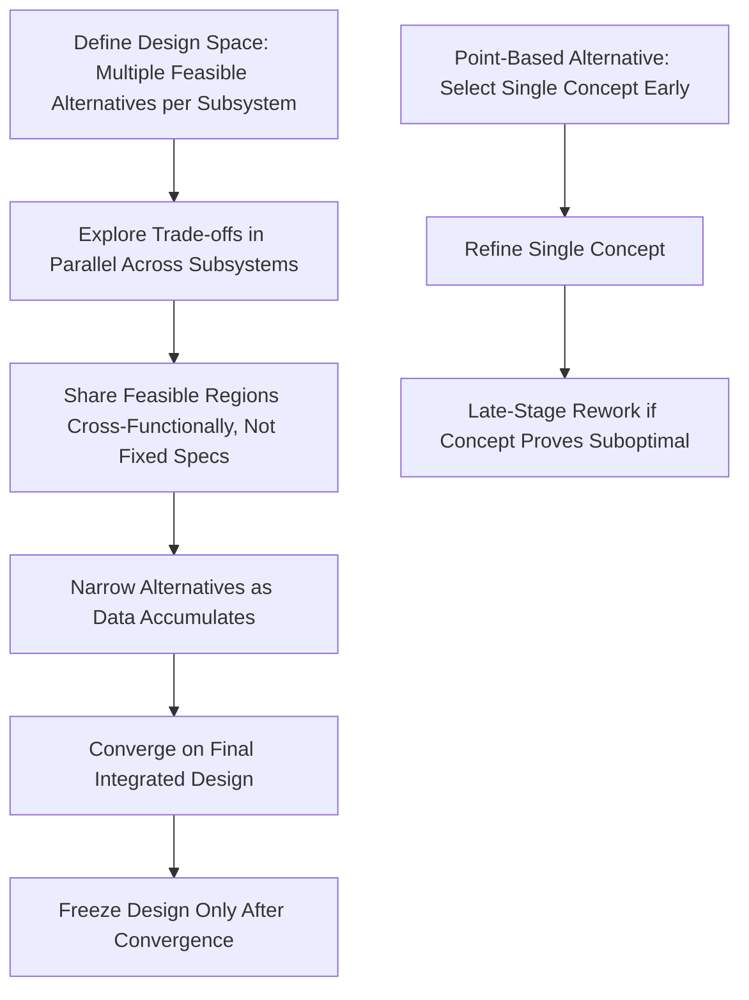

## Lean Product and Process Development Principles

### Overview

Lean Product and Process Development (LPPD) applies TPS principles to the upstream front-end of product creation — engineering design, R&D, and new product/process introduction — rather than to steady-state production execution. This domain is most closely associated with Toyota's own product development system, extensively documented by Allen Ward and James Morgan (notably *The Toyota Product Development System*, 2006, and Ward's *Lean Product and Process Development*, 2007). It addresses a distinct waste profile from manufacturing lean: waste in engineering, knowledge-creation, and decision-making processes rather than physical material flow.

### Why Product Development Requires a Different Lean Model

**Key Points**

- Manufacturing lean optimizes a repetitive, known process; product development is inherently a one-time, uncertain, knowledge-creation activity where the "correct design" is not known in advance — this fundamental difference is why LPPD tools differ substantially from shop-floor lean tools despite sharing the same underlying philosophy.
- The core "product" of development is not a physical part but validated engineering knowledge and decisions; waste in this context is primarily about wasted engineering effort, rework from premature commitment, and poor knowledge reuse rather than physical inventory or motion.
- Toyota's product development system is frequently characterized in the literature as achieving faster development cycles and fewer engineering changes late in the process compared to more sequential Western development models of the era it was studied, largely attributed to front-loaded problem-solving and delayed design commitment. [Unverified] Specific comparative cycle-time figures cited in various secondary sources vary depending on the study period, vehicle program, and comparison baseline used, and should be checked against primary academic sources if precise figures are needed.

### Set-Based Concurrent Engineering (SBCE)

**Key Points**

- Rather than selecting a single design concept early (point-based design) and refining it, Toyota's approach explored multiple design alternatives (a "set" of possibilities) in parallel across subsystems, narrowing the set gradually as trade-off data accumulated, and converging on a final design only once sufficient knowledge eliminated inferior options.
- This contrasts with traditional point-based engineering, where a single concept is chosen early based on limited information, often causing costly late-stage rework when the chosen concept proves suboptimal once more is learned.
- SBCE requires cross-functional communication of feasible design regions (e.g., "this subsystem geometry works within this range of parameters") rather than single fixed specifications, allowing downstream teams (e.g., manufacturing engineering) to communicate constraints back to design teams as overlapping "trade-off curves" rather than late-stage change requests.
- [Inference] Because SBCE requires exploring and maintaining multiple design alternatives simultaneously, it demands more front-end engineering capacity and discipline than point-based approaches; the efficiency gain comes from avoiding downstream rework rather than from reducing upfront exploration effort, making it best suited to complex, interdependent systems where late design changes are especially costly.

### Chief Engineer System (Shusa System)

- Toyota's product development is organized around a Chief Engineer (originally *shusa*) who holds end-to-end authority and responsibility for a vehicle program's overall concept, technical integrity, and customer value proposition, functioning as a cross-functional integrator rather than a traditional line manager with direct authority over all contributing engineers.
- The Chief Engineer typically has substantial technical credibility and deep product knowledge rather than pure administrative authority, and works through influence and technical judgment across functional departments (styling, engineering, manufacturing) that retain their own reporting lines.
- [Inference] This structure is frequently contrasted in the literature with traditional matrix or functional-silo product development organizations, where no single individual holds integrated responsibility for the complete product vision, though implementations of "chief engineer"-style roles outside Toyota vary significantly in the degree of authority granted, and simply creating the title without the accompanying technical depth and cross-functional respect the role requires is a commonly cited failure mode when other organizations attempt to replicate it.

### Front-Loading and Knowledge-Based Engineering

**Key Points**

- Front-loading refers to concentrating problem-identification and problem-solving effort early in the development process (when changes are cheap) rather than allowing problems to surface late (when changes are expensive), operationalizing the general engineering principle that the cost of fixing a defect rises sharply the later it is discovered.
- Toyota's development system emphasizes capturing and reusing engineering knowledge across programs through mechanisms such as trade-off curves, checklists, and standardized engineering checksheets, treating validated design knowledge as a durable organizational asset rather than something re-derived from scratch on each new program.
- Rapid, low-cost prototyping and simulation cycles support front-loading by allowing many design hypotheses to be tested cheaply and early, rather than relying on a small number of expensive, late physical prototypes to reveal problems.

### Standardized Work in Engineering Contexts

- Engineering checklists, design review checksheets, and trade-off curve libraries serve as the product-development analog to manufacturing standardized work — capturing the current best-known engineering practice while remaining explicitly revisable as new knowledge is generated (the kaizen mechanism applied to engineering process itself).
- Obeya ("big room") management — a dedicated cross-functional war-room space where program status, trade-off curves, and key decisions are visually displayed and reviewed — functions as the product-development analog to shop-floor visual management, making program status and open issues visible to the full cross-functional team rather than siloed in individual functional reports.

### Cadence, Pull, and Flow in Development Processes

- Applying flow concepts to engineering means structuring development milestones and information handoffs to minimize batching (e.g., avoiding "big bang" design reviews where all decisions are made at once) in favor of continuous, staged decision-making as knowledge matures.
- Pull-based information release means downstream functions (e.g., manufacturing engineering, tooling design) receive design information as it becomes stable and reliable rather than all at once at a formal release gate, reducing the risk of downstream teams working from information that later changes.
- [Inference] The degree to which flow and pull concepts can be cleanly mapped onto engineering processes is more contested in the literature than their application to repetitive manufacturing processes, since engineering work is inherently less repeatable and more uncertain; most LPPD sources treat this mapping as a directional analogy rather than a literal one-to-one translation.

### Comparison: Point-Based vs. Set-Based Product Development

| Dimension | Point-Based (Traditional Sequential) | Set-Based Concurrent Engineering |
| --- | --- | --- |
| Concept selection timing | Early, based on limited information | Delayed until sufficient trade-off data accumulates |
| Design alternatives explored | Single concept refined iteratively | Multiple concepts explored in parallel, then narrowed |
| Risk of late-stage rework | Higher, if chosen concept proves flawed | Lower, since inferior alternatives are eliminated with data before commitment |
| Cross-functional communication | Fixed specifications passed downstream | Feasible trade-off regions shared and negotiated |
| Upfront engineering capacity required | Lower | Higher (parallel exploration demands more resources initially) |

### Common Barriers to LPPD Adoption Outside Toyota

**Key Points**

- **Organizational structure mismatch.** Traditional functional-silo engineering organizations often lack a role with the cross-functional authority and technical depth the Chief Engineer system requires, and simply appointing a "program manager" without deep technical credibility does not replicate the intended function.
- **Metrics and incentive misalignment.** Engineering teams are frequently measured on individual task completion or functional-area efficiency rather than end-to-end program success, undermining the collaborative trade-off sharing that SBCE requires.
- **Resistance to delayed decision-making.** Organizational cultures accustomed to early "lock-in" decisions (often driven by financial reporting or milestone-based governance models) may resist the deliberately delayed convergence that SBCE requires, perceiving it as indecisiveness rather than disciplined knowledge-based convergence.
- **Underinvestment in knowledge capture infrastructure.** Reusable trade-off curves and engineering checksheets require sustained investment in capturing and organizing engineering knowledge across programs, which is often deprioritized in favor of near-term program delivery pressure.

### Related Topics

- Toyota Chief Engineer (Shusa) system: authority structure and selection criteria
- Set-Based Concurrent Engineering: trade-off curve development and usage
- Obeya (big room) management for cross-functional program visibility
- Front-loading problem-solving and knowledge-based engineering checklists
- A3 problem-solving reports applied to engineering decision documentation
- Design for Manufacturing and Assembly (DFMA) integration with SBCE
- Comparing LPPD with Stage-Gate and traditional Waterfall product development models
- Knowledge reuse systems and engineering checksheets across product programs