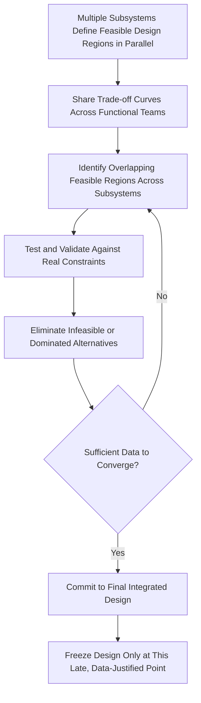

## Set Based Concurrent Engineering in Product Design

### Overview

Set-Based Concurrent Engineering (SBCE) is a product development methodology, originating from study of Toyota's design practices, in which engineering teams explore and maintain multiple viable design alternatives ("sets") across interdependent subsystems in parallel, gradually eliminating inferior options as trade-off data accumulates, and converging on a single integrated design only once sufficient knowledge justifies commitment. It stands in contrast to conventional point-based (sequential) engineering, where a single concept is selected early and refined. SBCE is most extensively documented in Allen Ward's academic research and in Sobek, Ward, and Liker's 1999 *Sloan Management Review* article "Toyota's Principles of Set-Based Concurrent Engineering," which remains the foundational published source on the topic.

### Core Concept: Sets vs. Points

**Key Points**

- In point-based design, engineers select a single candidate solution early based on limited available information, then iterate and refine that single solution — a design change discovered to be necessary late in the process is expensive because it may invalidate downstream work already committed to that point.
- In set-based design, engineers instead define and communicate a *range* of feasible design possibilities (a "set") for each subsystem, deferring the narrowing of that range until enough cross-functional data exists to eliminate weaker alternatives with confidence.
- The "set" is not merely a list of discrete alternatives but often expressed as a feasible region defined by constraints and trade-off relationships (e.g., "this bracket geometry is acceptable within this range of thickness and material combinations, given these strength and cost trade-offs").
- Convergence happens by *progressively eliminating* infeasible or dominated regions of the design space as data accumulates, rather than by committing to a single point and hoping it survives downstream validation.

### Three Principles of SBCE (Sobek, Ward, and Liker Framework)

The 1999 Sobek/Ward/Liker study identified three interrelated principles observed in Toyota's practice, which remain the standard reference framework for describing SBCE:

**1. Map the Design Space**

- Define feasible regions for each subsystem rather than single-point specifications, communicating design possibilities as trade-off curves or constraint ranges (e.g., a relationship between component weight, cost, and strength) rather than as fixed target values.
- Explore trade-offs by designing multiple alternatives simultaneously and understanding the theoretical limits and interactions between subsystems before committing to specific values.

**2. Integrate by Intersection**

- Rather than each subsystem team optimizing independently and negotiating conflicts after the fact, teams look for the *intersection* of feasible regions across interdependent subsystems — the overlapping zone where all subsystems' constraints can be simultaneously satisfied.
- This searches for solutions that work for the system as a whole, rather than iteratively negotiating point-to-point conflicts between subsystems designed in isolation, which is a common source of late-stage rework in point-based approaches.

**3. Establish Feasibility Before Commitment**

- Commitment to a final design happens only after the feasible region has been narrowed through testing, analysis, and cross-functional validation — not based on an early guess validated later.
- This effectively delays the most expensive, hard-to-reverse decisions until the point where the organization has the most relevant knowledge, inverting the traditional sequential model where the biggest commitment (concept selection) happens earliest, when the least is known.

### Example: SBCE Applied to a Structural Bracket Design

**Example**

Consider a cross-functional team designing a mounting bracket that must satisfy structural, manufacturing, and cost constraints simultaneously:

1. **Structural engineering** defines a feasible region: bracket thickness between 2–5mm depending on material choice, with corresponding strength margins mapped as a trade-off curve.
2. **Manufacturing engineering** defines its own feasible region in parallel: stamping tooling can economically produce thicknesses of 2.5–4mm without requiring new tooling investment; below 2.5mm requires a different, costlier process.
3. **Cost/procurement** maps material cost trade-offs across the same thickness range and across candidate materials (e.g., steel vs. aluminum alloy options), each with different cost curves.
4. Instead of structural engineering picking "3mm steel" early and forcing manufacturing and cost teams to accommodate that single point, all three feasible regions are compared, revealing the overlapping zone (e.g., 2.5–4mm steel) that satisfies all three sets of constraints simultaneously.
5. Final convergence selects a specific point *within* that validated intersection only once testing confirms performance — avoiding the rework risk of an early point-based commitment later found infeasible for manufacturing.

### Trade-off Curves as the Primary Communication Artifact

- Rather than communicating a fixed specification downstream, SBCE teams communicate reusable trade-off curves (graphs relating two or more design variables, such as weight vs. cost, or strength vs. material thickness) that allow other functional teams to see the consequences of moving within the feasible range.
- Toyota's practice of capturing and reusing these trade-off curves across vehicle programs (rather than re-deriving them from scratch each time) is frequently cited as a key mechanism supporting both SBCE and the broader Lean Product and Process Development knowledge-reuse philosophy.
- [Inference] The specific extent and formality of Toyota's internal trade-off curve libraries described in academic case studies reflects the research conducted primarily in the 1990s; the degree to which these exact practices persist in current form is not something that can be verified from training data and would require current primary-source confirmation if precision on present-day Toyota practice specifically (rather than the general SBCE methodology) is required.

### Comparison: SBCE vs. Point-Based Concurrent Engineering

| Dimension | Point-Based Concurrent Engineering | Set-Based Concurrent Engineering |
| --- | --- | --- |
| Initial commitment timing | Early single-concept selection | Delayed until feasible region narrows through data |
| Cross-team communication artifact | Fixed specifications/targets | Trade-off curves and feasible-region constraints |
| Conflict resolution method | Point-to-point negotiation/rework after conflicts surface | Search for intersection of feasible regions before commitment |
| Upfront resource requirement | Lower (single concept developed) | Higher (multiple alternatives explored in parallel) |
| Risk profile | Higher risk of late, expensive rework if concept proves flawed | Lower late-stage rework risk; cost shifted to upfront exploration |
| Knowledge reuse across programs | Limited; specifications often program-specific | Higher; trade-off curves designed for reuse across programs |

### When SBCE Is Most Applicable

**Key Points**

- Most valuable in complex, highly interdependent systems where subsystem interactions are significant and late-stage design changes are especially costly (e.g., automotive, aerospace, complex mechanical assemblies).
- Less clearly advantageous for simple, low-interdependency products where point-based iteration is already fast and cheap, since SBCE's upfront parallel-exploration cost may not be justified by the relatively low cost of late changes in simpler systems.
- [Inference] Because SBCE requires sustained cross-functional discipline and additional upfront engineering capacity to maintain multiple alternatives, organizations without strong existing cross-functional collaboration norms may find it difficult to implement SBCE well even when the product complexity would otherwise justify it — a likely contributor to SBCE's more limited adoption outside of Toyota-influenced organizations relative to Toyota's core lean manufacturing tools.

### Common Implementation Barriers

- **Cultural resistance to delayed decisions.** Organizational governance models built around early milestone lock-in (common in stage-gate product development processes) often penalize what looks like indecisiveness, even when the delay is a deliberate, data-driven SBCE practice rather than genuine uncertainty avoidance.
- **Resource intensity in early phases.** Maintaining multiple design alternatives simultaneously requires more upfront engineering hours than committing early to one concept, which can create budget/headcount friction, particularly in organizations that measure engineering productivity by early-phase output rather than total program cost including rework avoided.
- **Requires mature trade-off knowledge.** Effective SBCE depends on teams' ability to actually characterize feasible regions and trade-off curves accurately; organizations without this analytical maturity may default to superficial "multiple options" exploration without the rigorous intersection analysis SBCE requires.
- **Cross-functional trust and communication infrastructure.** SBCE's "integrate by intersection" principle requires functional teams to share incomplete, evolving trade-off information openly rather than protecting information until a polished final answer is ready — a cultural shift that can be difficult in siloed organizations with adversarial cross-functional dynamics.

### Related Topics

- Sobek, Ward, and Liker (1999): original SBCE research and case findings
- Trade-off curve development and cross-program reuse practices
- Chief Engineer (Shusa) system and its role in SBCE convergence decisions
- Lean Product and Process Development (LPPD) broader framework
- Comparison of SBCE with Stage-Gate and Waterfall product development models
- Design for Manufacturing and Assembly (DFMA) integration with feasible-region mapping
- Obeya (big room) visual management for cross-functional trade-off sharing
- Front-loading and knowledge-based engineering checklists