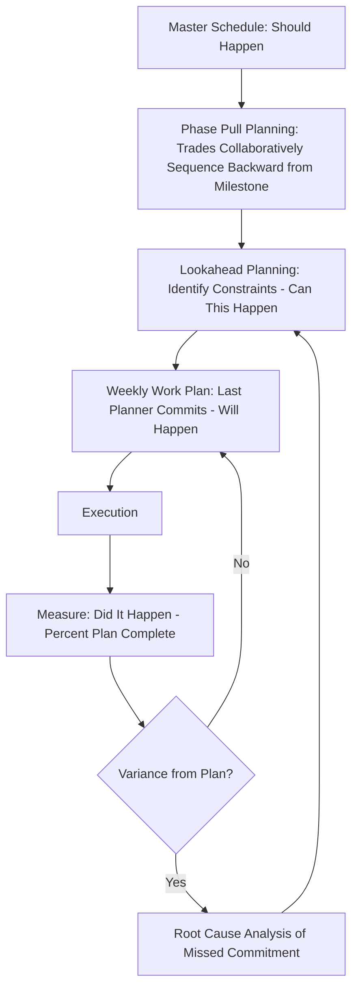

## Lean Construction Principles

### Overview

Lean Construction applies TPS flow, waste-elimination, and pull-system principles to the design and construction of buildings and infrastructure. It emerged as a distinct discipline in the early 1990s, most notably through Lauri Koskela's 1992 technical report "Application of the New Production Philosophy to Construction" (CIFE, Stanford) and the subsequent founding of the International Group for Lean Construction (IGLC) in 1993. The field's most widely adopted practical methodology is the Last Planner System (LPS), developed by Glenn Ballard and Greg Howell.

### Why Construction Requires Distinct Adaptation

**Key Points**

- Unlike a factory, construction produces a single, fixed, unique product (a specific building on a specific site) using a temporary, project-based organization of many independent subcontractors — the production system itself is assembled anew for each project and dissolved afterward, unlike a stable, permanent factory workforce.
- Construction work is location-dependent and sequential in ways manufacturing is not: physical trades (structural, electrical, plumbing, finishing) generally cannot occupy the same physical space simultaneously, creating inherent flow constraints tied to spatial sequencing rather than only process sequencing.
- High variability in weather, site conditions, design changes, and multi-party coordination (architects, engineers, owners, multiple subcontractors, regulatory inspectors) creates far greater plan disruption risk than a controlled factory environment.
- Contractual and organizational fragmentation — separate companies with separate profit motives for design, general contracting, and each trade subcontractor — creates incentive misalignment that manufacturing's typically single-employer production line does not face to the same degree.
- [Inference] This combination of one-off production, high site variability, and fragmented multi-party contracting is generally considered the primary reason construction has historically lagged manufacturing in systematic waste elimination, since many classic lean tools (standardized work, stable takt time, single-employer workforce control) assume conditions that construction projects do not naturally provide.

### Koskela's Transformation-Flow-Value (TFV) Theory

- Lauri Koskela's foundational contribution reframed construction production using three complementary views rather than the traditional "transformation-only" view (converting inputs to outputs) that dominated conventional construction management thinking:
  - **Transformation view:** production as converting materials/inputs into a finished product (the traditional view, focused on task efficiency)
  - **Flow view:** production as a flow of materials and information through time and space, where waiting, moving, and inspecting are non-value-adding flow activities to be minimized (directly derived from TPS flow thinking)
  - **Value view:** production as a process of generating value for the customer/owner, requiring the elimination of any activity that does not contribute to owner-defined requirements
- [Inference] This TFV framework is widely credited in construction management literature as the theoretical bridge that translated TPS's flow and value concepts into a formal academic basis for lean construction, distinguishing the field from earlier "buildability" or "constructability" improvement efforts that focused primarily on the transformation view alone.

### The Last Planner System (LPS)

**Key Points**

The Last Planner System, developed by Glenn Ballard and Greg Howell starting in the early 1990s, is the most widely implemented lean construction planning methodology. It directly addresses construction's variability and fragmentation problems by shifting planning reliability closer to the point of execution.

- **"Last Planner"** refers to the person or team directly responsible for executing a specific piece of work (e.g., a trade foreman) — the person whose commitments actually determine whether work happens as planned, as distinct from higher-level project schedulers who create plans without directly executing them.
- **Should-Can-Will-Did framework:** distinguishes between what a master schedule says *should* happen, what resources and conditions mean a task *can* actually happen, what the responsible party *will* commit to completing in a given period, and what *did* actually get completed — with the gap between "will" and "did" tracked as the core reliability metric.
- **Percent Plan Complete (PPC):** the primary LPS performance metric, calculated as the number of planned weekly work assignments actually completed divided by the total number of assignments planned, tracked over time to measure planning reliability and drive root-cause improvement of missed commitments.
- **Pull planning / reverse-phase scheduling:** milestone-based phase schedules are built backward from a target completion date through collaborative sessions involving all relevant trades, with each trade identifying what they need from upstream trades to be ready to start their own work — directly implementing TPS's pull-system logic (downstream demand triggers upstream work release) applied to construction sequencing.

### Waste in Construction (Reinterpreted)

| Manufacturing Waste (Muda) | Construction Equivalent |
| --- | --- |
| Overproduction | Ordering/fabricating materials far earlier than needed, creating site clutter and handling waste |
| Waiting | Trades idle waiting for prior trade to finish, waiting for inspections, waiting for material deliveries |
| Transportation | Excess material handling/movement across a site due to poor logistics planning |
| Overprocessing | Rework due to design changes, unnecessary quality inspections beyond requirement, over-specification |
| Inventory | Excess material stockpiled on site beyond near-term need, consuming space and risking damage/theft |
| Motion | Workers traveling excessive distances across a site to retrieve tools/materials |
| Defects | Rework due to construction errors, design-coordination clashes discovered late, non-conforming work |
| Underutilized talent/skills | Skilled trades performing material handling/logistics tasks instead of their specialized craft work |

### Building Information Modeling (BIM) as a Lean Enabler

- BIM's 3D/4D (time-integrated) modeling functions as a form of front-loading and clash detection, allowing design coordination conflicts between trades (e.g., ductwork and structural beams occupying the same space) to be identified and resolved digitally before physical construction, directly reducing the defect/rework waste that would otherwise surface on-site.
- [Inference] While BIM is frequently discussed alongside lean construction as a complementary digital tool, BIM adoption and lean construction methodology (such as LPS) are technically independent practices that are commonly, but not necessarily, implemented together; an organization can adopt one without the other, though many practitioner sources describe them as mutually reinforcing.

### Target Value Design (TVD)

- Target Value Design inverts the traditional design-then-estimate-then-cut-scope sequence: the target cost (derived from owner budget and value requirements) is set collaboratively upfront, and the design team designs *to* that target cost throughout the design process rather than designing first and reconciling budget afterward.
- Requires early, continuous collaboration between owner, architect, engineers, and often key trade contractors (sometimes formalized through Integrated Project Delivery contractual structures) to make real-time cost-informed design decisions rather than late-stage value engineering cuts.
- [Inference] TVD is generally considered dependent on collaborative contractual structures (such as Integrated Project Delivery) that align incentives across parties; attempting TVD within traditional adversarial design-bid-build contracts, where the general contractor and subcontractors are selected competitively after design completion, is widely noted in lean construction literature as significantly more difficult because the cost-informed collaboration TVD requires is harder to sustain without shared risk/reward incentives.

### Integrated Project Delivery (IPD) as a Structural Enabler

- IPD is a contractual framework in which owner, architect, and key contractors share risk and reward through a single multi-party agreement, explicitly designed to align incentives across the traditionally fragmented construction supply chain, addressing the organizational fragmentation problem that distinguishes construction from manufacturing.
- IPD is frequently paired with LPS and TVD as a mutually reinforcing set of practices, since IPD's shared-risk structure reduces the adversarial incentive misalignment that otherwise undermines the open, collaborative commitment-sharing that Last Planner and Target Value Design both depend on.

### Common Barriers to Lean Construction Adoption

**Key Points**

- **Fragmented contracting incentives.** Traditional design-bid-build and lump-sum contracts create adversarial dynamics (each party protecting its own margin) that conflict with the collaborative, transparent commitment-sharing lean construction tools require.
- **Temporary project-based workforce.** Unlike a stable factory workforce that can build shared lean culture over years, construction project teams disband at project completion, making sustained kaizen culture and cross-project learning harder to institutionalize.
- **Industry fragmentation and firm-size variation.** The construction industry includes a very large number of small subcontractor firms with limited capacity to invest in lean training, creating uneven lean maturity across the trades working on any given project.
- **Regulatory and inspection dependencies.** Construction schedules depend on external regulatory inspection approvals at fixed points, introducing waiting/flow disruptions outside the project team's direct control, unlike most internal manufacturing process steps.
- **Cultural resistance to public commitment tracking.** Last Planner's public tracking of trade foremen's completed vs. missed commitments (PPC) can initially be perceived as blame-oriented performance surveillance rather than a collaborative reliability-improvement tool, requiring deliberate cultural framing to avoid undermining the psychological safety needed for honest constraint reporting.

### Related Topics

- Last Planner System: detailed weekly work planning and constraint log procedures
- Koskela's Transformation-Flow-Value theory in depth
- Target Value Design and collaborative cost-informed design processes
- Integrated Project Delivery contractual structures and risk-sharing models
- Building Information Modeling (BIM) clash detection and 4D scheduling
- Percent Plan Complete (PPC) metric calculation and root-cause variance tracking
- International Group for Lean Construction (IGLC) research contributions
- Pull planning and reverse-phase scheduling facilitation techniques