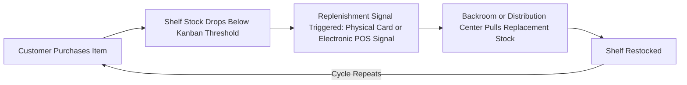

## Lean in Retail and Service Operations

### Overview

Lean applied to retail and service operations extends TPS waste-elimination, flow, and pull-system principles to environments where the "product" is often a customer-facing experience or transaction rather than a physical manufactured good. This spans retail store operations (inventory replenishment, checkout, merchandising), distribution/fulfillment centers, and broader service industries (banking, insurance, call centers, hospitality). Retail lean applications are notable for directly reusing several manufacturing-originated tools with minimal reinterpretation — particularly kanban-based replenishment — while service-sector applications more closely resemble the administrative/office lean adaptation challenges.

### The Eight Wastes Reinterpreted for Retail/Service

| Manufacturing Waste (Muda) | Retail/Service Equivalent |
| --- | --- |
| Overproduction | Overstocking inventory beyond actual demand; producing services/reports beyond what customers need |
| Waiting | Customers waiting in checkout lines, waiting for service representatives, waiting for stock replenishment |
| Transportation | Inefficient movement of goods within distribution centers or between store backroom and shelf |
| Overprocessing | Excessive checkout steps, redundant customer verification/data entry, over-elaborate packaging |
| Inventory | Excess stock tying up capital and shelf/warehouse space, out-of-season or slow-moving inventory |
| Motion | Store associates walking excessive distances to retrieve stock or locate items for customers |
| Defects | Mis-shipped orders, pricing errors, stockouts causing lost sales, incorrect service delivery |
| Underutilized talent/skills | Skilled staff performing routine restocking instead of customer engagement/sales expertise |

### Kanban-Based Retail Replenishment

**Key Points**

- Retail shelf replenishment is one of the most direct and well-established transplants of TPS's kanban pull system: a shelf reaching a minimum visual threshold (empty space, a kanban card, or an electronic reorder signal) triggers replenishment from backroom stock or a distribution center, mirroring the manufacturing kanban logic of downstream consumption pulling upstream replenishment.
- Toyota's own kanban system was reportedly partly inspired by observing US supermarket restocking practices (shelves are restocked based on what customers actually take, not based on a centrally forecasted push schedule), making retail replenishment something of a conceptual origin point for kanban rather than purely a later adaptation of it. [Inference] This supermarket-origin narrative is a commonly repeated element of TPS history in lean literature; the precise degree to which supermarket observation directly shaped kanban's design versus reinforced independently-developed thinking is difficult to establish with certainty from secondary sources.
- Modern electronic point-of-sale (POS) systems and automated reorder triggers function as a digital kanban signal, replacing physical cards with real-time inventory-level-driven replenishment logic, while preserving the core pull-system principle of replenishing based on actual consumption rather than forecast-driven push.

### Value Stream Mapping for Retail and Fulfillment

- Retail/fulfillment value stream mapping traces a product's journey from supplier/distribution center receipt through to customer purchase or delivery, capturing dwell time in each stage (receiving dock, backroom storage, shelf, checkout, or fulfillment pick-pack-ship stages for e-commerce).
- Commonly reveals significant "hidden inventory" waste in backroom storage — stock that has arrived but sits unshelved, extending the total lead time from receipt to actual availability for sale, analogous to work-in-process inventory sitting between manufacturing process steps.
- E-commerce/distribution center fulfillment value streams (pick, pack, ship) closely resemble manufacturing assembly-line flow analysis, and many large fulfillment operations directly apply manufacturing-style time-and-motion study and standardized work to picking/packing processes.

### 5S in Retail and Warehouse Environments

- **Sort:** Remove discontinued, damaged, or obsolete stock from active storage and shelf space
- **Set in Order:** Standardize shelf/bin locations using systematic slotting logic (e.g., high-velocity items placed for minimal picker travel distance) to reduce motion waste
- **Shine:** Maintain clean, safe, and customer-presentable store and warehouse environments
- **Standardize:** Create consistent store layout and backroom organization conventions across multiple store locations in a chain, reducing variation-driven inefficiency when staff transfer between locations
- **Sustain:** Regular audits, often integrated into daily opening/closing store procedures

### Standardized Work in Service Delivery

**Example**

A retail checkout process might apply standardized work by defining: the exact sequence of scanning, bagging, and payment processing steps; standard greeting and upsell scripting timed to not add excessive transaction time; and clearly defined escalation steps for price discrepancies or system errors — creating a consistent baseline customer experience and transaction time across all cashiers, while remaining subject to kaizen-driven revision as better sequences are identified (e.g., a store team discovering that scanning loose produce last reduces bagging rework).

### Takt Time and Demand Leveling in Service Contexts

- Takt time (the rate at which customer demand requires output) can be applied to service staffing: call centers, for instance, calculate staffing levels against forecasted call volume patterns to align service capacity with actual demand rate, directly analogous to matching production line speed to customer demand rate in manufacturing.
- Heijunka (demand leveling) is applied through staffing schedule design that anticipates predictable demand peaks (e.g., lunch rush in food service, weekend retail traffic) and levels available capacity accordingly, rather than uniformly staffing throughout all hours.
- [Inference] Unlike manufacturing, where heijunka often involves leveling the *production schedule itself* against relatively controllable output timing, service/retail demand (customer arrival patterns) is largely uncontrollable by the operation; leveling in this context therefore usually means adjusting staffing/capacity to match demand variability rather than smoothing the demand itself, a meaningfully different application of the same underlying principle.

### Case Example: Amazon Fulfillment Center Operations

**Example**

Amazon's fulfillment center operations are widely discussed in operations literature as applying lean/TPS-derived principles at large scale, including standardized work for picking and packing tasks, extensive use of data-driven process measurement (analogous to time studies), and slotting algorithms that function similarly to 5S-driven location standardization to minimize picker motion waste. [Unverified] Amazon has not, to the author's knowledge, publicly characterized its fulfillment operations as a direct or formal implementation of TPS/lean methodology in the same explicit way that organizations like Virginia Mason or NUMMI have; the lean-adjacent characterization in secondary literature is more of an external analytical observation about operational similarities than a claim about Amazon's own stated methodology, and should be treated as such.

### Common Barriers to Retail/Service Lean Adoption

**Key Points**

- **High demand volatility and unpredictability.** Consumer demand patterns (seasonal, trend-driven, weather-affected) are often harder to forecast reliably than industrial component demand, complicating pull-system calibration and staffing-based heijunka.
- **Multi-location standardization challenges.** Retail chains operating hundreds or thousands of locations face significant variation in local store conditions, staff turnover rates, and regional customer behavior, making uniform standardized work harder to sustain compared to a single manufacturing facility.
- **High frontline staff turnover.** Retail and service industries often have significantly higher frontline employee turnover than manufacturing, undermining the deep cross-training and process ownership that sustained kaizen culture typically requires.
- **Customer-facing variability.** Unlike a manufacturing process with controlled inputs, service delivery inherently involves variable customer behavior and requests, limiting the degree to which service standardization can eliminate all process variation without sacrificing customer responsiveness.
- **Tension between labor cost minimization and lean flow principles.** Retail operations under aggressive labor-cost-per-hour optimization pressure may understaff relative to actual demand variability, creating the customer-wait-time waste that heijunka-based staffing is intended to prevent — a conflict between short-term cost metrics and lean flow principles similar to the metrics-mismatch challenge seen in office lean adoption.

### Related Topics

- Kanban-based automatic replenishment systems and electronic POS reorder triggers
- Value stream mapping for e-commerce fulfillment (pick-pack-ship) operations
- Takt time calculation and staffing models for call centers and service operations
- 5S and warehouse slotting optimization to reduce picker motion waste
- Standardized work design for customer-facing transaction processes
- Heijunka applied to variable, uncontrollable customer demand patterns
- Multi-location standardization challenges in retail chain operations
- Labor cost metrics vs. flow-based staffing models in service operations