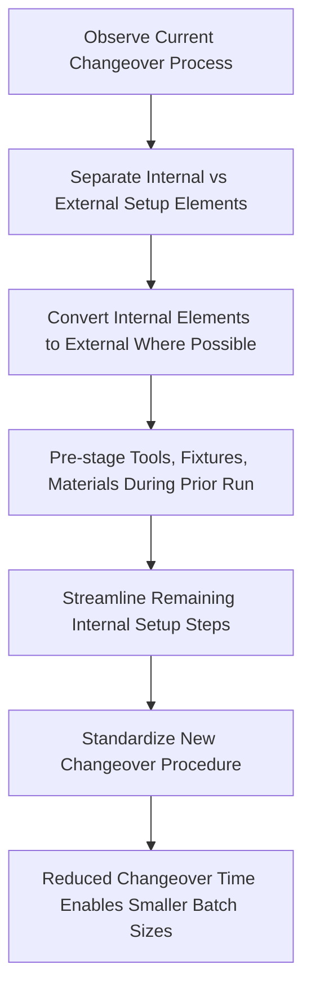

## Adapting TPS Tools to Low Volume, High Mix Environments

### Overview

Low-volume, high-mix (LVHM) production environments — characterized by many distinct product variants, each produced in small quantities, often to specific customer order — present a fundamentally different challenge from the high-volume, relatively low-mix automotive assembly context in which TPS was originally developed. Applying TPS in LVHM settings (common in aerospace, industrial equipment, custom fabrication, job shops, and made-to-order manufacturing) requires adapting core tools built around repetition and predictable takt time to conditions of high variability and unpredictable demand patterns.

### Why LVHM Environments Challenge Classic TPS Assumptions

**Key Points**

- Toyota's original TPS was refined primarily in the context of high-volume passenger vehicle assembly with relatively limited model variation on a given line, where stable, repeatable takt time and standardized work could be calculated against consistent, predictable demand.
- LVHM environments often have highly variable cycle times between product variants, small batch sizes (sometimes batch-of-one custom orders), and unpredictable order sequencing, all of which complicate the direct application of fixed takt time, single-piece flow lines, and rigid standardized work sequences designed around a narrow product range.
- Changeover/setup time becomes proportionally far more significant in LVHM contexts, since frequent product changes mean setup time is incurred much more often relative to run time than in high-volume single-model production.
- [Inference] Because classic TPS tools were refined under conditions of relative product stability, LVHM adaptation generally requires greater emphasis on flexibility-enabling tools (quick changeover, cellular manufacturing, flexible standardized work) relative to the pure flow-line and fixed-takt tools that dominate high-volume TPS case studies, though the underlying waste-elimination and flow principles remain directionally the same.

### Core Adaptation: SMED (Single-Minute Exchange of Die)

- SMED, developed by Shigeo Shingo (a key contributor to TPS methodology, distinct from Ohno), is the foundational tool for LVHM adaptation, since reducing changeover/setup time directly addresses the core constraint that makes small-batch, high-mix production economically viable without sacrificing flow.
- SMED methodology separates setup activities into **internal setup** (tasks that can only be performed while the machine/process is stopped) and **external setup** (tasks that can be performed while the machine is still running the previous job, such as staging tools, fixtures, or materials in advance).
- The core SMED improvement sequence: (1) identify and separate internal vs. external setup elements, (2) convert as many internal elements to external as possible (pre-staging, pre-heating, standardized fixture designs), (3) streamline remaining internal elements (quick-release fasteners, standardized fixture heights, one-touch clamps) to further reduce changeover time.
- [Inference] Because SMED directly reduces the economic penalty of frequent changeovers, it functions as an enabling precondition for many other LVHM lean tools (smaller batch sizes, mixed-model flow) rather than a standalone technique — without adequate changeover reduction, attempting small-batch flow in a high-mix environment often produces excessive non-value-added setup time that erodes the efficiency gains flow is meant to provide.

### Mixed-Model Production and Heijunka Adaptation

**Key Points**

- Heijunka (production leveling) in LVHM contexts focuses less on leveling a single product's volume (as in classic automotive heijunka boxes) and more on sequencing a varied mix of products through shared production resources in a pattern that smooths total workload and material demand across the mix.
- A heijunka box or leveling schedule in a high-mix environment sequences different product variants in a repeating pattern (e.g., interleaving high-complexity and low-complexity items) so that downstream processes and suppliers see a more predictable, averaged demand signal rather than large unpredictable batches of any single variant.
- Mixed-model flow lines are designed to accommodate product variation directly within a shared line/cell, using flexible fixtures, modular tooling, and standardized work that includes variant-specific sub-steps, rather than requiring entirely separate lines per product variant.
- [Inference] The degree of mixing achievable depends heavily on how much process similarity exists across the product mix; environments with extremely divergent process routings across variants (true job-shop conditions) often cannot achieve true mixed-model flow-line sequencing and instead rely more heavily on cellular manufacturing approaches (see below) than on a single shared flow line.

### Cellular Manufacturing for High Product Variety

- Cellular manufacturing groups machines/workstations by product family (based on similar processing requirements) rather than by process type (all lathes together, all drills together), allowing a family of related product variants to flow through a compact cell with minimal transport and waiting, even though individual products within the family differ.
- Group Technology (GT) classification — analyzing products to identify families sharing similar processing steps, dimensions, or routing — is typically the analytical precursor to cell design, since effective cellular layouts depend on grouping products with genuinely similar flow requirements rather than superficial similarity.
- Cells are often designed with flexible, quickly reconfigurable workstations (adjustable fixtures, modular tooling) to accommodate the variation within a product family without requiring a full changeover for each variant.

### Standardized Work in High-Mix Contexts

- Rather than a single fixed sequence (appropriate for a single repeated product), LVHM standardized work is often documented as a family of related work sequences or a decision-based standard work document that specifies common steps plus variant-specific branches (e.g., "if part type A, perform steps 4a-4c; if part type B, perform steps 4d-4f").
- Visual work instructions and digital work-instruction systems are more heavily relied upon in high-mix settings than in repetitive single-model lines, since operators must correctly recall or reference more variant-specific detail across a wider product range, increasing the risk of defects from operator memory reliance alone.
- [Inference] The greater documentation burden of high-mix standardized work is a commonly cited practical challenge in LVHM lean implementations; some organizations address this through digital andon/work-instruction systems that automatically display the correct variant-specific instructions based on the part or work order currently in process, though the maturity of such systems varies significantly by organization and is not a universal LVHM practice.

### Pull Systems and Kanban Adaptation for High Mix

- Classic two-bin or card-based kanban systems designed for stable, high-volume single-part replenishment often require modification in high-mix contexts, since maintaining separate kanban loops for a very large number of low-volume part variants can become administratively unwieldy.
- Common adaptations include: **broadcast/sequenced kanban** (signals tied to a specific customer order sequence rather than generic stock replenishment), **CONWIP (constant work-in-process)** systems that cap total WIP across the mixed product flow rather than per-part-number kanban loops, and **electronic kanban (e-kanban)** systems that reduce the administrative overhead of managing many simultaneous low-volume replenishment signals.
- [Inference] CONWIP, developed by Mark Spearman and colleagues as a generalization of kanban logic, is frequently cited in operations literature as particularly well-suited to high-mix environments precisely because it controls total system WIP rather than requiring a separate kanban loop per part number, though the specific tool selected in practice depends heavily on the particular mix characteristics and order volume of the environment in question.

### Comparison: High-Volume vs. Low-Volume High-Mix TPS Application

| Dimension | High-Volume, Low-Mix (Classic Automotive TPS) | Low-Volume, High-Mix Adaptation |
| --- | --- | --- |
| Takt time stability | Relatively stable, calculated against consistent demand | Highly variable; may require averaged or banded takt ranges |
| Changeover significance | Lower proportion of total time | Central constraint; SMED is foundational |
| Standardized work format | Single fixed sequence per station | Decision-based/variant-branching sequences |
| Line/cell layout | Dedicated flow lines per product/model | Cellular manufacturing grouped by product family |
| Kanban structure | Simple, stable two-bin/card loops per part | Broadcast, sequenced, CONWIP, or e-kanban systems |
| Batch size goal | Single-piece flow generally achievable | Smallest economically viable batch given changeover constraints |

### Common Barriers to LVHM Lean Adoption

**Key Points**

- **Underinvestment in changeover reduction.** Organizations sometimes attempt small-batch flow without first investing sufficiently in SMED-driven changeover reduction, resulting in excessive non-value-added setup time that undermines the intended efficiency gains.
- **Overreliance on operator memory across high product variety.** Without adequate visual/digital work-instruction support, high product variety increases defect risk from operators misapplying standardized steps meant for a different variant.
- **Forecasting difficulty undermining leveling.** Unlike relatively predictable automotive model-mix demand, some LVHM environments (custom/engineer-to-order businesses in particular) face demand patterns too unpredictable to support meaningful heijunka-style leveling, requiring greater reliance on flexible capacity and CONWIP-style WIP caps rather than pre-planned leveling schedules.
- **Group Technology misapplication.** Poorly analyzed product families (grouped by superficial similarity rather than genuine process-routing similarity) can produce cellular layouts that fail to deliver the intended flow benefits, since dissimilar actual processing requirements reintroduce the transport and waiting waste cells are meant to eliminate.

### Related Topics

- SMED (Single-Minute Exchange of Die) methodology: internal vs. external setup conversion techniques
- Group Technology and product family classification methods
- CONWIP systems vs. traditional kanban: design and comparison
- Cellular manufacturing layout design principles
- Mixed-model heijunka scheduling and sequencing patterns
- Digital/electronic kanban (e-kanban) systems for high part-count environments
- Engineer-to-order vs. make-to-stock production planning implications for lean tool selection
- Visual and digital standardized work instruction systems for high product variety