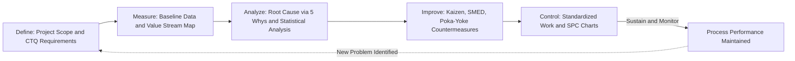

## Lean Six Sigma Integration and the Belt Certification Structure

### Overview

Lean Six Sigma (LSS) is a hybrid improvement methodology combining TPS-derived Lean principles (waste elimination, flow, speed) with Six Sigma's statistical process control and defect-reduction methodology (originally developed at Motorola in the 1980s and popularized by General Electric in the 1990s under Jack Welch). The two methodologies are complementary rather than redundant: Lean primarily targets flow efficiency and non-value-added waste, while Six Sigma primarily targets process variation and defect rates using structured statistical analysis. LSS also introduced a martial-arts-inspired "belt" certification hierarchy (White, Yellow, Green, Black, Master Black Belt) that has become a widely recognized (though not universally standardized) credentialing structure in industry.

### Why Lean and Six Sigma Are Combined

**Key Points**

- Lean excels at identifying and eliminating waste and improving flow speed but has comparatively limited built-in statistical tools for diagnosing the root causes of process variation in complex, multi-variable processes.
- Six Sigma excels at rigorous statistical root-cause analysis and variation reduction but, used alone, does not inherently focus on flow speed, lead time reduction, or the broader waste-elimination and respect-for-people cultural elements central to TPS.
- A process can be "fast but defective" (high flow, poor quality) or "precise but slow" (low variation, poor flow) — LSS aims to address both dimensions simultaneously rather than treating speed and quality improvement as separate initiatives.
- [Inference] The combination of Lean and Six Sigma into a single named methodology (rather than simply applying both independently) is generally credited to consultants and practitioners in the late 1990s and early 2000s (Michael George's 2002 book *Lean Six Sigma* is among the most frequently cited early synthesizing texts), reflecting an industry-driven convergence of two previously separate improvement traditions rather than a single deliberate joint academic origin.

### DMAIC: The Core Six Sigma Improvement Cycle

DMAIC is the standard five-phase Six Sigma problem-solving structure, into which Lean tools are commonly integrated at each phase within an LSS framework:

| Phase | Purpose | Common Lean Tools Integrated |
| --- | --- | --- |
| **Define** | Define the problem, project scope, and customer (CTQ — Critical to Quality) requirements | Voice of Customer analysis, project charter, high-level value stream map |
| **Measure** | Establish baseline process performance and data collection reliability | Value stream mapping (detailed), process cycle efficiency calculation, waste identification |
| **Analyze** | Identify root causes of defects or waste using statistical and qualitative tools | 5 Whys, fishbone/Ishikawa diagrams, statistical hypothesis testing, regression analysis |
| **Improve** | Design and test countermeasures/solutions | Kaizen events, SMED, poka-yoke (error-proofing), pilot testing with statistical validation |
| **Control** | Sustain the improved process and prevent regression | Standardized work, statistical process control (SPC) charts, visual management, control plans |

### DMAIC vs. PDCA: Relationship and Distinction

- PDCA (Plan-Do-Check-Act), central to TPS's kaizen cycle, and DMAIC serve similar iterative-improvement functions but differ in typical scope and rigor: PDCA cycles are generally lighter-weight and faster, suited to frontline continuous small improvements, while DMAIC projects are typically larger-scope, more data-intensive, and led by trained belt practitioners over a longer project timeline (often weeks to months).
- [Inference] Many LSS practitioners describe DMAIC as effectively an elaborated, more statistically rigorous version of PDCA suited to complex problems where root cause is not obvious from direct observation alone, while reserving PDCA/kaizen for problems where frontline teams can identify and test countermeasures quickly without extensive statistical analysis; this distinction is a common practitioner heuristic rather than a rigid, universally agreed rule.

### The Belt Certification Structure

**Key Points**

The belt system, borrowed metaphorically from martial arts ranking, denotes increasing levels of LSS training depth, project leadership responsibility, and statistical sophistication. Unlike Six Sigma's originating certification bodies (which have more formalized traditions), the LSS belt structure is not governed by a single universal standards body, and specific curriculum content, project requirements, and hour requirements for each belt vary meaningfully across certifying organizations (e.g., ASQ, IASSC, various universities and private training providers).

- **White Belt:** Introductory awareness-level training covering basic Lean and Six Sigma vocabulary and concepts; typically a short course (hours, not days) aimed at broad organizational awareness rather than project leadership capability.
- **Yellow Belt:** Foundational training enabling participation as a team member on improvement projects; covers basic DMAIC structure and core lean tools (5S, waste identification, basic process mapping) without deep statistical methods.
- **Green Belt:** Intermediate-level certification enabling an individual to lead small-to-medium improvement projects, typically part-time alongside their regular job role; covers DMAIC in depth along with foundational statistical tools (basic hypothesis testing, control charts, regression basics) and typically requires completion of a real workplace improvement project to certify.
- **Black Belt:** Advanced certification for individuals who lead complex, high-impact improvement projects often as a full-time role; requires deeper statistical proficiency (design of experiments, advanced hypothesis testing, process capability analysis) and frequently serves as a mentor/coach to Green Belts within the organization.
- **Master Black Belt (MBB):** The most advanced level, typically held by individuals responsible for training and mentoring Black Belts, developing organizational LSS strategy, and leading the most complex or cross-functional improvement initiatives across an organization.

[Unverified] Because no single global certifying body governs LSS belt standards the way some other professional certifications are governed, specific hour requirements, project count requirements, and content depth associated with each belt level vary across certifying organizations (ASQ, IASSC, and numerous corporate and university programs each publish their own requirements); readers seeking a specific organization's exact certification requirements should consult that organization's current published standards directly rather than treating any single description as universal.

### Where Lean Tools and Six Sigma Tools Complement Each Other

**Key Points**

- **Value Stream Mapping (Lean) + Statistical Process Control (Six Sigma):** VSM identifies where flow bottlenecks and waste occur across a process; SPC then diagnoses whether a specific step's variation is due to common cause (inherent process variation) or special cause (identifiable, correctable disruption).
- **5S/Standardized Work (Lean) + Control Plans (Six Sigma):** Lean's workplace organization and standardized work provide the physical/procedural foundation that Six Sigma's Control phase formalizes into a documented, monitored control plan to sustain gains.
- **Kaizen Events (Lean) + Design of Experiments (Six Sigma):** Rapid kaizen events can generate and test improvement hypotheses quickly at the team level, while formal Design of Experiments (DOE) provides more statistically rigorous testing when multiple interacting variables need to be isolated and optimized simultaneously.
- **Poka-Yoke (Lean error-proofing) + Process Capability Analysis (Six Sigma):** Six Sigma's capability analysis (e.g., Cp/Cpk metrics) identifies which process steps have the highest defect risk; poka-yoke devices are then designed specifically to error-proof those highest-risk steps.

### Common Criticisms and Adoption Challenges

- **Perceived overcomplexity for simple problems.** Critics note that applying full DMAIC statistical rigor to problems that a simple PDCA/kaizen cycle could resolve faster can itself become a form of overprocessing waste — a criticism sometimes leveled at LSS programs that mandate DMAIC structure for all improvement work regardless of problem complexity.
- **Belt certification without genuine capability.** Because belt programs vary widely in rigor across providers, organizations sometimes encounter "certified" practitioners whose actual statistical or lean tool proficiency does not match the credential, a commonly cited concern in LSS practitioner discussions regarding certification quality control.
- **Tension between Six Sigma's statistical rigor culture and Lean's frontline-driven kaizen culture.** Six Sigma projects are often led by dedicated, specially trained Black Belts working somewhat separately from daily operations, which can create a different organizational dynamic than TPS's emphasis on continuous, frontline-driven small-scale kaizen involving all workers — some practitioners argue this can inadvertently concentrate improvement ownership in specialists rather than distributing it broadly across the workforce as classic TPS culture intends.
- **Statistical tool overuse in low-data or high-variability contexts.** [Inference] In contexts with limited historical data or where processes are inherently highly variable and non-repetitive (such as some LVHM or project-based environments), Six Sigma's statistical toolkit, which generally assumes reasonably repeatable process behavior for meaningful analysis, may be less directly applicable than in high-volume repetitive manufacturing, requiring practitioners to adapt or select tools carefully rather than applying the full standard DMAIC statistical toolkit uniformly.

### Related Topics

- DMAIC phase-by-phase tool selection guide
- Statistical Process Control (SPC) chart types and interpretation
- Design of Experiments (DOE) methodology for multi-variable process optimization
- Process capability analysis (Cp/Cpk) and defect rate calculation
- Comparing certifying bodies: ASQ vs. IASSC vs. corporate-internal LSS programs
- PDCA vs. DMAIC: selecting the right improvement cycle for problem complexity
- Building organizational Master Black Belt mentorship and governance structures
- Integrating value stream mapping with statistical root cause analysis