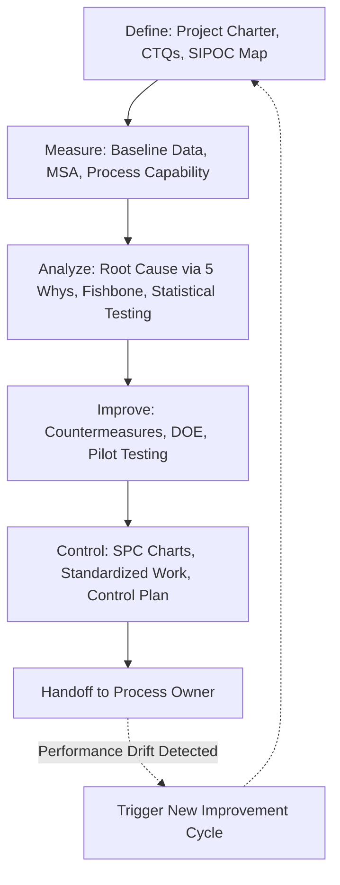

## The DMAIC Framework of Define, Measure, Analyze, Improve, and Control

### Overview

DMAIC (Define, Measure, Analyze, Improve, Control) is the core structured problem-solving methodology of Six Sigma, providing a data-driven, sequential framework for reducing process variation and defects. Within a Lean Six Sigma context, DMAIC is the primary vehicle through which Six Sigma's statistical rigor is combined with Lean's waste-elimination and flow tools, functioning as the more formal, statistically intensive counterpart to TPS's lighter-weight PDCA cycle. DMAIC is typically applied to existing processes with a known problem to solve, as distinguished from DMADV/DFSS (Design for Six Sigma), which is used for designing new processes or products from scratch.

### The Five Phases in Detail

**Define**

**Key Points**

- Establishes the project charter: problem statement, business case/impact, project scope and boundaries, project timeline, and team roles.
- Identifies the customer and their Critical to Quality (CTQ) requirements — the specific, measurable characteristics of the process output that matter most to the customer, translated from often-vague customer feedback (Voice of Customer, VOC) into specific measurable requirements.
- Produces a high-level process map (often a SIPOC diagram: Suppliers, Inputs, Process, Outputs, Customers) to establish the boundaries and major steps of the process under study before detailed analysis begins.
- A poorly scoped Define phase is commonly cited as a leading cause of DMAIC project failure or scope creep; overly broad problem statements make root cause isolation in the Analyze phase significantly harder.

**Measure**

**Key Points**

- Establishes a reliable, quantified baseline of current process performance against the CTQs identified in Define, ensuring the team is measuring the right things before attempting to improve them.
- Includes a Measurement System Analysis (MSA) — verifying that the data collection method itself is accurate and consistent (e.g., Gage R&R studies for physical measurement systems) — since improvement conclusions drawn from unreliable data collection can be misleading regardless of subsequent analytical rigor.
- Detailed value stream mapping is commonly integrated here as a Lean tool, capturing cycle time, wait time, and process cycle efficiency at each step to complement the statistical baseline data.
- Establishes baseline defect rates, process capability (Cp/Cpk), or Defects Per Million Opportunities (DPMO), depending on the nature of the problem, providing the quantitative reference point against which Improve-phase changes will later be measured.

**Analyze**

**Key Points**

- Uses both qualitative and statistical tools to move from *where* the problem occurs (established in Measure) to *why* it occurs, distinguishing correlation from causation through structured analysis.
- Common qualitative tools: 5 Whys, fishbone/Ishikawa (cause-and-effect) diagrams organized around standard categories (commonly Man, Machine, Method, Material, Measurement, Environment — the "6 Ms"), and Pareto analysis to identify which few causes account for the majority of defects (the 80/20 principle applied to root cause prioritization).
- Common statistical tools: hypothesis testing (t-tests, ANOVA) to determine whether observed differences between process conditions are statistically significant or due to random variation, regression analysis to quantify relationships between input variables (X's) and outcome variables (Y's), and correlation analysis to narrow the list of candidate root causes.
- The Analyze phase output is typically a validated, data-supported list of root causes (or a ranked/prioritized short list) that the Improve phase will specifically target, rather than a broad set of untested hypotheses.

**Improve**

**Key Points**

- Generates, evaluates, and implements countermeasures/solutions specifically targeting the validated root causes identified in Analyze, rather than broad general process changes.
- Common tools integrated here from Lean include kaizen events (rapid, team-based solution generation and testing), SMED (for changeover-related root causes), and poka-yoke error-proofing device design.
- Design of Experiments (DOE) is a distinctly Six Sigma statistical tool frequently used in the Improve phase when multiple interacting variables need to be tested systematically and efficiently (rather than one-variable-at-a-time testing) to find an optimal process setting.
- Solutions are typically piloted at small scale first, with statistical comparison of pilot results against the Measure-phase baseline to confirm the improvement is both statistically significant and practically meaningful before full-scale rollout.

**Control**

**Key Points**

- Ensures the improved process performance is sustained over time and does not regress to the prior baseline state after the project team's direct involvement ends — addressing a common failure mode where initial gains erode once attention moves elsewhere.
- Standardized work documentation (a core Lean tool) is typically finalized here to lock in the improved process as the new baseline method.
- Statistical Process Control (SPC) charts (e.g., X-bar and R charts, control charts with upper/lower control limits) are established to monitor ongoing process performance and flag when the process drifts out of statistical control, enabling early intervention before defects accumulate.
- A formal control plan document typically specifies what is monitored, how frequently, by whom, and what response is required if performance falls outside acceptable limits, along with a transition/handoff plan from the project team to the process owner who will sustain it going forward.

### Example: DMAIC Applied to a Manufacturing Defect Problem

**Example**

A manufacturing line experiencing an elevated scrap rate on a machined component might proceed through DMAIC as follows:

1. **Define:** Project charter states the scrap rate (currently 8%) is above the 2% target, costing an estimated amount in rework and material waste; CTQ is defined as dimensional tolerance conformance on the critical machined feature.
2. **Measure:** Baseline data collection confirms actual scrap rate and process capability (Cpk) for the critical dimension; a Gage R&R study confirms the measurement gauge itself is reliable before trusting the collected data.
3. **Analyze:** A fishbone diagram organizes potential causes (tool wear, operator technique variation, material batch variation, machine calibration drift); statistical analysis (ANOVA comparing scrap rates across three shifts) reveals a statistically significant difference by shift, narrowing the investigation toward operator technique and shift-specific machine calibration practices.
4. **Improve:** A kaizen event with operators from all three shifts standardizes the calibration-check procedure at shift start (poka-yoke: calibration check built into a mandatory startup checklist); a pilot run over two weeks shows scrap rate reduced to 2.3%, a statistically significant improvement confirmed via hypothesis testing against the baseline.
5. **Control:** Standardized work is updated to include the mandatory calibration checklist; an SPC chart tracking daily scrap rate is posted visually at the line, with a documented response protocol if scrap rate exceeds 3% on any given day; the process owner (line supervisor) assumes ongoing monitoring responsibility from the project team.

### DMAIC vs. PDCA: When to Use Which

| Dimension | PDCA (Plan-Do-Check-Act) | DMAIC |
| --- | --- | --- |
| Typical problem complexity | Simple to moderate; cause often identifiable through direct observation | Moderate to complex; root cause often requires statistical isolation among multiple variables |
| Typical timeframe | Days to weeks | Weeks to months |
| Statistical rigor | Generally minimal; relies on direct observation and simple data | Formal statistical tools (hypothesis testing, regression, DOE) |
| Typical leadership | Frontline team, often without specialized certification | Trained Green Belt or Black Belt practitioner |
| Best suited for | Rapid, iterative frontline improvement (classic kaizen) | Complex, cross-functional, or high-stakes problems requiring rigorous root cause validation |

[Inference] This comparison reflects common practitioner guidance on tool selection rather than a rigid rule; many organizations use both cycles concurrently for different categories of problems, and some problems may begin with a lighter PDCA approach before escalating to full DMAIC if initial attempts fail to resolve the issue.

### Common Pitfalls in DMAIC Execution

**Key Points**

- **Skipping to solutions before completing Analyze.** Teams under pressure to show results sometimes jump from Measure directly to implementing a "known fix" without validating root cause first, risking wasted effort on a countermeasure that does not address the actual driver of the problem.
- **Inadequate Measurement System Analysis.** Proceeding with analysis based on unreliable data collection (unvalidated gauges, inconsistent manual data entry) can produce statistically confident but substantively wrong conclusions.
- **Weak Control phase follow-through.** Projects that conclude at Improve without establishing genuine ongoing monitoring and process-owner accountability are commonly cited as a leading cause of improvement regression after project closure.
- **Over-applying statistical rigor to simple problems.** As noted in Lean Six Sigma integration discussions, mandating full DMAIC structure for problems a simple PDCA cycle could resolve faster introduces its own process overhead/waste.

### Related Topics

- SIPOC diagramming and process boundary definition in the Define phase
- Measurement System Analysis (MSA) and Gage R&R methodology
- Statistical hypothesis testing (t-tests, ANOVA) for root cause validation
- Design of Experiments (DOE) for multi-variable process optimization
- Statistical Process Control (SPC) chart types and control limit calculation
- Fishbone/Ishikawa diagram construction and the 6 Ms framework
- DMADV/Design for Six Sigma (DFSS) for new process/product design
- Control plan documentation and process-owner handoff practices