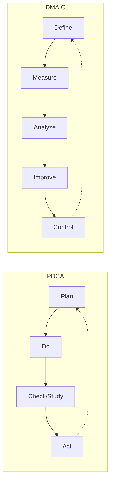

## Comparing PDCA and DMAIC Problem Solving Cycles

### Overview

PDCA (Plan-Do-Check-Act, also rendered PDSA — Plan-Do-Study-Act) and DMAIC (Define-Measure-Analyze-Improve-Control) are the two most widely used structured problem-solving cycles in continuous improvement work, originating from distinct but related traditions: PDCA traces to Walter Shewhart's statistical quality control work in the 1920s–30s and was popularized by W. Edwards Deming, becoming central to TPS's kaizen methodology; DMAIC developed within the Six Sigma tradition at Motorola in the 1980s and was formalized as Six Sigma's standard project structure. Both cycles share the same underlying scientific-method logic (hypothesize, test, evaluate, standardize) but differ meaningfully in typical scope, rigor, and organizational context of use.

### Structural Comparison

| Phase Correspondence | PDCA | DMAIC |
| --- | --- | --- |
| Problem framing/scoping | Plan (partial) | Define |
| Baseline understanding | Plan (partial) | Measure |
| Root cause investigation | Plan (partial) | Analyze |
| Solution design and testing | Do | Improve (partial) |
| Evaluation of results | Check (Study) | Improve (partial) |
| Standardization/sustaining | Act | Control |

[Inference] This phase-correspondence mapping is a commonly used pedagogical simplification to help practitioners already familiar with one cycle understand the other; the two frameworks are not a strict one-to-one translation, since DMAIC's five phases distribute investigative and evaluative work differently than PDCA's four broader phases, and some practitioner sources map the phases somewhat differently than shown here.

### PDCA: Structure and Characteristics

**Key Points**

- **Plan:** Identify the problem, form a hypothesis about root cause, and design a test or countermeasure to address it — often based on direct observation (Genchi Genbutsu) rather than extensive statistical data collection.
- **Do:** Implement the planned countermeasure, typically at small scale or as a limited trial, to test the hypothesis.
- **Check (or Study, in Deming's later PDSA revision):** Evaluate whether the countermeasure produced the expected result, comparing actual outcomes against the original hypothesis.
- **Act:** If successful, standardize the change as the new standard work; if unsuccessful, revise the hypothesis and cycle again — either outcome feeds directly into a new Plan phase, making PDCA inherently iterative and often executed in rapid, repeated cycles.
- PDCA is the operational engine of kaizen in TPS: frontline teams and individual workers are expected to run PDCA cycles frequently and independently as part of routine work, rather than treating it as a specialized project methodology requiring dedicated certification.
- Typically requires minimal formal statistical training to execute, relying more on direct observation, simple data (counts, checksheets), and iterative testing than on hypothesis testing or regression analysis.

### DMAIC: Structure and Characteristics

**Key Points**

- Five distinct phases (see the DMAIC framework topic for full detail) provide more granular structure than PDCA's four phases, particularly by separating problem definition (Define) from baseline measurement (Measure) and by dedicating an entire phase (Analyze) specifically to statistical root cause validation before any solution is attempted.
- Typically executed as a formal, bounded project with a defined charter, timeline, and assigned project leader (commonly a trained Green Belt or Black Belt), rather than as a continuous, informal frontline activity.
- Makes more extensive and explicit use of statistical tools throughout — Measurement System Analysis, hypothesis testing, regression, Design of Experiments — reflecting Six Sigma's origins in reducing process variation in complex manufacturing (originally semiconductor manufacturing at Motorola) where root causes are often not identifiable through direct observation alone.
- The Control phase's emphasis on formal SPC charting and documented control plans provides more structured, ongoing statistical monitoring than PDCA's typically simpler standardization step, though both aim at the same underlying goal of preventing regression.

### Key Differences Summarized

**Key Points**

- **Scope and typical problem complexity:** PDCA is generally suited to simpler problems where root cause can be identified through direct observation and reasonably quick testing; DMAIC is generally suited to more complex problems, often with multiple interacting variables, where rigorous statistical isolation of root cause is necessary before a countermeasure can be confidently designed.
- **Cycle speed and frequency:** PDCA cycles are typically fast (hours to days for a single cycle) and repeated frequently as part of continuous frontline improvement; DMAIC projects typically run over weeks to months as a single bounded project.
- **Practitioner training requirements:** PDCA can be taught relatively quickly to any frontline worker as part of a lean culture; DMAIC typically requires formal belt-level training (Green Belt or above) given its statistical content.
- **Organizational ownership model:** PDCA is designed to be distributed broadly across the workforce as an everyday practice (a core element of TPS's respect-for-people philosophy, empowering frontline problem-solving); DMAIC projects are more commonly led by designated specialists (Black Belts), which some critics argue can inadvertently concentrate improvement ownership rather than distributing it as broadly as classic kaizen culture intends.
- **Statistical rigor:** DMAIC's built-in statistical validation (hypothesis testing, capability analysis) provides stronger formal evidence that an observed improvement is real and not due to random variation, which PDCA's simpler Check phase does not inherently provide unless the team deliberately incorporates statistical comparison.

### When to Use Which: Practical Guidance

**Key Points**

- **Favor PDCA when:** the problem is well-understood through direct observation, a hypothesis can be tested quickly and cheaply, the team lacks specialized statistical training, and rapid iteration is more valuable than exhaustive root-cause certainty (e.g., most frontline shop-floor or office kaizen activity).
- **Favor DMAIC when:** the problem involves multiple interacting variables whose individual contribution to the defect/variation is not obvious from observation alone, the stakes are high enough to justify a more resource-intensive investigation, statistical validation is needed to convince stakeholders or satisfy regulatory/quality requirements, or the problem has resisted simpler PDCA-based attempts to resolve it.
- **Escalation pattern:** [Inference] A commonly described practitioner pattern is to begin with PDCA for a given problem, and escalate to a formal DMAIC project specifically when repeated PDCA cycles fail to produce a sustained fix — treating DMAIC's greater rigor and resource cost as justified once the simpler cycle has been tried and proven insufficient, though this exact escalation criterion is a practical heuristic rather than a formally standardized rule across organizations.
- Organizations running mature Lean Six Sigma programs frequently use both cycles concurrently for different categories of problems rather than treating them as mutually exclusive choices — PDCA remains the default for continuous frontline kaizen, while DMAIC is reserved for a smaller number of higher-complexity, higher-impact projects.

### Common Misapplications

- **Using DMAIC for problems better suited to PDCA.** Applying full DMAIC statistical machinery to a problem whose cause is already evident from direct observation adds unnecessary process overhead and project timeline, a form of overprocessing waste ironically inconsistent with Lean's own principles.
- **Using PDCA for problems that actually require DMAIC's rigor.** Attempting to solve a complex, multi-variable variation problem through simple PDCA iteration without statistical isolation of root cause can lead to repeated failed countermeasures, since the team may be testing hypotheses that address symptoms rather than the true statistically dominant cause.
- **Treating the two cycles as competing rather than complementary.** [Inference] Framing PDCA and DMAIC as rival methodologies (rather than tools suited to different problem types within the same overall continuous improvement culture) is a common conceptual error; most Lean Six Sigma practitioner literature treats them as complementary tools selected based on problem characteristics rather than as competing philosophies requiring an organization to choose one over the other.

### Related Topics

- The DMAIC framework in full phase-by-phase detail
- Deming's PDSA revision and its distinction from the original PDCA formulation
- Kaizen event structure and its relationship to rapid PDCA cycling
- Statistical hypothesis testing as a bridge between PDCA's Check phase and DMAIC's Analyze phase
- Belt certification structure and DMAIC project leadership requirements
- A3 problem-solving reports as a structured PDCA documentation format
- Selecting improvement methodology based on problem complexity and data availability
- Organizational culture factors supporting distributed PDCA vs. specialist-led DMAIC ownership