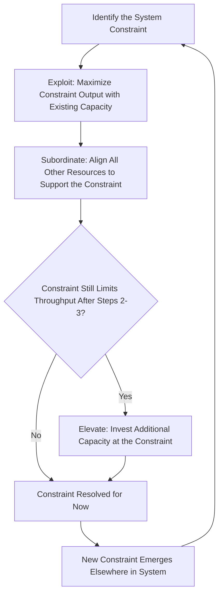

## Theory of Constraints and Its Relationship to Lean Thinking

### Overview

Theory of Constraints (TOC) is a management methodology developed by Eliyahu M. Goldratt, first introduced through his 1984 business novel *The Goal* and formalized in subsequent works including *The Race* (1986) and *It's Not Luck* (1994). TOC centers on the principle that any system's overall performance is limited by a small number of constraints (bottlenecks), and that systematic, ongoing focus on identifying and managing these constraints — rather than attempting uniform improvement everywhere — produces the greatest system-wide performance gains. TOC shares significant conceptual overlap with Lean/TPS (both emerged from operations improvement thinking and both emphasize flow), but the two developed largely independently and differ in their primary analytical lens.

### The Five Focusing Steps

**Key Points**

TOC's core operational methodology, applicable to any system with a constraint (manufacturing, project management, supply chains, or organizational processes generally):

1. **Identify the constraint** — determine which resource, process step, or policy limits the system's overall throughput (the bottleneck).
2. **Exploit the constraint** — maximize the constraint's output using existing capacity, without additional capital investment (e.g., eliminating idle time on the bottleneck resource, ensuring it never waits for input).
3. **Subordinate everything else to the constraint** — align all non-constraint resources and processes to support the constraint's maximum output, even if this means intentionally allowing non-constraint resources to have idle capacity, since optimizing a non-constraint step beyond what the constraint can absorb produces no system-wide benefit.
4. **Elevate the constraint** — if steps 2–3 are insufficient to meet demand, invest additional capacity (new equipment, additional shifts, process redesign) specifically at the constraint.
5. **Repeat the process, avoiding inertia** — once a constraint is resolved, the system's constraint shifts elsewhere (a new bottleneck emerges); the cycle restarts by identifying the new constraint, explicitly warning against assuming the original constraint remains the limiting factor indefinitely.

### Throughput Accounting: TOC's Distinctive Financial Lens

- TOC introduces an alternative to traditional cost accounting called Throughput Accounting, defining three core measures: **Throughput** (the rate at which the system generates money through sales, i.e., revenue minus truly variable costs), **Inventory/Investment** (money tied up in things the system intends to sell, including raw materials and work-in-process), and **Operating Expense** (money spent turning inventory into throughput, including most labor and overhead).
- TOC argues that traditional cost-accounting practices — which often allocate overhead costs per unit and can inadvertently encourage keeping non-constraint resources busy to "absorb" fixed costs — can lead to decisions that look favorable on a per-unit-cost basis but actually harm overall system throughput, particularly by encouraging overproduction at non-constraint steps.
- [Inference] This critique of traditional cost accounting is one of TOC's more distinctive and, among some accounting and operations academics, more contested claims relative to its operational Five Focusing Steps; the broader operations management literature is more consistently aligned on the value of constraint-focused flow management than on Throughput Accounting's specific critique of standard cost accounting practice.

### Drum-Buffer-Rope (DBR) Scheduling

- Drum-Buffer-Rope is TOC's primary production scheduling methodology, directly implementing the Five Focusing Steps in a scheduling context: the **Drum** is the constraint resource, whose pace sets the rhythm (like a drumbeat) for the entire system's production rate; the **Buffer** is a time or inventory cushion placed before the constraint to protect it from ever starving due to upstream variability; the **Rope** is a signal (conceptually similar to a pull signal) that paces material release at the start of the process to match the constraint's actual consumption rate, preventing excess work-in-process from building up ahead of the bottleneck.
- DBR's rope mechanism functions similarly in intent to a kanban pull signal — both prevent overproduction ahead of a constraining step — though DBR's logic is explicitly built around protecting a single identified constraint resource, whereas kanban systems typically apply pull signals more uniformly across the entire process regardless of where the current bottleneck happens to sit.

### TOC and Lean/TPS: Points of Convergence

**Key Points**

- Both methodologies prioritize system-wide flow over local efficiency optimization: TOC explicitly warns against optimizing non-constraint resources (which can create excess WIP inventory without improving overall throughput), directly paralleling TPS's caution against maximizing individual station efficiency at the expense of overall flow (a core motivation behind single-piece flow and takt-time-paced work).
- Both treat excess work-in-process/inventory as a signal of poor system design rather than a buffer to be managed for its own sake, though they arrive at this conclusion through different primary lenses (TOC via constraint-protection logic; Lean via waste-elimination and flow logic).
- Both emphasize systemic, ongoing improvement rather than one-time fixes: TOC's "repeat the process" fifth step parallels Lean's continuous kaizen culture, since both frameworks assume the system's limiting factor or improvement opportunity will continually shift as prior constraints/waste are addressed.

### TOC and Lean/TPS: Points of Divergence

| Dimension | Theory of Constraints | Lean / TPS |
| --- | --- | --- |
| Primary analytical lens | Identify and manage the single limiting constraint | Eliminate waste (muda) across the entire value stream |
| Where improvement effort is focused | Concentrated specifically at the current bottleneck | Distributed broadly; waste elimination pursued everywhere, though value stream mapping often reveals priority areas |
| Core financial framework | Throughput Accounting (explicitly distinct from traditional cost accounting) | No single mandated alternative accounting framework; traditional cost accounting more commonly retained alongside lean metrics |
| Scheduling mechanism | Drum-Buffer-Rope, explicitly built around protecting one identified constraint | Kanban pull systems, generally applied more uniformly across process steps |
| Origin and primary domain | Manufacturing scheduling, later extended to project management (Critical Chain) and broader management (Goldratt's later work) | Automotive manufacturing (Toyota), later extended broadly across many industries |
| Role of non-constraint capacity | Deliberately allows idle capacity at non-constraint resources as a correct outcome | Generally seeks to reduce all forms of waste, including idle capacity, though subordinated to overall flow goals |

[Inference] This comparison reflects the two methodologies' differing historical emphases and terminology rather than fundamentally incompatible goals; many practitioners and academic sources treat TOC and Lean as complementary lenses on the same underlying flow-optimization problem rather than as competing choices, and the combined term "Lean-TOC" or integrated TOC-Lean-Six Sigma frameworks appear in some practitioner literature, though such combined frameworks are less standardized or widely adopted than Lean Six Sigma's DMAIC/Lean integration.

### Example: Applying TOC Alongside Lean Value Stream Analysis

**Example**

A production line value stream map (a Lean tool) might reveal five process steps with significantly different cycle times: Steps A, B, D, and E each take approximately 2 minutes per unit, while Step C takes 5 minutes per unit — Step C is the system's constraint under TOC's framework. A combined TOC-Lean approach would: (1) apply TOC's exploit step by ensuring Step C never sits idle waiting for upstream material (informed by Lean's flow analysis of upstream wait times); (2) apply TOC's subordinate step by deliberately pacing Steps A and B to Step C's rate rather than running them at their own faster natural pace, preventing WIP buildup ahead of C — directly achieving the same WIP-reduction outcome Lean's kanban/pull principles would also recommend; (3) apply Lean's waste-elimination lens specifically to Step C itself (since that is where SMED-style setup reduction or standardized work improvement would have the greatest system-wide impact) rather than spreading improvement effort evenly across all five steps.

### Critical Chain Project Management (CCPM)

- Goldratt extended TOC's constraint-focused logic to project management through Critical Chain Project Management (introduced in his 1997 book *Critical Chain*), applying the same throughput-focused, buffer-protected logic to project scheduling rather than production scheduling.
- CCPM identifies the "critical chain" (the longest sequence of dependent tasks accounting for both task dependencies and resource constraints, distinct from traditional Critical Path Method which considers only task dependencies), and protects it using project buffers and feeding buffers analogous to DBR's constraint-protection buffer.
- [Inference] CCPM is generally treated in project management literature as a distinct TOC-derived methodology in its own right rather than a core Lean tool, though it shares the same underlying philosophy of protecting the system's actual limiting factor rather than optimizing every individual task independently.

### Common Points of Confusion or Debate

**Key Points**

- **"Constraint" vs. "waste" as the primary diagnostic lens.** Practitioners trained primarily in one methodology sometimes default to that framework's native diagnostic question (TOC: "where is the bottleneck?" vs. Lean: "where is the waste?") even when the other framing might surface the issue more directly for a given problem; mature practitioners typically use both lenses depending on context.
- **Whether TOC's Throughput Accounting genuinely requires abandoning traditional cost accounting.** This remains a more debated element of TOC than its operational Five Focusing Steps, with some organizations adopting TOC's operational scheduling logic (DBR) without fully adopting Throughput Accounting as their primary financial reporting framework.
- **Overlap and terminology confusion between DBR and kanban.** Because both mechanisms serve a similar WIP-limiting, pull-oriented function, practitioners new to one framework sometimes conflate the two mechanically, despite DBR's explicit single-constraint-protection design differing from kanban's more general per-step pull logic.

### Related Topics

- The Five Focusing Steps applied to non-manufacturing systems (services, projects)
- Drum-Buffer-Rope scheduling implementation in production environments
- Throughput Accounting vs. traditional cost accounting: comparative critique
- Critical Chain Project Management and buffer management techniques
- Combining value stream mapping with constraint identification for prioritized improvement
- Goldratt's *The Goal*: key concepts and case narrative structure
- CONWIP systems as a conceptual bridge between kanban and constraint-based WIP control
- Comparing TOC, Lean, and Six Sigma as complementary vs. competing improvement lenses