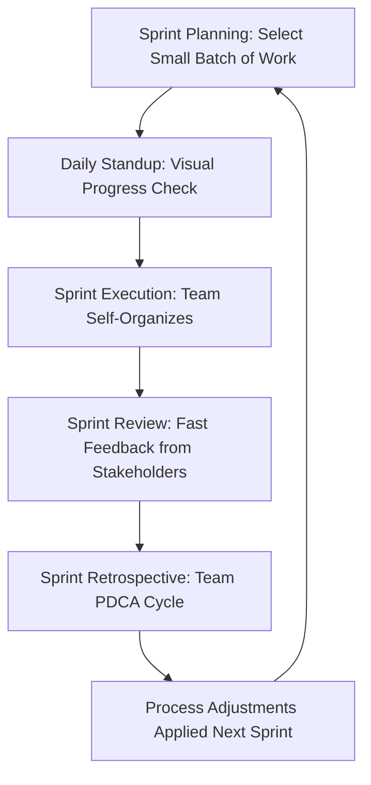

## Agile and Scrum Parallels with Lean Principles

### Overview

Agile software development and Scrum (its most widely adopted framework) share substantial conceptual heritage with Lean/TPS thinking, though the two traditions developed through distinct historical paths that later converged in practitioner literature. Agile formalized in 2001 with the publication of the Agile Manifesto, drawing partly on iterative software development practices already in use, while Scrum itself (Schwaber and Sutherland, early-to-mid 1990s) predates the Agile Manifesto and was directly influenced by Takeuchi and Nonaka's 1986 Harvard Business Review article "The New New Product Development Game," which explicitly drew on Toyota's cross-functional, overlapping-phase development practices — making Scrum's lineage to Lean/TPS thinking more direct and historically traceable than Agile's broader movement as a whole.

### Historical Lineage: Takeuchi and Nonaka's Influence on Scrum

**Key Points**

- Takeuchi and Nonaka's 1986 article coined the "rugby" metaphor (the whole team moving the ball downfield together, passing it back and forth, rather than a relay-race sequential handoff between specialized functions) to describe a new model of product development observed at companies including Toyota, Honda, and others, characterized by overlapping development phases and self-organizing, cross-functional teams.
- Jeff Sutherland has publicly credited this article, along with direct study of Toyota's production system principles, as a foundational influence on Scrum's design when he and Ken Schwaber formalized the framework in the early-to-mid 1990s.
- This lineage means Scrum's core structural bias toward small, self-organizing, cross-functional teams working in short, overlapping iterations is more directly traceable to Lean/TPS-adjacent thinking than to the broader software engineering practices that influenced other Agile methods (e.g., Extreme Programming's engineering-practice focus).

### The Agile Manifesto and Lean Principles: Conceptual Overlap

| Agile Manifesto Value/Principle | Corresponding Lean/TPS Concept |
| --- | --- |
| "Working software over comprehensive documentation" | Waste reduction — avoiding overprocessing (excess documentation not directly serving customer value) |
| "Customer collaboration over contract negotiation" | Value defined by the customer — a core Lean principle that value is whatever the customer is willing to pay for |
| "Responding to change over following a plan" | Flexibility and continuous adaptation — echoes Lean's emphasis on kaizen and adapting standardized work as better methods are discovered |
| "Deliver working software frequently" | Small batch sizes and flow — analogous to Lean's preference for small batches and continuous flow over large infrequent releases |
| "Simplicity — the art of maximizing the amount of work not done" | Direct parallel to Lean waste elimination (muda) — explicitly named as such in Agile Manifesto commentary |
| "Self-organizing teams" | Respect for People — frontline/team autonomy and empowerment, paralleling TPS's emphasis on trusting workers closest to the work |

[Inference] While these parallels are frequently drawn in practitioner and academic literature discussing Agile's relationship to Lean, the Agile Manifesto's authors themselves did not uniformly cite Lean/TPS as a direct, explicit source in the same way Scrum's own originators have cited Takeuchi and Nonaka's Toyota-influenced research; the broader Agile movement's connection to Lean is better characterized as substantial conceptual convergence and later cross-pollination (particularly through the Lean Software Development movement) than as a single direct lineage for the Manifesto as a whole.

### Sprint Structure as Batch-Size Reduction

**Key Points**

- Scrum's fixed-length Sprints (typically one to four weeks) function as a structural mechanism for batch-size reduction, directly paralleling Lean's preference for small batches and frequent delivery over large, infrequent releases — a smaller "batch" of work (a sprint's worth of features) surfaces integration problems and gathers customer feedback faster than committing to a large release cycle.
- The Sprint Review, where working software is demonstrated to stakeholders at the end of each Sprint, functions as a fast feedback loop analogous to Lean's emphasis on rapid detection of defects or misalignment (jidoka's "stop and fix immediately" principle applied to feedback on product direction rather than physical defects).
- The Sprint Retrospective directly parallels PDCA/kaizen: the team reflects on what worked and what did not in the completed Sprint, and commits to specific process adjustments for the next Sprint — an explicit, recurring team-level PDCA cycle embedded into the framework's core cadence.

### Kanban Boards: A Direct Tool Transplant

- Unlike the more conceptual parallels elsewhere in Agile/Lean comparison, the Kanban Board used in Scrum (and more centrally in the separate Kanban Method for software, discussed under Lean in Software Development) is a direct, largely unmodified transplant of TPS's visual pull-system tool, adapted to track software work items through columns (e.g., To Do, In Progress, Review, Done) rather than physical parts through production stages.
- Work-in-process (WIP) limits, when applied to a Scrum or Kanban board, directly implement the same pull-system logic as manufacturing kanban: new work is only started when capacity frees up, preventing the software-team equivalent of overproduction and excessive multitasking.

### Daily Standup as Visual Management

- The Daily Scrum (standup meeting) functions as a lightweight visual/verbal management ritual, similar in intent to a shop-floor visual management board review — surfacing blockers and status quickly across the team on a short, regular cadence, enabling fast escalation of problems (a lighter-weight parallel to andon-style immediate problem surfacing, though without the formal stop-the-line escalation mechanism jidoka implies).

### Points of Divergence Between Scrum/Agile and Classic TPS

**Key Points**

- **Domain of origin and applicability.** TPS was developed for physical, repetitive manufacturing with stable process steps; Scrum/Agile was developed for inherently uncertain, creative knowledge work (software) where the "correct design" is not known in advance — a difference closer to Lean Product Development's uncertainty-oriented challenges (see Set-Based Concurrent Engineering) than to steady-state manufacturing lean.
- **Standardized work vs. emergent process.** TPS relies heavily on documented standardized work as a stable baseline for improvement; Scrum deliberately avoids prescribing detailed task-level procedures, instead relying on team self-organization to determine how work gets done within the Sprint, reflecting knowledge work's higher inherent uncertainty relative to repetitive manufacturing tasks.
- **Role of the Chief Engineer vs. Product Owner.** Scrum's Product Owner role, who owns the product backlog and prioritization, shares some conceptual similarity with Toyota's Chief Engineer as a single point of accountability for product vision, but the Product Owner typically has less direct technical authority over implementation details than the Chief Engineer's deep technical involvement in engineering trade-offs.
- **Takt time vs. Sprint velocity.** TPS's takt time is a fixed external pacing mechanism derived from customer demand rate; Scrum's "velocity" (story points completed per Sprint) is an internally measured team capacity metric used primarily for forecasting rather than as an externally imposed demand-pacing target, a meaningfully different function despite both being cadence-related measurements.

### Common Points of Confusion in Practitioner Discourse

- **Conflating "Agile" broadly with "Lean" broadly.** Because both terms are used loosely in industry discourse, practitioners sometimes treat them as interchangeable, when more precisely Scrum has a specific, well-documented historical lineage to Toyota-influenced research (via Takeuchi and Nonaka), while other Agile methods (Extreme Programming, Crystal, etc.) have more varied and less uniformly Lean-connected origins.
- **Treating Kanban (the Method) and kanban (the tool) as identical to Scrum.** The Kanban Method (Anderson) and Scrum are distinct frameworks with different underlying philosophies (continuous flow without fixed iterations vs. fixed-length Sprints); both use visual boards, but the Kanban Method's WIP-limit-driven continuous flow model is closer in spirit to classical TPS pull systems than Scrum's batch-oriented Sprint cadence is.
- **Assuming Lean Software Development (Poppendieck) and "Agile" are synonymous.** Lean Software Development is a specific, separate body of work (see Lean in Software Development) that explicitly and systematically maps TPS's seven wastes onto software development; it is a complementary but distinct framework from Scrum/Agile, sometimes taught alongside Agile methods but not identical to them.

### Related Topics

- Takeuchi and Nonaka's "The New New Product Development Game" and its influence on Scrum
- Lean Software Development (Poppendieck) seven wastes mapping
- Kanban Method (Anderson) vs. Scrum: continuous flow vs. fixed iteration models
- Sprint Retrospective facilitation techniques and PDCA parallels
- Product Owner role vs. Toyota Chief Engineer system comparison
- DevOps Three Ways and their relationship to both Lean and Agile thinking
- Velocity and story point estimation vs. takt-time-based capacity planning
- Cross-functional, self-organizing team design principles in Scrum and TPS