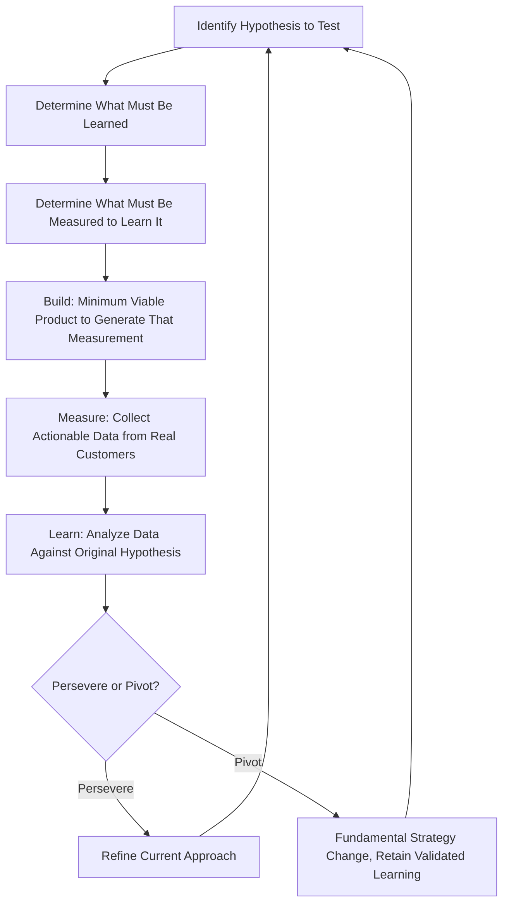

## Lean Startup and the Build Measure Learn Loop

### Overview

Lean Startup is a business development methodology introduced by Eric Ries in his 2011 book *The Lean Startup*, applying Lean/TPS principles — particularly waste elimination and rapid iterative validation — to the distinct problem of building new products or companies under conditions of extreme uncertainty, where the target customer, product features, and viable business model are not yet known. Ries developed the methodology partly from his own startup experience and explicitly credits TPS as a direct conceptual influence, alongside Steve Blank's Customer Development methodology, which Ries studied under and helped extend into the broader Lean Startup framework.

### Reframing "Waste" for Startup Conditions

**Key Points**

- In classic manufacturing Lean, waste is any activity that does not add value to a known, validated customer requirement; in Lean Startup, the central insight is that under conditions of extreme uncertainty, an entrepreneur often does not yet know what the customer actually values, making the biggest potential waste the effort spent building a fully-featured product that turns out to serve no real validated need.
- This reframes "waste" to include not just inefficient production of a known-good product, but the far larger risk of efficiently producing something nobody wants — a distinction Ries emphasizes as the core departure point justifying a startup-specific adaptation of Lean thinking rather than direct application of manufacturing lean tools.
- [Inference] This framing is Ries's own explicit articulation in *The Lean Startup* and is generally treated in startup and entrepreneurship literature as the methodology's central conceptual contribution, distinguishing it from simply applying existing Lean manufacturing tools to a startup context.

### The Build-Measure-Learn Feedback Loop

**Key Points**

The Build-Measure-Learn loop is Lean Startup's core iterative cycle, structurally analogous to PDCA but ordered and named specifically around validated learning as the primary objective rather than process standardization as the primary objective:

- **Build:** Rapidly construct a Minimum Viable Product (MVP) — the smallest, simplest version of a product or feature that allows the team to test a specific hypothesis about customer behavior or value, deliberately avoiding building more than the minimum needed to generate a meaningful learning signal.
- **Measure:** Collect data on how actual customers/users respond to the MVP, using specific, predefined metrics tied to the hypothesis being tested (Ries strongly emphasizes "actionable metrics" tied to specific decisions, as distinct from "vanity metrics" that look good but do not inform a clear next action).
- **Learn:** Analyze the measured data against the original hypothesis to determine whether to **persevere** (continue refining the current approach) or **pivot** (make a fundamental change in strategy while retaining validated learning from the prior iteration) — the central strategic decision point the entire loop is designed to inform.
- Ries explicitly frames the loop as running in the reverse conceptual order from its name during actual planning: teams should start by identifying what they need to *learn*, work backward to determine what to *measure* to learn it, and only then determine the minimum *build* needed to generate that measurement — a "think backward, execute forward" planning logic.

### Minimum Viable Product (MVP) as Batch-Size Reduction

- The MVP concept functions as Lean Startup's direct parallel to Lean manufacturing's preference for small batch sizes and single-piece flow: rather than building a complete, fully-featured product in one large "batch" before any customer contact (a high-risk, slow-feedback approach), the MVP delivers the smallest testable increment to generate real customer feedback as quickly as possible.
- [Inference] This mirrors the underlying logic connecting small manufacturing batch sizes to faster defect detection (jidoka) — just as a smaller manufacturing batch limits the cost of discovering a defect late, a smaller product "batch" (the MVP) limits the cost of discovering that an entire product direction was built on an invalid assumption about customer value.
- An MVP is explicitly not defined as a low-quality or incomplete product in a generic sense, but as the specific minimum artifact needed to test a particular hypothesis — the same underlying feature set might require a different MVP form (a landing page, a manual "concierge" service, a working prototype) depending on which specific hypothesis is being tested at a given stage.

### Validated Learning as the Central Metric of Progress

**Key Points**

- Ries argues that in early-stage startup conditions, traditional progress metrics (revenue, units shipped, features completed) can be misleading, since a team can be highly "productive" by conventional measures while building toward a product that ultimately fails to find product-market fit.
- Validated learning — empirically demonstrated, data-backed insight about what customers actually want or how they actually behave — is proposed as the more meaningful unit of progress in early-stage conditions, directly paralleling how classic Lean prioritizes flow and waste elimination over raw output volume as the more meaningful measure of production system health.
- Innovation Accounting, a framework Ries introduces alongside Build-Measure-Learn, establishes specific baseline metrics, tuning milestones, and pivot-or-persevere decision points to make validated learning progress trackable and accountable in a way comparable to how traditional financial accounting tracks more conventional business progress.

### Pivot vs. Persevere: The Core Decision Point

**Example**

A hypothetical startup testing a subscription meal-kit service might build an MVP consisting of a simple landing page describing the offering and a manual signup form (rather than a fully built logistics and delivery system) to measure signup conversion rate as a proxy for demand validation. If conversion rates are far below the hypothesis threshold, the Learn phase might reveal that customers responded positively to convenience messaging but negatively to the specific meal variety offered — informing a pivot toward a narrower, more curated menu concept rather than abandoning the underlying convenience-value hypothesis entirely. Ries's typology describes several specific pivot types (e.g., zoom-in pivot, customer segment pivot, platform pivot), each representing a different kind of strategic redirection while retaining some validated element of prior learning.

### Relationship to Genchi Genbutsu and Customer-Defined Value

- Lean Startup's emphasis on direct, frequent contact with real customers (rather than relying on internal assumptions, market research reports, or extended planning cycles) closely parallels TPS's Genchi Genbutsu principle — go and see the actual situation directly rather than relying on secondhand reports or assumptions.
- Both frameworks share the foundational Lean principle that value is ultimately defined by the customer, not by the producing organization's internal assumptions about what customers should want — Lean Startup operationalizes this through direct MVP testing rather than the value stream mapping and process-analysis tools used in manufacturing lean contexts.

### Relationship to Steve Blank's Customer Development

- Steve Blank's Customer Development methodology (predating and directly influencing Ries's work) provided the structured framework for systematically testing customer hypotheses outside the building itself ("get out of the building"), organized around stages of customer discovery, customer validation, customer creation, and company building.
- [Inference] Lean Startup is generally understood in startup methodology literature as synthesizing Blank's Customer Development framework with Agile software development practices and explicit Lean/TPS-derived waste-reduction thinking into a single integrated methodology, rather than being an entirely independent invention; Ries has himself publicly credited both Blank and Toyota's production system as direct influences.

### Common Misapplications and Criticisms

**Key Points**

- **Treating "MVP" as synonymous with "low-quality product."** A common misapplication strips away the hypothesis-testing purpose of the MVP concept, producing genuinely under-built or poor-quality releases justified under the MVP label without a clear specific learning objective attached, which undermines the methodology's actual intent.
- **Over-applying Lean Startup logic to non-uncertain contexts.** Critics note that Build-Measure-Learn's value is highest specifically under conditions of genuine market/product uncertainty; applying the same rapid-pivot logic to well-understood, low-uncertainty business contexts (where classic planning and execution approaches may be more efficient) can introduce unnecessary iteration overhead.
- **Vanity metrics substituting for actionable metrics.** Ries himself explicitly warns against teams measuring easily-improved but strategically uninformative metrics (e.g., total signups without conversion or retention context) that create an illusion of validated learning progress without genuinely informing the pivot-or-persevere decision.
- **Underestimating organizational adoption challenges in larger companies.** [Inference] While Lean Startup principles (sometimes marketed as "Lean Enterprise" or "Intrapreneurship" adaptations) have been applied within larger established organizations, adapting the methodology's rapid, uncertainty-embracing iteration culture to organizations with more risk-averse governance and longer planning/budgeting cycles is commonly cited as a significantly harder adaptation challenge than applying it within an actual early-stage startup context.

### Related Topics

- Minimum Viable Product design and hypothesis-specific MVP forms
- Steve Blank's Customer Development methodology and its stages
- Innovation Accounting: baseline metrics and pivot/persevere decision frameworks
- Pivot typology: zoom-in, customer segment, platform, and other pivot types
- Genchi Genbutsu and direct customer contact as a shared Lean Startup/TPS principle
- Lean Enterprise: adapting Lean Startup principles within established organizations
- Vanity metrics vs. actionable metrics in early-stage product measurement
- Comparing Build-Measure-Learn with classic PDCA and DMAIC improvement cycles