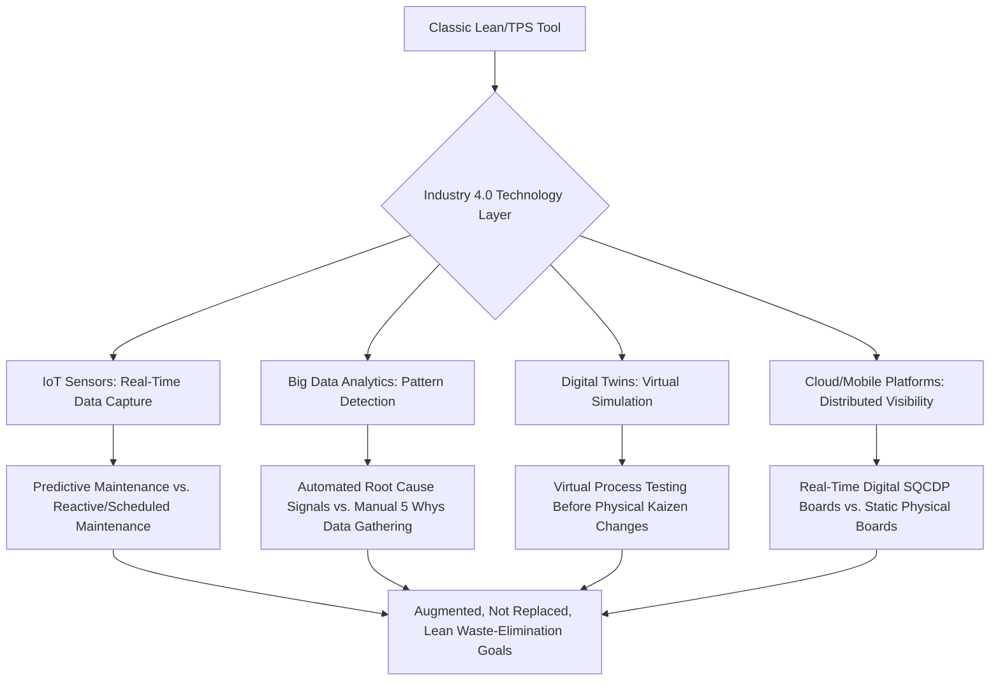

## Digital Lean and Lean 4.0 as the Convergence with Industry 4.0

### Overview

Digital Lean (also commonly called "Lean 4.0") refers to the integration of Lean/TPS principles with Industry 4.0 technologies — the broad wave of manufacturing digitalization built around interconnected sensors, real-time data, and cyber-physical systems. Industry 4.0 itself originated as a term from a German government-led manufacturing strategy initiative, first publicly introduced around 2011. [Inference] "Lean 4.0" is a widely used industry and academic term for this convergence, but it functions more as a descriptive label for an active area of practice and research than as a single standardized, formally codified methodology with one authoritative definition — multiple consulting firms, vendors, and academic papers use the term with somewhat different scope and emphasis, so specifics should be treated as illustrative of common usage rather than as a fixed canonical framework.

### The Nine Pillars of Industry 4.0

**Key Points**

Industry 4.0 is commonly described through a set of technology pillars, though the exact list and count vary somewhat by source (most commonly cited as nine, sometimes seven or a different grouping):

- **Big Data and Analytics** — collecting and analyzing data from equipment, IoT-enabled devices, and broader business/operational sources to reveal patterns and support real-time decisions.
- **Simulation and Digital Twins** — virtual, sensor-data-driven representations of machines, products, or entire production systems, allowing scenario testing and performance analysis without physical trial-and-error.
- **Horizontal and Vertical System Integration** — connecting plant-floor, operations, and management systems (vertical) and extending digital continuity to suppliers, partners, and customers (horizontal).
- **Industrial Internet of Things (IIoT)** — networked sensors and devices generating continuous real-time operational data.
- **Cybersecurity** — protecting increasingly connected industrial systems from data breaches and production disruption.
- **Cloud Computing** — centralized, scalable data storage and processing supporting the other pillars.
- **Additive Manufacturing (3D Printing)** — on-demand, flexible production supporting rapid prototyping and low-volume custom parts.
- **Augmented Reality** — overlaying digital information onto physical environments, used for training, maintenance guidance, and visualization.
- **Autonomous Robots** — increasingly flexible, sensor-driven, and collaborative robotic systems.

### Where Digitalization Extends Classic Lean Tools

**Key Points**

- **Just-in-Time / Kanban → IoT and Big-Data-Enabled Replenishment.** Just-in-Time systems enhanced with IoT and big data can track inventory and predict production needs, aiming to reduce downtime and waste compared to traditional manually-scheduled and human-overseen JIT/kanban systems. [Manufacturing Digital](https://manufacturingdigital.com/articles/jeff-winter-the-emergence-features-power-of-lean-4)
- **Standardized Work → Digital Work Instructions.** Paper-based or static standardized work documents are replaced with digital, often mobile-accessible instructions that can update centrally and incorporate real-time context (e.g., part-specific instructions triggered automatically by a scanned barcode).
- **Visual Management → Digitalized SQCDP Boards.** [Inference] Physical shop-floor boards tracking Safety, Quality, Cost, Delivery, and People (SQCDP) metrics are increasingly digitized into real-time dashboards, a transition reflected in commercial "digital lean" software platforms designed specifically to digitize this kind of visual management across multiple sites.
- **Andon → IoT-Triggered Automated Alerts.** Rather than relying solely on a manually pulled cord or button, sensor-driven systems can automatically detect abnormal conditions (e.g., vibration signatures indicating impending equipment failure) and trigger an andon-style alert without requiring a human to first notice the problem.
- **Genchi Genbutsu → Digital Twins for Remote/Simulated Observation.** Digital twins allow engineers to observe and analyze system behavior virtually, which some practitioners position as a complement to (though not a full replacement for) direct physical observation, since a simulation's fidelity depends entirely on how accurately it models the real system.

### Predictive Maintenance as an Illustrative Convergence Example

**Example**

Classic Total Productive Maintenance (TPM), a core Lean tool, relies on scheduled preventive maintenance intervals and operator-performed autonomous maintenance checks. A digitally-augmented version adds IoT vibration and temperature sensors continuously monitoring equipment condition, feeding data into machine-learning models that predict impending failure before it occurs — shifting maintenance from a fixed schedule (preventive) toward a condition-based, predictive model. This is commonly cited across Industry 4.0 and Lean 4.0 literature as one of the more mature and widely implemented convergence use cases, since equipment failure data is relatively well-suited to sensor-based monitoring compared to some other lean tool categories.

### A Foundational Tension: Simplicity vs. Complexity

**Key Points**

- Traditional lean systems have generally favored avoiding complex IT systems in order to preserve transparency and simplicity on the shop floor, reflecting TPS's historical preference for simple, visual, human-readable management tools (physical kanban cards, andon lights, paper standardized work) over technology-mediated ones. [ResearchGate](https://www.researchgate.net/publication/323527369_The_link_between_Industry_40_and_lean_manufacturing_mapping_current_research_and_establishing_a_research_agenda)
- This creates a foundational tension that Digital Lean/Lean 4.0 literature explicitly grapples with: digitalization can add real value (faster data, predictive capability, cross-site visibility) but risks reintroducing the very opacity and complexity that classic Lean's simple visual tools were designed to avoid, particularly if digital systems become a "black box" that obscures rather than clarifies actual process status to frontline workers.
- Digital tools in this convergence generally depend on clean underlying processes — clear standards, consistent work instructions, and disciplined execution — since without that foundation, digitalization risks simply making an already-disorganized process fail faster rather than genuinely improving it. This "digitizing chaos" risk is a frequently repeated caution in practitioner literature on the topic. [Leantech](https://info.leantech.com/post/lean-4-0-the-convergence-of-lean-thinking)
- [Inference] This tension is arguably the central open question in Digital Lean/Lean 4.0 discourse: whether digital tools are best understood as amplifying an already-disciplined lean culture (the position taken by most sources advocating for the convergence) versus creating new categories of waste (excess data collection nobody acts on, technology-driven complexity, over-reliance on dashboards over direct floor observation) if adopted without a mature underlying lean foundation.

### Addressing Low-Volume, High-Mix and Real-Time Responsiveness

- Lean 4.0 is frequently framed as addressing challenges traditional Lean tools struggled with, including low-volume, high-mix production and the demand for real-time responsiveness — directly connecting this topic to the LVHM adaptation challenges discussed elsewhere in this material (SMED, cellular manufacturing, CONWIP), where digital tools (flexible digital work instructions, automated changeover-time tracking, real-time scheduling optimization) can reduce some of the administrative burden that made classic manual LVHM lean tools harder to scale. [Manufacturing Digital](https://manufacturingdigital.com/articles/jeff-winter-the-emergence-features-power-of-lean-4)

### Reported Benefits and Their Evidentiary Status

**Key Points**

- Some industry sources describe Lean 4.0, combining organization-wide lean commitment with Industry 4.0 technologies, as capable of generating meaningfully greater improvement than lean alone for many manufacturers, though [Unverified] specific improvement percentage figures cited by individual consulting firms or vendors in this space are generally drawn from their own client case studies or industry surveys rather than independent, peer-reviewed, broadly generalizable research, and should be treated as illustrative claims from interested parties rather than established universal benchmarks. [TBMCG](https://tbmcg.com/resources/blog/lean-4.0-will-transform-your-business/)
- Industry commentary in this space emphasizes that data alone is not sufficient — meaningful improvement depends on what an organization does with the data to solve real business problems, positioning data/technology as one contributing factor among others (including workforce skill development) rather than a complete solution on its own. [TBMCG](https://tbmcg.com/resources/blog/lean-4.0-will-transform-your-business/)

### LSS 4.0: Extending the Convergence to Lean Six Sigma

- Academic literature has also proposed frameworks integrating Lean Six Sigma specifically with Industry 4.0 technologies — AI, IoT, digital twins, and big data analytics — aimed at enabling real-time decision-making, predictive intelligence, and more autonomous process optimization within a combined "LSS 4.0" framework. [Inference] This represents a parallel, more academically formalized strand of the broader digital-lean convergence discussed throughout this topic, applying similar digitalization logic specifically within the more statistically structured DMAIC methodology rather than to Lean/TPS tools alone. [zenodo](https://zenodo.org/records/15165100)

### Common Barriers and Risks

**Key Points**

- **Digitizing an undisciplined process.** As noted above, applying digital tools to a process lacking mature standardized work and disciplined execution risks accelerating existing dysfunction rather than correcting it.
- **IT/OT silos.** Information Technology and Operational Technology commonly operate in separate organizational silos in many plants, and a central practical challenge of this convergence is bridging that gap so that live machine-level data (OT) actually reaches usable dashboards and decision-making tools (IT). [Leantech](https://info.leantech.com/post/lean-4-0-the-convergence-of-lean-thinking)
- **Cost and accessibility barriers for smaller manufacturers.** Not every organization can afford a fully custom-built Manufacturing Execution System (MES) or ERP extension, creating demand for more configurable, lower-cost platform alternatives designed for broader frontline accessibility. [Leantech](https://info.leantech.com/post/lean-4-0-the-convergence-of-lean-thinking)
- **Risk of eroding frontline ownership.** [Inference] Because classic Lean culture emphasizes frontline worker engagement and ownership of visual management tools, a digitalization effort designed and imposed primarily by IT/engineering functions without genuine frontline involvement risks recreating the top-down, disconnected-from-the-floor dynamic that Lean's Respect for People principle and Genchi Genbutsu practice were specifically designed to counteract.

### Related Topics

- Total Productive Maintenance (TPM) and predictive maintenance using IoT sensor data
- Digital twin simulation for kaizen event planning and testing
- SQCDP digital dashboard platforms and multi-site visual management
- LSS 4.0: integrating DMAIC with AI and IoT-driven process optimization
- IT/OT integration challenges in manufacturing digitalization
- Applying digital tools to low-volume, high-mix production challenges
- Industry 5.0 and the shift toward human-centric, sustainable digital manufacturing
- Change management considerations for digitalizing an existing lean culture