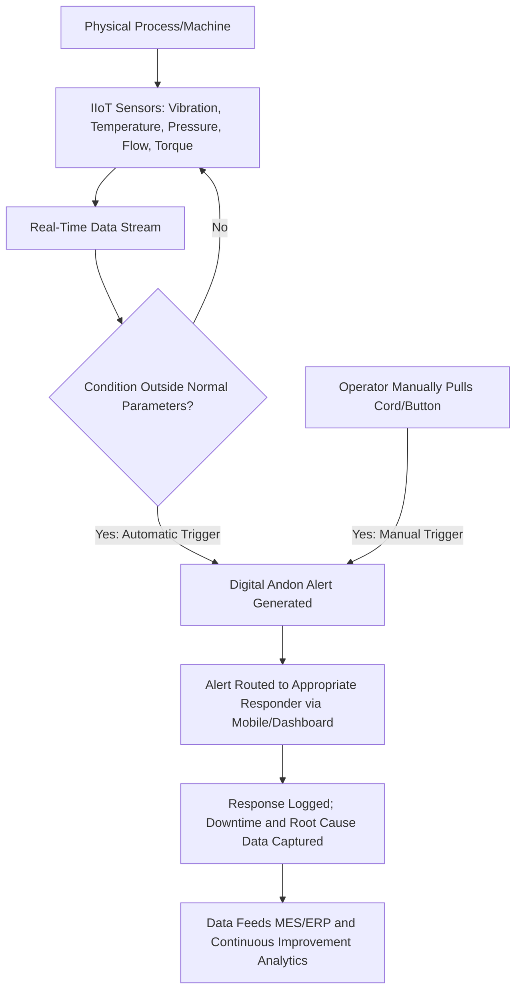

## The Industrial Internet of Things and Real Time Andon Systems

### Overview

The Industrial Internet of Things (IIoT) refers to networks of interconnected sensors, devices, and systems that collect, transmit, and analyze data from industrial operations in real time. Applied to TPS's andon concept — the visual and audible signal traditionally triggered by a worker pulling a cord to halt a production line and summon help — IIoT extends jidoka's "stop and fix" principle from a manually-triggered, single-station signal into a sensor-driven, plant-wide or enterprise-wide detection and escalation system. This represents one of the more concrete and widely implemented examples of the broader Digital Lean/Lean 4.0 convergence.

### From Physical Andon to IIoT-Enabled Digital Andon

**Key Points**

- The classical andon system relies entirely on human detection and manual signal initiation: a worker notices a defect or abnormality and pulls a cord or presses a button, illuminating a light and/or triggering a sound at a fixed physical location, after which a supervisor or team leader must be physically present or notified to respond.
- An IIoT-enabled digital andon system adds sensor-triggered detection alongside manual triggers, so that alerts can originate either from human observation or automatically from a monitored condition — for example, a bottling line halting automatically when a filler machine detects inconsistent flow pressure, or a CNC mill flagging tool breakage the instant it occurs, without waiting for an operator to notice.
- Traditional light-based andons excel at indicating *where* a problem is occurring but generally provide little information about *why* it happened, *how* to fix it, or *who* is best equipped to respond; IIoT-connected digital andon platforms aim to close this gap by linking the alert to sensor context, historical data, and automated routing to the appropriate responder.
- Digital andon extends the traditional signal's reach from a localized, single-line visual cue to plant-wide or even enterprise-level visibility, allowing alerts to escalate across shifts or across multiple facility sites rather than remaining locally contained.

### Core IIoT Architecture Components Supporting Digital Andon

**Key Points**

- **Sensors and field devices:** the foundation layer, capturing real-time data on variables such as temperature, pressure, vibration, torque, proximity, humidity, and flow rate, translating physical conditions into digital signals; IIoT-grade sensors typically include embedded processing and provide continuous data streams rather than only periodic manual measurements.
- **Connectivity/communication layer:** industrial communication protocols and gateways transmit sensor data to processing systems; real-time transmission is commonly supported through lightweight, low-latency protocols suited to industrial wireless sensor networks.
- **Edge and/or cloud processing:** data can be processed locally near the sensor (edge computing, reducing latency for time-critical alerts) or centrally in the cloud (supporting cross-site aggregation and more computationally intensive analytics); many architectures use a hybrid of both.
- **Streaming/real-time data processing:** [Inference] a recurring theme in IIoT manufacturing literature is that many existing plant data systems historically stored data statically and only reviewed it periodically (daily or weekly) rather than continuously, which produces longer unplanned downtime and less efficient response; real-time streaming data processing architectures are specifically designed to close this gap by enabling immediate, rather than delayed, anomaly detection.
- **Integration with MES/ERP:** mature digital andon implementations typically integrate with Manufacturing Execution Systems or Enterprise Resource Planning platforms so that every stop, start, and fix is automatically recorded, supporting downstream analytics without requiring manual data entry.

### How Digital Andon Supports OEE (Overall Equipment Effectiveness)

Digital andon systems are frequently discussed in terms of their impact on Overall Equipment Effectiveness, a standard manufacturing metric combining three components:

| OEE Component | How IIoT-Enabled Digital Andon Contributes |
| --- | --- |
| **Availability** | Faster detection and resolution of stoppages through real-time alerts and immediate escalation, reducing total idle/downtime |
| **Performance** | Surfaces micro-stoppages and slowdowns that might otherwise go unnoticed under manual observation alone, providing data to refine process speed |
| **Quality** | Catches defects as soon as they arise — whether flagged by a sensor or an operator — helping prevent flawed products from continuing further down the line |

### Predictive and Preventive Use Cases

**Example**

A food processing plant might deploy IIoT sensors monitoring temperature and humidity in storage facilities; if sensor readings indicate conditions that could lead to spoilage, the system can automatically alert personnel or, in more automated configurations, adjust environmental controls directly — preventing loss of perishable goods without requiring manual periodic inspection to catch the deviation.

**Example**

A manufacturer might correlate testing-phase data on finished components with earlier-stage process data (e.g., correlating final chip test failures with wafer-level fabrication data in semiconductor manufacturing) to identify problematic patterns and reject defective units earlier in the production sequence — extending andon-style "stop and fix" logic upstream to the point where a defect's root cause actually originates, rather than only where it is finally detected.

### Traceability and Root Cause Support

- Beyond real-time alerting, IIoT enables end-to-end traceability of the production process from raw materials to finished goods, which supports root-cause investigation (5 Whys, fishbone analysis) by making the full data trail behind a given alert available for review, rather than relying solely on operator memory or manual incident logs.
- Because a mature digital andon platform typically logs the data behind every triggered alert automatically, this supports deeper analytics and continuous improvement initiatives over time — turning individual andon events into a growing dataset for identifying recurring or systemic issues, rather than treating each event purely as an isolated incident to resolve and move past.

### Remote and Multi-Site Visibility

- IIoT enables remote monitoring and control of industrial assets, allowing managers to observe plant and equipment performance from a central location and make adjustments as needed — particularly valuable for organizations with geographically dispersed operations, extending andon-style visibility beyond what is physically observable from a single shop floor.
- [Inference] This multi-site capability is frequently positioned in vendor and practitioner literature as addressing a genuine limitation of classic physical andon systems, which are inherently local to a single line or facility; whether the benefit of this expanded visibility outweighs the added system complexity depends on the specific organization's scale and distributed-operations structure, and is not automatically a net improvement for every manufacturing context.

### Common Implementation Barriers

**Key Points**

- **Cost and complexity for smaller manufacturers.** The cost and complexity of legacy industrial automation and full custom system integration can be a significant barrier, which has driven demand for more accessible, cloud-based digital andon platforms designed specifically to lower this barrier for small-to-medium manufacturers.
- **IT/OT integration challenges.** As with the broader Digital Lean convergence, connecting Operational Technology (machine-level sensor data) with Information Technology (dashboards, MES, ERP systems) is a recurring practical hurdle, since these have historically operated as separate organizational and technical silos.
- **Data without action.** A frequently repeated caution in IIoT literature is that installing sensors alone is not sufficient — without the right integration and a clear response workflow, sensor data remains noise rather than actionable insight; the value of IIoT lies specifically in turning raw signals into insights that drive real action on the floor.
- **Preserving frontline engagement.** [Inference] Because classic andon's effectiveness depends partly on operators feeling empowered and responsible for signaling problems (a Respect for People element), an overly automated digital andon system that removes human judgment entirely from detection risks unintentionally reducing frontline ownership of quality and safety — a concern consistent with the broader tension between digitalization and classic Lean's frontline-centered culture discussed in relation to Digital Lean generally.

### Related Topics

- Total Productive Maintenance (TPM) and IIoT-enabled predictive maintenance
- Overall Equipment Effectiveness (OEE) measurement and improvement methods
- Edge computing vs. cloud computing architecture trade-offs in industrial settings
- MES/ERP integration for automated downtime and root-cause data capture
- IT/OT convergence challenges in manufacturing digitalization
- Digital Lean and Lean 4.0 as the broader convergence with Industry 4.0
- Root cause analysis (5 Whys, fishbone diagrams) using IIoT traceability data
- Digital andon platform selection criteria for small and medium manufacturers