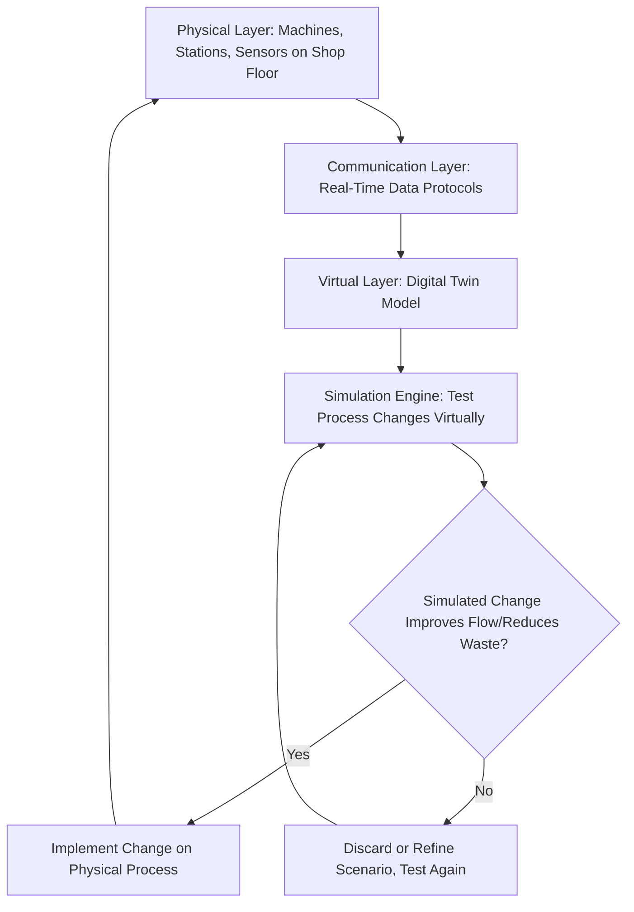

## Digital Twins and Simulation for Lean Process Design

### Overview

A digital twin is a virtual, real-time replica of a physical system — a machine, production line, or entire facility — continuously updated with live data from sensors monitoring the actual physical asset it represents. Applied to lean process design, digital twins extend the traditional static value stream map into a dynamic, continuously updated, simulation-capable model, allowing process changes to be tested virtually before being implemented on the physical floor. This represents one of the more actively researched applications within the broader Digital Lean/Lean 4.0 convergence, with a growing body of academic literature (including recent NIST and peer-reviewed work) specifically addressing digital twin integration with value stream mapping.

### Digital Twin Architecture: The Three Core Layers

**Key Points**

Digital twin systems are commonly described through a layered architecture:

- **Physical layer:** the actual machines, workstations, and material flows on the shop floor, instrumented with IIoT sensors capturing real-time operational data.
- **Virtual layer:** the digital replica itself — a computational model that mirrors the physical system's structure, behavior, and current state, updated continuously (or near-continuously) as new sensor data arrives.
- **Communication/interface layer:** the connectivity infrastructure (data protocols, integration middleware) that keeps the virtual layer synchronized with the physical layer and allows data to flow bidirectionally, including potentially feeding simulation-derived recommendations back into physical process control.

### From Static Value Stream Mapping to the "Digital Value Stream Twin"

**Key Points**

- Traditional value stream mapping is typically a manual, static, point-in-time exercise: a team walks the process, records cycle times and wait times by hand, and produces a snapshot map that becomes outdated as soon as the underlying process changes.
- A digital twin integrated with value stream mapping — sometimes termed a "digital value stream twin" in recent academic literature — collects data directly from machines and processes, enabling a continuously updated, real-time visualization of the production line rather than a manually refreshed snapshot.
- This integration is intended to support proactive identification and reduction of waste, improved resource utilization, and adaptation to changing operational conditions, extending the value stream map's diagnostic function from a periodic improvement-event tool into an ongoing monitoring and decision-support system.
- Commercial lean simulation platforms support this integration in practice by dynamically linking a simulation model to a value stream map view: changes made in the simulation are reflected in the VSM display, with all computed metrics (cycle time, WIP levels, cost) updated automatically as scenarios are tested.

### Simulation-Based Testing of Lean Process Changes

**Key Points**

- Digital twin and simulation platforms allow lean practitioners to test "what if" scenarios — changes to layout, staffing, equipment, automation, scheduling, sequencing, or inventory policy — virtually, observing the projected impact before committing to a physical change.
- This directly supports the front-loading logic found in Lean Product and Process Development: identifying whether a proposed kaizen change will actually improve flow before investing the time and disruption cost of implementing it on the live floor, reducing the risk of a kaizen event's proposed countermeasure turning out to be ineffective or counterproductive once tried physically.
- Simulation platforms in this space commonly support core lean-specific analyses: Kanban sizing and reorder-trigger calculation, line balancing, WIP inventory optimization, safety stock level determination, heijunka/load-leveling effects, bottleneck and constraint identification, and capacity planning against projected demand growth.
- Spaghetti diagrams (visualizing operator or material movement paths to identify motion waste) are commonly generated automatically within these simulation tools and overlaid on the value stream map, connecting the simulation's flow data directly back to a familiar lean visual tool.

### Example: Digital Twin Applied to a Lab-Scale Manufacturing Cell (NIST Case)

**Example**

Recent applied research (presented at the 2025 CIRP Conference on Manufacturing Systems) describes integrating a digital twin with a value stream map for a lab-scale manufacturing cell: rather than relying on a traditionally manual VSM, the digital twin collects data directly from the machines in the cell, producing a real-time, more accurate visualization of the production line than a manually maintained map would allow, and generating improvement recommendations aimed at reducing non-value-added process time. [Unverified] This specific case is drawn from a single conference paper describing a lab-scale demonstration; the degree to which findings from this particular scaled-down setup generalize to full production-scale environments would require examining the paper's specific methodology and results directly, which is beyond what can be confirmed from the available summary.

### Case Study Context: Automotive Sector Applications

- Case studies discussed in recent academic literature on digital twin-driven lean manufacturing, particularly in the automotive sector, describe digital twins increasing production efficiency through predictive maintenance and simulation-based scenario planning, in support of Lean's waste-reduction objectives, and explicitly connect digital twin integration to established Lean tools including Kaizen, Kanban, and Just-in-Time.
- [Inference] Automotive manufacturing's relatively higher historical investment in both Lean/TPS maturity and industrial automation infrastructure likely makes it a natural early-adopter context for this convergence, though this is an inference about probable adoption patterns rather than a claim found explicitly stated in the source material reviewed.

### Predictive Simulation vs. Reactive Physical Testing

- A key structural benefit repeatedly emphasized in this literature is the ability to test changes "on the fly" in a virtual environment — evaluating layout changes, process modifications, staffing adjustments, or automation implementations without the risk and cost of testing those changes in a live production environment.
- Proactive forecasting through simulation allows scenario comparison (e.g., comparing the projected effect of two different kaizen countermeasures) before physical commitment, supporting more economically informed decision-making than trial-and-error testing directly on the physical line.
- [Inference] This capability is conceptually similar in spirit to Set-Based Concurrent Engineering's approach of exploring multiple design alternatives before committing to one — here applied to process/layout design rather than product design, using simulation rather than physical prototyping as the exploration mechanism.

### Implementation Challenges

**Key Points**

- **Legacy system integration.** Existing shop-floor equipment and data systems, particularly older machinery not originally designed with IIoT connectivity in mind, can be difficult to integrate into a real-time digital twin architecture without additional retrofit investment.
- **Workforce adaptation.** Shifting from familiar manual, paper-based value stream mapping practices to digital, simulation-driven tools requires new skills and can meet cultural resistance, particularly among staff accustomed to the simplicity of traditional lean visual tools.
- **Data interoperability.** Connecting data from multiple machine types, control systems, and software platforms into a single coherent digital twin model is a recurring technical challenge, especially in facilities with a mix of equipment vintages and vendors.
- **Cybersecurity and data integrity.** Because digital twins depend on continuous real-time data flow from connected physical assets, securing that data pipeline against breaches or corruption is a distinct concern raised alongside the broader IIoT security considerations discussed in relation to Industry 4.0.
- **Risk of over-reliance on simulation fidelity.** [Inference] A simulation or digital twin's recommendations are only as good as how accurately the model reflects real-world conditions; over-trusting a digital twin's output without periodic validation against actual Genchi Genbutsu floor observation risks a disconnect between what the model predicts and what the physical process actually does, a concern conceptually related to the broader simplicity-versus-complexity tension discussed under Digital Lean more generally.

### Forward-Looking Directions Noted in Current Literature

- Recent academic work proposes several extensions to current digital twin practice, including AI-powered digital twins (incorporating machine learning for more sophisticated predictive capability), blockchain for enhanced supply chain traceability, and edge computing specifically to support lower-latency applications where near-instant response is required.
- [Unverified] These represent proposed future research directions identified in the literature reviewed rather than established, widely deployed practices as of this writing; their maturity and adoption status should be checked against current sources if precision on present-day deployment (rather than research direction) is required.

### Related Topics

- Value stream mapping fundamentals and traditional manual VSM technique
- IIoT architecture and real-time andon systems as a data source for digital twins
- Predictive maintenance using digital twin and sensor-driven condition monitoring
- Simulation-based Kanban sizing and safety stock calculation
- Digital Lean and Lean 4.0 as the broader convergence with Industry 4.0
- Spaghetti diagram generation and motion-waste analysis in simulation platforms
- Edge computing vs. cloud computing trade-offs for low-latency digital twin applications
- Change management for workforce adaptation to digital lean tools