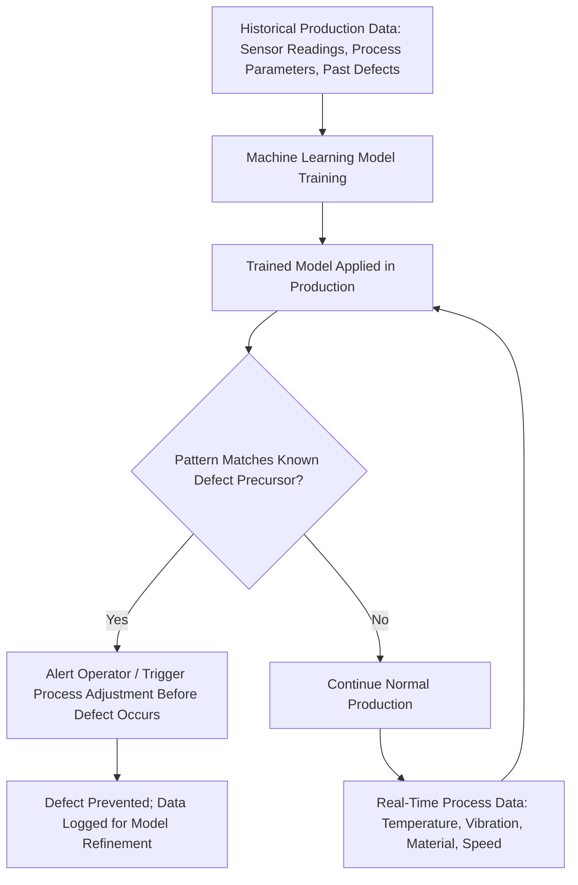

## Data Analytics, Artificial Intelligence, and Predictive Quality

### Overview

Predictive quality refers to the use of data analytics and artificial intelligence — primarily machine learning and computer vision — to anticipate and prevent defects before they occur, rather than only detecting them after the fact. This represents a shift from Lean/TPS's traditional jidoka-based approach (immediate detection and stoppage upon a defect occurring, often via manual poka-yoke devices or operator inspection) toward a proactive model that aims to intervene before a defect is produced at all, using patterns identified in historical and real-time process data.

### Reactive vs. Predictive Quality: A Conceptual Shift

**Key Points**

- Traditional quality processes, including classic Lean tools like poka-yoke and andon-triggered inspection, are fundamentally reactive: a defect is detected as it occurs (or immediately after), triggering a stop-and-fix response — this remains highly effective for catching defects quickly, but it does not prevent the defect from being produced in the first place.
- AI-enabled predictive quality analyzes historical production data alongside real-time inputs — temperature, material properties, equipment vibration, process deviations — to identify patterns that precede defects, allowing intervention before nonconforming product is actually made, enabling proactive process adjustment rather than after-the-fact correction.
- [Inference] This shift from reactive to predictive quality can be understood as extending jidoka's underlying intent (catch problems as early as possible in the process) one step further upstream — from "stop immediately when a defect is detected" toward "adjust before a defect would have been produced" — while still sharing the same underlying philosophy of preventing defective output from propagating downstream.

### Computer Vision and Machine Vision Inspection

**Key Points**

- Computer vision, a branch of AI using cameras and machine learning models, inspects products at both microscopic and macroscopic levels, capable of detecting surface defects (scratches, dents, cracks, discoloration, shape deformities) that traditional rule-based or manual inspection methods might overlook.
- Beyond surface-level visual inspection, AI-based systems can also detect internal faults — porosity, misalignment, weld inconsistencies, dimensional deviations — using X-ray, infrared, or ultrasonic data sources, extending inspection capability beyond what visible-light cameras alone can capture.
- Unlike traditional rule-based inspection systems that rely on fixed parameters, AI models learn from large datasets of product images and process data, allowing continuous improvement in accuracy and adaptation to new defect types without requiring manual reprogramming of fixed inspection rules.
- Manual visual inspection performed by human inspectors is subject to fatigue and inconsistency; some industry sources describe manual inspection missing a substantial share of quality issues in high-speed production environments for this reason, motivating the shift toward AI-based inspection systems capable of consistent inspection at line speed. [Unverified] Specific miss-rate percentages and defect-reduction percentages cited across vendor and industry sources in this space vary and often originate from vendor marketing materials or specific case studies rather than independent broad-based research; such figures should be treated as illustrative of commonly cited claims rather than universally validated benchmarks.

### Example: Predictive Quality Inspection at End-of-Line Automotive Testing

**Example**

Published research on predictive quality inspection frameworks in automotive manufacturing describes an AI-enabled system designed to predict vehicle quality at the end of the production line using machine learning techniques, aiming to prevent defective vehicles from reaching customers while reducing production costs and manufacturing time. The described framework supports personalized road test protocols, with the underlying economic rationale connected to the standard test-drive duration in end-of-line quality verification (commonly cited as roughly 10 to 30 minutes depending on vehicle model), a step this kind of predictive framework aims to make more targeted and efficient rather than uniformly applied to every unit.

### Integration with Lean Six Sigma / DMAIC

**Key Points**

AI and predictive analytics are increasingly discussed as an enhancement layer within existing DMAIC-based quality improvement work rather than a replacement for it:

- **Analyze phase acceleration:** AI can accelerate root cause analysis by enhancing traditional tools such as Fishbone diagrams and 5 Whys, and by correlating upstream process parameters with downstream quality outcomes to surface hidden process variables affecting output that might not be apparent through manual analysis alone.
- **Predictive FMEA (Failure Mode and Effects Analysis):** using AI to forecast potential failure modes before they occur, extending traditional FMEA's structured risk-assessment approach with data-driven prediction rather than solely engineering-judgment-based risk scoring.
- **Dynamic SPC and control charts:** AI-powered trend interpretation applied to Statistical Process Control charts, including automated detection of SPC rule violations and real-time Gage R&R analysis using machine learning, extending traditional Six Sigma statistical tools with faster, more continuous monitoring than periodic manual chart review.
- **Process capability under changing conditions:** predicting process capability metrics (Cp, Cpk) as conditions shift, rather than relying solely on capability studies calculated at fixed intervals.
- [Inference] This integration pattern reflects a broader theme consistent with the Digital Lean/Lean 4.0 convergence discussed elsewhere in this material: AI and data analytics are generally positioned in current literature as augmenting established Lean Six Sigma tools and DMAIC structure, rather than as a wholesale replacement methodology, similar to how IIoT augments rather than replaces the andon concept.

### Predictive Maintenance and Predictive Quality as Related Disciplines

- Predictive maintenance (anticipating equipment failure before it occurs, discussed under Digital Lean and IIoT topics) and predictive quality are closely related applications of the same underlying data-analytics capability: both rely on continuous sensor data streams analyzed by machine learning models trained to recognize patterns preceding an undesired outcome, whether that outcome is equipment failure or a product defect.
- In practice, the same sensor infrastructure (vibration, temperature, and other process condition monitoring) often supports both predictive maintenance and predictive quality applications simultaneously, since equipment condition degradation is frequently a direct contributor to emerging quality defects — for example, a model detecting a vibration pattern historically associated with micro-cracks in a material can serve both an equipment-health and a product-quality monitoring function at once.

### Machine Learning Techniques Commonly Referenced in This Domain

- **Supervised learning approaches** (e.g., random forests, gradient boosting) for categorical quality outcome prediction, trained on labeled historical data distinguishing acceptable from defective output.
- **Autoencoders** for unsupervised fault detection, useful when labeled defect examples are scarce or when detecting previously unseen anomaly types not represented in historical training data.
- **Model calibration and drift detection** — since production line conditions change over time (tooling wear, material batch variation, seasonal effects), models require ongoing calibration to production line variability and monitoring for model drift, where a model's predictive accuracy degrades as real-world conditions diverge from its original training data.
- **Class imbalance handling** — because defects are typically rare relative to total production volume, training data is inherently imbalanced (far more "good" examples than "defective" examples), requiring specific techniques to avoid models that default to simply predicting "no defect" and achieving misleadingly high raw accuracy while missing actual defects.

### Broader Manufacturing Applications Beyond Discrete Defect Detection

- AI-driven process monitoring extends beyond individual product inspection to continuous monitoring of production parameters — temperature, pressure, speed, material flow — to spot process anomalies before they manifest as downstream quality issues, applying pattern recognition across the process itself rather than only at final inspection points.
- Industries applying these techniques span automotive, electronics, food processing, aerospace, and heavy industries such as steel manufacturing, where continuous, high-volume production generates the large sensor datasets these machine learning approaches depend on for effective pattern recognition.

### Common Implementation Considerations and Cautions

**Key Points**

- **Bias mitigation in AI-driven quality decisions.** Models trained on historical data can inherit and perpetuate biases present in that data (e.g., underrepresenting rare but real defect types), requiring deliberate attention during model development and ongoing validation rather than assuming model output is inherently objective.
- **Data quality and interoperability dependency.** As with digital twins and broader IIoT applications discussed elsewhere, predictive quality models are only as reliable as the underlying sensor data feeding them; poor data quality, sensor calibration drift, or inconsistent data collection across production lines can undermine model reliability regardless of the sophistication of the machine learning technique applied.
- **Risk of over-trusting automated predictions without human validation.** [Inference] Consistent with the broader tension discussed under Digital Lean between technology-driven complexity and Lean's traditional emphasis on direct human observation (Genchi Genbutsu), an organization relying heavily on AI-driven predictive quality alerts without maintaining meaningful human oversight and periodic direct verification risks a disconnect between what the model predicts and actual floor conditions, particularly as production conditions evolve beyond what the model was originally trained on.
- **Economic and implementation cost.** [Unverified] Widely cited market-size and defect-reduction figures in this space come primarily from vendor and industry marketing sources rather than independent academic benchmarking; organizations evaluating specific predictive quality technology should treat vendor-reported outcome figures as claims to be independently verified against their own pilot results rather than assumed universal benchmarks.

### Related Topics

- Statistical Process Control and DMAIC's Analyze/Control phases, AI-augmented
- Jidoka and poka-yoke: traditional reactive defect-prevention tools
- IIoT sensor architecture supporting predictive maintenance and predictive quality
- Digital twins and simulation for lean process design
- Failure Mode and Effects Analysis (FMEA), traditional and AI-enhanced (predictive FMEA)
- Model drift detection and ongoing machine learning model governance in production settings
- Computer vision inspection system design and deployment considerations
- Data interoperability and legacy system integration challenges in AI-driven quality programs