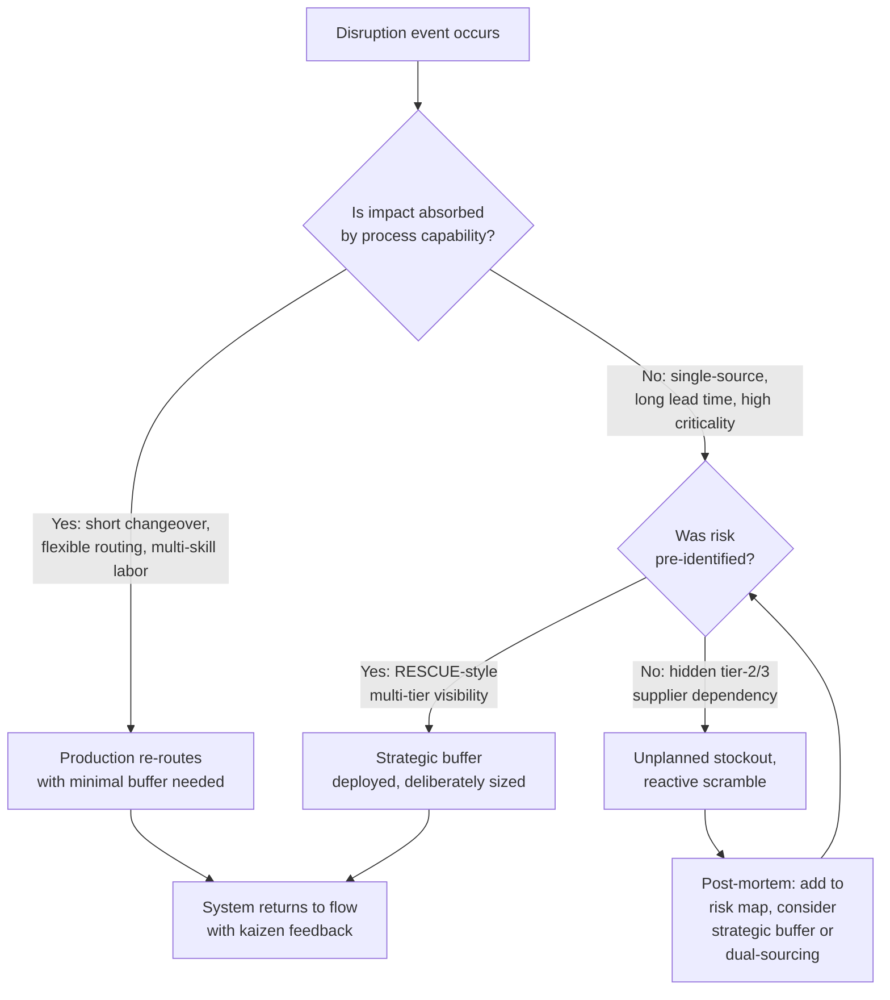

## The Just-in-Time versus Just-in-Case Resilience Debate

### Overview

The Just-in-Time (JIT) versus Just-in-Case (JIC) resilience debate concerns whether lean, low-inventory production systems are structurally vulnerable to disruption, and whether the correct response to supply shocks is to reintroduce buffer inventory, redundant suppliers, and slack capacity. The debate intensified sharply after the COVID-19 pandemic (2020–2022), the 2021 Suez Canal blockage (Ever Given), the global semiconductor shortage, and geopolitical disruptions to logistics networks. It represents one of the most consequential challenges to core TPS philosophy in the modern era, because JIT is not a peripheral technique but one of the two pillars of the Toyota Production System (alongside Jidoka).

### Historical Context

**Origins of JIT**

JIT was developed at Toyota primarily under Taiichi Ohno from the 1950s onward, as a response to capital scarcity and small domestic market size in postwar Japan. The guiding principle was to produce only what is needed, when it is needed, in the amount needed — eliminating the seven wastes (muda), with overproduction treated as the "root waste" because it hides all others, including excess inventory.

**Origins of JIC**

Just-in-Case is not a formal named methodology from a single originator; rather, it is the retrospective label given to the pre-lean, mass-production paradigm that JIT was explicitly designed to replace. JIC logic holds inventory, capacity, and supplier redundancy at every stage specifically to insulate the system from variability — in demand, supply, quality, and lead time — treating buffers as an insurance premium against uncertainty rather than as waste.

### Core Philosophical Positions

**Key Points**

- **JIT position**: Inventory is waste (muda) that conceals problems — the "lowering the water level to expose the rocks" metaphor. Reducing buffers forces process discipline, surfaces defects immediately, and drives continuous improvement (kaizen). Resilience should come from *process capability* — short changeovers (SMED), standardized work, quality at the source (jidoka/poka-yoke), and multi-skilled labor (shojinka) — not from stockpiles.
- **JIC position**: Inventory is a legitimate hedge against irreducible uncertainty. In volatile, uncertain, complex, and ambiguous (VUCA) environments, deterministic process improvement cannot fully substitute for physical buffers, because some disruptions (pandemics, wars, natural disasters, single-source supplier failure) are exogenous shocks that no amount of internal process discipline can prevent.
- The debate is frequently mischaracterized as "lean failed during COVID." A more precise framing, argued by lean scholars including those associated with the Lean Enterprise Institute, is that many companies practiced **cost-reduction inventory minimization** without the accompanying TPS infrastructure (supplier partnerships, stable heijunka-leveled demand, quality systems, and problem-solving culture) that makes true JIT resilient. This is sometimes termed "fake lean" or "lean without the system."

### The Toyota Counter-Example

Toyota itself is frequently cited as evidence *against* the claim that JIT is inherently fragile, because Toyota's actual response to disruption diverges from the caricature of zero-buffer lean manufacturing.

**Key Points**

- After the 2011 Tōhoku earthquake and tsunami, Toyota experienced severe supply chain disruption (particularly in semiconductor microcontrollers). In response, Toyota developed **RESCUE** (Reinforce Supply Chain Under Emergency), a system requiring suppliers at all tiers to disclose which parts they produce and where, creating supply chain visibility down to sub-tier suppliers that most competitors lacked.
- Toyota deliberately maintained strategic buffer stock for critical, hard-to-source semiconductor components (a policy reportedly extended to several months of supply for certain chips) following the 2011 lessons — years before the 2020–2021 global chip shortage.
- As a result, during the 2020–2021 semiconductor shortage, Toyota was widely reported to have weathered the disruption better than most competitors initially, before eventually also facing production cuts as the shortage deepened and rolling closures hit multiple supplier tiers simultaneously in 2021–2022.
- This demonstrates that Toyota's actual practice was never "zero inventory everywhere" — it was **selective, risk-informed buffering**, calibrated to part criticality, supplier concentration, and lead-time risk, layered on top of JIT flow for the vast majority of components where such risk did not apply.

### Reframing the Debate: A False Dichotomy

**Key Points**

Most contemporary lean and supply-chain scholarship treats "JIT vs. JIC" as a false binary and instead proposes a spectrum or portfolio approach:

1. **Segmentation by risk/criticality** — apply JIT flow to high-volume, low-risk, multi-sourced components; apply strategic buffering to low-volume, high-risk, single-sourced, or long-lead-time components (often analyzed via a Kraljic-style supply positioning matrix: crossing supply risk against profit/business impact).
2. **Buffer at the right node, not everywhere** — Toyota's philosophy has always distinguished between *inventory as a crutch that hides problems* (bad) and *strategic buffer stock deliberately held and actively managed as a known, monitored decision* (acceptable), consistent with the concept of a **strategic buffer** versus **safety stock accumulated by default**.
3. **Resilience through flexibility rather than inventory alone** — multi-skilling (shojinka), flexible manufacturing systems, modular product design, platform sharing, and rapid changeover capability (SMED) allow a plant to re-route production in response to shocks without necessarily holding large finished-goods or component stockpiles.
4. **Visibility as a substitute for inventory** — real-time, multi-tier supply chain mapping (as Toyota built post-2011) allows earlier disruption detection and faster response, reducing the *need* for blanket buffering because problems are caught with more lead time.

### Comparative Framework

| Dimension | Pure JIT | Pure JIC | Resilient Lean (Hybrid) |
| --- | --- | --- | --- |
| Inventory philosophy | Minimize everywhere; treat as waste | Maximize as insurance | Segmented by part criticality/risk |
| Response to variability | Eliminate variability at the source | Absorb variability with stock | Reduce variability where possible; buffer only where irreducible |
| Supplier strategy | Single-source, close partnership, frequent small deliveries | Multi-source, arms-length, large batch orders | Multi-tier visibility; dual-source for critical/high-risk parts |
| Capital efficiency | High (low working capital tied up) | Low (high carrying cost) | Moderate — capital allocated deliberately to risk-weighted buffers |
| Response to demand shock (recession) | Fast — production throttles with demand (heijunka) | Slow — must liquidate excess stock | Fast for JIT-flow parts, managed drawdown for buffered parts |
| Response to supply shock (shortage) | Vulnerable unless upstream visibility/buffer exists | Naturally cushioned, but only for pre-stocked SKUs | Cushioned selectively; visibility enables early rerouting |
| Underlying requirement | Deep process stability, quality at source, stable demand leveling | Capital availability, warehouse capacity | Both — plus supply-chain risk analytics |

### Process View: Where Resilience Actually Comes From

### Illustrative Example

**Example**

A contract electronics manufacturer produces two product lines:

- **Line A** uses a commodity resistor sourced from twelve qualified global suppliers, delivered daily in small lots. A single supplier outage has negligible impact because volume shifts to the other eleven within days. JIT flow is appropriate here: holding large stock of this part would tie up capital and warehouse space for no meaningful risk reduction.
- **Line B** uses a specialized application-specific integrated circuit (ASIC) sourced from a single fabrication plant with a nine-month lead time and no qualified second source. Here, pure JIT exposes the company to catastrophic stockout risk from a single fire, geopolitical export restriction, or fab outage. A risk-informed hybrid approach holds several months of strategic buffer stock for this part specifically, monitors the supplier's own sub-tier dependencies, and pursues a parallel qualification of a second source — while every *other* component on the same bill of materials continues to flow under standard JIT replenishment.

This illustrates the core resolution to the debate: the unit of analysis should be the *individual part or supply node*, not the *plant-wide philosophy*.

### Common Criticisms and Counterarguments

**Key Points**

- **Criticism**: "COVID-19 proved lean manufacturing is fragile and companies should return to large safety stocks."

  **Counter**: Empirical post-COVID analyses (including studies referenced by the Lean Enterprise Institute and MIT's Center for Transportation & Logistics) generally found that the primary failure mode was *lack of multi-tier supply chain visibility and single-sourcing of critical inputs*, not JIT flow itself for non-critical parts. Companies holding large generic safety stock often still faced shortages because the stock they held was not for the specific components that became bottlenecked (e.g., a specific semiconductor die, not "chips" in general). [Inference: the precise magnitude of attribution between "lack of visibility" versus "lack of buffer" as root causes varies across studies and industries, and is not reducible to a single universal ratio.]
- **Criticism**: "Holding buffer stock contradicts TPS principles and is therefore not 'real' lean."

  **Counter**: TPS founders distinguished between inventory that *masks* problems (accumulated passively, unmonitored, growing over time) and inventory that is a *deliberate, sized, monitored countermeasure* to a specifically identified and accepted risk. The latter is consistent with the broader TPS principle of *genchi genbutsu* (go and see the actual risk) and *hoshin kanri* (strategic alignment) — a buffer chosen deliberately through analysis is a different category of decision than stock that accumulates because no one addressed the underlying instability.
- **Criticism**: "JIC is simply more resilient by definition since it has more stock."

  **Counter**: Large undifferentiated stock without visibility into *which* parts are actually at risk can be the wrong stock in the wrong place — as observed when companies with substantial finished-goods inventory still faced line stoppages due to a single unbuffered, unmapped sub-component.

### Metrics Used to Evaluate the Trade-off

- **Inventory turns / Days of Supply** — traditional lean efficiency metric; lower is generally better for cash and waste, but must be interpreted per-part, not in aggregate.
- **Supply chain visibility depth** — how many tiers upstream (Tier 1, 2, 3+) a firm has mapped and monitored; Toyota's RESCUE system aimed at deep multi-tier mapping specifically because Tier 2/3 disruptions are typically invisible to OEMs under conventional sourcing models.
- **Single-source exposure ratio** — proportion of critical components (by revenue or by production-stoppage risk) sourced from only one supplier or one geographic region.
- **Time-to-recovery (resilience curve)** — how quickly output returns to baseline after a shock, sometimes modeled as a resilience triangle (depth of disruption × duration).
- **Total cost of ownership including risk-adjusted disruption cost** — an extension of standard lean costing that attempts to price in the expected cost of stockouts, weighted by probability and severity, against carrying cost of buffer stock.

### Practical Framework for Applying This in an Organization

**Next Steps**

1. Map the bill of materials (or service equivalent) against a supply-risk matrix: axis one = business impact of stockout, axis two = supply availability risk (lead time, number of qualified sources, geographic concentration).
2. Apply pure JIT flow with standard kanban replenishment to the low-risk, high-availability quadrant.
3. For the high-risk, high-impact quadrant, evaluate: dual-sourcing, design changes to reduce part uniqueness, strategic buffer sizing (using service-level and lead-time-variability models rather than arbitrary "months of supply" heuristics), or supplier-held consignment stock.
4. Invest in multi-tier supply chain visibility tooling and supplier relationship depth (analogous to Toyota's post-2011 RESCUE initiative) so that emerging risk is detected before it becomes a stockout, allowing buffers to be sized dynamically rather than permanently maximized.
5. Treat the JIT/JIC allocation as a living decision subject to periodic kaizen-style review, not a one-time architectural choice — supply risk profiles shift as geopolitics, single-source dependencies, and demand patterns change.

**Related Topics**

- Supply chain risk segmentation and the Kraljic portfolio matrix
- Toyota's RESCUE system and post-2011 supply chain resilience reforms
- Heijunka (production leveling) as a precondition for effective JIT
- Kanban system design and safety-stock-adjusted reorder points
- Single Minute Exchange of Die (SMED) and its role in enabling flexible, low-buffer response
- Bullwhip effect and demand-signal distortion across supply tiers
- Reshoring, nearshoring, and friend-shoring as structural resilience strategies
- Digital twin and real-time supply chain visibility platforms
- Antifragility and resilience engineering as applied to operations management