## Sustainability and Green Lean Manufacturing

### Overview

Green Lean (also called "Lean and Green" or "Sustainable Lean") is the integration of environmental sustainability objectives into the Toyota Production System's waste-elimination framework. The core thesis is that traditional lean waste categories (muda) correlate strongly with environmental waste — overproduction, excess inventory, and defects consume energy, raw materials, and water, and generate emissions and scrap, largely independent of their cost impact. Green Lean extends the TPS toolkit to explicitly measure, target, and reduce environmental impact using the same continuous-improvement (kaizen) infrastructure used for cost and quality.

### Conceptual Foundation: The Muda–Environmental Waste Overlap

**Key Points**

Lean's seven classical wastes (muda) map onto environmental impacts as follows:

| Lean Waste (Muda) | Environmental Consequence |
| --- | --- |
| Overproduction | Excess raw material consumption, excess energy use, unsold product becoming waste |
| Waiting | Idle equipment often continues consuming energy (non-value-adding energy draw) |
| Transportation | Fuel consumption, emissions, packaging waste |
| Overprocessing | Excess energy, water, chemical inputs beyond what the customer requires |
| Inventory | Storage energy (climate control, lighting), obsolescence, spoilage, packaging degradation |
| Motion | Indirect — inefficient plant layout increases energy use in material handling equipment |
| Defects | Scrap material, rework energy, and in some processes hazardous waste requiring disposal |

Some practitioners add an eighth "waste of unused environmental resources" or explicitly append **excess energy use and hazardous waste** as environmental-specific waste categories, sometimes summarized as extending muda to muda + energy + emissions.

### Historical Development

- The concept traces to research beginning in the late 1990s and 2000s examining correlation between lean adoption and reduced environmental footprint, notably work associated with the U.S. Environmental Protection Agency's **Lean and Environment** initiative, which published guidance connecting kaizen events, value stream mapping, and 5S directly to EPA environmental management frameworks.
- The EPA's **Lean, Energy & Climate Toolkit** and **Lean and Environment Toolkit** formalized methods for adding environmental metrics onto standard lean tools (value stream mapping, kaizen events, 5S, Six Sigma) without replacing them.
- Toyota's own sustainability reporting and the **Toyota Environmental Challenge 2050** (announced 2015) positioned environmental impact reduction — including a stated goal of eliminating CO2 emissions from vehicle life cycles and plants — as a direct extension of TPS thinking rather than a separate corporate social responsibility initiative.

### Core Tools and Techniques

**Green Value Stream Mapping (Green VSM)**

Standard Value Stream Mapping is extended with an "environmental data box" at each process step, alongside the traditional cycle time, changeover time, and uptime data. Typical added metrics include:

- Energy consumption per unit (kWh)
- Water consumption per unit
- Material yield / scrap rate
- Hazardous material usage
- Emissions (direct CO2e, or proxy metrics like fuel/electricity consumption)

This allows environmental waste to be visualized alongside process lead time on the same map, making it possible to identify whether a process step is a "hotspot" for both cost waste and environmental waste simultaneously — which is often, though not always, the case.

**5S and Environmental Housekeeping**

The standard 5S methodology (Sort, Set in Order, Shine, Standardize, Sustain) is extended in Green Lean implementations with environmental-specific practices:

- Sort: identify and segregate hazardous materials, expired chemicals, and materials eligible for recycling
- Set in Order: designate labeled bins for recyclables, hazardous waste, and general waste at the point of use
- Shine: incorporate leak detection (compressed air, water, chemical) into cleaning routines, since undetected leaks are both a maintenance and environmental waste
- Standardize: build environmental checks into standard work (e.g., equipment shutdown procedures during idle periods)
- Sustain: environmental KPIs included in visual management boards alongside safety, quality, cost, delivery metrics (sometimes formalized as adding "E" for Environment to the traditional **SQDC** — Safety, Quality, Delivery, Cost — board, yielding **SQDCE**)

**Kaizen Events with Environmental Scope**

Standard kaizen (rapid improvement) events are run with an explicit environmental target metric (e.g., reduce compressed air leaks, reduce solvent usage, reduce packaging material) using the same PDCA (Plan-Do-Check-Act) structure as a cost- or quality-focused kaizen event.

**Total Productive Maintenance (TPM) and Energy**

TPM's autonomous maintenance pillar is extended to include operator-level detection of energy waste (e.g., air leaks, unnecessary idle running of motors, inefficient heating/cooling), tying equipment effectiveness (OEE) improvements directly to reduced specific energy consumption per unit produced.

### Metrics Framework

**Key Points**

Green Lean implementations typically track environmental KPIs in parallel with traditional lean KPIs:

- **OEE (Overall Equipment Effectiveness)** — traditional lean metric; also correlates with energy efficiency, since idle/inefficient equipment often has poor specific energy consumption
- **Specific Energy Consumption (SEC)** — energy used per unit of output (kWh/unit), analogous to takt time but for energy rather than pace
- **Material Yield Rate** — proportion of input material that becomes finished, saleable product (inverse of scrap rate)
- **Water Intensity** — water consumed per unit of output
- **Carbon Intensity** — CO2e emitted per unit of output, often calculated via Scope 1 (direct), Scope 2 (purchased energy), and increasingly Scope 3 (supply chain) accounting per the **GHG Protocol**
- **Waste Diversion Rate** — proportion of total waste diverted from landfill via recycling, reuse, or energy recovery

$$\text{SEC} = \frac{\text{Total energy consumed (kWh)}}{\text{Units produced}}$$

### Illustrative Example

**Example**

A metal stamping plant runs a green kaizen event targeting compressed air waste, since compressed air is among the most energy-intensive utilities in a typical factory (commonly cited as one of the least energy-efficient forms of usable industrial energy due to compression losses).

1. **Current state assessment**: Ultrasonic leak detection survey identifies 40 leaks across the plant, estimated to waste a measurable percentage of total compressor output continuously, 24/7, even during non-production hours.
2. **Root cause analysis**: Leaks concentrated at quick-disconnect fittings that have exceeded their service life; no standard work exists for fitting replacement intervals.
3. **Countermeasure**: Fittings repaired; a standard work instruction is created specifying leak-check frequency (folded into existing TPM autonomous maintenance checklist); a visual kanban card system is introduced to flag fittings nearing end-of-life for proactive replacement.
4. **Result tracking**: Compressor run-hours during non-production shifts (a proxy for baseline/idle energy waste) are tracked weekly on the plant's SQDCE board alongside standard cost and quality metrics.

This demonstrates the Green Lean pattern: reuse existing lean infrastructure (kaizen events, standard work, visual management, TPM) with an environmental-specific target metric, rather than building a parallel sustainability program.

### Process Flow: Integrating Environmental Data into Standard Lean Cycle

```mermaid
flowchart TD
    A[Current State VSM] --> B[Add environmental<br/>data box per process step:<br/>energy, water, scrap, emissions]
    B --> C{Identify hotspot:<br/>high lead-time waste AND<br/>high environmental waste?}
    C -->|Yes| D[Prioritize for kaizen event<br/>with dual cost/environmental target]
    C -->|No, cost waste only| E[Standard kaizen event,<br/>track environmental metric<br/>as secondary indicator]
    C -->|No, environmental only| F[Environmental-specific<br/>kaizen event]
    D --> G[PDCA cycle]
    E --> G
    F --> G
    G --> H[Update Future State VSM<br/>with new environmental baseline]
    H --> I[SQDCE visual board<br/>tracks sustained result]
```

### Relationship to Broader Sustainability Frameworks

**Key Points**

- **ISO 14001 (Environmental Management Systems)**: Green Lean is frequently used as the operational execution layer beneath an ISO 14001 management system — ISO 14001 defines the policy and management review structure, while Green Lean tools (VSM, kaizen, 5S) provide the shop-floor mechanism for identifying and acting on environmental aspects/impacts.
- **Circular Economy**: Green Lean's emphasis on reducing overproduction and defects aligns with circular economy principles (design out waste, keep materials in use), though circular economy is a broader systems-level framework addressing product lifecycle and end-of-use recovery, not solely production-floor waste.
- **Carbon accounting / GHG Protocol**: Increasingly, Green Lean programs are asked to report Scope 1–3 emissions reductions as auditable outcomes, particularly where a firm's customers (especially large OEMs with their own net-zero commitments) require supplier-level emissions data as a condition of continued sourcing.
- **ESG reporting**: Corporate ESG (Environmental, Social, Governance) disclosure requirements have increased pressure on manufacturers to produce plant-level environmental data that Green Lean's metric infrastructure (SEC, water intensity, waste diversion rate) is well positioned to supply.

### Common Criticisms and Limitations

**Key Points**

- **Criticism**: Cost-waste reduction and environmental-waste reduction do not always align. Some interventions that reduce cost waste (e.g., switching to cheaper but more energy-intensive processes, or increasing batch size to reduce changeover cost) can *increase* environmental impact, and vice versa. [Inference: the degree of correlation between lean maturity and environmental performance varies significantly by industry and process type, and claims of a universal strong correlation should be treated with caution rather than assumed.]
- **Criticism**: Green Lean as typically implemented focuses on operational/production-floor waste and may understate lifecycle impacts occurring outside the plant boundary (raw material extraction, product use-phase energy consumption, end-of-life disposal) — issues more comprehensively addressed by full Life Cycle Assessment (LCA) methodology (ISO 14040/14044) rather than shop-floor VSM alone.
- **Criticism**: Without leadership commitment to track environmental KPIs with the same discipline as cost/quality/delivery KPIs, environmental targets in kaizen events risk being treated as secondary and deprioritized under production pressure — a variant of the general risk that any "bolted-on" initiative that lacks integration into daily management (hoshin kanri) will not sustain.

### Practical Implementation Steps

**Next Steps**

1. Add an environmental data box to existing Value Stream Maps for at least the highest-volume product family, capturing energy, water, and scrap data per process step.
2. Extend existing 5S audits and TPM autonomous maintenance checklists with environmental checkpoints (leak detection, waste segregation, idle-equipment shutdown).
3. Select one process step identified as both a cost-waste and environmental-waste hotspot and run a kaizen event with an explicit dual metric target.
4. Add an "E" column to the plant's SQDC visual management board, tracked with the same review cadence as safety, quality, delivery, and cost.
5. Align internal environmental metrics with any external reporting obligations (ISO 14001, customer-mandated Scope 3 disclosure, ESG reporting) so that shop-floor data collection serves both continuous improvement and compliance/reporting needs simultaneously, avoiding duplicate data-collection systems.

**Related Topics**

- EPA Lean and Environment Toolkit and Lean, Energy & Climate Toolkit
- Life Cycle Assessment (LCA) and ISO 14040/14044
- ISO 14001 Environmental Management Systems
- Total Productive Maintenance (TPM) and energy-focused autonomous maintenance
- Circular economy principles applied to manufacturing
- Scope 1/2/3 carbon accounting under the GHG Protocol
- Toyota Environmental Challenge 2050
- Design for Environment (DfE) and eco-design integration with lean product development